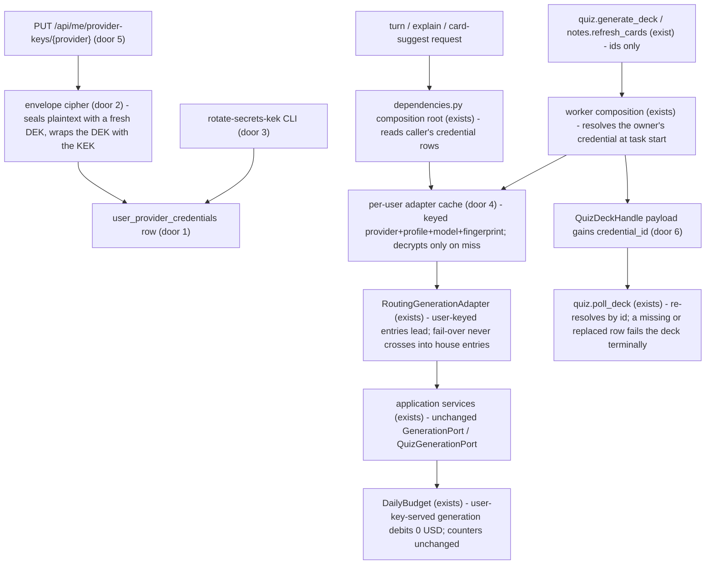
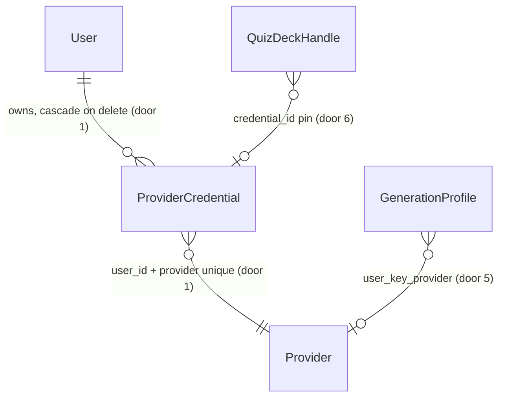

# BYOK secrets and chains

## Problem

Every generation call in Learny runs on a key the operator owns. A learner who already pays
Anthropic or OpenAI cannot use that account here. The operator pays for every Ask, Tutor turn,
Explain, card suggestion and deck, and then caps each learner's day (`daily_ai_spend_usd`,
`daily_ask_cap`) to stay solvent. A self-hoster with no house key gets only the deterministic
extractive answers. The 2026-09-30 research found that a free cohort which costs the operator
inference does not survive at 0.5-3 % free-to-paid conversion. Learny's own analogues are
Khoj Cloud and Omnivore, which both shut down. Anthropic permits customer keys "provided the
resulting usage is billed to the key owner". The three blockers recorded on 2026-09-07 are
still open: no at-rest crypto, a per-process `lru_cache` that cannot hold per-user clients,
and no rule for keeping keys out of worker payloads.

When this ships, a learner on an instance whose operator enabled it can paste their own
Anthropic, OpenAI or Gemini key in Account. They can test it and see which curated profiles
it powers. From then on their Ask, Tutor, Explain, card suggestions and decks run on it. The
key is stored encrypted, never shown again, and never written to a log, an error, an API
response or a task payload. Replacing or deleting the key, or deleting the account, takes
effect at once.

## Flow

Reuses the profile registry and `RoutingGenerationAdapter` from ADR-0020 for every routing
rule. Reuses the existing adapters (`AnthropicGenerationAdapter`, `OpenAICompatibleGenerationAdapter`,
`AnthropicQuizAdapter`), which already take `api_key` as a constructor argument. Reuses the
CSRF, user-keyed rate-limit and account-delete CASCADE machinery as they stand.

## Impact

| Front | What changes |
| --- | --- |
| domain | new term: `ProviderCredential` - one learner's sealed API key for one provider. Metadata (id, provider, last four, fingerprint, timestamps) is all that ever leaves the infrastructure layer. Lives in `domain/entities.py` with its port in `domain/ports.py` |
| domain | new term: user-key-bound profile - a registry profile whose `user_key_provider` names the provider whose learner keys may serve it. Lives in `providers/profiles.py` |
| domain | existing term: house chain - meant "every declared profile in registry order". Now it means "every declared profile the house can serve", which excludes user-key-only profiles. `build_generation_chain`, `build_user_generation_chain`, `learner_catalog` and `_validate_declared` branch on the registry today |
| domain | existing term: deck provider pin - `QuizDeckHandle.provider` meant "which adapter collects this batch". It now also carries the credential row the batch was submitted under. `poll_quiz_deck` and `build_quiz_adapter(provider=...)` branch on it today |
| domain | existing term: card/deck/explain generation - ADR-0020 amendment point 3 made these house-routed always. For a learner with a key they now run on that key. `get_card_generation`, `get_explain_generation`, `_build_run_deck` and `_build_refresh_note_cards` are the process-cached house seams that change |
| domain | existing term: generation result stamp - `GeneratedAnswer.profile_id` named the serving profile for pricing. The router now also stamps `user_keyed` (who paid), because the same profile can be served on the house key or a learner's key. `DailyBudget.usage_micros` and `PostConversationTurn._debit` branch on it |
| stored data | nothing to migrate: a new table, empty at creation. Existing `QuizDeckHandle` payloads already in flight lack `credential_id` and keep house routing (read as absent = house) |
| configuration | new env `LEARNY_SECRETS_KEK` (base64, 32 bytes) and `LEARNY_SECRETS_KEK_PREVIOUS` (comma-separated). An unset KEK means the feature is off, which is the default. A malformed one fails startup |
| dependency | `cryptography` joins `backend/pyproject.toml`. It is a crypto library, not a provider SDK, so the ADR-0019/0020 lock is untouched |

## Relations

One-way constraints: at most one credential per (user, provider) (door 1). The credential dies
with its user through the FK cascade (door 1). The sealed payload is bound to its user and
provider by the AEAD associated data (door 2). A replace mints a new row id, never an in-place
update (door 6).

## Surface

| Route | In | Out | Status |
| --- | --- | --- | --- |
| `GET /api/me/provider-keys` | session | `enabled` · `providers[]`: `provider`, `label`, `configured`, `last4`, `added_at`, `powers[]` (`profile_id`, `display_name`, `ask`, `teach`), `powers_cards` | `200`, `401` |
| `PUT /api/me/provider-keys/{provider}` | `api_key`, CSRF header | the provider's view row (no key material) | `200`, `401`, `403`, `404`, `422`, `429` |
| `POST /api/me/provider-keys/{provider}/test` | CSRF header | `ok` · `reason` (`rejected`, `rate_limited`, `unavailable`, or null) | `200`, `401`, `403`, `404`, `429` |
| `DELETE /api/me/provider-keys/{provider}` | CSRF header | empty | `204`, `401`, `403`, `404` |

Operator command, not an HTTP route: `python -m app.cli.rotate_secrets_kek` reads the KEK env, prints counts (rewrapped, already current, unknown KEK) and exits `0`, or `1` when any row is under an unknown KEK.

## Landing

| One-way door | Literal shape | Alternative rejected |
| --- | --- | --- |
| 1. new table `user_provider_credentials` | migration `0030_user_provider_credentials`. Columns: `id` uuid pk, `user_id` FK `users.id` ON DELETE CASCADE, `provider` text, `ciphertext`/`nonce`/`wrapped_dek`/`dek_nonce` bytea, `kek_id` text, `fingerprint` text, `last4` text, timestamps. `UNIQUE (user_id, provider)` | a JSON blob on `user_ai_preferences`, which cannot hold one row per provider or rotate per row; a single app-wide Fernet key with no per-secret DEK, which makes KEK rotation re-encrypt every ciphertext and puts one key over all secrets |
| 2. envelope format | AES-256-GCM. A fresh 32-byte DEK per write seals the key under a 12-byte random nonce. The KEK wraps the DEK with AES-256-GCM under its own nonce. Associated data is `learny/provider-credential/v1/<user_id>/<provider>` on both layers. `kek_id` = first 16 hex chars of SHA-256(KEK) | LibreChat-style fixed `CREDS_IV`, because nonce reuse breaks GCM; no associated data, which lets a DB writer move one user's ciphertext onto another user's row |
| 3. KEK configuration + rotation | `LEARNY_SECRETS_KEK` is the current KEK. `LEARNY_SECRETS_KEK_PREVIOUS` holds old KEKs that are still readable. `python -m app.cli.rotate_secrets_kek` re-wraps every DEK whose `kek_id` is not current, without touching `ciphertext`. A row under an unknown KEK is unusable: it is reported, never crashed on | rotate by re-encrypting the plaintext, which needs every key decrypted at once and touches more rows than wrapping does; a KMS dependency, because no provider SDK may be added and self-host has no KMS |
| 4. per-user adapter cache | a process-local bounded LRU with a TTL (256 entries, 15 min). The key is `(provider, profile_id, model, fingerprint)`. It holds only built adapters, and a lookup reaches it only through a fingerprint read from a live row | keep `lru_cache` keyed per profile, which would serve one user's key to everyone; build an adapter per request, which opens a new TLS pool per turn (the reason `get_card_generation` is cached today) |
| 5. registry binding field + provider names | `GenerationProfileSettings.user_key_provider: Literal["anthropic","openai","gemini"] \| None = None`. A profile with `user_key_provider` set and no `api_key_env` is user-key-only and never joins a house chain. Route and payload `provider` values are the same literals | inferring the binding from `kind`+`base_url`, which lets a host change silently re-bind learner keys; a user-chosen model or `base_url`, which the research rules out (Lobe Chat GHSA, CVE-2024-7959) |
| 6. deck pin carries the credential | `QuizDeckHandle.to_payload()` gains `"credential_id": "<uuid>" \| null`. The poll re-reads that row (owner-scoped) and fails the job terminally with fixed copy when it is gone. Replace = delete + insert = new id | pin by provider only, which would collect a user-key batch with the house key or with a replaced key from another org |
| 7. API routes | the four `/api/me/provider-keys*` routes above. `GET` always answers `200` with `enabled: false` when the feature is off; writes answer `404` then | folding into `/api/me/ai-profile`, which mixes a non-secret choice with secret material and its stricter redaction rules |
| 8. decision record | new ADR-0033 superseding ADR-0020 amendment point 7 (BYOK no longer waits for a paid tier). It states that BYOK on a hosted public instance stays disabled until `byok-hosted-policy` ships | amend ADR-0020 a third time, which buries a reversal of a recorded deferral inside a provider-choice ADR |
| 9. credential fingerprint | `fingerprint` = hex SHA-256 of `learny/provider-credential-fingerprint/v1\0` ‖ the row's associated data ‖ `\0` ‖ `nonce` ‖ `ciphertext`. It is recomputed on every read for the asking user, and a row whose stored value differs reads as no credential. Rotation leaves it unchanged because the ciphertext is untouched | SHA-256 of the plaintext key, which lets anyone holding a dump confirm a guessed key, and which is identical across rows, so a row copied onto another account would hit the first learner's cached adapter |

- Nothing else in this change is hard to reverse

## Criteria

### S1: Sealed key storage (P1)

A learner's key is stored encrypted, bound to its owner, rotatable, and gone with the account.

**Acceptance Criteria**

1. WHEN a key is stored THEN the system SHALL persist only ciphertext, nonce, wrapped DEK, DEK nonce, `kek_id`, a fingerprint and the last four characters. No column SHALL hold the plaintext or the plaintext DEK
2. The system SHALL generate a new random DEK and new nonces on every write, so storing the same key twice yields two different ciphertexts
3. IF a sealed row is opened under a different user id or provider than it was sealed for THEN the system SHALL refuse to decrypt it
4. WHEN `rotate_secrets_kek` runs with a new current KEK and the old KEK in `LEARNY_SECRETS_KEK_PREVIOUS` THEN the system SHALL re-wrap every DEK under the current KEK, leave every `ciphertext` byte-identical, and leave every key decryptable
5. IF a row's `kek_id` matches no configured KEK THEN the rotation SHALL report it and exit `1`, and a generation request for that user SHALL treat the credential as absent rather than raise
6. IF `LEARNY_SECRETS_KEK` is set but is not base64 of exactly 32 bytes THEN the system SHALL fail at startup with an error naming the variable and not its value
7. WHEN a user account is deleted THEN the system SHALL delete every `user_provider_credentials` row of that user

**Independent test:** store a key, read the raw row, rotate the KEK, decrypt again, delete the account and count rows.

### S2: Key management API (P1)

A learner can add, test, replace and delete a key, and see what it powers, through four routes
that never return key material.

**Acceptance Criteria**

8. WHILE `LEARNY_SECRETS_KEK` is unset or no declared profile sets `user_key_provider` the system SHALL answer `GET /api/me/provider-keys` with `enabled: false` and SHALL answer every write route with `404`
9. WHEN an authenticated learner calls `GET /api/me/provider-keys` THEN the system SHALL list exactly the providers that at least one declared profile binds. Each SHALL carry `configured`, `last4`, `added_at`, the bound profiles with their ask/teach eligibility, and `powers_cards` (true only for `anthropic`)
10. WHEN a learner `PUT`s a well-formed key for an offered provider THEN the system SHALL store it sealed, return the view row with `last4`, and replace any previous key for that provider with a new row id
11. IF the `PUT` body's key is missing, has whitespace, is shorter than 20 or longer than 256 characters, or lacks the provider prefix (`sk-ant-` for anthropic, `sk-` for openai) THEN the system SHALL answer `422` with a detail that does not contain the submitted value
12. IF the `{provider}` path value is not offered on this instance THEN the system SHALL answer `404` on every write route
13. WHEN a learner calls the test route for a stored key THEN the system SHALL call the provider's model-list endpoint with that key through the profile's own host. It SHALL answer `200` with `ok: true`, or `ok: false` with `reason` one of `rejected`, `rate_limited`, `unavailable`
14. IF the test route is called for a provider with no stored key THEN the system SHALL answer `404`
15. WHEN a learner `DELETE`s a provider key THEN the system SHALL remove the row and answer `204`, also when no row existed
16. IF a write route is called without a valid CSRF token THEN the system SHALL answer `403` and change nothing
17. WHEN a learner exceeds the user-keyed rate limit on `PUT` or test THEN the system SHALL answer `429`
18. The system SHALL never include any part of a stored key except `last4` in any response of these routes

**Independent test:** with a KEK and a bound profile declared, add, list, test against a fake probe, replace, then delete a key through the API.

### S3: Learner chains for Ask, Tutor and Explain (P1)

A learner's key serves their own turn and Explain generation, and only theirs.

**Acceptance Criteria**

19. WHEN a learner with a stored key for provider P asks or takes a Tutor turn THEN the system SHALL serve it from a profile bound to P, built with that learner's key, before any house entry
20. WHEN a learner with a stored key for P sends a selection-Explain THEN the system SHALL serve it from a profile bound to P with that learner's key. `generation_explain_profile` SHALL lead when it is bound to P
21. IF every user-keyed entry eligible for the mode fails THEN the system SHALL fail the turn with the existing fixed generation-failure copy and SHALL NOT fall over to a house-keyed entry
22. WHERE no profile bound to the learner's providers is eligible for the requested mode, the system SHALL serve that mode from the house chain exactly as it does for a learner without a key
23. WHEN two learners with different keys for the same provider ask in the same process THEN the system SHALL build each adapter with its own learner's key
24. WHEN a learner replaces or deletes a key THEN the system SHALL serve their next request with the new key or with the house chain, never with the previous key
25. WHEN a generation call is served by a user-keyed entry THEN the system SHALL debit 0 USD to the house ledger and SHALL still count the call against `daily_ask_cap` / `daily_teach_start_cap`
26. WHILE `ai_kill_switch` is on the system SHALL refuse user-keyed generation exactly as it refuses house generation
27. The system SHALL never build a house chain that contains a user-key-only profile, and SHALL reject at startup a registry whose house-servable set is empty

**Independent test:** declare a user-key-only fake profile, store a key for user A, ask as A and as B, and assert which adapter key served each.

### S4: Cards and decks under the learner's key (P2)

Card suggestions, note card refresh and quiz decks run on the learner's Anthropic key when they
have one, and worker payloads carry ids only.

**Acceptance Criteria**

28. WHEN a learner with a stored anthropic key requests card suggestions THEN the system SHALL build the quiz adapter with that key and `quiz_model`, and SHALL debit 0 USD to the house ledger
29. WHEN `quiz.generate_deck` or `notes.refresh_cards` runs for a source or note whose owner has a stored anthropic key THEN the worker SHALL resolve that key from the database at task start and generate with it
30. WHEN a deck batch is submitted under a learner's key THEN the system SHALL record that credential's row id on the deck handle, and `quiz.poll_deck` SHALL collect it with the same credential
31. IF the credential a deck handle pins has been deleted or replaced when the poll runs THEN the system SHALL fail the job terminally with fixed copy and SHALL NOT poll with any other key
32. The system SHALL never place key material in any Celery task argument or keyword argument. Task payloads SHALL carry only source, job, note and credential row ids

**Independent test:** run the deck task against a fake batch adapter for a learner with a key, capture `apply_async` args, then delete the key and run the poll.

### S5: Keys never leak (P1)

No key value reaches a log line, an error, a trace field or a serialized object.

**Acceptance Criteria**

33. The system SHALL mask any substring shaped like a provider key (`sk-ant-…`, `sk-…`, `AIza…`) in every log record's message, arguments and exception text before it is emitted
34. WHEN a canary key is added, tested, used for an Ask and a deck, rotated and deleted THEN no captured log record, API response body, raised exception string, Celery argument or `repr` of a credential or adapter SHALL contain the canary
35. IF a deliberate leak is introduced (the canary logged through an unmasked path) THEN the leak sensor SHALL fail, demonstrating that it observes the channels it claims

**Independent test:** run the canary end-to-end test, then run its built-in negative control.

### S6: Account keys section (P2)

The Account page lets a learner add, test, replace and delete a key, and see what it powers.

**Acceptance Criteria**

36. WHERE the keys endpoint reports `enabled: false` the Account page SHALL render no keys section
37. WHEN the section renders THEN the system SHALL show one row per offered provider. A configured row SHALL show `•••• <last4>`, the added date, and the profiles it powers with Ask/Teach marks plus "flashcards & decks" when `powers_cards`. An unconfigured row SHALL show a masked input and Save
38. WHEN a learner saves a key THEN the system SHALL clear the input, show the configured row, and never render the submitted value again
39. WHEN a learner presses Test THEN the system SHALL show "Key works" or a reason-specific message for `rejected`, `rate_limited`, `unavailable`
40. WHEN a learner presses Delete THEN the system SHALL ask for confirmation before calling the delete route
41. IF a keys request fails THEN the system SHALL show an inline error and keep the previous state
42. The section SHALL state that calls made with the learner's key are billed by that provider to them under their own agreement, and that Learny stores the key encrypted and cannot show it again

**Independent test:** render `AccountPanel` with a mocked enabled catalog and walk add → test → replace → delete.

## Out of scope

| Excluded | Why |
| --- | --- |
| hosted allow-list enforcement, cost display, soft monthly budget, privacy badges, BYOK exemption from the house USD cap | `byok-hosted-policy` row; until it ships the ADR keeps hosted BYOK disabled |
| user-supplied `base_url`, raw model picker, user-chosen model | research do-not-build list (SSRF and key-exfiltration CVEs; eval gate) |
| per-user embedding keys | embeddings stay operator-level (ADR-0019; research Q5) |
| subscription/OAuth logins (Claude.ai, ChatGPT) | Anthropic prohibits it in writing; 09-07 research rejected it |
| local models, Ollama profiles | `local-models-self-host` row |
| OpenAI- or Gemini-keyed decks and card suggestions | no non-Anthropic quiz adapter exists; adding one is a provider-surface change outside this row |
| persisting key test results or marking a key "rejected" after a failed turn | the test route answers on demand; status tracking can follow if needed |
| revoking a stream already in flight when its key is deleted | a stream that already started finishes; the next request sees the deletion (AC 24) |
| a paid tier | `paid-hosted-tier` row |

## Assumptions

| Assumption | Chosen default | Rationale | Confirmed? |
| --- | --- | --- | --- |
| failure fall-over from a learner key to the house key | never (AC 21); coverage fall-over by mode is allowed (AC 22) | a rejected learner key silently billed to the operator breaks the "free BYOK cohort costs no inference" premise and hides a broken key from its owner | y |
| house USD ledger for user-keyed calls | debit 0 USD; counters, kill switch and the pre-flight USD assertion are unchanged | the house did not pay. The exemption from the house cap and the cost display belong to `byok-hosted-policy` | y |
| how the operator offers a provider | an explicit per-profile `user_key_provider` field, so the registry is the allow-list on self-host | curation stays operator-owned, and nothing re-binds when a host changes | y |
| enabling switch | KEK set AND at least one profile binds a provider; no separate boolean | one switch the operator cannot half-set; the brief requires "off unless the operator configures a KEK" | y |
| hosted-instance guard | documented in ADR-0033 and `.env.production.example` (leave the KEK unset until `byok-hosted-policy`); no code guard | the code cannot tell a public host from a private VPS self-host; a heuristic guard would misfire on self-hosters | y |
| learner's house-profile preference when they have a key | it reorders the user-keyed entries when the chosen profile is bound to their provider, and is otherwise ignored for those modes | keeps one choice surface and does not invent a second preference | y |
| key format validation | length 20-256, no whitespace, prefix `sk-ant-` / `sk-` for anthropic / openai, no prefix check for gemini | catches pasted typos without coupling to undocumented key formats | y |
| test route cost | model-list call (no tokens billed) | the test must not spend the learner's money | y |
| delivery mechanism | over lean's 150k budget (~251k): two sequential PRs - batch A = sealed storage + rotation + learner chains + ADR (engine unreachable, off by default), batch B = key routes + cards/decks + leak sensors + Account UI | one builder would compact over a security-critical slice set | y |
| sealing scheme | AES-256-GCM envelope, fresh DEK + nonce per write, KEK from `LEARNY_SECRETS_KEK`, AAD `learny/provider-credential/v1/<user_id>/<provider>` on both layers, `kek_id` = SHA-256(KEK)[:16 hex]; rotation re-wraps DEKs with `LEARNY_SECRETS_KEK_PREVIOUS` | rejected: a fixed IV (GCM nonce reuse), a single app-wide Fernet key (rotation re-encrypts everything), KMS (no SDK, no self-host KMS) | y |
| routing of explain/quiz/cards for a learner holding a key | user-keyed entries lead the learner's chain for every mode a bound profile covers (an Anthropic key powers cards/decks with `quiz_model`); supersedes the archived "explain/quiz/cards house-routed" decision (AD-351) for those learners only | rejected: inferring the binding from kind + base_url | y |
| ADR-0033 needs the user's acceptance | accepted at the door gate (2026-10-02) | it reverses a recorded deferral (ADR-0020 amendment point 7) | y |

**Open questions:** none - all resolved or logged above.

## Observable

| Surface | Decision | Landing |
| --- | --- | --- |
| screen Account keys section | empty state (feature off) | AC 36 |
| screen Account keys section | empty state (provider not configured) | AC 37 |
| screen Account keys section | loading state | existing - `AccountPanel` loads its sections with the same spinner pattern as the AI-profile section |
| screen Account keys section | error state | AC 41 |
| screen Account keys section | unauthorised state | existing - `/account` sits behind the app-shell auth redirect |
| screen Account keys section | destructive action confirms | AC 40 |
| screen Account keys section | density and ordering | AC 37 (provider rows in registry order of first binding) |
| API `GET /api/me/provider-keys` | response shape | AC 9 |
| API `PUT /api/me/provider-keys/{provider}` | error shape and codes | AC 11, AC 12, AC 16, AC 17 |
| API `POST /api/me/provider-keys/{provider}/test` | error shape and codes | AC 13, AC 14, AC 17 |
| API `DELETE /api/me/provider-keys/{provider}` | error shape and codes | AC 15, AC 16 |
| all new `/api/me/provider-keys*` | who may call it | AC 16 plus existing `get_authenticated_user` (401) |
| all new `/api/me/provider-keys*` | rate limits | AC 17 |
| all new `/api/me/provider-keys*` | versioning | n/a - the app has no API versioning; the routes are additive and same-origin only |
| command `rotate_secrets_kek` | output format and exit codes | AC 4, AC 5 |
| command `rotate_secrets_kek` | failure halfway | AC 4 (each row re-wrapped in its own transaction, so a re-run resumes) |
| command `rotate_secrets_kek` | flags | n/a - configuration comes from the same env the app reads; there are no flags |
| document ADR-0033 | structure, tone, reader's next step | AC 42 copy, plus the ADR in the repo's MADR format |
| copy Account disclosure | what the reader does next | AC 42 |

## Sources

- `.specs/project/ROADMAP.md` v8 row `byok-secrets-and-chains` - authoritative scope line
- `docs/research/2026-09-30/synthesis.md` §BYOK and row details 2-3 - binding architecture and the row-3 split
- `docs/adr/0020-use-anthropic-claude-for-generation.md` amendments - routing rules this conforms to; point 7 superseded by ADR-0033
