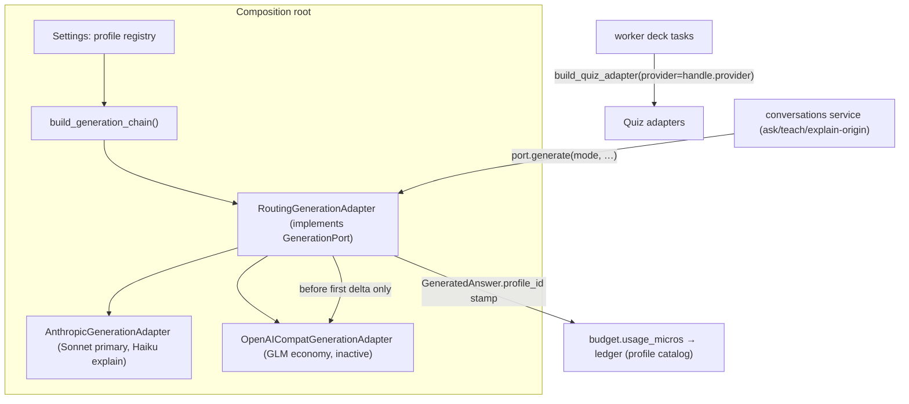

# Cheaper Intelligence Design

**Spec**: `.specs/features/cheaper-intelligence/spec.md`
**Context**: `.specs/features/cheaper-intelligence/context.md` (AD-334..AD-344)
**Status**: Approved (ship-cycle auto-decision rule; research: `docs/research/2026-09-07/provider-adapter-architecture.md`)

---

## Architecture Overview

Everything provider-specific stays adapter-internal or beside the port (research §1.3): a
settings-declared **profile registry** and one **routing adapter** that implements
`GenerationPort` itself. Application services keep calling the same port; the quiz deck path
pins its provider via the handle; the budget resolves prices from the stamp the router leaves
on the result.



Routing policy (AD-337/AD-338): walk the eligible chain in order; `Timeout`/`ProviderUnavailable`
→ next profile; `RateLimited` → one same-provider backoff retry, then next; `RequestRejected` →
next only when the candidate adapter builds a different request shape (kind differs); streams
fail over only before the first delta. Grounded modes (ask, teach) route only over profiles
enabled for that mode; an empty eligible chain fails honest before any provider touch.

---

## Code Reuse Analysis

### Existing Components to Leverage

| Component | Location | How to Use |
|---|---|---|
| `GenerationPort` (frozen) | `backend/app/domain/ports.py:658-730` | Router implements it; no member changes |
| Adapter factory pattern | `backend/app/infrastructure/answering/__init__.py:29-56` | Extended into `build_generation_chain()`; fail-fast discipline carries to registry validation |
| Sentinel + `[^n]` marker machinery | `backend/app/domain/entities.py:511,523` (SENTINEL, CITE_MARK), parse in `answering/anthropic.py:260-267` | Prompt-cited adapter reuses the convention (prompt-level, provider-agnostic) |
| Grounding intersection | `backend/app/application/grounding.py:20` | Verifies prompt-cited chunk ids unchanged (AD-027 backstop) |
| Budget ledger | `backend/app/application/budget.py:110-122`, `AiSpendDayRepository` | Debit path unchanged; only price resolution + new debit sites added |
| OpenAI SDK + base_url pattern | `backend/app/infrastructure/embeddings/openai.py` | Same SDK dependency serves the compat generation adapter |
| Eval harness | `backend/app/eval/judge.py:321` (`generation_model` per case), `.github/workflows/eval.yml` | Gains profile id + candidate-run input; thresholds untouched |
| Origin-marker precedent | `origin=tutor` (teach-becomes-tutor) | Ask request grows `origin="explain_selection"` the same way |
| Streaming contract | `ports.py:720-729`, `application/streaming.py` | Zero+ deltas then one `AnswerCompleted`; router commits at first delta |

### Integration Points

| System | Integration Method |
|---|---|
| Spend rails (Cycle F) | Unchanged upstream of the port: budget assert + user-keyed rate limits + kill switch apply before any profile is touched |
| Deck spend marker | `claim_spend` idempotent conditional UPDATE untouched (provider-agnostic) |
| Nightly eval | Records serving profile; candidate runs via env/workflow input; promotion = registry reorder commit (process) |

---

## Components

### 1. Provider error taxonomy

- **Purpose**: Learny-owned classes the router decides on.
- **Location**: `backend/app/infrastructure/providers/` (new package: `errors.py`, `profiles.py`)
- **Interfaces**:
  - `ProviderError(Exception)` base; `Timeout`, `RateLimited`, `ProviderUnavailable`, `RequestRejected`
  - Adapters translate SDK/HTTP failures **inside** their own module (Anthropic SDK exceptions +
    `appinfra` timeout bounds at `answering/anthropic.py:70`; quiz suggest bound `quiz/anthropic.py:44`)
- **Dependencies**: none (stdlib)
- **Reuses**: the 4xx logging side-channel's classification knowledge (`answering/anthropic.py:299-328`)

### 2. Profile registry (settings)

- **Purpose**: The single source of truth for generation selection when declared.
- **Location**: `backend/app/core/config.py` + `backend/app/infrastructure/providers/profiles.py`
- **Interfaces**:
  - `GenerationProfileSettings` (pydantic): `id`, `kind` (`local|anthropic|openai-compatible`),
    `model`, `base_url: str = ""`, `api_key_env: str = ""`, `effort_ask`/`effort_teach`
    (Anthropic effort literals; ignored by kinds that cannot express them), `max_tokens`,
    `price_input/output/cache_read/cache_creation_usd_per_million_tokens: float`,
    `grounding` (`verified-spans|prompt-cited|none`), `ask_enabled: bool`, `teach_enabled: bool`
  - `settings.generation_profiles: list[GenerationProfileSettings] = []` (JSON env
    `LEARNY_GENERATION_PROFILES`); validation at composition: unique ids, non-empty chain,
    known kinds, present key envs → fail fast (ROUTE-05)
  - Legacy seed (AD-342): when the list is empty, one profile is synthesized from
    `generation_provider`/`generation_model`/`generation_effort` + global `price_*` (ask/teach
    enabled = today's behavior; `grounding=verified-spans` for anthropic) — equivalence pinned
    by ROUTE-06 tests
- **Dependencies**: pydantic-settings
- **Reuses**: existing settings comment style + startup rejection of bad effort values

### 3. RoutingGenerationAdapter

- **Purpose**: Implement `GenerationPort` over an ordered chain; own all fallback policy.
- **Location**: `backend/app/infrastructure/answering/routing.py`
- **Interfaces**:
  - `RoutingGenerationAdapter(chain: tuple[ChainEntry, ...])` where `ChainEntry` = built
    sub-adapter + its `GenerationProfileSettings` (id, prices, eligibility)
  - `model` → primary profile's model; `generate`/`generate_stream` per policy above
- **Dependencies**: `providers/errors.py`, `providers/profiles.py`
- **Reuses**: port contract + streaming semantics (`AnswerTextDelta*` then one
  `AnswerCompleted`)
- **Attribution (AD-344/ROUTE-08)**: the router stamps `profile_id` onto the returned
  `GeneratedAnswer` (buffered) / the `AnswerCompleted.answer` (stream) — one carrier for both
  debit paths. `profile_id`/price pair never enter the port signature.
- **Explain-origin resolution (AD-345)**: the composition root exposes two cached accessors —
  `get_generation()` (ask/teach chain: primary first) and the explain chain (cheap
  grounded profile first via `generation_explain_profile: str = ""`, then primary). The ask
  service entry point selects by the request's `origin` field. Routing *policy* stays in the
  router; the port stays frozen; the service learns only that a turn-kind resolver exists (same
  as it already resolves quiz/embedding adapters per call).

### 4. Anthropic adapter changes

- **Purpose**: Taxonomy translation, per-mode effort, cache-token usage, teach cache reorder.
- **Location**: `backend/app/infrastructure/answering/anthropic.py`
- **Changes**:
  - Constructor grows per-mode effort (`effort_ask`/`effort_teach`; legacy single `effort`
    keyword keeps working → both modes). Call paths (`:462-463` stream, `:587-588` buffered)
    pick by `mode`.
  - `TokenUsage` population grows `cache_read_input_tokens` / `cache_creation_input_tokens`
    (buffered usage block **and** the stream's `message_delta` usage).
  - Teach prompt assembly: stable per-section documents move **before** the 1h cache breakpoint
    (`:544-550`); playbook text, sentinel discipline, and grounding behavior byte-unchanged.
  - SDK failures → taxonomy per AD-337; `_log_call` redaction culture unchanged (never log
    keys/headers).

### 5. OpenAI-compatible adapter

- **Purpose**: The second adapter kind; serves the economy tier.
- **Location**: `backend/app/infrastructure/answering/openai_compat.py`
- **Interfaces**: implements `GenerationPort` (generate, generate_stream, model)
- **Behavior**: openai SDK with `base_url`; system prompt carries the same sentinel +
  `[^n]`-into-evidence convention (COST/ECON-02); `[^n]` markers parse to chunk-level
  `CitedSpan`s (no fabricated char offsets — offsets stay empty; grounding intersection is the
  verifier); `response_format` json_schema not required on the answer path; effort ignored
  (ECON-05); usage maps from `prompt_tokens`/`completion_tokens` (+ cached-token detail fields
  when the host reports them; absent → debit 0); taxonomy translated from HTTP/SDK errors
  (408/timeout → `Timeout`, 429 → `RateLimited`, 5xx → `ProviderUnavailable`, other 4xx →
  `RequestRejected`)
- **Dependencies**: openai SDK (already a dependency via embeddings)
- **Tests**: stubbed-transport contract tests — no network (ECON-06); parity assertions with
  the port contract (deltas + exactly one `AnswerCompleted`; sentinel never streamed)

### 6. Quiz provider pinning

- **Purpose**: Deck polls collect from the provider that began the deck.
- **Location**: `backend/app/infrastructure/quiz/__init__.py:28-50`, `backend/app/worker/tasks.py:616,662`
- **Interfaces**: `build_quiz_adapter(settings, provider: str | None = None)` — `provider`
  overrides the settings switch; unknown/undeclared provider raises a typed config error the
  poll task maps to **terminal** failure with an operator-actionable log (PIN-02)
- **Reuses**: existing factory switch + `QuizDeckHandle.provider` (`entities.py:868`)

### 7. Per-profile pricing + metering

- **Purpose**: Honest debits under routing.
- **Location**: `backend/app/application/budget.py`, `backend/app/core/config.py`,
  debit sites in `backend/app/application/conversations.py` + capture/tutor-card call sites
- **Interfaces**:
  - `TokenPrices` grows cache read/creation micros (defaults derived: read = 0.1× input,
    creation = 1.25× input; profile may override)
  - `usage_micros` prices input + output + cache fields from the **profile catalog**
  - Resolution order at the debit site: `answer.profile_id` stamp → primary catalog + warning
    (PRICE-04)
  - `TokenUsage` grows `cache_read_input_tokens: int = 0`, `cache_creation_input_tokens: int = 0`
  - `GeneratedAnswer` grows `profile_id: str | None = None` (beside `model`, same
    adapter-capability pattern; default preserves every existing constructor)
  - Suggest/accept metering (AD-341): `QuizGenerationPort.suggest_cards`/`suggest_note_cards`
    return a small frozen `SuggestResult(candidates, usage)` instead of a bare list — the quiz
    port is **not** the frozen `GenerationPort`; all implementers + call sites updated in the
    same task; call sites debit USD via the existing ledger record path (no caps). If the
    ledger record API requires a counter column, migration `0029` adds an advisory
    `suggest_count` (no cap enforced)
- **Reuses**: micros integer math; `(user_id, day)` upsert; `claim_spend` untouched

### 8. Eval-gated promotion mechanics

- **Purpose**: Candidate profiles are judged before promotion; promotion is a recorded act.
- **Location**: `backend/app/eval/judge.py`, `.github/workflows/eval.yml`
- **Interfaces**: JSONL case grows `generation_profile` (EVAL-01); workflow gains a
  `workflow_dispatch` input that overrides the profile registry env for candidate runs
  (EVAL-02) — thresholds/assertion code untouched
- **Reuses**: `eval.yml`'s env-driven secret-skip pattern

### 9. Frontend origin marker

- **Purpose**: Let the backend distinguish selection-Explain ask turns.
- **Location**: capture-popover → ask panel plumbing (`frontend/app/components/`,
  ask request payload type in `frontend/app/lib/`)
- **Interfaces**: ask payload grows `origin?: "explain_selection"`; sent only when the turn was
  opened by the popover Explain verb; absent otherwise (COST-04)
- **Reuses**: `origin=tutor` plumbing pattern

### 10. ADR-0020 amendment

- **Purpose**: Accepted governance before routing ships (AMD-01).
- **Location**: `docs/adr/0020-*.md` (in place, AD-335)
- **Content**: amendment section answering the twelve §4 inputs verbatim; status line notes the
  amendment date.

---

## Data Models

```python
# entities.py — defaults preserve every existing construction site
class TokenUsage:
    input_tokens: int = 0
    output_tokens: int = 0
    cache_read_input_tokens: int = 0          # new
    cache_creation_input_tokens: int = 0      # new

@dataclass(frozen=True)
class GeneratedAnswer:
    text: str
    cited_chunk_ids: tuple[UUID, ...]
    model: str
    found: bool
    spans: tuple[CitedSpan, ...] = ()
    usage: TokenUsage | None = None
    profile_id: str | None = None             # new — router stamp (AD-344)

@dataclass(frozen=True)
class SuggestResult:                           # new — quiz suggest carrier
    candidates: tuple[QuizCandidate, ...]
    usage: TokenUsage | None = None
```

Settings (`config.py`): `generation_profiles: list[GenerationProfileSettings] = []`,
`generation_explain_profile: str = ""`. Legacy `generation_provider`/`generation_model`/
`generation_effort`/`price_*` unchanged and recognized (AD-342).

---

## Error Handling Strategy

| Error Scenario | Handling | User Impact |
|---|---|---|
| Primary `Timeout`/`ProviderUnavailable` (buffered) | Router fails over to next eligible | None (slower turn) |
| `RateLimited` | One same-provider backoff retry, then fail over | None |
| `RequestRejected` | No blind cross-provider retry; only different-kind candidates | Possible honest failure |
| All candidates exhausted | Last translated error re-raised → existing `AnswerGenerationFailed` envelope | Same as today's provider failure |
| Stream fails pre-first-delta | Fail over before anything is emitted | None |
| Stream fails post-first-delta | Surface exactly as today (no rewind, no second `AnswerCompleted`) | Same as today |
| Ask with no eligible profile | Honest failure before any provider touch | Not-found / failed envelope |
| Registry misconfig (dup id, unknown kind, missing key env) | Fail fast at composition | Startup error, actionable message |
| Poll names undeclared provider | Terminal deck failure, operator-actionable log | Deck fails honestly, no foreign-vendor poll |
| Unknown `profile_id` at debit | Primary catalog + warning log | Correct-or-conservative debit, never silent misprice |

---

## Risks & Concerns

| Concern | Location | Impact | Mitigation |
|---|---|---|---|
| Anthropic stream usage: cache tokens ride `message_delta`, not the message start | `answering/anthropic.py` stream path | Under-priced stream debits | Tests assert cache fields on both buffered and stream usage extraction |
| Compat hosts ignore `stream_options.include_usage` | `openai_compat.py` | Debit 0 on economy streams | Declared degradation (ECON-03: absent → 0); per-profile cost model notes it |
| `[^n]` markers split across SSE deltas | streaming path | Display/parse drift vs Anthropic parity | Port-contract parity tests: final `AnswerCompleted` parses markers from accumulated text; deltas carry raw text exactly as the Anthropic adapter does today |
| Teach reorder touches a byte-stable, eval-pinned prompt | `answering/anthropic.py:544-550` | Silent eval semantics drift | Prompt-assembly tests pin document order + breakpoint position; playbook text asserted unchanged; grounding suite green |
| `lru_cache` singleton hides per-origin chains | `dependencies.py:619-622` | Explain turns served by the wrong chain | Two explicit cached accessors keyed by origin; tests pin selection per origin |
| Fitness gate (SDK isolation) | `backend/scripts/check_boundaries.py` | New package accidentally imports SDKs above infrastructure | Router/registry stdlib-only; `make fitness` in every phase gate |
| Two profiles sharing one model | registry | Ambiguous price lookup | Stamp-based resolution (AD-344) makes lookup exact; model lookup is fallback-only + warning |
| Baseline drift | full suite | Silent deletions masked | Baselines recorded: backend 2660 passed / 12 skipped, frontend 897 — counts must grow, never shrink |

---

## Tech Decisions (non-obvious)

| Decision | Choice | Rationale |
|---|---|---|
| Where routing metadata rides | `GeneratedAnswer.profile_id` stamp | `model` precedent; one carrier covers buffered + stream (`AnswerCompleted.answer`) |
| Quiz suggest usage | `SuggestResult` widening of the quiz port | GenerationPort stays frozen; quiz port already provider-owned shapes; honest metering needs real usage |
| Effort per mode | Adapter constructor pair with legacy single-key compat | Port untouched; rq15 diet is config |
| Explain chain selection | Composition-root accessors selected by request origin | Port frozen; mirrors existing per-call adapter resolution |
| Cache price defaults | read 0.1× / creation 1.25× input, profile-overridable | Anthropic Sonnet actuals; profile catalog remains the truth |

**Project-level decisions recorded**: AD-345 — the composition root may resolve turn-kind
generation chains (normal vs explain-origin) at dependency level; routing *policy* lives only in
`RoutingGenerationAdapter`; `GenerationPort` gains no members. (Refines AD-338's "application
services never learn it exists" to "never learn routing *policy* exists".)
