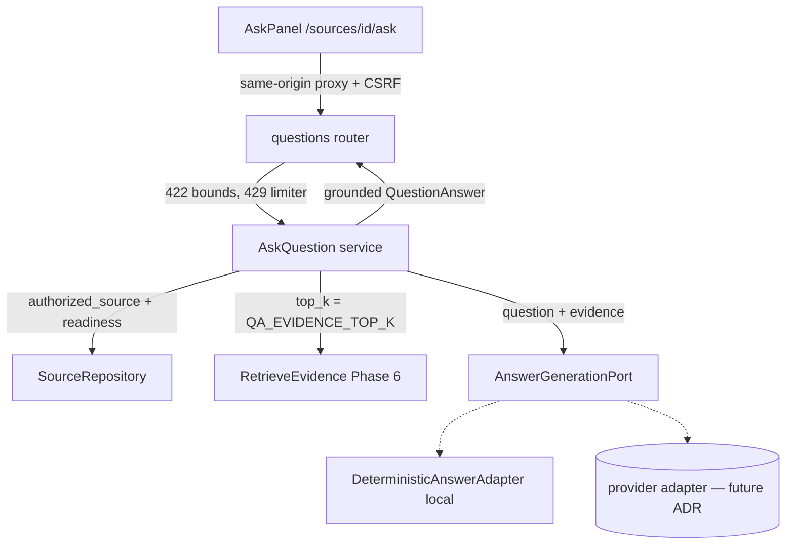

# Cited Q&A Design (`cited-qa`)

**Spec**: `.specs/features/cited-qa/spec.md`
**Status**: Approved (auto, per ship-cycle contract; decisions in `context.md`)

---

## Architecture Overview

The answer path composes the existing Phase-6 retrieval service with a new
Learny-owned generation port, keeping every provider concern behind one seam
(ADR-0007/0009). Approach chosen over two alternatives:

- **Chosen — compose `RetrieveEvidence`, guard in the service:** `AskQuestion`
  reuses the whole Phase-6 retrieval composition as a dependency and owns the
  readiness check, not-found short-circuit, and grounding guard.
  Why: maximal reuse (no duplicated embed+search wiring), the grounding
  invariant lives in Learny application code once for every future adapter.
  Why not: `RetrieveEvidence` re-runs `authorized_source` inside (one redundant
  source lookup per ask) — negligible, and keeps both services independently
  safe.
- **Alt 1 — `AskQuestion` wires ports directly (mirror `RetrieveEvidence`):**
  avoids the double lookup but duplicates retrieval composition; rejected for
  reuse.
- **Alt 2 — grounding inside each adapter:** smaller service, but the citation
  invariant would depend on per-adapter goodwill; rejected (D-4/AD-027).



Request flow (QA-01..17): validate (422) → auth/CSRF (401/403) → rate limit
(429) → `authorized_source` (404) → readiness (409) → retrieve; empty ⇒
`not_found_in_source` without invoking the port (QA-13) → `generate()`;
port exception ⇒ `AnswerGenerationFailed` (502, QA-17) → guards: `found`,
non-blank text, grounding filter in evidence-rank order (dedupes and grounds in
one step since fused evidence chunk ids are unique) → `answered` result →
one content-free log line (QA-12).

---

## Code Reuse Analysis

### Existing Components to Leverage

| Component | Location | How to Use |
|---|---|---|
| `RetrieveEvidence` | `backend/app/application/retrieval.py` | Injected whole as `AskQuestion`'s retrieval dependency |
| `authorized_source` | `backend/app/application/ingestion.py` | Ownership + 404 collapse, returns the `Source` for the readiness check |
| `Evidence` entity | `backend/app/domain/entities.py` | Citations are grounded `Evidence` items — no new citation entity |
| `EvidenceView` | `backend/app/infrastructure/web/retrieval.py` | Imported as the citation view (carries exactly the QA-02 fields + score) |
| Rate limiter | `backend/app/infrastructure/web/rate_limit.py` | New `rate_limit_questions` dependency, same limiter/key/429 shape |
| CSRF/Origin deps | `backend/app/infrastructure/web/csrf.py` | Same `Depends(enforce_origin), Depends(enforce_csrf)` pair |
| Error handler registry | `backend/app/infrastructure/web/error_handlers.py` | Add `SourceNotReady`→409, `AnswerGenerationFailed`→502 |
| Composition root | `backend/app/infrastructure/web/dependencies.py` | `get_ask_question` builds on the existing `get_retrieve_evidence` wiring |
| Frontend client pattern | `frontend/app/lib/sources.ts` | `questions.ts` mirrors CSRF header, `credentials: "same-origin"`, `toError` detail mapping |
| Frontend panel pattern | `frontend/app/components/SourcesPanel.tsx` | AskPanel follows its client-component + error-state conventions; sources list links to the ask view for ready sources |

### Integration Points

| System | Integration Method |
|---|---|
| Phase-6 retrieval | `RetrieveEvidence(user, source_id, query, top_k=settings.qa_evidence_top_k)` — layer consumed as-is, no retrieval changes (ADR-0006) |
| Settings | New `LEARNY_QA_QUESTION_MAX_CHARS` (2000), `LEARNY_QA_EVIDENCE_TOP_K` (8; server-controlled, kept ≤ `retrieval_max_top_k`) |
| Next.js proxy | Existing catch-all `/api/[...path]` forwards POST unchanged — no proxy edits |
| Database | None — no schema/migration this cycle (AD-025) |

---

## Components

### `GeneratedAnswer` + `QuestionAnswer` (domain DTOs)

- **Purpose**: Learny-owned result types so no provider response shape crosses the port (ADR-0007 §4).
- **Location**: `backend/app/domain/entities.py`
- **Interfaces** (frozen dataclasses):
  - `GeneratedAnswer(text: str, cited_chunk_ids: tuple[UUID, ...], model: str, found: bool)` — raw port output.
  - `QuestionAnswer(status: str, text: str, citations: tuple[Evidence, ...], evidence_count: int, model: str)` — service result; `status ∈ {"answered", "not_found_in_source"}`; not-found ⇒ `text == ""`, `citations == ()`.
- **Reuses**: `Evidence` for citations.

### `AnswerGenerationPort` (domain port)

- **Purpose**: The single seam for answer generation (QA-05).
- **Location**: `backend/app/domain/ports.py`
- **Interfaces**: `model: str` (stable identity, readable without generating — the not-found short-circuit reports it while never invoking `generate`, QA-04+QA-13); `generate(*, question: str, evidence: Sequence[Evidence]) -> GeneratedAnswer`
- **Contract**: returns `found=False` when the evidence cannot support an answer; raises for operational failure (the service maps any raise to `AnswerGenerationFailed`). Never sees SQL/HTTP types.

### `AskQuestion` (application service)

- **Purpose**: Orchestrate ownership → readiness → retrieve → generate → ground (QA-01..04, 07..08, 12..17).
- **Location**: `backend/app/application/qa.py` (new module)
- **Interfaces**: `__call__(*, user: User, source_id: UUID, question: str) -> QuestionAnswer` (question arrives trimmed/validated from the web layer, like `RetrieveEvidence`).
- **Dependencies**: `sources: SourceRepository`, `authorize: AuthorizeOwnership`, `retrieve: RetrieveEvidence`, `generation: AnswerGenerationPort`, `evidence_top_k: int`.
- **Logic**: as in the flow above. Grounding filter: `[e for e in evidence if e.chunk_id in set(gen.cited_chunk_ids)]` — evidence-rank order, inherently deduped (QA-02/03/15). Port call wrapped: any exception ⇒ `raise AnswerGenerationFailed from exc` (QA-17). Completion log via module `logging.getLogger(__name__)`: `qa completed outcome=<status> source_id=<id> evidence_count=<n> model=<m>` — never question/answer text (QA-12).
- **Reuses**: `authorized_source`, `RetrieveEvidence`.

### `DeterministicAnswerAdapter`

- **Purpose**: Default network-free adapter (QA-06; AD-024 mirror of AD-019).
- **Location**: `backend/app/infrastructure/answering/local.py` (new package)
- **Interfaces**: implements `AnswerGenerationPort`; model identity `"local-extractive"`.
- **Logic**: empty evidence ⇒ `GeneratedAnswer("", (), model, found=False)` (defensive; service short-circuits first). Else compose the answer from the top `min(3, len(evidence))` snippets (`_MAX_SNIPPETS = 3`, adapter-local constant — prompt-shaping detail, not product config) joined by blank lines, citing exactly those chunk ids, `found=True`. Pure function of input ⇒ deterministic.

### Application errors + handlers

- **Location**: `backend/app/application/errors.py`, `backend/app/infrastructure/web/error_handlers.py`
- `SourceNotReady` → 409 `{"detail": "Source is not ready for questions."}` (names the not-ready state, QA-08).
- `AnswerGenerationFailed` → 502 `{"detail": "Answer generation failed. Please try again."}` — generic, no provider detail (QA-17).

### Questions router

- **Purpose**: `POST /api/sources/{source_id}/questions` (QA-01..04, 09..11).
- **Location**: `backend/app/infrastructure/web/questions.py` (new)
- **Interfaces**: `QuestionRequest{question: str}` — validator strips, rejects blank, rejects trimmed length > `qa_question_max_chars` (mirrors retrieve's `get_settings()` validator pattern), and passes the **trimmed** value on. Response `AnswerResponse{answer_status, answer, citations: list[EvidenceView], retrieval: {strategy: "hybrid", evidence_count}, model}`.
- **Dependencies**: `enforce_origin`, `enforce_csrf`, `rate_limit_questions`, `get_authenticated_user`, `get_ask_question`.

### `rate_limit_questions`

- **Location**: `backend/app/infrastructure/web/rate_limit.py`
- Mirrors `rate_limit_upload` (shared swappable limiter, IP+route key, 429 + `Retry-After`; same documented proxy-IP limitation) (QA-22).

### Composition root additions

- **Location**: `backend/app/infrastructure/web/dependencies.py`
- Process-wide `_answering = DeterministicAnswerAdapter()` + `get_answer_generation()` (test-overridable, like `get_storage`); `get_ask_question(conn)` composes repositories, `AuthorizeOwnership`, the existing `get_retrieve_evidence(conn)` product, `_answering`, and `settings.qa_evidence_top_k`.

### Frontend: questions client + AskPanel + ask page

- **Location**: `frontend/app/lib/questions.ts`, `frontend/app/components/AskPanel.tsx`, `frontend/app/sources/[id]/ask/page.tsx`; link ("Ask") from the sources list for `status === "ready"` rows in `SourcesPanel.tsx`.
- **Interfaces**: `askQuestion(sourceId, question, csrfToken, fetchImpl?) -> Promise<AnswerView>`; `AnswerView` mirrors `AnswerResponse`. POST with `credentials: "same-origin"` + `X-CSRF-Token` (QA-21). Non-OK ⇒ `Error` from backend `detail` with readable fallback (QA-20).
- **AskPanel states**: idle form → pending → answered (answer text + per-citation `section_path.join(" › ")` + snippet) → not-found message → error message; form stays usable after every terminal state (QA-18..20). CSRF token obtained on mount via the existing `/api/auth/me` flow (mirrors SourcesPanel).

---

## Data Models

No database changes. Response shape (contract for client + tests):

```json
{
  "answer_status": "answered",
  "answer": "…",
  "citations": [
    {
      "chunk_id": "…", "source_id": "…",
      "section_path": ["Chapter 1", "Core Idea"],
      "anchor": "chapter-1.xhtml#core-idea",
      "page_span": null, "snippet": "…", "score": 0.03
    }
  ],
  "retrieval": { "strategy": "hybrid", "evidence_count": 8 },
  "model": "local-extractive"
}
```

Not-found: `answer_status: "not_found_in_source"`, `answer: ""`,
`citations: []`, same `retrieval`/`model` fields (QA-04 applies to both).

---

## Error Handling Strategy

| Error Scenario | Handling | User Impact |
|---|---|---|
| Blank / over-long question | Pydantic validator → 422 before service runs | Inline "enter a question (max 2000 chars)" style message |
| No/invalid session | `NotAuthenticated` → 401 (existing) | Redirect/notice per existing screens |
| Bad Origin / CSRF | 403 (existing deps) | Readable error |
| Missing / non-owned source | `SourceNotFound` → 404, identical body | "Source not found." |
| Source not ready | `SourceNotReady` → 409 | "This source isn't ready for questions yet." |
| No supporting evidence | 200 `not_found_in_source` | Explicit not-found message, no citations |
| Port raises | `AnswerGenerationFailed` → 502 generic | "Answer generation failed. Please try again." |
| Rate limit exceeded | 429 + `Retry-After` | "Too many questions, try again shortly." |

---

## Risks & Concerns

| Concern | Location | Impact | Mitigation |
|---|---|---|---|
| Rate-limit key collapses behind the proxy (all users share the proxy IP) | `rate_limit.py:83` (documented KNOWN LIMITATION) | One actor can exhaust the questions window for everyone | Accepted since Cycle 1 for single-process MVP; same documented note reused; Redis/forwarded-IP swap is a wiring change |
| Deterministic adapter produces extractive, not generative, prose | `answering/local.py` | Placeholder answer quality until a provider ADR lands | Port contract + grounding guard are adapter-independent; provider adapter is a drop-in follow-up (AD-024, flagged at merge gate) |
| Double source lookup per ask (`AskQuestion` + inner `RetrieveEvidence`) | `qa.py` | One extra indexed PK query per request | Negligible; keeps both services independently safe; noted for a later refactor if profiling ever cares |
| `EvidenceView` imported across web modules (questions ← retrieval) | `web/questions.py` | Mild coupling between routers | Both are web-layer views of the same domain entity; move to a shared views module only when a third consumer appears |
| No dedicated `LEARNY_QA_*` guard that `qa_evidence_top_k ≤ retrieval_max_top_k` | `config.py` | Misconfig could request more evidence than the retrieve API would allow its own clients | Server-controlled setting; `RetrieveEvidence` itself has no cap (web layer owns that bound), so behavior stays correct — documented in config comment |

---

## Tech Decisions (only non-obvious ones)

| Decision | Choice | Rationale |
|---|---|---|
| Reuse `RetrieveEvidence` inside `AskQuestion` | Inject the service, not raw ports | Single retrieval composition; grounding/readiness stay in one new service |
| Citations are `Evidence` | No new citation entity/table | Grounding filter maps cited ids back to retrieved `Evidence`; view reuses `EvidenceView` |
| Adapter snippet cap | `_MAX_SNIPPETS = 3` adapter-local constant | Prompt-shaping detail of one adapter, not product configuration |
| Not-found carries `retrieval`/`model` too | QA-04 applies to every 200 | UI and future evaluation see diagnostics on both outcomes |

Project-level decisions AD-024..AD-029 appended to `.specs/project/STATE.md`
(mirrors of `context.md` D-1..D-6).
