# EPUB Corpus Pipeline Design

**Spec**: `.specs/features/epub-corpus-pipeline/spec.md` (CORP-01..14)
**Context**: `.specs/features/epub-corpus-pipeline/context.md` (D-1..D-5)
**Status**: Draft
**Approach**: One-transaction step (user-confirmed) — the existing `IngestionStep`
seam is implemented by a real adapter; parse + build + persist run inside a single
task-owned transaction, so rollback gives CORP-08/09 with no new lifecycle machinery.

---

## Architecture Overview

Cycle 3's lifecycle is untouched: the task still claims the job, classifies
retryable vs terminal failures, and drives `source.status`. The only task change is
the step block opening `get_engine().begin()` instead of `.connect()`, so the whole
corpus build is one transaction. The step adapter maps infrastructure failures to
the existing retry contract; a new `BuildCorpus` application service orchestrates
ports; ebooklib and BeautifulSoup live only inside `infrastructure/ingestion/`
(ADR-0009, D-1).

```mermaid
graph TD
    T[worker/tasks.py run_ingestion<br/>step block: begin&#40;&#41; tx] --> S[EpubCorpusIngestionStep<br/>infrastructure/worker/steps.py<br/>error mapping only]
    S --> B[BuildCorpus<br/>application/corpus.py]
    B --> SP[StoragePort.get_object<br/>existing S3 adapter]
    B --> PP[EpubParserPort.parse<br/>EbooklibEpubParser]
    B --> MC[MarkupConverterPort.to_markdown<br/>Bs4MarkupConverter]
    B --> CH[pack_chunks&#40;&#41; — pure fn<br/>application/chunking.py]
    B --> CR[CorpusRepository.replace<br/>SqlAlchemyCorpusRepository]
    B --> EV[IngestionEventRepository.append<br/>corpus_built + counts]

    W[GET /api/sources/id/structure] --> RS[ReadSourceStructure<br/>application/corpus.py]
    RS --> CR2[CorpusRepository.get_structure]
    FE[SourcesPanel 'View structure'] -->|same-origin proxy| W
```



Build sequence inside the one transaction: read bytes → parse to `ParsedBook` →
derive per-section Markdown (block by block via the converter) → pack chunks →
`CorpusRepository.replace` (delete old document row, cascade wipes children; insert
new aggregate) → append `corpus_built` event with counts. Any raise rolls back all
of it; Celery `acks_late` redelivery just rebuilds (replace is idempotent).

---

## Code Reuse Analysis

### Existing Components to Leverage

| Component | Location | How to Use |
|---|---|---|
| `IngestionStep` port + task retry classification | `app/domain/ports.py:208`, `app/worker/tasks.py` | Implement the port; contract unchanged (`run(*, source, job) -> None`) |
| `RetryableIngestionError` | `app/infrastructure/worker/steps.py` | Raised by the new step for transient storage faults (CORP-07) |
| `StoragePort` / `S3StorageAdapter` (+ `ObjectNotFound`) | `app/domain/ports.py:235`, `app/infrastructure/storage/s3.py` | `get_object(source.object_key)`; `ObjectNotFound` stays terminal |
| `_authorized_source` (ownership-as-404) | `app/application/ingestion.py:51` | Reuse verbatim in `ReadSourceStructure` (CORP-11) |
| `IngestionEventRepository` | `app/infrastructure/db/repositories.py` | Append the `corpus_built` counts event (CORP-10) |
| Shared `metadata` + `NAMING_CONVENTION` | `app/infrastructure/db/metadata.py` | New corpus tables join the same `MetaData` |
| Alembic migration chain | `backend/alembic/versions/` (0003 latest) | Migration 0004 for corpus tables |
| `get_settings()` | `app/core/config.py` | New `chunk_max_chars` setting (A-5) |
| Web error handlers / 404 mapping | `app/infrastructure/web/error_handlers.py` | `CorpusNotFound` → 404 like `SourceNotFound` |
| Same-origin proxy catch-all | `frontend/app/api/[...path]/route.ts` | No new proxy routes (Cycle 2 T7 precedent) |
| `lib/sources.ts` fetch pattern + CSRF-free GET | `frontend/app/lib/sources.ts` | `fetchSourceStructure()` mirrors `listSources()` |
| `SourcesPanel` row controls + error state | `frontend/app/components/SourcesPanel.tsx` | "View structure" mirrors the Start-ingestion row pattern |

### Integration Points

| System | Integration Method |
|---|---|
| Worker lifecycle | `_build_run_ingestion` wires `EpubCorpusIngestionStep` instead of `NoOpIngestionStep`; step block `connect()` → `begin()` (`app/worker/tasks.py:90`) |
| Database | New tables FK onto `sources` (`ondelete="CASCADE"`, CORP-14); ownership reachable only via parent source (AD-014 pattern) |
| Web API | New `GET /api/sources/{source_id}/structure` on the existing sources router |
| Frontend | Structure fetch goes through the existing proxy; control gated on `status === "ready"` |

---

## Components

### Domain entities (`app/domain/entities.py`)

- **Purpose**: Library-free parse result + read models (ADR-0009).
- **Interfaces** (frozen dataclasses):
  - `ParsedBlock(position: int, block_type: str, html_fragment: str)`
  - `ParsedSection(position: int, title: str, depth: int, section_path: tuple[str, ...], anchor: str, blocks: tuple[ParsedBlock, ...])`
  - `ParsedBook(title: str | None, authors: tuple[str, ...], language: str | None, sections: tuple[ParsedSection, ...])`
  - `SectionChunk(index: int, text: str, section_path: tuple[str, ...], anchor: str, page_span: None)` — `page_span` always `None` for EPUB (A-9)
  - `CorpusSectionRecord(section: ParsedSection, markdown: str, chunks: tuple[SectionChunk, ...])` — the persistable aggregate item
  - `CorpusStructure(title: str | None, authors: tuple[str, ...], language: str | None, sections: tuple[StructureSection, ...])`; `StructureSection(position, title, depth, section_path, anchor)` — flat, ordered; nesting happens at the web layer
- **Reuses**: `Source`, `IngestionJob` untouched.

### Ports (`app/domain/ports.py`)

- `EpubParserPort.parse(source_bytes: bytes, *, filename: str) -> ParsedBook` — raises `InvalidEpubError` on anything that is not a parseable EPUB (CORP-06).
- `MarkupConverterPort.to_markdown(html: str) -> str` — A-6 element coverage.
- `CorpusRepository`:
  - `replace(source_id: UUID, *, title, authors, language, schema_version: int, sections: Sequence[CorpusSectionRecord]) -> None` — delete-then-insert inside the caller's transaction (CORP-09)
  - `get_structure(source_id: UUID) -> CorpusStructure | None` (CORP-11)
- `InvalidEpubError` lives in `app/application/errors.py` beside the other use-case errors (it is transport-agnostic and terminal by the existing task rule "any non-retryable raise is terminal").

### `BuildCorpus` (`app/application/corpus.py`)

- **Purpose**: The Phase-5 use case — bytes to persisted corpus, one call (CORP-01..05, 08..10).
- **Interfaces**: `__call__(*, source: Source, job: IngestionJob) -> None`
- **Logic**: get bytes → parse → for each section: markdown = `\n\n`-join of `to_markdown(block.html_fragment)`; chunks = `pack_chunks(markdown_blocks, max_chars, section_path, anchor)` → `corpus.replace(...)` with `schema_version=1` (A-8) → `events.append(corpus_built, "sections=N blocks=M chunks=K")`.
- **Dependencies**: `StoragePort`, `EpubParserPort`, `MarkupConverterPort`, `CorpusRepository`, `IngestionEventRepository`, `Clock`, `ids`, `chunk_max_chars`.
- **Reuses**: event-append pattern from `RunIngestion._append_event`.

### `pack_chunks` (`app/application/chunking.py`)

- **Purpose**: Pure structure-first packing (D-4, A-5, CORP-05). No I/O, no libraries.
- **Interfaces**: `pack_chunks(block_texts: Sequence[str], *, max_chars: int, section_path, anchor) -> tuple[SectionChunk, ...]`
- **Logic**: append whole block texts (joined by `\n\n`) while ≤ `max_chars`; a single block text > `max_chars` splits at sentence boundaries (regex on `.!?` + whitespace; hard character fallback for pathological sentence-free text so the cap is absolute); empty texts skipped; indices contiguous from 0.

### `ReadSourceStructure` (`app/application/corpus.py`)

- **Purpose**: Ownership-scoped structure read (CORP-11).
- **Interfaces**: `__call__(*, user: User, source_id: UUID) -> CorpusStructure`
- **Logic**: `_authorized_source(...)` (missing/non-owner → `SourceNotFound` → 404); `get_structure` `None` → `CorpusNotFound` (new, `app/application/errors.py`) → 404 (A-7).

### `EbooklibEpubParser` (`app/infrastructure/ingestion/epub.py`)

- **Purpose**: The only module importing ebooklib/bs4 for parsing (ADR-0009, D-1).
- **Interfaces**: implements `EpubParserPort`.
- **Logic** (A-1..A-4):
  1. `epub.read_epub(BytesIO(source_bytes))`; any ebooklib/zip/XML failure wrapped in `InvalidEpubError`.
  2. OPF metadata: `get_metadata("DC", ...)` → title/authors/language, `None`/empty when absent (CORP-01).
  3. Flatten `book.toc` depth-first into TOC entries: `(href, fragment, title, depth, section_path)`.
  4. Walk `book.spine` in order, **linear items only** (A-3); unresolvable spine idref → `InvalidEpubError`; TOC entries pointing at hrefs not in the spine are dropped (edge case).
  5. Per spine document: soup `item.get_body_content()`; iterate top-level block elements (`h1..h6, p, ul, ol, table, pre, blockquote, figure, img, hr`; unknown elements kept as `other`). The current section starts as the TOC entry targeting the doc's href without fragment — else the A-2 fallback section (first heading text, else href stem). When an element (or a descendant) carries an `id` matching a TOC fragment for this doc, switch current section *before* assigning that element. Blocks get a global running `position`.
  6. Section `anchor` = `href` or `href#fragment` (A-4); blocks keep their raw outer HTML as `html_fragment` (CORP-03).
- **Dependencies**: `ebooklib`, `beautifulsoup4` (new backend deps via uv).

### `Bs4MarkupConverter` (`app/infrastructure/ingestion/markup.py`)

- **Purpose**: Preserved-HTML → Markdown for the A-6 element set; the derivation input is the stored fragment, never the EPUB (CORP-04).
- **Interfaces**: implements `MarkupConverterPort`.
- **Logic**: hand-rolled bs4 walker: `h1..h6` → `#`-levels, `p` → text, `ul/ol` → `-`/`1.` items (nested via indent), `blockquote` → `>`, `pre/code` → fenced blocks, `table` → GitHub pipe table, `img` → ``, `a` → `[text](href)`, `em/strong` → `*`/`**`; anything else → `.get_text()` (never dropped, A-6).

### `EpubCorpusIngestionStep` (`app/infrastructure/worker/steps.py`)

- **Purpose**: Bind `BuildCorpus` to the existing `IngestionStep` contract; own retry classification (CORP-06/07).
- **Interfaces**: `run(*, source: Source, job: IngestionJob) -> None`
- **Logic**: `try: self._build(source=source, job=job)`; `except (ClientError, BotoCoreError) as exc: raise RetryableIngestionError from exc`. `ObjectNotFound` and `InvalidEpubError` propagate untouched → terminal. `NoOpIngestionStep` stays exported for existing tests.

### Worker wiring (`app/worker/tasks.py`)

- Step block at line 90: `get_engine().connect()` → `get_engine().begin()`.
- `_build_run_ingestion(conn)` gains the real step: `EpubCorpusIngestionStep(BuildCorpus(storage=S3StorageAdapter(...), parser=EbooklibEpubParser(), markup=Bs4MarkupConverter(), corpus=SqlAlchemyCorpusRepository(conn), events=SqlAlchemyIngestionEventRepository(conn), clock=_clock, ids=uuid4, chunk_max_chars=get_settings().chunk_max_chars))`.
- Nothing else in the task changes — begin/retry/fail/complete transactions stay as-is.

### `SqlAlchemyCorpusRepository` (`app/infrastructure/db/repositories.py`)

- **Purpose**: Corpus persistence over the new tables; caller-provided `Connection` (convention).
- **Interfaces**: `replace(...)`, `get_structure(...)` per the port.
- **Logic**: `replace` = `DELETE FROM corpus_documents WHERE source_id = :sid` (cascade clears children) + bulk `insert()` of document/sections/blocks/chunks. `get_structure` = document row + sections ordered by `position`.

### Web endpoint (`app/infrastructure/web/sources.py`)

- **Purpose**: `GET /api/sources/{source_id}/structure` (CORP-11).
- **Response schema**: `{"title", "authors", "language", "sections": [{"title", "depth", "section_path", "anchor", "children": [...]}]}` — nested tree built in the web layer from the flat depth-ordered list.
- **Errors**: `SourceNotFound`/`CorpusNotFound` → 404, unauthenticated → 401 via existing handlers. No CSRF (GET), no new rate limit (A-7).

### Frontend (`frontend/app/lib/sources.ts`, `frontend/app/components/SourcesPanel.tsx`)

- `fetchSourceStructure(id: string): Promise<SourceStructure>` — mirrors `listSources()`; type `SourceStructure = { title: string | null; authors: string[]; language: string | null; sections: StructureSection[] }` with recursive `children`.
- `SourcesPanel`: rows with `status === "ready"` render a "View structure" toggle button (CORP-12); in-flight → button disabled (CORP-13); success → expandable panel under the row with metadata line + recursive `<ul>` section tree; failure → existing `error` alert pattern. One `structureId`/`structure` state pair, mirroring `startingId`.

### Config (`app/core/config.py`)

- `chunk_max_chars: int = 2000` (`LEARNY_CHUNK_MAX_CHARS`, A-5).

### Migration (`backend/alembic/versions/0004_*.py`)

- Creates the four corpus tables below; no changes to existing tables.

### Test fixtures (`backend/tests/fixtures_epub.py`)

- Synthetic EPUBs (D-5) built **as code** with stdlib `zipfile` + literal OPF/XHTML strings — reviewable in diffs, no binaries in git, and independent of ebooklib's writer (no parse-what-we-wrote circularity):
  - `valid_book()` — nested TOC (2 levels), multiple spine docs, in-doc `id` anchors, an image, a footnote, a doc absent from the TOC (A-2 path), a non-linear spine item (A-3).
  - `no_toc_book()`, `broken_spine_book()`, `empty_body_book()`, `not_an_epub()` (plain bytes).
- Expected structures asserted in tests as literal Python (golden-style, ADR-0016 precursor).

---

## Data Models

New SQLAlchemy Core tables on the shared `metadata` (all `created_at DateTime(timezone=True) server_default=func.now()`, UUID PKs):

```python
corpus_documents = Table(
    "corpus_documents", metadata,
    Column("id", UUID(as_uuid=True), primary_key=True),
    Column("source_id", UUID(as_uuid=True),
           ForeignKey("sources.id", ondelete="CASCADE"), nullable=False, unique=True),
    Column("title", Text, nullable=True),            # OPF DC title (CORP-01)
    Column("authors", JSONB, nullable=False, server_default="[]"),
    Column("language", Text, nullable=True),
    Column("schema_version", Integer, nullable=False, server_default="1"),  # A-8
    Column("created_at", ...),
)

corpus_sections = Table(
    "corpus_sections", metadata,
    Column("id", UUID(as_uuid=True), primary_key=True),
    Column("document_id", UUID(as_uuid=True),
           ForeignKey("corpus_documents.id", ondelete="CASCADE"), nullable=False, index=True),
    Column("position", Integer, nullable=False),      # spine/TOC order (CORP-02)
    Column("depth", Integer, nullable=False),         # TOC nesting depth, root=0
    Column("title", Text, nullable=False),
    Column("section_path", JSONB, nullable=False),    # root-to-node titles (A-1/A-2)
    Column("anchor", Text, nullable=False),           # href[#fragment] (A-4)
    Column("markdown", Text, nullable=False),         # derived view (CORP-04)
    Column("created_at", ...),
    UniqueConstraint("document_id", "position"),
)

corpus_blocks = Table(
    "corpus_blocks", metadata,
    Column("id", UUID(as_uuid=True), primary_key=True),
    Column("section_id", UUID(as_uuid=True),
           ForeignKey("corpus_sections.id", ondelete="CASCADE"), nullable=False, index=True),
    Column("position", Integer, nullable=False),      # global reading order (CORP-03)
    Column("block_type", Text, nullable=False),       # heading|paragraph|list|table|...
    Column("html_fragment", Text, nullable=False),    # preserved HTML (ADR-0002)
    Column("created_at", ...),
)

corpus_chunks = Table(
    "corpus_chunks", metadata,
    Column("id", UUID(as_uuid=True), primary_key=True),
    Column("section_id", UUID(as_uuid=True),
           ForeignKey("corpus_sections.id", ondelete="CASCADE"), nullable=False, index=True),
    Column("chunk_index", Integer, nullable=False),   # order within section (CORP-05)
    Column("text", Text, nullable=False),             # derived Markdown text
    Column("section_path", JSONB, nullable=False),    # denormalized citation anchor
    Column("anchor", Text, nullable=False),
    Column("page_span", JSONB, nullable=True),        # NULL for EPUB; PDF later (A-9)
    Column("created_at", ...),
)
```

**Relationships**: `sources 1—0..1 corpus_documents 1—* corpus_sections 1—* corpus_blocks / corpus_chunks`. Ownership flows through `sources.user_id` (AD-014 pattern — no `owner_id` duplication). The `unique` on `corpus_documents.source_id` enforces one corpus per source at the persistence layer (CORP-09), mirroring how Cycle 3 backstopped ING-03 with an index. Phase 6 adds embedding/tsvector columns to `corpus_chunks` — no reshape needed.

---

## Error Handling Strategy

| Error Scenario | Handling | User Impact |
|---|---|---|
| Non-EPUB / corrupt bytes / unresolvable spine | `InvalidEpubError` from parser → propagates (terminal); tx rollback; task writes `failed` + redacted summary | Source `failed`; generic "Ingestion processing failed." (CORP-06) |
| Object missing from storage | `ObjectNotFound` propagates (terminal), same path as above | Same as above (edge case) |
| Transient storage fault (`ClientError`/`BotoCoreError`) | Step maps → `RetryableIngestionError`; existing backoff retry (max 3) | `retrying` events; eventual success or failure (CORP-07) |
| Any failure mid-build | Single-tx rollback: zero new rows, old corpus intact | No partial data ever visible (CORP-08) |
| Crash after step tx commit, before `complete()` | `acks_late` redelivery: `begin_run` sees `running` job → step re-runs → `replace` rebuilds idempotently | At most a duplicate `corpus_built` event in the log |
| Structure request: missing/non-owner source | `SourceNotFound` → 404 (existing handler) | 404, no existence disclosure (CORP-11) |
| Structure request: no corpus yet | `CorpusNotFound` → 404 (A-7) | 404; FE only offers the control on `ready` rows |
| FE structure fetch fails | Existing `error` alert state; button re-enabled | Readable error, retryable (CORP-13) |

---

## Risks & Concerns

| Concern | Location | Impact | Mitigation |
|---|---|---|---|
| Real-world EPUB nav/TOC quirks (missing entries, weird nesting) crash the parser | `EbooklibEpubParser` | Terminal failures on books that should ingest | A-2/A-3 fallbacks are explicit design; every parse failure is wrapped (never a raw traceback into state); malformed fixtures pin the behavior; Phase 9 adds real books |
| DB transaction held during parse | `worker/tasks.py` step block | Long tx on very large books; pool pressure at scale | Accepted trade-off of the chosen approach (user-confirmed); books parse in seconds; revisit if Phase 9 real-book fixtures show pain |
| Existing worker/app tests wire `NoOpIngestionStep` and `connect()` | `backend/tests/test_worker_tasks.py`, `fakes.py` | Wiring change breaks tests if unhandled | `NoOpIngestionStep` stays exported; only `_build_run_ingestion` + the tx call change; task tests updated in the same task that changes them |
| bs4 `get_text()` fallback could flatten semantically rich unknown elements | `Bs4MarkupConverter` | Markdown fidelity loss for exotic markup | A-6 makes "text never dropped" the guarantee, not perfect fidelity; canonical HTML is preserved so Markdown can be re-derived better later without re-ingestion (ADR-0002's whole point) |
| `ruff format` drift pre-exists on 10 Cycle-1 files | `.specs/project/STATE.md` Known Gaps | `ruff format --check .` fails repo-wide | Unchanged scope: gate on `ruff check` + tests, format only new files (Cycle 2/3 precedent) |

---

## Tech Decisions (only non-obvious ones)

| Decision | Choice | Rationale |
|---|---|---|
| Markdown derivation | Hand-rolled bs4 walker, not `markdownify` | One fewer dependency; A-6 set is small and closed; full control over table/footnote text preservation; canonical HTML retained means we can swap later without re-ingest |
| Chunk text form | The derived Markdown text | One derived text form to reason about; headings/list markers help retrieval context; plain-text normalization can happen at embedding time (Phase 6) |
| Structure tree shape | Flat depth-ordered sections in domain/repo; nesting built at web layer | Keeps SQL and domain simple (no recursive queries); the tree is a presentation concern |
| Fixtures as code | stdlib `zipfile` + literal OPF/XHTML, no committed binaries, no ebooklib writer | Reviewable, deterministic, avoids parse-what-we-wrote circularity (D-5) |
| Parse-error type placement | `InvalidEpubError` in `app/application/errors.py` | Terminal-by-default under the existing task rule; adapter raises it without importing worker modules |
| One-corpus-per-source enforcement | `UNIQUE` on `corpus_documents.source_id` | Persistence-layer backstop for CORP-09, mirroring Cycle 3's ING-03 index pattern |

> Project-level decisions to append to `.specs/project/STATE.md` on approval:
> **AD-017** (ebooklib behind `EpubParserPort`; Docling deferred to PDF era) and
> **AD-018** (canonical corpus schema shape: document/sections/blocks/chunks FK'd
> off `sources`, atomic replace via delete+cascade in the step transaction,
> structure-first chunking with `LEARNY_CHUNK_MAX_CHARS`).
