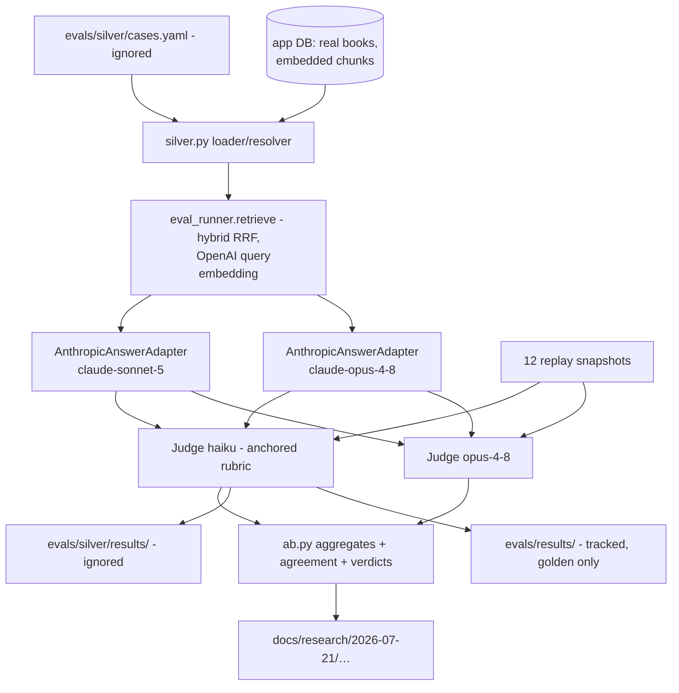

# Eval Deepening Design

**Spec**: `.specs/features/eval-deepening/spec.md`
**Status**: Approved (auto, ship-cycle contract; decisions AD-161..167)

---

## Architecture Overview

Two committed code surfaces, one local data surface, one evidence surface:

1. **Silver tier (committed code, ignored data).** A loader `backend/tests/eval/silver.py` (case schema, YAML load + validation, checksum+anchor resolution against a live DB) and a runner `backend/tests/eval/test_silver.py` (pytest, markers `live`+`eval`) that: resolves each case → retrieves over the app DB via `eval_runner.retrieve` → generates with the real Anthropic adapter → judges → appends JSONL to `evals/silver/results/`. Self-skips (module-level) when `evals/silver/cases.yaml` is absent or keys/DB are unset. Data lives in git-ignored `evals/silver/`.
2. **A/B study module (committed).** `backend/app/eval/ab.py`: pure aggregation/comparison logic — per-model metric aggregates, judge agreement rates (exact, within-1), verdict helpers implementing AD-165/AD-166 thresholds — plus a thin study driver that takes prepared cases and adapters. Pure logic is deterministically unit-tested; no SDK import at module level (ADR-0007/0009 lazy-import convention).
3. **Rubric anchoring (committed).** `backend/app/eval/prompts/relevancy.md` gains one exemplar per score 1–5; `prompt_hash()` changes as a byte-level consequence; `RELEVANCY_MIN` re-derived per the calibration runbook and re-pinned in `test_eval_judge.py`.
4. **Evidence (committed doc).** `docs/research/2026-07-21/eval-deepening-ab.md` — judge A/B + generation A/B results and both decisions. Golden-case results also land in tracked `evals/results/`; silver results only in ignored `evals/silver/results/`.

## Code Reuse Analysis

| Component | Location | How to Use |
| --- | --- | --- |
| `Judge` (already model-parameterized) | `backend/app/eval/judge.py:169` | Instantiate twice (haiku / opus-4-8); no class change needed |
| `prompt_hash()` | `backend/app/eval/judge.py:273` | Unchanged — rubric edit re-versions results automatically |
| `retrieve()` (raw `Connection`, settings-built embedder) | `backend/tests/eval_runner.py:186` | Silver runner calls it with an app-DB connection; `LEARNY_EMBEDDING_PROVIDER=openai` gives real query embeddings matching stored vectors |
| `AnthropicAnswerAdapter` (explicit `model=`) | `backend/app/infrastructure/answering/anthropic.py` | Construct one per A/B arm; do not go through `build_answer_adapter` (it reads the settings default) |
| Replay harness (`load_cases`, `load_snapshots`) | `backend/tests/eval/harness.py` | Judge A/B scores the 12 committed snapshots; generation A/B reuses the 12 golden cases' questions/evidence conventions |
| JSONL result-line schema + `_write_jsonl` pattern | `backend/app/eval/judge.py:333-345,395` | Silver/A/B lines reuse the same field set + `prompt_hash` |
| Live/record guard idiom | `backend/tests/eval/test_replay_harness.py:186-191` | Silver runner copies the self-skip pattern (marker + key/env checks) |
| Calibration procedure | `docs/ops/eval-calibration.md` | Recalibration follows the recorded 2026-07-18 derivation (baseline − margin) |

**Integration points:** app DB via `LEARNY_DATABASE_URL` (read-only usage: resolve sources by checksum, read chunks, run retrieval); markers `live`/`eval` already registered (`backend/pyproject.toml:56-58`); `.gitignore` (root) gains `evals/silver/`.

## Components

### `silver.py` (loader/resolver)

- **Purpose**: Parse + validate `evals/silver/cases.yaml`; resolve each case against a DB by source checksum + expected anchor(s); classify per-case as `runnable | skipped(book absent) | broken(anchor unresolvable)`.
- **Location**: `backend/tests/eval/silver.py`
- **Interfaces**:
  - `load_silver_cases(path: Path) -> list[SilverCase]` — schema-validates; raises `SilverCaseError` with case id + field on malformed input (DEEP-17 analog for load).
  - `resolve_case(conn: Connection, case: SilverCase) -> ResolvedCase | SkippedCase | BrokenCase` — checksum→source lookup; anchor→chunk lookup (including `anchor_aliases` on sections).
- **Data model**: `SilverCase{case_id, question, source_checksum, expected_anchors: list[str], expected_snippet, language}` — YAML, one file, 10–20 entries.
- **Reuses**: SQLAlchemy Core selects against `sources`/`corpus_*` tables (no ORM additions).

### `test_silver.py` (runner)

- **Purpose**: The committed silver runner: retrieval → generation → judge per runnable case; JSONL append per case; per-case statuses recorded (`retrieved_empty` flag per DEEP-19; error lines per DEEP-17/20).
- **Location**: `backend/tests/eval/test_silver.py`, markers `live, eval`.
- **Self-skip conditions (module level)**: missing `evals/silver/cases.yaml`, missing `LEARNY_ANTHROPIC_API_KEY`/`LEARNY_OPENAI_API_KEY`, or unreachable `LEARNY_DATABASE_URL` → pytest skip, zero provider calls (DEEP-03).
- **Results**: `evals/silver/results/<date>-<sha>.jsonl`, new file per run (DEEP-20).

### `ab.py` (study logic)

- **Purpose**: Deterministic aggregation + decision helpers for both A/Bs; the only place AD-165/AD-166 thresholds are encoded.
- **Location**: `backend/app/eval/ab.py`
- **Interfaces** (pure, unit-tested):
  - `aggregate(lines: list[dict]) -> ModelAggregate` — mean faithfulness, mean relevancy, citation-valid rate, not-found discipline, split by tier (golden/silver).
  - `judge_agreement(a: list[dict], b: list[dict]) -> Agreement{exact, within_1, n, gate_flips}` — paired by (case_id, generation_model).
  - `judge_verdict(agreement) -> keep | switch` per AD-165; `generation_verdict(sonnet: ModelAggregate, opus: ModelAggregate) -> stay | move` per AD-166 (silver tier drives; no metric may regress).
- **Reuses**: result-line dict schema from `run_eval`.

## Error Handling Strategy

| Error Scenario | Handling | User Impact |
| --- | --- | --- |
| Malformed cases.yaml | `SilverCaseError` naming case + field; run aborts before any provider call | Fix the local file |
| Book not ingested locally | Case → `skipped` with reason; run continues | Partial run, visible skip count |
| Anchor unresolvable after re-ingestion | Case → `broken` (distinct from skip) | Re-author the case |
| Judge returns unschema'd output | Error line (case_id, error) appended; case not scored | Visible in results + doc |
| Provider 5xx / rate limit mid-run | Per-case append already on disk; rerun writes a fresh results file | No corruption, safe rerun |
| Keys/data absent (CI, fresh clone) | Module-level pytest skip | Deterministic suite unaffected |

## Risks & Concerns

| Concern | Location | Impact | Mitigation |
| --- | --- | --- | --- |
| `LEARNY_EVAL_GATE` read via `os.getenv`, not Settings | `backend/app/eval/judge.py:322` | Pre-existing inconsistency; silver must not double down | Silver runner takes no gate path at all (report-only tier this cycle, AD-164) |
| `evals/results/` is tracked; silver lines contain copyrighted snippets | `.gitignore` (root) | Accidental commit of book text | Silver results directory lives *inside* ignored `evals/silver/`; runner refuses to write outside it; DEEP-05 test asserts ignore coverage |
| Duplicate ingested book ("Os 5 desafios…" ×2, same checksum likely) | app DB | checksum→source resolution ambiguity | Resolver picks deterministically (latest `created_at`) and records the chosen source id on the result line |
| App-DB writes from eval code | silver runner | Real user data | Runner opens read-only intent: SELECT-only statements; no repository write paths imported |
| Anchored rubric may shift faithfulness behavior too | `prompts/relevancy.md` | Gate flapping | Only `relevancy.md` is edited; faithfulness prompt untouched; recalibration re-pins only `RELEVANCY_MIN` |

## Tech Decisions (feature-local; project-level ones are AD-161..167)

| Decision | Choice | Rationale |
| --- | --- | --- |
| Silver runner is pytest, not a CLI | `test_silver.py` with `live`+`eval` markers | Matches every existing live-eval entry point; inherits skip idiom and `--record-generation`-style guards |
| A/B arms construct adapters directly | `AnthropicAnswerAdapter(model=…)` per arm | `build_answer_adapter` reads the settings default — exactly what the A/B must not depend on |
| Recalibration spend | 12 replayed outputs × 2 judge models ≈ 24 Haiku/Opus judge calls; generation A/B ≈ 27 cases × 2 models ≈ 54 generations + ~108 judge calls | Few dollars total; no training-wheels needed, but stated for the merge-gate report |
| Silver results file naming | `<date>-<git-sha>.jsonl` (same as `evals/results/`) | One convention everywhere |

## Execution Phases (→ tasks.md)

- **A. Silver foundation** — gitignore, `silver.py` loader/resolver + deterministic tests (fixture YAML + test-DB resolution), `test_silver.py` runner skeleton with self-skip + statuses. (Opus)
- **B. Rubric anchoring + recalibration** — exemplars in `relevancy.md`; live recalibration over the 12 snapshots; `RELEVANCY_MIN` + pinned test + `docs/ops/eval-calibration.md` update. (Opus)
- **C. A/B logic** — `ab.py` aggregates/agreement/verdicts + unit tests. (Opus)
- **D. Studies + evidence** — author 10–20 silver cases from the local corpus; run silver + both A/Bs live; write the research doc; apply AD-165/AD-166 decisions; ROADMAP row. (Opus; Verifier on Fable per established upshift)
