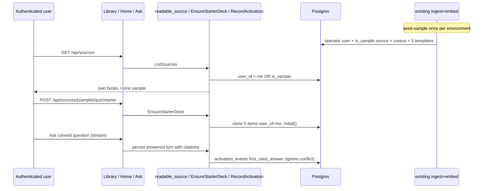

# first-session-converts Design

**Spec**: `.specs/features/first-session-converts/spec.md`
**Status**: Approved

---

## Architecture Overview

Keep every source row owned (`user_id` NOT NULL). Add a boolean `is_sample` so one operator-owned book is readable by every authenticated user. Do not widen `AuthorizeOwnership`. Introduce `readable_source` beside `authorized_source`. Quiz templates stay on the operator; each learner gets five cloned items with their own FSRS rows. Activation is a tiny unique table written only from application persist/register/read/review hooks.

Rejected alternatives that deliver the same RFC slice:

| Approach | Why not |
|---|---|
| Nullable `sources.user_id` | Every owner query must remember NULL-is-public; easy 404/leak. |
| Per-signup clone of the sample source | Pays embeddings per user; RFC exclusion. |
| Shared `quiz_items` for the starter deck | AD-149 `user_id` NOT NULL; FSRS cannot be shared. |
| `InstrumentRecorder` / `study_days` as the funnel | Ops rings and adherence counters are not once-per-user events. |
| Guest Ask widget on `/` | RFC conflict 2; Cycle F. |
| Auto-seed on API boot | Races workers; can call OpenAI in prod. |



---

## Code Reuse Analysis

### Existing Components to Leverage

| Component | Location | How to Use |
|---|---|---|
| `authorized_source` | `backend/app/application/ingestion.py:61` | Keep owner-only for mutate paths. |
| `AuthorizeOwnership` | `backend/app/application/identity.py:238` | Unchanged. |
| `ListSources` / `GetSource` | `backend/app/application/sources.py` | List unions sample; Get uses `readable_source`. |
| `SourceSummary` | `backend/app/infrastructure/web/sources.py:60` | Add `is_sample`, `suggested_question`. |
| `_answered_turn` / persist | `backend/app/application/conversations.py` | After persist, `RecordActivation` when Ask+answered+citations. |
| `RegisterUser` | `backend/app/application/identity.py` | Insert `account_created`. |
| `SubmitReview` | `backend/app/application/reviews.py` | Insert `first_review` after success. |
| `StartDeckGeneration` | `backend/app/application/quiz.py` | Keep `authorized_source` so sample returns 404 for non-owners. |
| Library CTAs | `frontend/app/components/library-screen.tsx` | One Open; overflow; PDF accept; wait copy. |
| Home | `frontend/app/components/home-screen.tsx` | Ask-first when due is 0 and no resume. |
| Ask panel | `frontend/app/components/ask-panel.tsx` | Highlight `suggested_question` when `is_sample`. |
| Landing | `frontend/app/page.tsx` | Static proof; no fetch to generation. |
| Notes export | `frontend/app/components/notes/notes-screen.tsx` | Label Download notes. |
| Sidebar | `frontend/app/components/shell/app-sidebar.tsx` | Label Library. |
| CreateSource + enqueue | existing ingest | Seed CLI reuses commit-then-enqueue (AD-016). |

### Integration Points

| System | Integration Method |
|---|---|
| `sources` | Column `is_sample BOOLEAN NOT NULL DEFAULT false`; unique partial index `WHERE is_sample`. |
| `activation_events` | New table; FK users CASCADE; UNIQUE `(user_id, name)`. |
| `quiz_items` | Existing unique on deck content_key; clones use caller `user_id` + sample `source_id`. |
| Conversations | Sample Ask uses `readable_source` in `StartConversation` / turn paths. |
| Reading | `ReadChapter` uses `readable_source` so Open works. |

---

## Components

### `readable_source`

- **Purpose**: Return a source the caller may read, or `SourceNotFound`.
- **Location**: `backend/app/application/ingestion.py`
- **Interfaces**: `readable_source(*, user, source_id, sources, authorize) -> Source`
- **Dependencies**: `SourceRepository`, `AuthorizeOwnership` (owner branch only)
- **Reuses**: same 404 collapse as `authorized_source`

### `EnsureStarterDeck`

- **Purpose**: Clone five operator templates to the caller for the sample source.
- **Location**: `backend/app/application/quiz.py`
- **Interfaces**: `__call__(*, user, source_id) -> Sequence[QuizItem]`
- **Dependencies**: `readable_source`, quiz item repo, `SchedulingPort.initial`
- **Reuses**: existing upsert/insert; conflict on `(user_id, content_key)` or equivalent unique so overlap cannot double-insert

### `RecordActivation`

- **Purpose**: Idempotent insert of a closed event name.
- **Location**: `backend/app/application/activation.py`
- **Interfaces**: `__call__(*, user_id, name: ActivationName) -> None`
- **Dependencies**: activation repo, clock
- **Reuses**: structured logging pattern from conversation persist

### `SeedSample`

- **Purpose**: Idempotent operator+source+store+enqueue. Exit non-zero on storage/enqueue failure without marking ready.
- **Location**: `backend/app/application/sample.py` + CLI entry
- **Interfaces**: `__call__() -> Source`
- **Dependencies**: storage, sources, ingestion enqueue
- **Reuses**: CreateSource / StartIngestion / AD-016

---

## Data Models

### Source (additive)

```python
is_sample: bool  # default False
# suggested_question is not necessarily a column: is_sample sources
# serialize LEARNY_SAMPLE_QUESTION (or a module constant) on the summary.
```

Partial unique: `CREATE UNIQUE INDEX uq_sources_one_sample ON sources (is_sample) WHERE is_sample`.

### activation_events

```python
user_id: UUID  # FK users CASCADE
name: str      # account_created | sample_opened | first_cited_answer | first_review
occurred_at: datetime
# PK or UNIQUE (user_id, name)
```

Closed enum in application code. No client-supplied name.

---

## Error Handling Strategy

| Error Scenario | Handling | User Impact |
|---|---|---|
| Non-owner mutates sample | `authorized_source` → `SourceNotFound` | 404 |
| Unauthenticated sample | existing auth dep | 401 |
| Starter on non-sample | 404 | Hidden |
| Sample not ready | existing 409 not-ready | Badge + wait |
| Overlapping starter POSTs | unique constraint; second returns existing five | Five cards |
| Duplicate activation | ON CONFLICT DO NOTHING | One row |
| Seed storage/enqueue fail | abort; no ready sample row | Non-zero CLI |
| Failed / not-found Ask | no `first_cited_answer` | Conversation kept (Cycle A) |

---

## Risks & Concerns

| Concern | Location | Impact | Mitigation |
|---|---|---|---|
| `authorized_source` used on Ask/read today | `conversations.py`, `reading.py`, `corpus.py` | Sample 404s for everyone but the operator | Switch those read paths to `readable_source`; leave ingest/delete/deck-start on `authorized_source` |
| `list_by_user` exclusive | `repositories.py` | Sample invisible | `list_for_library(user)` = own UNION sample |
| GET that clones cards | new starter route | Accidental mint on prefetch | POST only |
| Teach answered without citations | `conversations.py` | False aha | Gate mode=ask AND citations≥1 |
| SE EPUB in repo vs AD-037 | goldens | Policy confusion | Product sample path is not a golden; tests use synthetic books |
| Compose without seed | local empty sample | First session still empty | Makefile target + ops note; not boot |

---

## Tech Decisions

| Decision | Choice | Rationale |
|---|---|---|
| ACL flag | `is_sample` boolean + partial unique | RFC OQ2; AD-316 |
| Read primitive | `readable_source` | Do not widen `AuthorizeOwnership` |
| Starter trigger | POST `/api/sources/{id}/quiz/starter` | Idempotent; not register; not GET |
| Events | `activation_events` unique pair | First-party; no SDK |
| `first_cited_answer` | persist hook, Ask+answered+≥1 citation | RFC success-only |
| Suggested question | constant serialized when `is_sample` | No extra column required |
| Seed | CLI/Make, enqueue ingest | AD-016; no boot seed |
| Landing proof | static copy on `page.tsx` | No provider call |

Project-level: AD-315 (this cycle is one PR), AD-316..AD-321 as in STATE.
