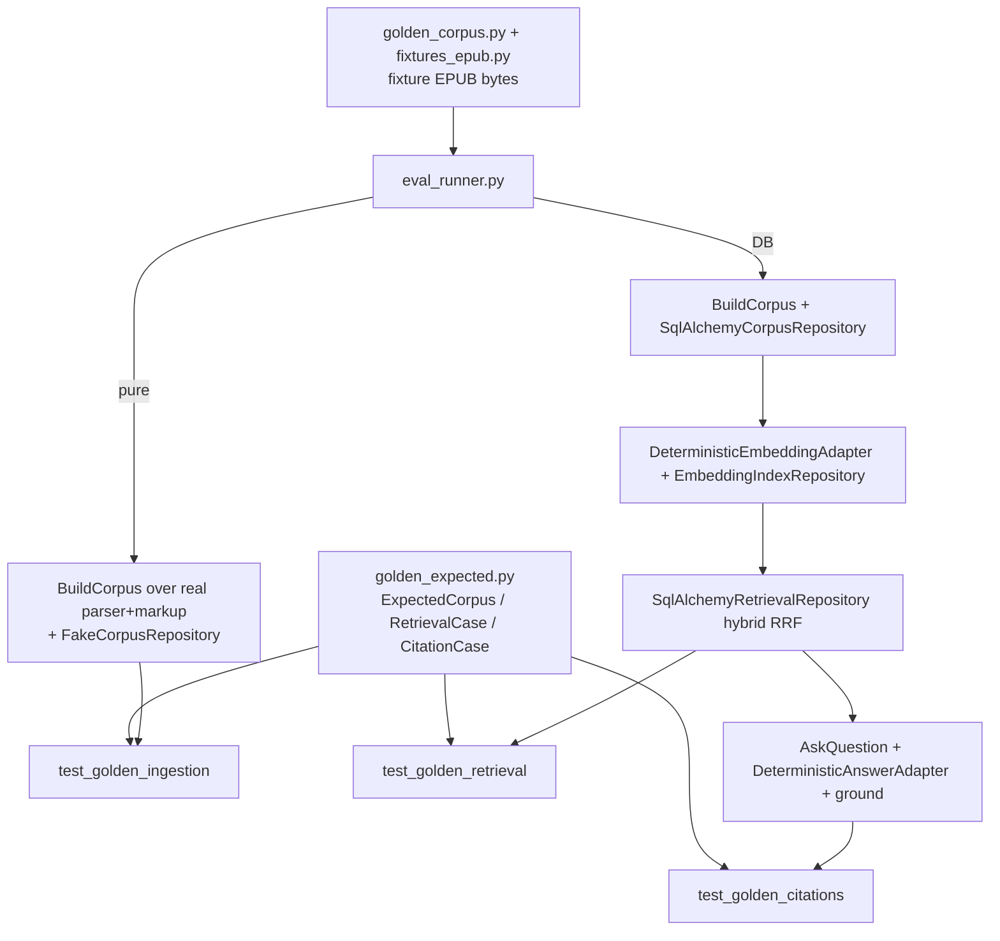

# Golden Fixtures Design

**Spec**: `.specs/features/golden-fixtures/spec.md`
**Status**: Approved (auto, ship-cycle Stage 1; decisions locked in context.md D-1..D-4 / AD-036..039)

## Architecture Overview

A deterministic, offline evaluation harness drives the *already-built* grounding
pipeline against versioned golden expectations. There is no new production code
and no new schema — the harness composes existing application services and
adapters and lives entirely under `backend/tests/`.

## Code Reuse Analysis

Everything the harness needs already exists and is deterministic + injectable.

| Component | Location | How to Use |
| --- | --- | --- |
| Synthetic EPUB builders + `Expected*` types | `tests/fixtures_epub.py` | Reuse `valid_book`, `no_toc_book`, `nested_fragment_book`, `ncx_book` as ingestion fixtures; reuse `ExpectedSection`/`ExpectedBlock` idiom |
| `BuildCorpus` | `app/application/corpus.py` | Drive ingestion from real EPUB bytes; pure run captures records via a fake corpus repo, DB run persists via the real one |
| `EbooklibEpubParser`, `Bs4MarkupConverter` | `app/infrastructure/ingestion/{epub,markup}.py` | Real parser + markup converter (no fakes) so the harness exercises the true pipeline |
| `pack_chunks` | `app/application/chunking.py` | Invoked inside `BuildCorpus`; golden chunk expectations assert its output |
| `FakeStorage`, `FakeCorpusRepository`, `FakeIngestionEventRepository` | `tests/fakes.py` | Seed EPUB bytes; capture `replace(...)` records for the pure ingestion run; no-op events |
| `SqlAlchemyCorpusRepository`, `SqlAlchemyEmbeddingIndexRepository`, `SqlAlchemyRetrievalRepository` | `app/infrastructure/db/*` | Real DB path for retrieval/citation golden (mirror `test_retrieval.py`) |
| `DeterministicEmbeddingAdapter` | `app/infrastructure/embeddings/local.py` | Embed corpus chunks + query text reproducibly |
| `AskQuestion`, `RetrieveEvidence`, `ground`, `DeterministicAnswerAdapter` | `app/application/{qa,retrieval,grounding}.py`, `app/infrastructure/answering/local.py` | Real cited-answer path for citation golden |
| `requires_db`, `db_conn`, `_persisted_source` idiom | `tests/conftest.py`, `tests/test_retrieval.py` | Integration marker + per-test rolled-back connection + source seeding |
| `SystemClock` | `app/infrastructure/clock.py` | `BuildCorpus` clock dependency |

## Components

### `tests/golden_corpus.py` (new fixture)
- **Purpose**: one topically-rich synthetic EPUB whose sections carry distinct, lexically-disjoint prose so retrieval queries map to unambiguous targets (D-2).
- Built as code with the same `_zip`/`_doc`/`_CONTAINER` idiom as `fixtures_epub.py` (import or mirror those helpers). A small EPUB3 nav TOC with ~3–4 chapters, each ~2–3 paragraphs of a single distinct topic (e.g. a chapter on tides, one on volcanoes, one on printing presses). Exposes `golden_book() -> bytes` and `EXPECTED_GOLDEN_*` constants (title, authors, language, sections with `section_path`/`anchor`/`depth`, and the chunk texts per section).
- Prose per section stays within one chunk (< `chunk_max_chars`, default 2000) so chunk expectations are a single deterministic snippet per section — keeps `EVAL-03` expectations simple and the retrieval target a single chunk.

### `tests/golden_expected.py` (new)
- **Purpose**: versioned expected values + cases (the golden targets, EVAL-09).
- Types:
  - `ExpectedCorpus(title: str | None, authors: tuple[str, ...], language: str | None, sections: tuple[ExpectedCorpusSection, ...], block_count: int, chunk_count: int)`
  - `ExpectedCorpusSection(section_path: tuple[str, ...], anchor: str, depth: int, chunk_texts: tuple[str, ...])`
  - `RetrievalCase(query: str, expected_anchor: str)` — positive recall: the target anchor that must appear within top-k (EVAL-05).
  - `CitationCase(question: str, expected_anchor: str)` — answerable: `answered`, the target anchor cited, all citation anchors bounded to `GOLDEN_SECTION_ANCHORS` (EVAL-07).
  - `GoldenFixture(name: str, epub: Callable[[], bytes], expected: ExpectedCorpus)` and a `GOLDEN_FIXTURES` tuple registry (ingestion fixtures) + `RETRIEVAL_CASES` / `CITATION_CASES` + `GOLDEN_SECTION_ANCHORS` (frozenset of the golden book's section anchors, the grounding bound) + `UNSUPPORTED_QUESTION` (tokens absent from the book, for the empty-evidence not-found test).
- Expectations are keyed on `anchor`/`section_path`/snippet text only (D-3); no chunk UUIDs appear.

### `tests/eval_runner.py` (new harness)
- **Purpose**: compose existing pieces into runnable pipeline steps; no assertions live here (the test modules assert).
- Pure ingestion:
  - `run_ingestion(epub: bytes) -> BuiltCorpus` — seeds `FakeStorage` with `epub`, constructs `BuildCorpus(storage=FakeStorage, parser=EbooklibEpubParser(), markup=Bs4MarkupConverter(), corpus=FakeCorpusRepository(), events=FakeIngestionEventRepository(), clock=SystemClock(), ids=<counter>, chunk_max_chars=<settings/default 2000>)`, calls it with a throwaway `Source`/`IngestionJob`, and returns the captured `replace(...)` payload (title/authors/language + `CorpusSectionRecord`s) as a small `BuiltCorpus` view (metadata, sections, totals).
- DB pipeline (integration; each takes `db_conn`):
  - `build_corpus_in_db(db_conn, source, epub)` — same `BuildCorpus` but with `SqlAlchemyCorpusRepository(db_conn)` + `FakeIngestionEventRepository()` (events are not under test; a fake avoids needing an `ingestion_jobs` row).
  - `embed_source(db_conn, source_id)` — deterministic embed of every chunk (mirror `test_retrieval._embed_all`).
  - `retrieve(db_conn, source_id, query, *, anchors=None) -> list[Evidence]` — real `SqlAlchemyRetrievalRepository.search` with settings-sourced tuning + deterministic query embedding.
  - `answer(db_conn, user, source, question) -> QuestionAnswer` — wire `AskQuestion` with `SqlAlchemySourceRepository`, `AuthorizeOwnership`, a `RetrieveEvidence` over the real retrieval repo + deterministic embeddings, `DeterministicAnswerAdapter()`, and `evidence_top_k` from settings.
- `run_ingestion` and the DB builders share one id counter factory so runs are deterministic within a test.

### `tests/test_golden_fixtures.py` (self-consistency, pure — no parser/DB)
- For every `GoldenFixture`: `epub()` returns non-empty bytes; `expected.sections` is internally consistent (unique anchors, `chunk_count == Σ len(section.chunk_texts)`, `block_count` a positive int).
- For every `RetrievalCase`/`CitationCase`: `expected_anchor` ∈ the golden book's `GOLDEN_SECTION_ANCHORS` (a typo in a golden anchor fails here, not as a confusing pipeline miss). EVAL-09 guard.

### `tests/test_golden_ingestion.py` (pure — no DB)
- Parametrized over `GOLDEN_FIXTURES`. Runs `run_ingestion(fixture.epub())` and asserts against `fixture.expected`:
  - metadata equality (EVAL-01);
  - ordered `(section_path, anchor, depth)` equality (EVAL-02);
  - per-section chunk texts + `page_span is None` + count, keyed by `anchor` (EVAL-03);
  - `block_count` / `chunk_count` totals (EVAL-04).

### `tests/test_golden_retrieval.py` (`requires_db`)
- `pytestmark = requires_db`. Builds + embeds the golden book once per test via the runner over `db_conn` (rolled back per test).
  - Parametrized over `RETRIEVAL_CASES`: `case.expected_anchor ∈ {e.anchor for e in retrieve(query)[:top_k]}` (EVAL-05).
  - Dedicated scoping test: build+embed the golden book in source A and a query-matching chunk in source B; assert the B chunk id is absent and every `Evidence.source_id == A` (EVAL-06).

### `tests/test_golden_citations.py` (`requires_db`)
- `pytestmark = requires_db`.
  - Parametrized over `CITATION_CASES` (build + embed): `answer(...).status == "answered"`, citations non-empty, `case.expected_anchor ∈ {c.anchor for c in citations}`, and `{c.anchor for c in citations} ⊆ GOLDEN_SECTION_ANCHORS` (EVAL-07).
  - Dedicated not-found test: build the golden corpus **without** embedding, ask `UNSUPPORTED_QUESTION`; assert `status == "not_found_in_source"` and `citations == ()` (EVAL-08, empty-evidence short-circuit).

## Data Models

No schema changes. No migration. The only new "data" is the versioned golden
constants in `golden_corpus.py` / `golden_expected.py`.

## Error Handling

Not applicable — the harness asserts on success-path outputs and the existing
`not_found_in_source` product outcome. No new error types or HTTP mappings.

## Testing Strategy

The deliverable *is* tests. The Verifier's discrimination sensor applies
directly: mutating the parser, chunker, or retrieval query in scratch state must
make a golden check fail (that is the regression-protection claim, EVAL-09).
Determinism (EVAL-10) is inherent — synthetic bytes + deterministic embedding +
extractive adapter; integration modules carry `requires_db` and skip without the
test DB.

## Tech Decisions

| Decision | Choice | Rationale |
| --- | --- | --- |
| Persistence | None (harness only) | AD-036 / ADR-016 defer the run store; no consumer |
| Fixtures | Authored synthetic EPUBs | AD-037; resolves TDD OQ#9 without third-party text |
| Expected identity | anchors/section_path/snippet | AD-038; chunk UUIDs are per-run |
| Ingestion suite | Pure (fake corpus repo) | AD-038; corpus rows are a faithful projection of `replace` records |
| Retrieval/citation suite | Integration (pgvector DB) | Real hybrid SQL is the thing under test |
| Slice | Backend/test-only | AD-039; no user surface |

## Dependencies

None added. Reuses `ebooklib`, `beautifulsoup4`, `pgvector`, and the existing
deterministic adapters already in the backend.
