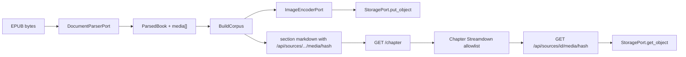

# reader-people-read-in Design

**Spec**: `.specs/features/reader-people-read-in/spec.md`
**Status**: Approved

---

## Architecture Overview

**Chosen approach:** keep derived Markdown as the reader contract. At ingest, the parser hands the application the packaged image bytes; an encoder adapter turns them into capped WebP; storage keys are content-addressed under the source prefix; markdown `src` becomes an authenticated same-origin path; the chapter Streamdown allowlists that path only. `/read` leaves the app shell via a sibling route group. Below `lg` the existing dock becomes a bottom `Sheet` and capture listens for pointer/touch.

**Rejected:** (2) signed MinIO URLs in markdown — cookies would not attach, allowlist would have to include the object host, and ADR-0013 stays “Postgres owns keys, FastAPI authorizes.” (3) iframe the spine — rq06/Foliate XSS class, RFC forbids it.



---

## Code Reuse Analysis

### Existing Components to Leverage

| Component | Location | How to Use |
|---|---|---|
| `EbooklibEpubParser.parse` | `backend/app/infrastructure/ingestion/epub.py:78` | Collect `ITEM_IMAGE` (and img hrefs resolved against the package) onto `ParsedBook.media` |
| `Bs4MarkupConverter._image` | `backend/app/infrastructure/ingestion/markup.py:56` | Keep `` shape; rewrite `src` after encode, not inside the converter |
| `BuildCorpus` | `backend/app/application/corpus.py:103` | After `normalize_book`, encode+store+rewrite markdown before persist |
| `StoragePort` | `backend/app/domain/ports.py:296` | Unchanged `put_object` / `get_object` |
| Source ownership 404 | `backend/app/application/sources.py:125` | Same `_authorize` collapse on media GET |
| Catch-all proxy | `frontend/app/api/[...path]/route.ts` | Relays binary GET unchanged |
| `MessageResponse` / Streamdown | `frontend/components/ai-elements/message.tsx:326` | **Do not** change; add a chapter-specific renderer or props |
| `paintHighlights` / scaffold skip | `frontend/app/lib/highlight-paint.ts:92` | Reject `IMG` in the tree walker |
| `useKeyShortcuts` | `frontend/app/lib/use-key-shortcuts.ts:33` | Bind `[` / `]` when capture is not eating keys |
| `useRecedingChrome` | `frontend/app/lib/use-receding-chrome.ts:19` | Keep on the thin reader bar |
| `Sheet` | `frontend/components/ui/sheet.tsx` | Bottom sheet for dock below `lg` |
| `ReaderPanel` | `frontend/app/components/reader-panel.tsx:122` | Same tabs; change shell by breakpoint |
| `CapturePopover` | `frontend/app/components/capture-popover.tsx:79` | Compact variant below `lg` |
| `.prose-reading` 65ch | `frontend/app/globals.css:178` | Pin; overlay dock instead of shrinking |

### Integration Points

| System | Integration Method |
|---|---|
| Celery ingest | Same `CorpusIngestionStep` → `BuildCorpus`; no extra task |
| FastAPI sources router | New GET next to `/chapter` |
| Next.js app router | Move `read/page.tsx` from `(app)` to `(read)` |
| Settings | `LEARNY_MEDIA_MAX_EDGE_PX`, `LEARNY_MEDIA_MAX_BYTES` |

---

## Components

### ParsedMedia + ParsedBook.media

- **Purpose**: Library-free DTO so application code never imports ebooklib/Docling types (ADR-0009).
- **Location**: `backend/app/domain/entities.py`
- **Interfaces**: `ParsedMedia(href: str, content_type: str, data: bytes)`; `ParsedBook.media: tuple[ParsedMedia, ...]` default empty.
- **Reuses**: `ParsedBlock` / `ParsedBook` pattern.

### ImageEncoderPort + Pillow adapter

- **Purpose**: Decode raster, drop SVG/undecodable, downscale to caps, emit WebP bytes + sha256.
- **Location**: port in `backend/app/domain/ports.py`; adapter `backend/app/infrastructure/ingestion/images.py`
- **Interfaces**: `encode(data: bytes, *, content_type: str) -> EncodedRaster | None` where `EncodedRaster(data, sha256, content_type="image/webp")`.
- **Dependencies**: Pillow as a **core** `pyproject.toml` dependency (default EPUB worker, not pdf extra).
- **Reuses**: Settings via `get_settings()`.

### Markdown src rewrite

- **Purpose**: Map original href variants onto `/api/sources/{id}/media/{sha256}` in **markdown only**.
- **Location**: `backend/app/application/media.py` (pure) called from `BuildCorpus`.
- **Interfaces**: `rewrite_markdown_images(markdown: str, *, source_id: UUID, href_to_hash: Mapping[str, str]) -> str`
- **Invariant**: Does not mutate `html_fragment`.

### GET source media

- **Purpose**: Cookie-auth binary GET.
- **Location**: `backend/app/infrastructure/web/sources.py` + a small application use case `ReadSourceMedia`.
- **Interfaces**: `GET /api/sources/{source_id}/media/{sha256}` → 200 webp / 404.
- **Key construction**: `sources/{owner_id}/{source_id}/media/{sha256}.webp` (owner from the authorized source row).
- **Reuses**: Existing source load + `_authorize`.

### Chapter markdown renderer

- **Purpose**: Streamdown with Learny-pinned harden for book markdown.
- **Location**: beside `chapter-reader.tsx` or a tiny `chapter-markdown.tsx` so `MessageResponse` stays chat-hardened (READ-14).
- **Interfaces**: `allowedImagePrefixes: ["/api/sources/"]`, `defaultOrigin` from `window.location.origin` (tests: explicit origin), `allowDataImages: false`.
- **Reuses**: Streamdown; do not change `message.tsx`.

### `(read)` route group

- **Purpose**: `/sources/{id}/read` without `AppSidebar` / `AuthHeader`.
- **Location**: `frontend/app/(read)/sources/[id]/read/page.tsx` (+ a minimal layout if providers are required). Auth still comes from root layout / cookies.
- **Reuses**: `ChapterReader`. Drop `h-[calc(100vh-3rem)]` header offset; fill the viewport.

### Reader chrome + shortcuts

- **Purpose**: Thin bar; `[` TOC; `]` dock.
- **Location**: `chapter-reader.tsx`, `use-key-shortcuts.ts`
- **TOC default closed** on this route (state, not a cookie). Dock still `dockTabFromParam`.

### Phone dock + capture

- **Purpose**: Bottom sheet below `lg`; pointer/touch capture; Highlight-first overflow.
- **Location**: `reader-panel.tsx`, `chapter-reader.tsx` `handleMouseUp` → pointer-aware handler, `capture-popover.tsx`
- **Reuses**: `Sheet`; existing capture actions.

---

## Data Models (if applicable)

No new Postgres table. Media identity is the object key + the URL in `corpus_sections.markdown`.

```python
@dataclass(frozen=True)
class ParsedMedia:
    href: str
    content_type: str
    data: bytes

@dataclass(frozen=True)
class EncodedRaster:
    data: bytes
    sha256: str  # 64 lowercase hex of encoded WebP bytes
    content_type: str  # "image/webp"
```

**Relationships**: `ParsedBook.media` is ingest-only (not persisted as rows). Markdown URLs are the durable index.

---

## Error Handling Strategy

| Error Scenario | Handling | User Impact |
|---|---|---|
| SVG / undecodable / over-cap after downscale | Drop image; keep alt as emphasis if present | Missing figure, not a failed book |
| `put_object` / `get_object` storage fault | Existing ingest failure / GET 404 | Same as today's storage faults |
| GET non-owner / bad hash | 404 | No source-existence leak |
| Broken img after rewrite (blob missing) | 404 on GET; browser broken-image | Rare; re-ingest |
| Touch selection empty | No popover (same as mouse) | No false capture |

---

## Risks & Concerns

| Concern | Location (file:line) | Impact | Mitigation |
|---|---|---|---|
| `content_hash` churn if HTML src is rewritten | `metadata.py` corpus_blocks; note reconcile | Highlights/notes orphan on re-ingest | Rewrite markdown only (READ-10) |
| Streamdown 2.x docs default `allowedImagePrefixes: ['*']` vs walkthrough `[Image blocked]` | `message.tsx:326` | Spec might pin the wrong default | Pin Learny chapter props explicitly; assert blocked indicator for `https://evil.example/x.png` and `` for `/api/sources/` |
| Pillow on default worker image | `backend/pyproject.toml` | Runtime image grows (small vs torch) | Core dep, not pdf extra; architecture-boundaries still forbid PIL in `domain/` / `application/` |
| `(read)` vs `(app)` duplicate `sources/[id]` | app router | Build conflict if both define `read` | Move the page; do not leave a stub in `(app)` |
| `h-[calc(100vh-3rem)]` assumes AuthHeader | `read/page.tsx:24` | Extra gap or clipped column | Viewport height without 3rem once header is gone |
| `onMouseUp` only | `chapter-reader.tsx:509` | Phone still broken if we only add a sheet | `pointerup` + `selectionchange` |
| Malicious huge raster | EPUB zip | Memory spike before cap | Encoder max pixels: refuse decode above e.g. 40 Mpx (Pillow `Image.MAX_IMAGE_PIXELS`) and drop |
| Proxy JSON assumption | `proxy.ts` `relayResponse` | Unlikely — body is a stream | Add a web test that owner GET media is `image/webp` through the FastAPI app; proxy already relays bytes |

---

## Tech Decisions (only non-obvious ones)

| Decision | Choice | Rationale |
|---|---|---|
| Where bytes enter the domain | `ParsedBook.media` from the parser | ADR-0009: no ebooklib in application |
| Encoder | `ImageEncoderPort` + Pillow adapter | Keep PIL out of application; test with a fake encoder |
| Hash input | SHA-256 of **encoded** WebP bytes | GET key matches stored object; re-encode is deterministic at fixed quality |
| Pillow MAX_IMAGE_PIXELS | Honor Pillow bomb limit; treat as drop | Zip-bomb of pixels, not just bytes |
| Chapter vs chat Streamdown | Separate chapter renderer | READ-14 |
| `/read` layout | `(read)` route group | READ-16 / AD-278 |
| Overlay breakpoint | `xl` | rq06 `<xl`; Tailwind `xl` is the first width that can host 65ch + 26rem + padding |
