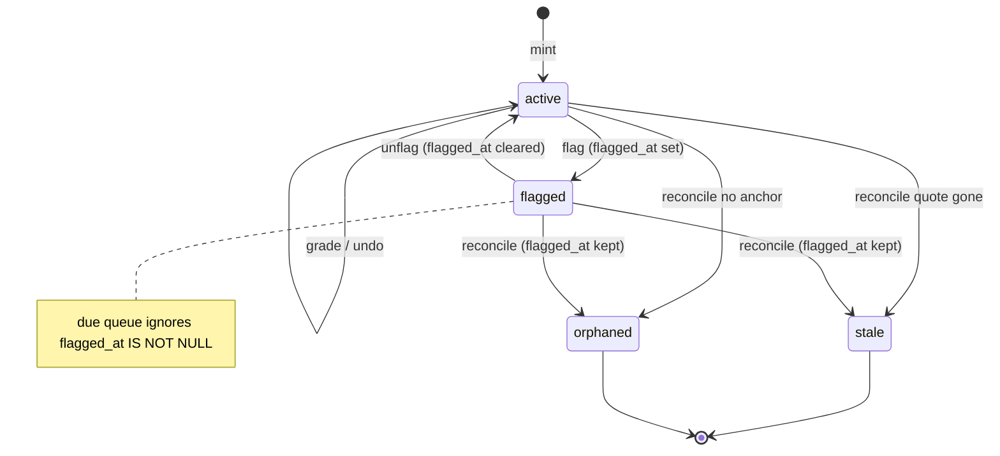

# review-worth-returning Design

**Spec**: `.specs/features/review-worth-returning/spec.md`
**Status**: Approved

---

## Architecture Overview

Keep the quiz aggregate's three-way split (content / scheduling / append-only log). This cycle adds (1) a reason-coded QC function on the generated path, (2) a compensating undo on `review_log` that restores a stored pre-grade snapshot, (3) an orthogonal `flagged_at` that due already knows how to exclude by adding one predicate, and (4) session sizing as the existing due `limit` plus honest `total_due`.

Rejected alternatives that deliver the same RFC slice:

| Approach | Why not |
|---|---|
| `suspended` as a fourth `quiz_items.status` | Reconcile (AD-078) owns `active\|stale\|orphaned`. A flagged card would be flipped back to active on re-ingest, or unflag would dump an orphaned quote into due. |
| Delete the last `review_log` row | Breaks append-only history and ADR-0021. |
| Inverse FSRS rating to "undo" | Ratings are not uniquely invertible; must store the previous snapshot. |
| New `review_sessions` table | Session is "the current due page". `total_due` + `limit` already distinguish pile from job. |
| Email digest in this PR | `EmailPort` is Cycle F. |

```mermaid
sequenceDiagram
    participant UI as Review / Library / Home
    participant Quiz as quiz + reviews + cards
    participant QC as quiz_qc
    participant FSRS as SchedulingPort
    participant DB as Postgres

    UI->>Quiz: POST generate deck
    Quiz->>QC: discard_reason(candidate)
    QC-->>Quiz: code or accept
    Quiz->>DB: job.discard_reasons JSONB

    UI->>Quiz: GET /reviews/due
    Quiz->>DB: active AND flagged_at IS NULL AND due<=now
    Quiz->>FSRS: preview(snapshot) x4 fuzz off
    Quiz-->>UI: items[session] + total_due + interval_labels

    UI->>Quiz: POST grade
    Quiz->>FSRS: review
    Quiz->>DB: log row with prev snapshot; study_days += 1
    Quiz-->>UI: new due + labels
    alt due within requeue window
        UI->>UI: insert card into remaining queue
    end

    UI->>Quiz: POST /reviews/undo
    Quiz->>DB: restore prev snapshot; undone_at; study_days -= 1
```



---

## Code Reuse Analysis

### Existing Components to Leverage

| Component | Location | How to Use |
|---|---|---|
| `quiz_qc.py` helpers | `backend/app/application/quiz_qc.py:29` | Add `discard_reason(...)`; keep `quote_in_text` / `cloze_is_valid` / `content_key`. |
| `RunDeckGeneration._ground` | `backend/app/application/quiz.py:329` | Return a reason instead of `None`; count into `discard_reasons`; do not inline a second rubric. |
| Highlight / note QC | `cards.py` `_passes_qc` / `note_card_passes_qc` | Route generated candidates through `discard_reason` so all three paths share the bar. Author-edited stays ungated (AD-138). |
| `_section_prompt` / `_quote_prompt` | `backend/app/infrastructure/quiz/anthropic.py:93` | Rewrite instruction; citations + structured item schema unchanged. |
| Local adapter `_candidates_from` | `backend/app/infrastructure/quiz/local.py:52` | Emit formulation-legal fixtures; same two-types-per-section shape if both pass. |
| `GetDueQueue` / `due_for_user` | `reviews.py:57`, `repositories.py:1580` | Add `flagged_at IS NULL`; `limit` from `LEARNY_REVIEW_SESSION_SIZE`. |
| `SubmitReview` | `reviews.py:85` | Persist prev snapshot on the log row; return interval labels for the new snapshot. |
| `UpdateCard` | `cards.py:420` | Edit-from-review; no new write path. |
| `FsrsSchedulingAdapter` | `backend/app/infrastructure/scheduling/fsrs.py:51` | Add `preview(snapshot, now) -> dict[int, datetime]` via copies, `enable_fuzzing=False`. |
| `StudyDayRepository.record` | `repositories.py:2243` | Grade still increments. Undo uses a new `decrement_reviews` that UPDATEs only an existing row with `GREATEST(count-1, 0)`. |
| Anki export | `backend/app/infrastructure/export/anki.py:73` | Also skip `flagged_at is not None`. |
| `ReviewScreen` | `frontend/app/components/review-screen.tsx` | Intervals, undo, requeue, flag, edit, Space=Good. Do not fork a dock-only grader (AD-213). |
| `QuizDeckControls` | `frontend/app/components/library-screen.tsx:70` | Render honesty copy from `latest_job` counts + `discard_reasons`. |
| Home `DueCard` | `frontend/app/components/home-screen.tsx:163` | Session count as the job; reuse `getContinueReading` for the done-state book link. |
| `useKeyShortcuts` | existing | `u` / Ctrl+Z undo, `f` flag, `e` edit; Space after reveal = Good. |

### Integration Points

| System | Integration Method |
|---|---|
| Quiz API | Additive fields on job and due views; `POST /api/reviews/undo`; `POST /api/quiz-items/{id}/flag` |
| Cards API | `PATCH /api/quiz-items/{id}` unchanged for edit-from-review |
| FSRS port | Preview method; review still the only persist path besides reset |
| Study days | Compensating decrement on undo; same local-day as the credited grade (`X-Client-Timezone` on undo too) |
| Next proxy | Catch-all already relays POST bodies |

---

## Components

### Formulation QC

- **Purpose**: One function decides accept vs a reason code for every generated candidate.
- **Location**: `backend/app/application/quiz_qc.py`
- **Interfaces**:
  - `discard_reason(candidate, *, chunk_text: str | None, note_body: str | None) -> str | None` — `None` means persist; a code means discard. Grounding uses `chunk_text` or `note_body`. Duplicate cosine stays in `RunDeckGeneration` (`duplicate`) because it needs embeddings.
  - Closed `FROZENSET` stopwords EN∪PT; 1–2 letter cloze answers fail `cloze_stopword`.
- **Dependencies**: existing normalize / quote / cloze helpers
- **Reuses**: `note_card_passes_qc` becomes `discard_reason(...) is None` for generated note cards (author-edited still skips)

### Deck job reasons

- **Purpose**: Succeeded jobs explain yield.
- **Location**: `quiz.py` finalize, `QuizGenerationJob`, `QuizJobView`
- **Interfaces**: `discard_reasons: dict[str, int]` JSONB `NOT NULL DEFAULT '{}'`
- **Trap**: `_ground` currently returns `None` with no code — a mutation that counts `other` for every reject would hide gate yield. Each discard path must set a specific code; `other` is only the fallthrough.

### Undo

- **Purpose**: Restore the last grade without deleting history.
- **Location**: `application/reviews.py` `UndoLastReview`; `web/quiz.py` `POST /api/reviews/undo`
- **Interfaces**:
  - `UndoLastReview(user, client_tz) -> SchedulingSnapshot`
  - 409 `QuizReviewNotUndoable` when no row / already undone / NULL snapshot
  - 404 via AD-149 if the item vanished (cascade) — treat as not undoable 409 if the join misses, not a disclosure 404 on another user's row (query is `user_id`-scoped)
- **Dependencies**: prev snapshot columns on `review_log`; `decrement_reviews`
- **Reuses**: same CSRF / `rate_limit_quiz` as `SubmitReview`

### Flag

- **Purpose**: Hide from due without touching FSRS.
- **Location**: `FlagCard` in `application/reviews.py` (or `cards.py`); `POST /api/quiz-items/{id}/flag` body `{flagged: bool}`
- **Interfaces**: sets or clears `flagged_at`; returns the item
- **Trap**: do not send flagged cards through `UpdateCard` and do not change `status`

### Interval preview

- **Purpose**: Labels without a write.
- **Location**: `SchedulingPort.preview` + `interval_bucket(delta) -> str`
- **Interfaces**: `preview(snapshot, reviewed_at) -> dict[int, datetime]` for ratings 1–4; application maps through buckets
- **Reuses**: `FsrsSchedulingAdapter` constructing a throwaway `Scheduler(enable_fuzzing=False)` so prod fuzzing does not leak into labels

### Session + UI

- **Purpose**: Finishable daily job.
- **Location**: settings + due view + `review-screen.tsx` + `home-screen.tsx` + `library-screen.tsx`
- **Interfaces**:
  - `DueQueueView.session_size: int`
  - Client requeue: if `due - now <= requeue_minutes`, `queue.splice(index+1..., card)`
  - Done-for-today copy vs "N still in short-term review"
- **Reuses**: `getContinueReading` for the book link; dock Review tab already mounts `ReviewScreen` (AD-213)

---

## Data Models

### Migration `0021_review_quality`

```
quiz_generation_jobs.discard_reasons  JSONB NOT NULL DEFAULT '{}'
quiz_items.flagged_at                 TIMESTAMPTZ NULL
review_log.undone_at                  TIMESTAMPTZ NULL
review_log.prev_state                 INTEGER NULL
review_log.prev_step                  INTEGER NULL
review_log.prev_stability             DOUBLE PRECISION NULL
review_log.prev_difficulty            DOUBLE PRECISION NULL
review_log.prev_due                   TIMESTAMPTZ NULL
review_log.prev_last_review           TIMESTAMPTZ NULL
```

Pre-cycle log rows keep NULL prev_* and cannot be undone. Downgrade drops the new columns.

`QuizItem.flagged_at: datetime | None`
`ReviewLogEntry` gains `undone_at` and a `previous: SchedulingSnapshot | None`
`QuizGenerationJob.discard_reasons: dict[str, int]`

### Settings

- `LEARNY_REVIEW_SESSION_SIZE` int default 20, `le=100`
- `LEARNY_REVIEW_REQUEUE_MINUTES` int default 15

### Interval buckets

| Delta | Label |
|---|---|
| < 90s | `~1m` |
| < 12 min | `~10m` |
| < 90 min | `~1h` |
| < 36 h | `~1d` |
| < 6 d | `~4d` |
| < 18 d | `~2w` |
| < 45 d | `~1mo` |
| < 150 d | `~4mo` |
| else | `~1y` |

---

## Error Handling Strategy

| Error Scenario | Handling | User Impact |
|---|---|---|
| Nothing to undo / already undone / legacy NULL snapshot | 409 `QuizReviewNotUndoable` | Review keeps the current card; no silent no-op |
| Flag/undo/grade missing or other user's item | 404 collapse (AD-149) | Same as today |
| Flag body invalid | 422 | No write |
| Rating not 1–4 | 422 existing | Unchanged |
| Session size over cap | 422 on the due query if the client passes `limit`; settings reject boot-time over-cap | Operator-facing |
| Undo with no study-day row | decrement is a no-op (no insert) | Heatmap stays 0 |

---

## Risks & Concerns

| Concern | Location | Impact | Mitigation |
|---|---|---|---|
| `_ground` duplicates QC inline | `quiz.py:329` | Formulation added in one place and skipped in another | `_ground` must call `discard_reason`; delete the duplicated bool chain |
| Local adapter will fail every new gate | `local.py:52` | Offline `generated_count` drops to 0; eval groundedness fixtures break | T5 rewrites fixtures before any gate is wired as the default path |
| `study_days.record(-1)` would insert a −1 day | `repositories.py:2243` | Heatmap lies | Dedicated UPDATE … GREATEST, never insert |
| Reconcile overwriting a status-based suspend | `quiz.py:482` | Flagged cards re-enter due after ingest | `flagged_at` is orthogonal; reconcile stays status-only (AD-078) |
| ReviewScreen snapshot queue | `review-screen.tsx:88` | Learning steps never return | Reinsert from submit payload; do not refetch the whole pile (would pull cards outside the session) |
| Dock and `/review` share `ReviewScreen` | AD-213 | A dock-only fork would drift | Change the shared component; both surfaces pick it up |
| Preview calling `review_card` four times per due item | FSRS adapter | 80 calls on a 20-card page | Pure in-process; no I/O. If it shows up on the instrument, batch later — not this cycle |
| `ruff format --check` repo drift | STATE known gap | Cycle files must not join the 116-file list | Format only files this cycle touches |

---

## Tech Decisions (only non-obvious ones)

| Decision | Choice | Rationale |
|---|---|---|
| Flag storage | `flagged_at` not `suspended` status | AD-305; reconcile owns status |
| Undo | Compensating log row + stored prev snapshot | AD-306; FSRS not invertible |
| Study-day undo | Dedicated decrement, no insert | AD-307 |
| Stopwords | EN∪PT union + 1–2 letters | AD-308 |
| Local adapter | Must pass gates | AD-309 |
| Session | Due `limit` = session size | AD-310 |
| Requeue | Client insert from submit `due` vs 15-minute window | AD-311; server stays stateless per request |
| Interval preview | Port method, fuzzing off, nine buckets | AD-312 |
| Execute | Four phases, one Opus worker each, fresh Verifier; no Haiku unit | Undo, QC, and due-predicate are quiet-failure invariants |
