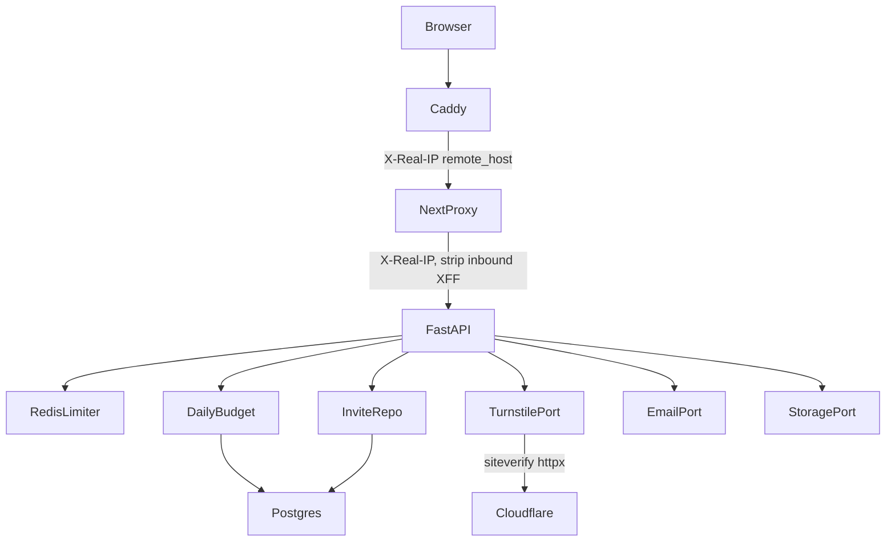

# safe-to-open-the-doors Design

**Spec**: `.specs/features/safe-to-open-the-doors/spec.md`
**Status**: Approved

---

## Architecture Overview

Keep FastAPI authoritative. Redis implements the existing `RateLimiter` port at the API composition root. Daily budget, quotas, invites, Turnstile, and mail are Learny application services behind ports; adapters stay in `infrastructure/`. The Next.js proxy stays transport-only: it forwards a Caddy-stamped client IP and never interprets invites, spend, or captcha.

Do not introduce Cycle G's thinking-token `SpendPort`. This letter's ledger is a daily budget table plus integer counters (`DailyBudget` / `ai_spend_days`).

Approach comparison (same RFC slice):

| Approach | Why not |
|---|---|
| LiteLLM budgets in front of generation | Would orchestrate (ADR-0009) |
| Invite without Turnstile | Drops the RFC opening bot brake; AD-325 chooses AND |
| Turnstile instead of invites | Hosted stays invite-only until this letter is green |
| ESP SDK (Resend/Postmark) | New provider package; SMTP behind `EmailPort` is enough |
| Soft-delete accounts | Not honest LGPD erase |
| 80 MiB stored quota | Blocks the existing 100 MiB PDF upload cap |

**Chosen:** Redis limiter + Postgres daily budget + invite/Turnstile/disposable + SMTP EmailPort + storage-then-CASCADE delete.

---

## Code Reuse Analysis

### Existing Components to Leverage

| Component | Location | How to Use |
|---|---|---|
| `RateLimiter` protocol + deps | `backend/app/infrastructure/web/rate_limit.py` | Redis adapter implements `hit`; change key builders |
| `set_rate_limiter` | same | Composition root + tests |
| `redis_url` | `backend/app/core/config.py` | Shared with Celery; pooled client |
| Register/login | `backend/app/application/identity.py`, `web/auth.py` | Invite + tos + disposable + Turnstile before `RegisterUser` |
| Cascade FKs | `backend/app/infrastructure/db/metadata.py` | User delete wipes PG; objects need explicit storage delete |
| `sources.byte_size` | same | SUM for byte quota; no MinIO list |
| Same-origin proxy | `frontend/app/lib/proxy.ts` | Forward trusted IP; strip client XFF |
| Cookie/CSRF/origin | existing auth | Deletion and reset are CSRF writes |
| Sample `is_sample` | sources | Excluded from quotas and deletion |
| Anthropic usage log | `backend/app/infrastructure/answering/anthropic.py` | Map `usage` onto a Learny usage DTO for USD micros |
| httpx | `backend/pyproject.toml` | Turnstile siteverify; already a dependency |

### Integration Points

| System | Integration Method |
|---|---|
| Redis | `INCR` + `EXPIRE` on first increment; key `learny:rl:{policy}:{subject}` |
| Postgres | migration `0024` budget/invites/tokens/user columns |
| MinIO | `delete_object` via boto3 inside the storage adapter |
| SMTP | stdlib in `infrastructure/email/smtp.py` |
| Turnstile | `POST` siteverify; widget script on register when site key set |
| Caddy | `header_up X-Real-IP {remote_host}` on `reverse_proxy web:3000` |

---

## Components

### RedisRateLimiter

- **Purpose**: Shared fixed-window `RateLimiter` across API workers.
- **Location**: `backend/app/infrastructure/web/redis_rate_limit.py`
- **Interfaces**: `hit(key) -> (allowed, retry_after)`. Redis errors raise `LimiterUnavailable`; the dependency maps to 503.
- **Dependencies**: redis-py connection pool.
- **Reuses**: `RateLimiter` protocol. In-memory limiter stays for unit tests via `set_rate_limiter`.

### Client IP + key policy

- **Purpose**: Auth buckets use trusted IP; expensive buckets use `user_id`.
- **Location**: `rate_limit.py` key helpers; `frontend/app/lib/proxy.ts`; `deploy/Caddyfile`
- **Interfaces**: `trusted_client_ip(request) -> str` reads `X-Real-IP` only when the peer is a configured trusted hop.
- **Reuses**: existing deps.

### DailyBudget

- **Purpose**: Check and debit daily USD + integer Ask/Teach counters. Not Cycle G `SpendPort`.
- **Location**: `backend/app/application/budget.py` + SQL repo
- **Interfaces**: `assert_generation(user_id, *, kind)`; `record(user_id, *, usd_micros, kind)`.
- **Dependencies**: price catalog in settings; kill switch short-circuits before the provider.
- **Reuses**: conversation turn path and quiz deck start; debit after success.

### Quotas

- **Purpose**: Owned source count, byte sum, in-flight ingest.
- **Location**: `backend/app/application/quotas.py`
- **Interfaces**: `assert_upload(user, byte_size)`; `assert_ingest_start(user)`.
- **Reuses**: `list_by_user` minus `is_sample`.

### Invite + disposable

- **Purpose**: Gate `RegisterUser` when the invite flag is on.
- **Location**: `backend/app/application/invites.py`, `validation.py`
- **Interfaces**: `consume(code) -> None`; `is_disposable(email) -> bool`.

### TurnstilePort

- **Purpose**: Verify a widget token against Cloudflare siteverify.
- **Location**: `backend/app/domain/ports.py` + `infrastructure/captcha/turnstile.py`
- **Interfaces**: `verify(token: str, ip: str) -> bool`. Empty secret skips HTTP. Set secret fails closed on missing token, reject, timeout, or 5xx.
- **Dependencies**: httpx; no official Cloudflare package.

### EmailPort

- **Purpose**: Send verify and reset messages.
- **Location**: `backend/app/domain/ports.py` + `infrastructure/email/`
- **Interfaces**: `send(*, to, subject, body) -> None`
- **Reuses**: session token hasher. ADR-0031 records the port (T24).

### DeleteAccount

- **Purpose**: Object delete then user delete.
- **Location**: `backend/app/application/identity.py`
- **Interfaces**: `__call__(user)`; storage fault does not delete the user.
- **Reuses**: CASCADE; sample not in the caller's owned list.

### Legal pages

- **Purpose**: Static terms/privacy/copyright.
- **Location**: `frontend/app/terms/page.tsx` and siblings.

---

## Data Models

### ai_spend_days

`(user_id, day_utc)` PK, `usd_micros`, `ask_count`, `teach_starts`. FK users CASCADE.

### invite_codes

`code TEXT UNIQUE`, `remaining_uses`, `expires_at`, `created_at`.

### email_tokens

`user_id` FK CASCADE, `purpose` (`verify`|`reset`), `secret_hash`, `expires_at`, `consumed_at`.

### users

Add nullable `email_verified_at`, `accepted_tos_at`.

### StoragePort

Add `delete_object(key: str) -> None`. Missing keys are success.

---

## Error Handling Strategy

| Error Scenario | Handling | User Impact |
|---|---|---|
| Limiter exceeded | 429 + Retry-After | Wait |
| Redis down | 503 | Fail closed |
| Spend / Ask / Teach exhausted | 429 honest copy; conversation kept | Come back tomorrow |
| Kill switch | 503 honest pause copy | Library and review still work |
| Source count quota | 403 | Delete a book |
| Byte quota | 413 | Smaller file or delete a book |
| In-flight ingest | 409 | Wait |
| Bad/missing invite | 403 | Invite-required copy |
| Disposable / tos | 422 | Generic invalid email / tos required |
| Bad/missing Turnstile when secret set | 400 | Retry the widget |
| Reset unknown email | 204, no mail | No enumeration |
| Storage delete fails | 502; user remains | Retry delete |
| SMTP send fails | Log; session still created | Resend later |
| Siteverify timeout when secret set | Fail closed | Retry |

---

## Risks & Concerns

| Concern | Location | Impact | Mitigation |
|---|---|---|---|
| Proxy still forwards spoofed XFF | `frontend/app/lib/proxy.ts` | Shared auth bucket | Strip XFF; only set X-Real-IP from Caddy |
| Caddy does not stamp X-Real-IP today | `deploy/Caddyfile` | FastAPI still sees `web` | `header_up` this letter |
| Spend check race | budget increment | One extra paid call | Spec edge; next call 429s |
| SMTP failure blocking register | EmailPort | Invite wasted | Best-effort send |
| Deleting sample objects | DeleteAccount | Shared book gone | Only caller-owned keys |
| Test suite register flood | invite flag | CI red | Default false |
| Turnstile in CI | siteverify | Network in tests | Empty secret skips |
| Cloudflare as subprocessor | `/privacy` | Incomplete disclosure | Name Cloudflare |

---

## Tech Decisions

| Decision | Choice | Rationale |
|---|---|---|
| Limiter store | Redis String INCR + EXPIRE | Existing `hit` protocol |
| Budget vs Cycle G SpendPort | Separate `ai_spend_days` table | Cycle G owns thinking-token persistence |
| Captcha | Turnstile via `TurnstilePort` + httpx when secret set | AD-325; empty secret skips |
| Mail | SMTP + log adapter | No ESP SDK |
| Byte quota | 256 MiB | Compatible with 100 MiB PDF max × 2 books |
| Delete order | Objects then user row | Fail closed on storage |

Project-level decisions recorded as AD-324..AD-333 in `.specs/project/STATE.md`.
