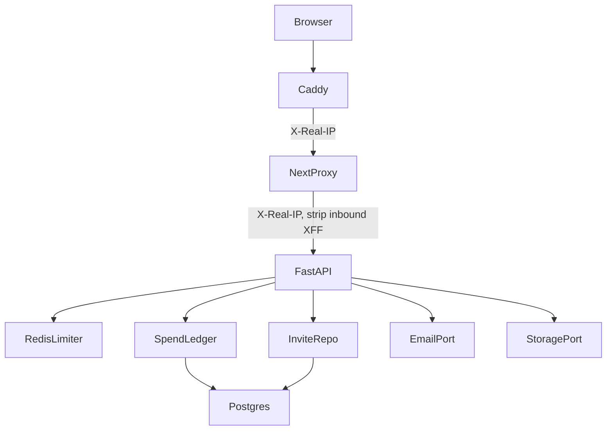

# safe-to-open-the-doors Design

**Spec**: `.specs/features/safe-to-open-the-doors/spec.md`
**Status**: Approved

---

## Architecture Overview

Keep FastAPI authoritative. Redis implements the existing `RateLimiter` port (one-line swap at the API composition root). Spend, quotas, invites, and mail are Learny application services behind ports; adapters stay in `infrastructure/`. The Next.js proxy is transport-only: it stamps a trusted client IP and never interprets invites or spend.

**Approaches considered**

1. **Recommended — ports + Redis + Postgres entitlements (this design).** Reuses `RateLimiter.hit`, adds `SpendPort` / `EmailPort` / `delete` on storage. Fits ADR-0007/0009 and rq09 Cycle A–D packed into one letter.
2. **LiteLLM budgets in front of generation.** Rejected: LiteLLM would orchestrate (ADR-0009).
3. **Turnstile instead of invites.** Rejected: AD-325; invite XOR captcha while hosted stays invite-only.

---

## Code Reuse Analysis

### Existing Components to Leverage

| Component | Location | How to Use |
|---|---|---|
| `RateLimiter` protocol + deps | `backend/app/infrastructure/web/rate_limit.py` | Redis adapter implements `hit`; change key builders only |
| `set_rate_limiter` | same | Composition root + tests |
| `redis_url` | `backend/app/core/config.py` | Shared with Celery; pooled client |
| Register/login | `backend/app/application/identity.py`, `web/auth.py` | Invite + tos + disposable before `RegisterUser` |
| Cascade FKs | `backend/app/infrastructure/db/metadata.py` | User delete wipes PG; objects need explicit storage delete |
| Same-origin proxy | `frontend/app/lib/proxy.ts` | Forward trusted IP; strip client XFF |
| Cookie/CSRF/origin | existing auth | Deletion and reset are CSRF POSTs/DELETEs |
| Sample `is_sample` | sources | Excluded from quotas and deletion |

### Integration Points

| System | Integration Method |
|---|---|
| Redis | `INCR` + `EXPIRE` on first increment; key `rl:{kind}:{id}:{route}` |
| Postgres | migrations `0024` spend/entitlements/invites/tokens |
| MinIO | `delete_object` / prefix delete via boto3 inside the storage adapter |
| SMTP | stdlib in `infrastructure/email/smtp.py` |

---

## Components

### RedisRateLimiter

- **Purpose**: Shared fixed-window `RateLimiter` across API workers.
- **Location**: `backend/app/infrastructure/web/redis_rate_limit.py`
- **Interfaces**: `hit(key) -> (allowed, retry_after)`; constructor takes a redis client and `max_attempts`/`window_seconds`. Redis errors surface as a typed `LimiterUnavailable` the dependency maps to 503.
- **Dependencies**: redis-py connection pool (not one TCP per request).
- **Reuses**: `RateLimiter` protocol.

### Client IP + key policy

- **Purpose**: Auth buckets use trusted IP; expensive buckets use `user_id`.
- **Location**: `rate_limit.py` key helpers; `frontend/app/lib/proxy.ts`
- **Interfaces**: `trusted_client_ip(request) -> str` reads `X-Real-IP` only when the peer is a configured trusted hop (loopback + docker web). Proxy sets `X-Real-IP` from Caddy's value and deletes inbound `x-forwarded-for`.
- **Reuses**: existing deps `rate_limit_auth` / `_conversations` / `_quiz` / `_upload`; ingest-start joins them.

### SpendPort

- **Purpose**: Check and debit daily USD + integer Ask/Teach counters.
- **Location**: `backend/app/application/spend.py` + SQL repo
- **Interfaces**: `assert_allowed(user_id, *, kind)`; `record(user_id, *, usd_micros, kind)`; kinds `ask` / `teach_start` / `generation` / `embed`.
- **Dependencies**: price catalog in settings (`usd per million` input/output/thinking); local adapters may record fixture micros for tests.
- **Reuses**: called from conversation turn persist path and quiz deck start, after authz, before provider; debit after success.

### QuotaPort

- **Purpose**: Owned source count, byte sum, in-flight ingest.
- **Location**: `backend/app/application/quotas.py`
- **Interfaces**: `assert_upload(user, byte_size)`; `assert_ingest_start(user)`.
- **Reuses**: `list_by_user` minus `is_sample`; `ingestion_jobs` active statuses.

### Invite + disposable

- **Purpose**: Gate `RegisterUser`.
- **Location**: `backend/app/application/invites.py`, `validation.py`
- **Interfaces**: `consume(code) -> None` (403 if missing/exhausted/expired); `is_disposable(email) -> bool`.
- **Reuses**: `validate_email` generic invalid copy for disposables (DOOR-21).

### EmailPort

- **Purpose**: Send verify and reset messages.
- **Location**: `backend/app/domain/ports.py` + `infrastructure/email/`
- **Interfaces**: `send(*, to, subject, body) -> None`
- **Reuses**: session token hasher for verify/reset secrets; TTL settings.

### DeleteAccount

- **Purpose**: Object delete then user delete.
- **Location**: `backend/app/application/identity.py`
- **Interfaces**: `__call__(user)`; lists keys from sources (object_key + media prefix), storage delete, then users.delete. On storage fault, no user delete.
- **Reuses**: CASCADE; sample not in the caller's source list as owner.

### Legal pages

- **Purpose**: Static terms/privacy/copyright.
- **Location**: `frontend/app/terms/page.tsx` (and siblings) reading committed markdown.
- **Reuses**: existing signed-out layout; DMCA email from `LEARNY_DMCA_CONTACT_EMAIL` via a tiny public config endpoint or build-time env on the Next server.

---

## Data Models

### ai_spend_days

`(user_id, day_utc)` PK, `usd_micros BIGINT NOT NULL DEFAULT 0`, `ask_count INT NOT NULL DEFAULT 0`, `teach_starts INT NOT NULL DEFAULT 0`. Increment with `INSERT ... ON CONFLICT DO UPDATE`.

### invite_codes

`code TEXT UNIQUE`, `remaining_uses INT NOT NULL`, `expires_at TIMESTAMPTZ NULL`, `created_at`.

### email_tokens

`id`, `user_id` FK CASCADE, `purpose` (`verify`|`reset`), `secret_hash`, `expires_at`, `consumed_at` NULL.

### users

Add nullable `email_verified_at`, `accepted_tos_at`.

---

## Error Handling

| Case | Response |
|---|---|
| Limiter exceeded | 429 + Retry-After |
| Redis down | 503 |
| Spend/Ask/Teach exhausted | 429 honest copy; no provider call; conversation kept |
| Kill switch | 503 |
| Source/byte quota | 403 |
| In-flight ingest | 409 |
| Bad/missing invite | 403 |
| Disposable / tos | 422 |
| Reset unknown email | 204, no mail |
| Storage delete fails | 502/503; user remains |

---

## Risks & Concerns

| Concern | Mitigation |
|---|---|
| Proxy still forwards spoofed XFF | Strip it in `buildProxyRequest`; only set X-Real-IP from the incoming Caddy header |
| Spend check race | One extra call tolerated; next increment 429s (spec edge) |
| SMTP failure blocking register | Best-effort send; invited session still created |
| Deleting sample objects | Only keys from caller-owned sources |
| redis-py blocking the event loop | Sync client is what Celery already uses; limiter `hit` is one INCR |
| Legal copy quality | Committed short pages; not generated per request |
| Test DB + Redis | Reuse compose Redis; limiter tests can inject a fake Redis |

---

## Testing Approach

- Unit: fake Redis, fake EmailPort, fake Spend repo, disposable list, invite consume.
- Integration: live Redis + Postgres for limiter share, spend increment, quota counts, delete cascade + MinIO.
- Frontend: register form invite + tos; legal routes render titles; proxy unit test for X-Real-IP / stripped XFF.
- Gates: `make lint`; pytest modules named in tasks; vitest for proxy, auth screens, legal pages.
