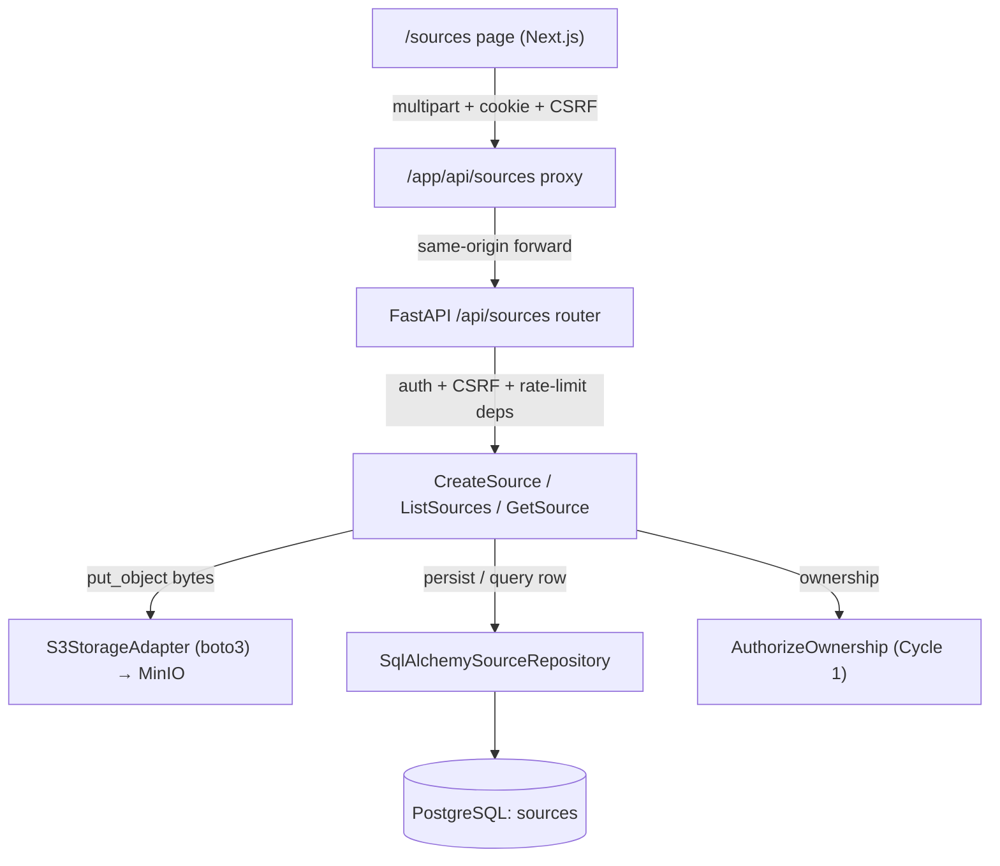

# Design — Cycle 2: Source Storage

**Spec**: `.specs/features/source-storage/spec.md`
**Status**: Draft

Specializes TDD-001 Phase 3 (Source storage) and the "Library And Sources"
module. Architecture, boundaries, ownership rules, and the API contract are
inherited from TDD-001 and the ADRs (not re-decided). Conforms to active
decisions AD-001..AD-011 in `.specs/STATE.md`. This doc adds only: the Sources
module internals, the boto3 storage adapter, the `sources` data model, and the
frontend slice.

---

## Architecture Overview

Direct multipart upload through FastAPI (ADR-018 / AD-009); bytes to MinIO via a
Learny `StoragePort`, metadata to PostgreSQL. Same layering as Identity
(ADR-007/009): `domain → application → infrastructure`, composed at the web root.



Request order for create (AD-009, edge cases): validate file+title → generate
opaque key → `put_object` → INSERT row → commit → return summary. The DB
transaction is the Cycle-1 per-request unit of work; a failed INSERT rolls back
the row, leaving only an opaque orphan object (accepted, SRC-09).

---

## Code Reuse Analysis

### Existing Components to Leverage

| Component | Location | How to Use |
| --------- | -------- | ---------- |
| `StoragePort` protocol | `backend/app/domain/ports.py:142` | Implement with boto3; port already defines `put_object`/`get_object` — no change (AD-009) |
| `AuthorizeOwnership` | `backend/app/application/identity.py:242` | Enforce per-source ownership on read (closes Gap-2) |
| `get_authenticated_user` / `CurrentPrincipal` | `backend/app/infrastructure/web/dependencies.py:113,137` | Reuse for auth on every `/api/sources*` endpoint |
| `get_db_connection` / request UoW | `backend/app/infrastructure/web/dependencies.py:50` | Same request-scoped transaction boundary |
| `enforce_csrf` / `enforce_origin` | `backend/app/infrastructure/web/csrf.py` | Attach to `POST /api/sources` (SRC-05) |
| `rate_limit_auth` pattern | `backend/app/infrastructure/web/rate_limit.py` | Add a `rate_limit_upload` hook mirroring it |
| SQLAlchemy Core metadata + naming convention | `backend/app/infrastructure/db/metadata.py:33` | Define `sources` table under the same `MetaData` |
| Repository pattern (Connection-injected) | `backend/app/infrastructure/db/repositories.py` | Mirror for `SqlAlchemySourceRepository` |
| Error handlers (`NotAuthenticated`→401, etc.) | `backend/app/infrastructure/web/error_handlers.py` | Add mappings for new application errors |
| Next.js proxy pattern | `frontend/app/lib/proxy.ts`, `frontend/app/api/**` | Mirror for `/app/api/sources/**` (forward cookie + CSRF) |
| `SystemClock`, `SecretsTokenGenerator` (uuid) | `backend/app/infrastructure/{clock,security/tokens}.py` | Timestamps / id generation as in Identity |

### Integration Points

| System | Integration Method |
| ------ | ------------------ |
| FastAPI app | `create_app()` includes a new `sources_router` (`backend/app/main.py:26`) |
| PostgreSQL | New `sources` table under the shared `metadata`; Alembic migration `0002` |
| MinIO (compose `minio` service) | boto3 client via env config; adapter ensures bucket on first use |
| Next.js | New `/sources` route + `/app/api/sources/**` proxy handlers |

---

## Components

### `Source` (domain entity)

- **Purpose**: Immutable record of an uploaded source file owned by a user.
- **Location**: `backend/app/domain/entities.py`
- **Interfaces**: frozen dataclass — `id: UUID`, `user_id: UUID`, `title: str`, `filename: str`, `content_type: str`, `byte_size: int`, `checksum: str` (sha256 hex), `object_key: str`, `status: str` (`"uploaded"`), `created_at: datetime`, `updated_at: datetime`.
- **Dependencies**: none (no framework/SDK imports, ADR-007/009).
- **Reuses**: dataclass style + module docstring conventions from `entities.py`.

### `SourceRepository` (domain port)

- **Purpose**: Persistence contract for `Source`, ownership-scoped.
- **Location**: `backend/app/domain/ports.py`
- **Interfaces**:
  - `add(source: Source) -> Source` — insert; raises on unique-key violation.
  - `list_by_user(user_id: UUID) -> list[Source]` — newest-first, owner-scoped.
  - `get_by_id(source_id: UUID) -> Source | None` — `None` if absent (app layer decides 404).
- **Dependencies**: `Source` entity only.
- **Reuses**: `runtime_checkable` Protocol + None-on-missing convention from `ports.py`.

### `S3StorageAdapter` (infrastructure — implements `StoragePort`)

- **Purpose**: Store/read blob bytes in an S3-compatible bucket via boto3 (AD-011).
- **Location**: `backend/app/infrastructure/storage/s3.py` (new package `infrastructure/storage/`).
- **Interfaces**:
  - `put_object(key: str, data: bytes, *, content_type: str) -> None`
  - `get_object(key: str) -> bytes` — raises `ObjectNotFound` if absent.
  - internal `_ensure_bucket()` — idempotent create-if-missing on init/first use.
- **Dependencies**: `boto3` client built from settings (endpoint, keys, bucket, region).
- **Reuses**: `StoragePort` protocol (unchanged); settings pattern from `core/config.py`.
- **Boundary**: boto3 client/`ClientError` objects never cross into domain/application — mapped to Learny errors here.

### Application services

- **Location**: `backend/app/application/sources.py`
- `CreateSource(sources: SourceRepository, storage: StoragePort, clock: Clock, ids: <uuid gen>, *, max_bytes: int)`
  - `__call__(*, user: User, title: str, filename: str, content_type: str, data: bytes) -> Source`
  - Steps: `validate_source_upload(...)` → build opaque key `sources/{user_id}/{uuid}.epub` → `storage.put_object` → `sources.add(Source(...))` → return.
  - Raises `InvalidSourceUpload` (bad type/ext/size/title/empty) **before** any storage/DB write.
- `ListSources(sources)` → `__call__(*, user) -> list[Source]` (delegates to `list_by_user`).
- `GetSource(sources, authorize: AuthorizeOwnership)` → `__call__(*, user, source_id) -> Source`
  - `get_by_id`; if `None` → raise `SourceNotFound`; else `authorize(user=user, owner_id=source.user_id)` — **on `NotAuthorized`, raise `SourceNotFound` instead** so non-owners get 404, not 403 (spec P1-View AC2, no existence disclosure).
- **Validation** (`app/application/validation.py`, extend existing module): `validate_source_upload` — extension `.epub` (case-insensitive), content-type `application/epub+zip`, `0 < byte_size <= max_bytes`, `title` non-empty after strip and `<= 500`.

### Web adapter

- **Location**: `backend/app/infrastructure/web/sources.py`; wiring in `dependencies.py`; router included in `main.py`.
- Router `APIRouter(prefix="/api/sources", tags=["sources"])`:
  - `POST ""` — `UploadFile` + `Form(title)`; deps `[rate_limit_upload, enforce_origin, enforce_csrf]` + `get_authenticated_user`; reads bytes (bounded by `max_bytes`), calls `CreateSource`; `201` + `SourceSummary`.
  - `GET ""` — `get_authenticated_user`; `ListSources`; `200` + `list[SourceSummary]`.
  - `GET "/{source_id}"` — `source_id: UUID` (malformed → framework `422`); `get_authenticated_user`; `GetSource`; `200` + `SourceSummary`.
- `SourceSummary(BaseModel)`: `id, title, filename, byte_size, content_type, status, created_at` (+ `from_entity`). Secret-free: no `object_key`, no `checksum` (internal).
- Composition (`dependencies.py`): process-wide singleton `S3StorageAdapter`; `get_create_source`/`get_list_sources`/`get_get_source` assemble services with a request `Connection`-backed `SqlAlchemySourceRepository`, `_clock`, uuid gen, `AuthorizeOwnership`, and `settings.epub_max_bytes`.

### Frontend

- **Location**: `frontend/app/sources/page.tsx`, `frontend/app/components/SourcesPanel.tsx`, `frontend/app/lib/sources.ts`, proxy `frontend/app/api/sources/route.ts` + `frontend/app/api/sources/[id]/route.ts`.
- Client `sources.ts`: `listSources()`, `uploadSource(file, title)`, `getSource(id)` — all hit same-origin `/api/sources*`, forwarding CSRF header from `/api/auth/me` (reuse Cycle-1 `auth.ts` CSRF fetch).
- Proxy routes: forward method, cookie, `X-CSRF-Token`, and multipart body to FastAPI; own no domain logic (ADR-017). Reuse `proxy.ts` helper.
- `SourcesPanel`: list (empty-state), upload form (file picker + title), error surface; unauthenticated → `router.replace("/login")` (UX only), mirroring `AccountPanel`.

---

## Data Models

### `sources` table (`backend/app/infrastructure/db/metadata.py`)

```
sources
  id           UUID  pk
  user_id      UUID  fk -> users.id ON DELETE CASCADE, NOT NULL, INDEX
  title        Text  NOT NULL
  filename     Text  NOT NULL
  content_type Text  NOT NULL
  byte_size    BigInteger NOT NULL
  checksum     Text  NOT NULL                       # sha256 hex of stored bytes
  object_key   Text  NOT NULL, UNIQUE               # sources/{user_id}/{uuid}.epub
  status       Text  NOT NULL, server_default 'uploaded'
  created_at   timestamptz NOT NULL, server_default now()
  updated_at   timestamptz NOT NULL, server_default now()
```

**Relationships**: `sources.user_id → users.id` (cascade delete). One EPUB file per
source (attributes inline; no `source_files` table this cycle — spec Out of Scope).
Migration `0002_sources_schema.py` follows the `0001` naming-convention pattern;
reversible `downgrade` drops the table.

---

## Error Handling Strategy

| Error Scenario | Handling | User Impact |
| -------------- | -------- | ----------- |
| Wrong extension/content-type | `InvalidSourceUpload` → handler → `415`; nothing persisted | "Only EPUB files are supported." |
| File over size cap | `InvalidSourceUpload(kind=size)` → `413`; nothing persisted | "File exceeds the maximum size." |
| Missing/empty/too-long title, empty file, no file part | `InvalidSourceUpload`/framework validation → `422`; nothing persisted | Field-level error |
| Unauthenticated | existing `NotAuthenticated` → `401` | Redirected to login (UX) |
| Missing CSRF / bad origin | existing `enforce_csrf`/`enforce_origin` → `403` | Generic error |
| Source not found OR not owned | `SourceNotFound` → `404` (owner-mismatch mapped to 404, not 403) | "Source not found." |
| Object storage down at upload | boto3 `ClientError` → `StorageUnavailable` → `503`; no row inserted; logged with `user_id` | "Upload failed, try again." |
| INSERT fails after object stored | request transaction rolls back row → `5xx`; orphan object opaque, left for GC | Retry creates a fresh source |

New application errors: `InvalidSourceUpload` (carries `kind` → 415/413/422),
`SourceNotFound` (404), `StorageUnavailable` (503) — registered in
`error_handlers.py` beside the identity mappings.

---

## Risks & Concerns

| Concern | Location | Impact | Mitigation |
| ------- | -------- | ------ | ---------- |
| Failed INSERT after `put_object` leaves an orphan object | `application/sources.py` (create order) | Minor storage waste; no user-visible corruption or metadata leak (opaque key) | Accepted for MVP (spec SRC-09); object key carries no PII; future GC task noted in Out of Scope |
| Whole file buffered in memory in the request worker | `web/sources.py` upload handler | Large uploads could pressure memory | Enforce `max_bytes` before/while reading; EPUB cap 50 MiB (AD-009); presigned upgrade path in ADR-018 if formats grow |
| Content-type is client-asserted (spoofable) | upload validation | A non-EPUB could pass type check | MVP accepts client type + extension; real EPUB structural validation is ingestion's job (Phase 5) — logged as known limitation |
| boto3 not yet a dependency | `backend/pyproject.toml` | Build/import failure if missing | Add `boto3` (and types) via `uv add`; adapter import isolated behind the port |
| `AuthorizeOwnership` maps to 403 globally, but sources need 404 | `application/sources.py` GetSource | Wrong status could disclose existence | Catch `NotAuthorized` in `GetSource` and raise `SourceNotFound` → 404 (explicit in design) |

> Cycle-1 code reviewed in the touched areas (dependencies, csrf, error_handlers, metadata, repositories): no fragile/tech-debt/security blockers found for extension — the module extends cleanly.

---

## Tech Decisions (only non-obvious ones)

| Decision | Choice | Rationale |
| -------- | ------ | --------- |
| Cross-user / missing read status | `404` (not `403`) | No existence disclosure of other users' source IDs; `GetSource` maps `NotAuthorized`→`SourceNotFound` |
| Store-then-persist ordering | `put_object` then INSERT | Keeps validation authoritative; avoids a row pointing at absent bytes; orphan-on-failure accepted |
| File attributes inline on `sources` | single table, no `source_files` | MVP source = one EPUB; keeps schema minimal; additive later if multi-file needed |
| Storage SDK | boto3 (S3 API) behind `StoragePort` | Provider-neutral (MinIO/S3/R2), preserves AD-008 swap property |
| Checksum stored but not enforced-unique | sha256 hex column, no unique constraint | Enables future dedup/integrity without blocking duplicate uploads this cycle |

> **Project-level decisions** AD-009 (upload transport), AD-010 (vertical-slice scope), AD-011 (boto3 SDK) are appended to `.specs/STATE.md` `## Decisions`. ADR-018 is the durable architecture record for AD-009.

---

## Test Strategy (drives Tasks gates; TDD Testing Strategy)

- **Unit (fake ports):** `validate_source_upload` (each reject: ext, type, size, empty title, long title, empty file); `CreateSource` happy path (calls `put_object` then `add`, opaque key shape, no title/email in key); `GetSource` owner→ok, non-owner→`SourceNotFound`, missing→`SourceNotFound`; `ListSources` newest-first + owner scoping. Fakes extend `tests/fakes.py`.
- **Integration (real test DB + fake/local storage):** `POST /api/sources` `201` + row + stored object; `415`/`413`/`422` rejects persist nothing; `401` unauth; `403` missing CSRF; `GET` list owner-scoped + empty; `GET /{id}` owner `200`, cross-user `404`, missing `404`, malformed `422`. Storage adapter contract test against compose MinIO (or a fake for unit).
- **Frontend (vitest):** proxy forwards cookie + CSRF + multipart; `sources.ts` list/upload/get hit same-origin; `SourcesPanel` renders empty-state, adds on success, surfaces error on reject; unauthenticated redirect is UX-only.
- **Smoke:** `docker compose up`, upload an EPUB via `/sources`, see it listed; verify object present in MinIO.

---

## Out of Scope (inherited from spec)

Ingestion trigger + status, corpus/chunks/embeddings, PDF, presigned upload,
deletion/update/versioning, content dedup, `source_files` multi-file table,
orphan GC. MinIO is now exercised by real uploads (was health-check-only in Cycle 1).
