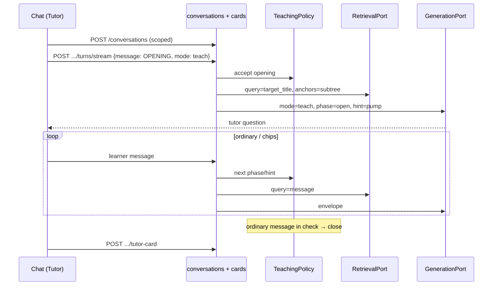
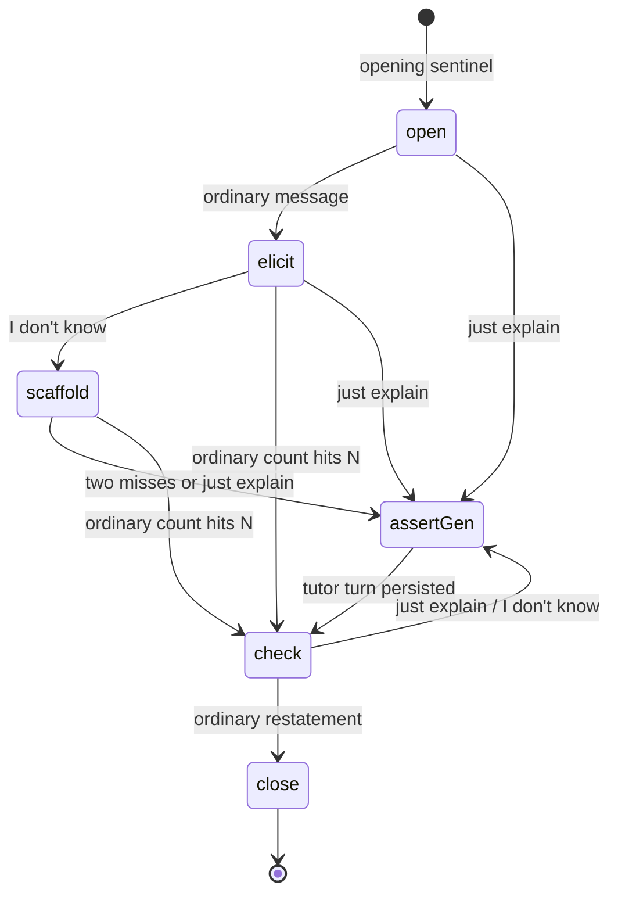

# teach-becomes-tutor Design

**Spec**: `.specs/features/teach-becomes-tutor/spec.md`
**Status**: Approved

---

## Architecture Overview

Extend the unified conversation aggregate (ADR-0029). Pedagogy is a frozen system prompt plus a pure application state machine whose output is written onto the conversation row and copied into the volatile user envelope. The Chat dock is a composition of the existing Ask and Teach surfaces under one tab. The check→card join is a new origin on `quiz_items`, not a new aggregate.

Rejected alternatives that deliver the same RFC slice:

| Approach | Why not |
|---|---|
| Prompt-only (no schema) | RFC must-be-true: ladder state is application-owned. History truncates at 6 turns. |
| New `TeachingSession` aggregate | ADR-0029 already unified Ask/Teach. A second write path would fork grounding, streaming, and the dock list. |





---

## Code Reuse Analysis

### Existing Components to Leverage

| Component | Location | How to Use |
|---|---|---|
| `PostConversationTurn` / `.stream` | `backend/app/application/conversations.py:552` | Opening, chips, close-409, retrieve-query fork, grounding fork. Do not add a second turn service. |
| `StartConversation` | `conversations.py:200` | Unchanged. Tutor Start is still create-then-stream. |
| `TEACHING_SYSTEM_PROMPT` | `backend/app/infrastructure/answering/prompts.py:36` | Replace body; keep constant + cache breakpoint. |
| `AnthropicGenerationAdapter._build_request` | `backend/app/infrastructure/answering/anthropic.py:488` | Add envelope lines to teach user text. |
| `ground` | `backend/app/application/grounding.py:20` | Teach-mode caller skips the empty-citation collapse; do not delete the helper. |
| `AcceptCard` | `backend/app/application/cards.py:240` | Pattern only (validate, embed, schedule, idempotent unique). New `AcceptTutorCard` — highlight's `note_anchor_id` is the wrong identity. |
| `SchedulingPort.initial` | existing FSRS adapter | Due-now for a new tutor card, same as highlight accept. |
| `ReconcileQuizItems._resolve` | `backend/app/application/quiz.py:482` | Fork `origin==tutor` to anchor/alias keep-or-orphan. Scheduling/log still untouched. |
| `AskPanel` / `TeachPanel` / `useConversationThread` | `frontend/app/components/` | Compose under `ChatPanel`. Keep `createConversationTransport`. Tutor Start calls `start()` then streams the sentinel. |
| `ReaderPanel` tab strip | `frontend/app/components/reader-panel.tsx:60` | Replace Ask/Teach with Chat; aliases in `dockTabFromParam`. |
| Capture pending request | `frontend/app/lib/panel.ts` | Still Answer-mode auto-submit. |

### Integration Points

| System | Integration Method |
|---|---|
| Conversations API | Additive fields on views; opening/chip/close rules inside existing turn routes; new `POST /api/conversations/{id}/tutor-card` |
| Quiz / FSRS | New origin + nullable `conversation_id`; due queue unchanged (it already lists by `user_id`) |
| Next proxy | Catch-all already relays POST bodies; add the tutor-card path only if the proxy is route-enumerated (it is not) |

---

## Components

### Frozen playbook + envelope

- **Purpose**: Byte-stable teach system prompt and volatile phase/hint on the user turn.
- **Location**: `backend/app/infrastructure/answering/prompts.py`, `anthropic.py`, `backend/app/domain/ports.py`, `backend/app/domain/entities.py`
- **Interfaces**:
  - `TUTOR_OPENING_MESSAGE`, `TUTOR_JUST_EXPLAIN_MESSAGE`, `TUTOR_DONT_KNOW_MESSAGE` — frozen strings next to `SENTINEL`
  - `GenerationPort.generate(..., tutor_phase: str | None = None, hint_level: str | None = None)`
  - Teach user text becomes: section line, `Phase: {phase}`, `HintLevel: {hint}`, learner line (opening sentinel or message)
- **Dependencies**: ADR-0020 cache breakpoint on the system string only
- **Reuses**: Existing `_CACHE_CONTROL` on `TEACHING_SYSTEM_PROMPT`

### `TeachingPolicy`

- **Purpose**: Pure next-state function. No I/O.
- **Location**: `backend/app/application/teaching_policy.py`
- **Interfaces**:
  - `TutorState(phase, hint_level, ordinary_turns, scaffold_misses, check_text)`
  - `advance(state, *, message: str, check_after: int) -> TutorState` for a learner message before generate
  - `after_tutor_turn(state) -> TutorState` for the assert→check shift once the tutor reply persists
  - `is_opening(message) -> bool` / `is_just_explain` / `is_dont_know`
- **Dependencies**: settings default `LEARNY_TUTOR_CHECK_AFTER_TURNS=3`
- **Reuses**: none — keep it out of `conversations.py` so the table-driven tests do not boot the turn service

### Turn-path forks in `PostConversationTurn`

- **Purpose**: Enforce opening, retrieve-query, grounding carve-out, close 409, mode lock.
- **Location**: `backend/app/application/conversations.py`
- **Interfaces**:
  - `_retrieve_evidence`: if opening sentinel → `query=target_title or target_anchor`
  - `_preflight`: 409 `ConversationClosed` when `phase==close`; 422 `InvalidConversationMode` when `tutor_phase` set and `mode==answer`; 422 first teach turn must be opening unless retrying a failed opening
  - persist: write `TutorState` onto the conversation after each learner-driven advance and after assert tutor turns
  - `ground(...)`: teach + `generated.found` + non-blank text + empty grounded list → persist answered with `citations=[]` instead of not-found
- **Dependencies**: `TeachingPolicy`, conversation repo update for tutor columns
- **Reuses**: existing 404 collapse, AD-262 `_persist_failed`

### `AcceptTutorCard`

- **Purpose**: One opt-in FSRS card from a closed tutor conversation.
- **Location**: `backend/app/application/cards.py` (sibling of `AcceptCard`), `backend/app/infrastructure/web/conversations.py` or `web/cards.py`
- **Interfaces**:
  - `AcceptTutorCard(user, conversation_id) -> (QuizItem, created: bool)`
  - `POST /api/conversations/{id}/tutor-card` → 201/200; 409 if not close; 404 non-owner
- **Dependencies**: embeddings + scheduling, same as `AcceptCard`
- **Reuses**: `content_key`, `rate_limit_quiz`, origin+CSRF

### Chat dock

- **Purpose**: One conversation surface with Answer | Tutor.
- **Location**: `frontend/app/components/reader-panel.tsx`, new `chat-panel.tsx` composing `AskPanel`/`TeachPanel` internals (or renaming in place)
- **Interfaces**:
  - `DockTab = "chat" | "notes" | "review"`
  - `dockTabFromParam("ask"|"teach"|"chat")` → `"chat"` so existing `?panel=ask` URLs keep working. Composer mode is armed separately: `ask` → Answer, `teach` → Tutor, `chat` → last-used or Answer. Do not rewrite tombstone redirects or capture verbs off `panel=ask`.
  - Tutor empty: section `<select>` defaulting to current chapter anchor + Start
  - Start: `startConversation` then `send(TUTOR_OPENING_MESSAGE)` with composer hidden until the opening turn exists
  - Hide learner bubble when `message === TUTOR_OPENING_MESSAGE`
  - Chips send the frozen chip strings
  - Close: hide composer, card offer, "Ask about this" → new Answer conversation
- **Dependencies**: existing conversation client, quiz accept client
- **Reuses**: `useConversationThread`, `ConversationList`, capture `pendingRequest`

---

## Data Models

### `conversations` additive columns (migration `0019_tutor_state`, down_revision `0018_citation_spans`)

| Column | Type | Null | Default | Notes |
|---|---|---|---|---|
| `tutor_phase` | TEXT | yes | NULL | `open\|elicit\|scaffold\|check\|close` or NULL |
| `hint_level` | TEXT | yes | NULL | `pump\|hint\|prompt\|assert` or NULL |
| `tutor_ordinary_turns` | INTEGER | no | 0 | Ordinary learner messages counted toward the check |
| `tutor_scaffold_misses` | INTEGER | no | 0 | `I don't know` count |
| `tutor_check_text` | TEXT | yes | NULL | Restatement that closed the session |

CHECK: `(tutor_phase IS NULL) = (hint_level IS NULL)`.

Pre-cycle rows stay NULL (TUTOR-26).

### `quiz_items` additive

| Column | Type | Null | Notes |
|---|---|---|---|
| `conversation_id` | UUID FK → conversations(id) ON DELETE SET NULL | yes | Only `origin=tutor` fills it |

Partial unique: `conversation_id WHERE origin='tutor' AND conversation_id IS NOT NULL`.

`origin` remains TEXT (no DB enum). Application + tests pin the new value `'tutor'`. Source CHECK `source_id IS NOT NULL OR origin='note'` is unchanged (tutor cards are source-backed).

### Frozen strings (`domain/entities.py`)

```
TUTOR_OPENING_MESSAGE = "(session start)"
TUTOR_JUST_EXPLAIN_MESSAGE = "Just explain this."
TUTOR_DONT_KNOW_MESSAGE = "I don't know."
TUTOR_CARD_QUESTION = 'In your own words, what is "{title}" arguing?'
```

### Conversation views

`ConversationView` / list summary gain `tutor_phase: str | None` and `hint_level: str | None`. Target snapshot is already needed by the card question; if it is not on the view today, include `target_title` / `target_anchor` on the detail view used by Chat (do not invent a second GET).

---

## Error Handling Strategy

| Error Scenario | Handling | User Impact |
|---|---|---|
| Opening 502 / provider 4xx | AD-262 `failed` turn; retry allowed (TUTOR-12) | Error in thread + retry, conversation kept |
| Opening empty evidence | Existing not-found turn; phase stays `open` | Not-found copy; composer appears |
| First teach message is not opening | 422 | Frontend never sends this after Start |
| Turn on `close` | 409 `ConversationClosed` | Composer already hidden |
| Answer mode on tutor thread | 422 | UI starts a new Answer conversation instead |
| Accept card before close | 409 | Offer is not shown |
| Accept by non-owner | 404 | Existing non-disclosure |
| Whole-book Tutor Start | Existing 409 target-unavailable on first teach turn | Section picker is required |
| Turn-index race on double Start stream | Existing 409 conflict | One opening turn wins |

---

## Risks & Concerns

| Concern | Location | Impact | Mitigation |
|---|---|---|---|
| AD-027 empty-citation collapse kills Socratic teach | `grounding.py:33` | Tutor questions persist as not-found | TUTOR-05 carve-out in the teach caller only |
| Every `generate` fake must accept new kwargs | `tests/fakes.py:632`, `test_application_conversations.py:443`, `test_web_conversations.py` | Collecting kwargs without defaults breaks the suite | Defaults `None`; `**kwargs` fakes already safe |
| Quiz reconcile would orphan paraphrases | `quiz.py:482` | Due cards die on next ingest | Tutor origin: keep-if-anchor, excerpt is book snippet/title |
| TeachPanel lazy-create tests | `frontend/tests/teach-panel.test.tsx` | Will fail once Start streams immediately | Rewrite in Phase 4; do not weaken Ask lazy-create tests |
| Opening generation cost on bounce | create-then-stream | Paid tokens for abandoned Starts | Accepted (RFC); no provisional-delete (AD-264) |
| `include_notes` 422 if omitted | `web/conversations.py` | Tutor Start must send `false` | Pin in the client; trap in the worker brief |
| Dispatch on target presence | `conversations.py:839` | Scoped Ask would get the playbook | Keep dispatch on `mode` only (trap) |

---

## Tech Decisions (only non-obvious ones)

| Decision | Choice | Rationale |
|---|---|---|
| Where ladder state lives | Conversation row, not turn JSON | One current phase; history already truncates |
| How a pass is detected | Ordinary message in `check` | No judge; production of a restatement |
| How opening is stored | Visible frozen message, hidden in UI | `message` is NOT NULL / min_length 1; empty string is 422 |
| Card identity | Minted id + partial unique on `conversation_id` | One card per session; conversation delete must not take the memory |
| Reconcile for tutor | Anchor/alias only | Excerpt fallback may be the title, which `quote_in_text` may miss |
| Chat URL | Aliases keep `ask`/`teach`; add `chat` | Do not break RFC-004 verbs |

Project-level: AD-288..AD-301 in STATE.md.
