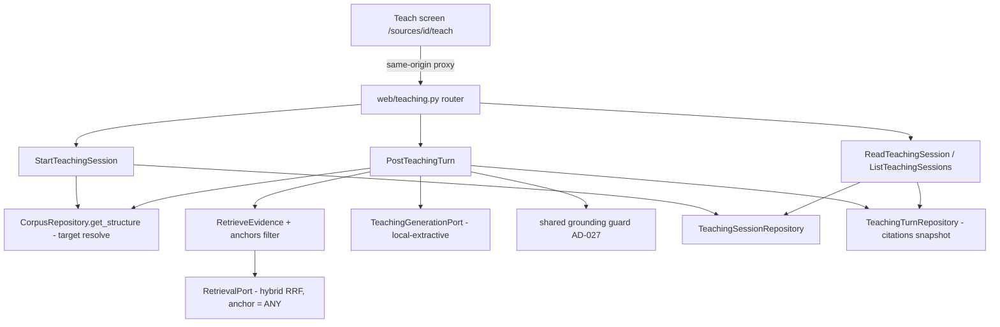

# Teaching Sessions Design

**Spec**: `.specs/features/teaching-sessions/spec.md`
**Status**: Approved (auto, ship-cycle Stage 1; decisions locked in context.md D-1..D-7 / AD-030..035)

## Architecture Overview

The turn path is the Phase-7 answer path with three additions: a persistent
session/turn aggregate, target-subtree scoping pushed into the hybrid query,
and bounded history in the generation contract.



## Code Reuse Analysis

| Component | Location | How to Use |
| --- | --- | --- |
| `authorized_source` (404-collapse + ownership) | `app/application/ingestion.py` | Import for source-rooted authz (start, list) |
| `SOURCE_STATUS_READY` readiness guard | `app/application/qa.py` pattern | Same guard in start + turn services |
| `RetrieveEvidence` | `app/application/retrieval.py` | Extend with optional `anchors` pass-through (AD-031) |
| `SqlAlchemyRetrievalRepository` hybrid SQL | `app/infrastructure/db/retrieval.py` | Add anchor filter to the `scoped` CTE |
| Grounding + not-found logic | `app/application/qa.py::AskQuestion._answer` | Extract shared helper `app/application/grounding.py`; `AskQuestion` delegates (behavior unchanged — existing QA tests are the regression net) |
| `GeneratedAnswer`, `Evidence` | `app/domain/entities.py` | Reused as-is for turn generation + citation snapshots |
| Extractive strategy | `app/infrastructure/answering/local.py` | Extract module-level helper; both adapters call it |
| `AnswerGenerationFailed`, `SourceNotReady`, error-handler mapping | `app/application/errors.py`, `web/error_handlers.py` | Reuse 502/409; add new teaching errors |
| Rate limiter | `app/infrastructure/web/rate_limit.py` | New `rate_limit_teaching` instance, same policy as questions |
| CSRF/Origin, auth deps, router style, Pydantic views | `web/questions.py` | Mirror for `web/teaching.py` |
| Repo patterns + unique-violation translation (ING-03) | `app/infrastructure/db/repositories.py` | Mirror for session/turn repos |
| Structure endpoint (CORP-11) | `web/sources.py` | Frontend target picker data — no backend change |
| `questions.ts` client + `AskPanel` composition | `frontend/app/lib`, `components` | Mirror for `teaching.ts` + `TeachPanel` |

## Components

### Migration `0006_teaching_schema.py`
- **Purpose**: `teaching_sessions`, `teaching_turns`, `teaching_turn_citations` (AD-033).
- **Location**: `backend/migrations/versions/`
- Columns per Data Models below; FKs CASCADE except `chunk_id` (plain UUID, no FK); UNIQUE `(session_id, turn_index)`, UNIQUE `(turn_id, rank)`; indexes on `teaching_sessions.source_id`, `teaching_turns.session_id`, `teaching_turn_citations.turn_id`. Mirrored in `db/metadata.py`.

### Domain entities (`app/domain/entities.py`)
- `TeachingSession(id, source_id, target_anchor, target_section_path: tuple[str,...], target_title, created_at, updated_at)` — frozen.
- `TeachingTurn(id, session_id, turn_index, message, answer_status, answer_text, model, evidence_count, citations: tuple[Evidence,...], created_at)` — frozen; citation rank = tuple position; stored citations round-trip through `Evidence` (page_span None for EPUB).
- `HistoryTurn(message: str, response_text: str)` — frozen port DTO for bounded history.
- `TeachingSessionSummary(session: TeachingSession, turn_count: int)` — list read model.

### Domain ports (`app/domain/ports.py`)
- `TeachingSessionRepository`: `add(session)`, `get_by_id(session_id) -> TeachingSession | None`, `list_for_source(source_id) -> list[TeachingSessionSummary]` (newest first).
- `TeachingTurnRepository`: `add(turn) -> TeachingTurn` (adapter translates the `(session_id, turn_index)` unique violation to `TeachingTurnConflict` — TEACH-17), `list_for_session(session_id) -> list[TeachingTurn]` (turn_index asc, citations loaded).
- `TeachingGenerationPort`: attr `model: str`; `generate(*, message: str, target_section_path: tuple[str,...], history: Sequence[HistoryTurn], evidence: Sequence[Evidence]) -> GeneratedAnswer` (AD-032).
- `RetrievalPort.search(..., anchors: Sequence[str] | None = None)` — additive param (AD-031).

### Retrieval scoping (AD-031)
- `SqlAlchemyRetrievalRepository`: when `anchors` is not None, the `scoped` CTE gains `AND cc.anchor = ANY(:anchors)` (second prepared statement or conditional SQL assembly; bound as a list — psycopg adapts arrays). Empty `anchors` list is never passed (service guarantees ≥1 anchor: the target itself).
- `RetrieveEvidence.__call__` gains `anchors: Sequence[str] | None = None`, passed through.

### Application errors (`app/application/errors.py` + `web/error_handlers.py`)
| Error | HTTP |
| --- | --- |
| `TeachingSessionNotFound` | 404 (no disclosure — missing and non-owned collapse) |
| `InvalidTeachingTarget` (unknown anchor at create) | 422 |
| `TeachingTargetGone` (anchor unresolvable at turn, post-re-ingest) | 409, readable detail |
| `TeachingTurnConflict` (index race) | 409 |
| reuse `SourceNotFound` 404, `SourceNotReady` 409, `AnswerGenerationFailed` 502 | |

### `app/application/grounding.py`
- **Purpose**: single home for the AD-027 guard: `ground(generated: GeneratedAnswer, evidence: list[Evidence]) -> tuple[str, list[Evidence]] | None` — returns `None` for the not-found outcome (found=false / blank text / nothing survives grounding), else `(text, grounded_citations)` in evidence-rank order, deduped.
- `AskQuestion._answer` delegates to it; teaching turn service uses it identically. Existing QA tests must stay green unchanged.

### `app/application/teaching.py`
- `StartTeachingSession(user, source_id, target_anchor)`: `authorized_source` → ready check (`SourceNotReady`) → `CorpusRepository.get_structure` → find section by `anchor` (miss → `InvalidTeachingTarget`) → build + persist session (target snapshot: anchor, section_path, title) → return.
- `ReadTeachingSession(user, session_id)`: session lookup; missing → `TeachingSessionNotFound`; load parent source, non-owner → `TeachingSessionNotFound` (collapse); return `(session, turns)`.
- `ListTeachingSessions(user, source_id)`: `authorized_source` → summaries newest-first.
- `PostTeachingTurn(user, session_id, message)`:
  1. resolve session + owner (404 collapse); source ready check (409);
  2. structure → target section by stored `target_anchor`; miss → `TeachingTargetGone` (409); subtree anchors = sections whose `section_path` starts with target's path (prefix match incl. target);
  3. prior turns via `list_for_session`; history = last `history_turns` as `HistoryTurn`s (response_text = answer_text, empty for not_found);
  4. `RetrieveEvidence(user, source_id, query=message, top_k=evidence_top_k, anchors=subtree)`;
  5. empty evidence → not_found turn (port NOT invoked; `model` from port attr) — persisted;
  6. else `TeachingGenerationPort.generate(...)`; any raise → `AnswerGenerationFailed` (502, nothing persisted);
  7. `ground(...)` → answered or not_found turn; `turn_index = len(prior turns)`; `TeachingTurnRepository.add` (conflict → 409);
  8. one content-free log line: `teaching turn completed outcome=%s session_id=%s evidence_count=%s model=%s` (TEACH-19).
- Constructor-injected: repos, `RetrieveEvidence`, port, clock, ids, settings values — framework-free (ADR-0007/0009).

### `app/infrastructure/answering/local.py`
- Extract `_extractive_answer(evidence) -> GeneratedAnswer`-shaped helper; `DeterministicAnswerAdapter` unchanged behavior; new `DeterministicTeachingAdapter` (`model = "local-extractive"`) ignores history/target for prose (deterministic), delegates to the shared helper. Cloud adapter deferred (AD-024/AD-032).

### `app/infrastructure/db/repositories.py`
- `SqlAlchemyTeachingSessionRepository`, `SqlAlchemyTeachingTurnRepository` on the caller's `Connection` (existing pattern). Turn `add` inserts turn + citation rows (rank = position); IntegrityError on the turn-index unique → `TeachingTurnConflict`. `list_for_session` joins citations, orders by `turn_index`, groups in Python.

### `app/infrastructure/web/teaching.py`
- Router (auth + CSRF/Origin on POSTs, mirroring `questions.py`):
  - `POST /api/teaching-sessions` `{source_id, target_anchor}` → 201 `SessionView`; rate-limited.
  - `GET /api/teaching-sessions/{session_id}` → 200 `SessionDetailView` (session + turns + citations).
  - `POST /api/teaching-sessions/{session_id}/turns` `{message}` (trim, 1..max validator) → 201 `TurnView`; rate-limited.
  - `GET /api/sources/{source_id}/teaching-sessions` → 200 `list[SessionSummaryView]`.
- Views mirror `questions.py` (`CitationView` shape reused; snake_case fields).
- `web/dependencies.py` providers + `main.py` include; `rate_limit_teaching` in `rate_limit.py`.

### Settings (`app/core/config.py`)
`LEARNY_TEACHING_MESSAGE_MAX_CHARS=2000`, `LEARNY_TEACHING_EVIDENCE_TOP_K=8`, `LEARNY_TEACHING_HISTORY_TURNS=6`.

### Frontend
- `app/lib/teaching.ts`: `startTeachingSession`, `getTeachingSession`, `listTeachingSessions`, `postTeachingTurn` — mirror `questions.ts` (proxy base, error mapping incl. 409/422/429/502 readable messages).
- `app/components/TeachPanel.tsx`: no-session state (target picker from structure endpoint + previous-sessions list) ↔ conversation state (message list: user message, cited response with section-path breadcrumb + snippet, explicit not-found callout; composer; per-state error banners).
- `app/sources/[id]/teach/page.tsx`: page shell (mirrors ask page).
- `SourcesPanel.tsx`: "Teach" link next to "Ask" for `ready` rows.
- Tests: `tests/teaching-client.test.ts`, `tests/teach-screen.test.tsx` (mirror questions/ask tests).

## Data Models

```sql
teaching_sessions (
  id uuid PK, source_id uuid FK->sources ON DELETE CASCADE,
  target_anchor text NOT NULL, target_section_path jsonb NOT NULL,
  target_title text NOT NULL, created_at timestamptz, updated_at timestamptz)
teaching_turns (
  id uuid PK, session_id uuid FK->teaching_sessions ON DELETE CASCADE,
  turn_index int NOT NULL, message text NOT NULL,
  answer_status text NOT NULL, answer_text text NOT NULL DEFAULT '',
  model text NOT NULL, evidence_count int NOT NULL,
  created_at timestamptz, UNIQUE (session_id, turn_index))
teaching_turn_citations (
  id uuid PK, turn_id uuid FK->teaching_turns ON DELETE CASCADE,
  rank int NOT NULL, chunk_id uuid NOT NULL,          -- no FK: snapshot (AD-033)
  section_path jsonb NOT NULL, anchor text NOT NULL,
  snippet text NOT NULL, score float NOT NULL, UNIQUE (turn_id, rank))
```

## Error Handling Strategy

| Scenario | Handling | User sees |
| --- | --- | --- |
| Source/session missing or non-owned | 404 collapse | "not found" |
| Source not ready (create or turn) | `SourceNotReady` → 409 | "source is not ready" |
| Unknown target anchor at create | `InvalidTeachingTarget` → 422 | "unknown target" |
| Target vanished after re-ingest | `TeachingTargetGone` → 409 | "target no longer exists; start a new session" |
| Turn index race | `TeachingTurnConflict` → 409 | "another turn was just added; retry" |
| Port raise | `AnswerGenerationFailed` → 502, no persist | "generation failed; retry" |
| Bounds/malformed body | 422 (Pydantic) | field detail |
| Throttle | 429 | "too many requests" |

## Risks & Concerns

| Concern | Location | Impact | Mitigation |
| --- | --- | --- | --- |
| Refactoring verified QA grounding into a shared helper | `app/application/qa.py` | Regression in shipped Q&A | Pure extraction, no behavior change; full existing QA test suite is the gate |
| `anchors` filter breaks the prepared hybrid SQL | `infrastructure/db/retrieval.py` | Retrieval regressions | Conditional statement assembly; existing retrieval integration tests run both with and without the filter |
| turn_index read-then-write race | `application/teaching.py` | Duplicate index | DB UNIQUE is the arbiter; loser → 409 (TEACH-17 test) |
| Citation snapshot drift vs live corpus after re-ingest | turns tables | Stale-looking snippets | By design (AD-033); GET returns snapshots; new turns re-resolve target (TEACH-16/20) |
| In-process rate limiter proxy-IP limitation | `web/rate_limit.py` | Shared-IP throttling | Accepted KNOWN LIMITATION (AD-029); unchanged |

## Tech Decisions (feature-local)

| Decision | Choice | Rationale |
| --- | --- | --- |
| Citation domain shape | Reuse `Evidence` for stored citations | Identical fields; avoids a parallel DTO |
| Subtree computation | `section_path` prefix match over `get_structure` output, in the service | No new SQL; structure read model already flat+ordered |
| History content | `(message, response_text)` pairs only | Smallest contract that lets a future LLM adapter build a conversation; statuses/citations not needed for prompting |
| Teaching adapter model id | `"local-extractive"` (same as Q&A) | Same strategy family; provider ADR will introduce distinct ids |
