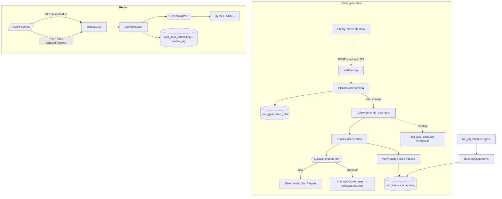

# v2-active-recall Design

**Spec**: `.specs/features/v2-active-recall/spec.md`
**Context**: `.specs/features/v2-active-recall/context.md` (D-1..D-10 locked → AD-072..AD-081)
**Status**: Approved (ship-cycle auto-decision)

## Architecture Overview

Hexagonal, mirroring the existing layout exactly. Two new domain ports (`QuizGenerationPort`,
`SchedulingPort`), adapters at the edges (deterministic local + Anthropic Batch/structured-outputs;
py-fsrs), pure application services, SQLAlchemy repositories, one new router, two Celery tasks,
one reconciliation step inside the existing ingestion pipeline, one new frontend screen + client.



## Code Reuse Analysis

| Component | Location | How to use |
|---|---|---|
| Structured-outputs call shape | `backend/app/eval/judge.py:159` (`output_config={"format":{"type":"json_schema",...}}`) | Model the quiz adapter's per-section request on this — NOT on the answer adapter (citations ⊕ structured outputs are mutually exclusive) |
| `_AnthropicAdapter` base (lazy SDK import, injected client, `model` property) | `backend/app/infrastructure/answering/anthropic.py:171` | Reuse/extend for `AnthropicQuizAdapter`; fake client injection keeps tests offline |
| Provider factory + fail-fast | `backend/app/infrastructure/answering/__init__.py:38` | `build_quiz_adapter(settings)` sibling keyed on `generation_provider` |
| Job/state machine + own-UoW-per-transition + retry countdown | `backend/app/worker/tasks.py:154` (`run_ingestion`), `app/application/ingestion.py` services | `generate_quiz_deck`/`poll_quiz_deck` copy the pattern; `quiz_generation_jobs` mirrors `ingestion_jobs` columns |
| Enqueue-after-commit port | `IngestionEnqueuer` (`domain/ports.py:235`) + `infrastructure/worker/enqueuer.py` | `QuizDeckEnqueuer` sibling |
| Ownership rule | `AuthorizeOwnership` (`app/application/identity.py`), AD-014 | All quiz services load Source → authorize → 404 non-disclosure |
| Rate limit / CSRF / origin deps | `web/rate_limit.py`, router decorators (`web/teaching.py:218`) | Add `rate_limit_quiz`; apply to deck POST + reviews POST |
| Error → HTTP mapping | `web/error_handlers.py:63` | Add `QuizDeckConflict→409`, `QuizItemNotFound→404`, `QuizItemNotReviewable→409` |
| EmbeddingPort + factory | `domain/ports.py`, `infrastructure/embedding/` | Dedup embeddings (`question + "\n" + answer`); deterministic local adapter keeps CI offline |
| Citation snapshot precedent | teaching turns (AD-033) | quiz_items snapshot columns; **no FK to corpus_chunks** (replace() regenerates ids — `repositories.py:391`) |
| Golden fixtures | `backend/tests/golden_corpus.py`, `epub_builder.py` | Deterministic eval corpus + re-ingest mutation fixture |
| Eval harness + nightly | `app/eval/judge.py`, `tests/eval/`, `.github/workflows/eval.yml` | Answerability judge = new prompt + schema + `live and eval` test; nightly picks it up unchanged |
| Reader navigation | `/sources/[id]/read?anchor=` (AD-068) | "Open in book" from citation footnote |
| Frontend client/test conventions | `frontend/app/lib/*.ts`, `frontend/tests/*` (AD-071) | `lib/quiz.ts` fetch clients + vitest; polling per AD-070 (3 s, stop on terminal/unmount) |

## Components

### Migration `0008_quiz_schema` (`backend/migrations/versions/`)
`down_revision="0007_language_aware_fts"`. Style per `0004_corpus_schema.py`.

### Domain (`app/domain/entities.py`, `app/domain/ports.py`)
- Entities (frozen dataclasses): `QuizItem`, `QuizCandidate` (item_type, question, answer, source_chunk_id, anchor_quote), `QuizSection` (section_path, anchor, title, chunks: tuple[(chunk_id, text)]), `QuizDeckHandle` (provider, batch_id | None, inline payload for local; `to_payload()/from_payload()` for Celery JSON round-trip), `QuizDeckResult` (per-section candidates + per-section errors), `SchedulingSnapshot` (state, step, stability, difficulty, due, last_review), `ReviewLogEntry`, `QuizGenerationJob`. Constant classes `QuizItemType` (`free_recall|cloze`), `QuizItemStatus` (`active|stale|orphaned`), `QuizJobStatus` (`queued|running|succeeded|failed`).
- Ports (`@runtime_checkable Protocol`):
  - `QuizGenerationPort`: `model: str`; `begin_deck(sections) -> QuizDeckHandle`; `collect_deck(handle) -> QuizDeckResult | None` (None = still pending).
  - `SchedulingPort`: `initial() -> SchedulingSnapshot`; `review(snapshot, rating: int, reviewed_at: datetime) -> tuple[SchedulingSnapshot, ReviewLogEntry]`.
  - `QuizItemRepository`, `QuizJobRepository`, `QuizDeckEnqueuer` (mirror existing repo/enqueuer ports).
- Pure QC helpers (domain or `application/quiz_qc.py`): `normalize_text` (lowercase + collapse whitespace), `content_key(item_type, q, a) = sha256(type + "\x1f" + norm(q) + "\x1f" + norm(a))`, `quote_in_text(quote, text)` (normalized containment), cloze mask validity (`answer ⊂ anchor_quote`, `question` contains `____`).

### Quiz generation adapters (`app/infrastructure/quiz/`)
- `local.py` — `DeterministicQuizAdapter` (`model="local-deterministic"`): per eligible section, derive 1 free_recall + 1 cloze from the first chunk's leading sentence (question templated from section title, answer = sentence, anchor_quote = sentence; cloze masks the longest word). Grounded by construction; `begin_deck` computes inline results, `collect_deck` returns them immediately.
- `anthropic.py` — `AnthropicQuizAdapter` on `_AnthropicAdapter`: `begin_deck` builds one Batch request per section (`custom_id` = anchor-derived), each a single-turn message with section text + book/section metadata, `output_config` json_schema: `{items: [{item_type enum, question, answer, source_chunk_id enum(section's chunk ids), anchor_quote}]}` (schema generated per section for the enum), asks for 3–6 items; `collect_deck` retrieves batch status, returns None while in_progress, else maps results by custom_id (per-request errors → section errors). **Verify-at-install:** exact `client.messages.batches.*` param names and whether `output_config` is accepted in batch params under `anthropic>=0.116,<1` — if structured outputs are rejected inside batches, fall back to prompt-enforced JSON + server-side schema validation (QC already re-validates everything; note in ADR).
- `__init__.py` — `build_quiz_adapter(settings)`: `local` default / `anthropic` (fail-fast on empty key), unknown → `ValueError`.

### Scheduling adapter (`app/infrastructure/scheduling/fsrs.py`)
`FsrsSchedulingAdapter(SchedulingPort)`: wraps `fsrs.Scheduler(desired_retention=settings.fsrs_desired_retention, enable_fuzzing=settings.fsrs_fuzzing, maximum_interval=36500)`; maps `SchedulingSnapshot` ↔ `fsrs.Card` fields; `Rating(rating)` 1:1. All datetimes UTC. Tests run fuzzing-off and assert monotonic properties (Good/Easy move `due` forward ≥ previous interval), never exact intervals.

### Application services
- `app/application/quiz.py`: `PlanDeckGeneration` (source ready-check → reuse the corpus-ready error the QA path uses; single in-flight guard → `QuizDeckConflict`; create job `queued`; enqueue after commit), `RunDeckGeneration` (worker-driven, own-UoW per transition à la `RunIngestion`: `begin(job)` → build `QuizSection`s from corpus (leaf sections, ≥ `quiz_min_section_chars`) → `begin_deck` → on each poll `collect_deck` → on complete: QC pipeline (schema/quote/cloze checks → embedding dedup ≥ threshold vs accepted-in-run + persisted items → content_key upsert preserving scheduling; new items get `SchedulingPort.initial()` rows) → `complete(counts)` / `fail(last_error)`), `ListQuizItems` (items + counts + latest job).
- `app/application/reviews.py`: `GetDueQueue` (user-scoped join via sources, active + due<=now, order due/id, limit cap), `SubmitReview` (load item→source→authorize; status guard → `QuizItemNotReviewable`; `SchedulingPort.review`; update scheduling + append log in one txn).
- `ReconcileQuizItems` (application): given source_id + new corpus text index — keep / `stale` / relocate / `orphaned` per AD-078; touches only `quiz_items.anchor/section_path/status`; invoked as a step of the ingestion pipeline **after corpus replace** (no-op fast path when the source has no items).

### Repositories (`app/infrastructure/db/repositories.py`)
`SqlAlchemyQuizItemRepository` (upsert on `(source_id, content_key)` with `ON CONFLICT DO UPDATE` on content fields only; list/counts; due query; scheduling get/update; log append; reconciliation reads/updates), `SqlAlchemyQuizJobRepository` (create/get-active/transition — mirror ingestion jobs repo).

### Worker (`app/worker/tasks.py`)
- `generate_quiz_deck(self, source_id, job_id)` (`name="quiz.generate_deck"`, bind, max_retries=3): trace scope; begin; build+begin_deck; local (result immediate) → finalize inline; else schedule `poll_quiz_deck` with `handle.to_payload()` + deadline (`now + quiz_batch_timeout_s`).
- `poll_quiz_deck(self, job_id, handle_payload, deadline_iso)` (`name="quiz.poll_deck"`): collect; pending → `self.apply_async(countdown=quiz_batch_poll_interval_s)` unless past deadline → fail(timeout); complete → finalize. Finalize is idempotent (upserts; re-delivery safe with acks_late).
- `run_ingestion`: add reconcile step after corpus replace (before embed), inside the existing step framework so events/retries/traces apply.

### Web (`app/infrastructure/web/quiz.py`, wired in `main.py` + `dependencies.py`)
| Route | Deps | Behavior |
|---|---|---|
| `POST /api/sources/{source_id}/quiz/deck` | auth, origin, csrf, `rate_limit_quiz` | 202 job view; 409 conflict/not-ready; 404 non-owner |
| `GET /api/sources/{source_id}/quiz` | auth | items + counts by status + due count + latest job view |
| `GET /api/reviews/due` | auth | `{items: [...], total_due}` — item view includes question, item_type, citation (section_path, anchor, source_excerpt), source_id/title; `limit` 20/max 100 (422 over), optional `source_id` |
| `POST /api/quiz-items/{item_id}/reviews` | auth, origin, csrf, `rate_limit_quiz` | body `{rating: 1..4, review_duration_ms?}`; 200 updated scheduling view; 422/409/404 |
| `GET /api/sources/{source_id}/quiz/export` | auth | `.apkg` bytes (`application/octet-stream`, Content-Disposition filename from source title); 404 when no items |

Answer/citation exposure: due view carries the full card (question + answer + citation) — reveal is a client-side act (self-grade model; no server round-trip to reveal).

### Anki export (`app/infrastructure/export/anki.py`)
`build_apkg(items, source_title) -> bytes` via genanki: fixed hardcoded model/deck IDs; `guid = genanki.guid_for(str(source_id), content_key)`; Basic model (Front=question, Back=answer + citation footnote), Cloze model (`{{c1::answer}}` reconstructed into the anchor_quote sentence); tempfile write + read + cleanup. Only free_recall/cloze; stale/orphaned included (content still valid learning material) — status noted in footnote.

### Frontend
- `app/lib/quiz.ts`: `getQuizOverview(sourceId)`, `generateDeck(sourceId)`, `getDueReviews({sourceId?, limit?})`, `submitReview(itemId, {rating, review_duration_ms?})`, `quizExportUrl(sourceId)` — fetchImpl-injected like siblings.
- `app/(app)/review/page.tsx` → `app/components/review-screen.tsx`: loads due queue; per-card state question→reveal→grade; grade submits then advances; summary view (counts per rating, done state); empty state ("nothing due"). Cloze question rendered as plain text with `____`. Citation footnote: section path + excerpt + "Open in book" (`/sources/{id}/read?anchor=`); orphaned never appears here (due queue is active-only).
- `library-screen.tsx` additions: per ready source — "Generate quiz deck" button (POST then 3 s polling of overview until job terminal), item/due counts, stale/orphaned badge, link to `/review?source_id=`; sidebar/header entry to `/review`.
- Tests: `quiz-client.test.ts`, `review-screen.test.tsx` (queue → reveal → grade → summary; empty state; error state), library additions test.

### Evals
- PR-deterministic: `backend/tests/eval/test_quiz_groundedness.py` — run local adapter + QC over golden corpus sections; assert every persisted-candidate passes containment, cloze validity, anchor resolvability, and that a poisoned candidate (quote not in chunk) is discarded (discrimination case).
- Nightly: `app/eval/prompts/answerability.md` (versioned) + `Judge.answerability(question, answer, excerpt) -> {answerable: bool, score 1-5, reason}` structured outputs on `judge_model`; `tests/eval/test_quiz_answerability.py` (`live and eval`) over items generated from golden book via real Haiku (small N, `LEARNY_EVAL_MAX_CASES` capped), JSONL results — nightly `eval.yml` runs it unchanged.

### ADR-0021 (`docs/adr/0021-active-recall-design.md`)
Accepted: free-recall/cloze (no MCQ), FSRS-6 via py-fsrs defaults, snapshot + reconciliation model, Batch API pipeline, quote-verify grounding, genanki export. Alternatives recorded: MCQ (rejected — followup research), LLM critique pass (deferred), CSV export (rejected), optimizer (deferred).

## Data Models (DDL sketch — migration `0008_quiz_schema`)

```sql
quiz_items (
  id uuid PK,
  source_id uuid NOT NULL FK sources(id) ON DELETE CASCADE,
  item_type text NOT NULL,                 -- 'free_recall' | 'cloze'
  question text NOT NULL,
  answer text NOT NULL,
  section_path jsonb NOT NULL,
  anchor text NOT NULL,
  source_excerpt text NOT NULL,            -- verified anchor_quote (snapshot)
  chunk_hash text NOT NULL,                -- sha256 of chunk text at generation
  content_key text NOT NULL,               -- sha256(type\x1f norm(q) \x1f norm(a))
  status text NOT NULL DEFAULT 'active',   -- active | stale | orphaned
  embedding vector(1536) NULL,             -- dedup identity (existing pgvector ext)
  generation_meta jsonb NOT NULL DEFAULT '{}',  -- model, prompt_version, batch custom_id
  created_at/updated_at timestamptz,
  UNIQUE (source_id, content_key)          -- upsert identity
)
quiz_item_scheduling (
  quiz_item_id uuid PK FK quiz_items(id) ON DELETE CASCADE,
  state smallint NOT NULL, step smallint NULL,
  stability float NULL, difficulty float NULL,
  due timestamptz NOT NULL, last_review timestamptz NULL,
  updated_at timestamptz,
  INDEX ix_quiz_item_scheduling_due (due)
)
review_log (
  id uuid PK,
  quiz_item_id uuid NOT NULL FK quiz_items(id) ON DELETE CASCADE,
  rating smallint NOT NULL,                -- 1..4 (CHECK)
  reviewed_at timestamptz NOT NULL,
  review_duration_ms integer NULL
)
quiz_generation_jobs (
  id uuid PK,
  source_id uuid NOT NULL FK sources(id) ON DELETE CASCADE,
  status text NOT NULL,                    -- queued|running|succeeded|failed
  attempts integer NOT NULL DEFAULT 0,
  generated_count integer NOT NULL DEFAULT 0,
  discarded_count integer NOT NULL DEFAULT 0,
  failed_sections integer NOT NULL DEFAULT 0,
  last_error text NULL,
  created_at/updated_at timestamptz,
  INDEX ix_quiz_generation_jobs_source_id (source_id)
)
```

No FK to corpus tables anywhere. Embedding column: dedup vs persisted items without re-embedding the back-catalog each regen (paid tokens); no vector index (exact scan, small N per source).

## Settings additions (`app/core/config.py`, `LEARNY_` prefix)

`quiz_model="claude-haiku-4-5"`, `quiz_max_items_per_section=6`, `quiz_min_section_chars=200`, `quiz_dedup_threshold=0.90`, `quiz_batch_timeout_s=3600`, `quiz_batch_poll_interval_s=30`, `fsrs_desired_retention=0.9`, `fsrs_fuzzing=True`. Deps: `fsrs>=6,<7`, `genanki` (pin current minor).

## Error Handling Strategy

| Scenario | Handling | User sees |
|---|---|---|
| Deck POST while job in flight | `QuizDeckConflict` → 409 | "Deck generation already running" |
| Deck POST on non-ready corpus | existing corpus-not-ready error → 409 | actionable message |
| Batch per-request error | count in `failed_sections`, job still `succeeded` | partial deck + counts in overview |
| Batch never ends | poll deadline → job `failed` "timeout" | failed state + retry via new POST |
| Structured output invalid / quote unverified / cloze invalid | discard candidate, `discarded_count++` | fewer items, counts visible |
| Review rating ∉ 1..4 | 422 (Pydantic) | validation error |
| Review on stale/orphaned | `QuizItemNotReviewable` → 409 | "item suspended after re-ingest" |
| Non-owner/missing anything | 404 (no disclosure) | not found |
| Export with zero items | 404 | "no quiz items" |
| Anthropic SDK/API failure at begin/poll | task retry w/ `_retry_countdown`, then job `failed` + `last_error` | failed state |

## Risks & Concerns

| Concern | Location | Impact | Mitigation |
|---|---|---|---|
| Batch API + structured outputs support in `anthropic>=0.116,<1` unverified | new `infrastructure/quiz/anthropic.py` | adapter 400s in prod | verify at install (Phase B); documented fallback: prompt-JSON + server-side schema validation (QC re-validates regardless); `live` smoke test |
| py-fsrs exact field/API drift within v6 | new `infrastructure/scheduling/fsrs.py` | adapter breaks on minor bump | pin `>=6,<7`; behavior-level tests (fuzz off), not exact-interval assertions |
| FSRS fuzzing randomness in tests | same | flaky tests | `LEARNY_FSRS_FUZZING=false` in test fixtures; assert monotonic/range properties |
| `run_ingestion` step change regressions | `app/worker/tasks.py:154` + ingestion service | breaks shipped pipeline | reconcile added as isolated step w/ no-op fast path; full existing ingestion test module in phase gate |
| Upsert must not touch scheduling | new repo | silent progress loss (the cardinal sin here) | dedicated AC (QUIZ-02) + test asserting scheduling row untouched after re-upsert |
| Due query correctness across users | new repo | data leak | ownership join through sources + explicit cross-user test |
| genanki tempfile handling in request path | export module | leaked temp files | `tempfile.TemporaryDirectory` context; small decks (author scale) |

## Tech Decisions (feature-local)

| Decision | Choice | Rationale |
|---|---|---|
| Dedup embedding storage | `embedding vector(1536) NULL` on quiz_items | avoids re-embedding back-catalog per regen; no index needed at author scale |
| Reveal model | full card in due view; reveal is client-side | self-grade flow needs no server reveal round-trip |
| Reconcile placement | ingestion step after corpus replace, before embed | needs new corpus text only; events/retry/trace for free |
| Export includes stale/orphaned | yes, footnoted | content remains valid learning material; Anki GUID keeps identity |
| content_key includes item_type | yes | cloze and free_recall from the same sentence must not collide |

## Phase sketch (→ tasks.md)

A schema+domain+settings+deps → B generation adapters+repos → C worker pipeline+reconcile+dedup → D scheduling+review services+router+export → E frontend → F evals+ADR. All phases Opus (each carries invariants: migration, structured outputs, idempotency, FSRS correctness, ownership, eval semantics); Verifier Opus.
