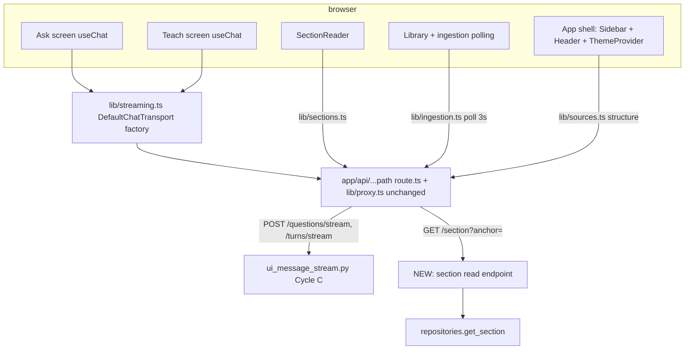

# v2-frontend Design

**Spec**: `.specs/features/v2-frontend/spec.md`
**Status**: Approved (ship-cycle auto-decision; approach options recorded in context.md D-1..D-7)

---

## Architecture Overview

The backend is untouched except one new read endpoint (FE-14). The frontend keeps its
transport layer (`app/lib/*`, proxy) and rebuilds the presentation layer on Tailwind v4
+ shadcn/ui + AI Elements. Streaming rides the existing Cycle-C UI Message Stream v1
SSE endpoints through the existing proxy — no protocol work, only a client.



**Route groups** (URLs unchanged): shelled routes move to `app/(app)/…` sharing a
layout that renders `SidebarProvider + AppSidebar + AuthHeader`; `login`/`register`
move to `app/(auth)/…` with a minimal centered layout. `app/layout.tsx` gains
`next/font` (Geist Sans via the `geist` package — zero network at build; fallback:
Inter via `next/font/google` if the package fights the standalone build), `globals.css`
(Tailwind v4 `@import "tailwindcss"` + shadcn tokens), and `ThemeProvider`
(next-themes, `attribute="class"`, `defaultTheme="system"`, `suppressHydrationWarning`
on `<html>`).

## Code Reuse Analysis

| Component | Location | How to Use |
| --- | --- | --- |
| Proxy request/response relay | `frontend/app/lib/proxy.ts`, `app/api/[...path]/route.ts` | Unchanged; FE-22 adds an SSE relay test alongside `tests/proxy-forwarding.test.ts` |
| Fetch clients + types | `app/lib/auth.ts`, `sources.ts`, `questions.ts`, `teaching.ts` | Keep as-is; reuse `Citation`, `SourceSummary`, `TeachingSessionDetail` types; add `ingestion.ts`, `sections.ts` following the same `fetchImpl`-last-arg pattern |
| Auth gate pattern | `onRequireAuth={() => router.replace("/login")}` in every page | Preserve in the shelled layout/screens (FE-05) |
| Structure tree flattening | `TeachPanel.tsx` `flattenSections` | Generalize into a shared tree util consumed by sidebar tree, teach target picker |
| Non-streaming teaching session start/list/detail | `app/lib/teaching.ts` | Unchanged — only the *turn* path becomes streaming |
| Test conventions | `tests/ask-screen.test.tsx` `routedFetch`, client tests' `fetchImpl` injection | All new tests follow these (AD-071) |
| Backend read-service pattern | `ReadSourceStructure` service + `get_structure` repo + `sources.py` router | `ReadSection` clones this shape for FE-14 |
| SSE presenter + stream routes | `backend/app/infrastructure/web/ui_message_stream.py`, `questions.py:128`, `teaching.py:284` | Consumed, never modified |

### Integration Points

| System | Integration Method |
| --- | --- |
| Stream endpoints | `useChat` + `DefaultChatTransport` POST via proxy; header `x-vercel-ai-ui-message-stream: v1` already set server-side |
| Session/CSRF | `credentials: "same-origin"` + `X-CSRF-Token` from `/api/auth/me` (existing pattern), injected in `prepareSendMessagesRequest` |
| Corpus sections | New endpoint reads `corpus_sections.markdown` by `(source_id, anchor)` via owner-scoped join through `sources` |

## Components

### Frontend — foundation

- **Styling stack**: Tailwind v4 (`@tailwindcss/postcss`), shadcn/ui init (CSS-variables
  mode — AI Elements requires it), `npx ai-elements@latest` vendored into
  `components/ai-elements/`. shadcn primitives used: `sidebar`, `button`, `input`,
  `badge`, `collapsible`, `dropdown-menu`, `popover`, `card`, `skeleton`, `separator`,
  `tooltip` (workers add only what compositions need).
- **ThemeProvider** (`app/components/theme-provider.tsx`): next-themes wrapper; toggle
  in `AuthHeader` (light/dark/system). FE-02.

### Frontend — shell

- **`app/(app)/layout.tsx`**: fetches nothing itself (client components fetch);
  composes `SidebarProvider`, `AppSidebar`, `AuthHeader`, main content inset.
- **AppSidebar** (`app/components/shell/app-sidebar.tsx`): sources list w/ status
  `Badge`; per-ready-source `Collapsible` section tree from
  `getSourceStructure` (add to `lib/sources.ts` if absent); links: Ask/Teach/Read per
  source; tree node → `/sources/{id}/read?anchor=<enc>`. Empty-library state. FE-03/04.
- **AuthHeader** (`app/components/shell/auth-header.tsx`): `/api/auth/me` state, email,
  account link, logout (existing `logout` client), theme toggle. 401 → `/login`. FE-05.

### Frontend — streaming

- **`app/lib/streaming.ts`** (the one protocol-aware client module, AD-066):
  - `createQuestionTransport(sourceId, csrfToken)` → `DefaultChatTransport` with
    `api: /api/sources/{id}/questions/stream`, `prepareSendMessagesRequest` returning
    `{headers: {"X-CSRF-Token": csrf}, body: {question: <latest user message text>}}`.
  - `createTurnTransport(sessionId, csrfToken)` → same for
    `/api/teaching-sessions/{id}/turns/stream` with body `{message}`.
  - `LearnyUIMessage` type: `UIMessage` with data parts
    `{"data-citations": Citation[], "data-answer-status": {status: AnswerStatus}}`.
  - `turnsToUIMessages(turns)`: persisted `TeachingTurnView[]` → seeded `UIMessage[]`
    (user message + assistant message with text part + data-citations part).
  - `errorMessageFor(status, body)`: maps 401/403/404/409/422/429/502/network to the
    readable strings both surfaces render.
- **AskScreen** (`app/components/ask-screen.tsx`, replaces AskPanel): AI Elements
  `Conversation`/`Message`/`Response` + `PromptInput` (submit disabled while
  `status === "streaming"`, stop button calls `stop()`); renders `data-citations` via
  `CitationList`, `data-answer-status` not-found state, `error` part / `onError`
  states with partial text retained. FE-06..FE-10.
- **TeachScreen** (`app/components/teach-screen.tsx`, replaces TeachPanel): target
  picker (shared tree util) + resume list (existing `listTeachingSessions`); session
  view seeds `useChat` `messages` from `turnsToUIMessages(getTeachingSession(...))`;
  streams new turns via `createTurnTransport`. FE-11..FE-13.
- **CitationList / CitationPopover** (`app/components/citations.tsx`): AI Elements
  `InlineCitation`/`Sources` composition; popover = section-path breadcrumb + snippet +
  "Open in book" → router push `/sources/{sourceId}/read?anchor=${encodeURIComponent(anchor)}`.
  FE-16.

### Frontend — reader

- **`app/lib/sections.ts`**: `getSection(sourceId, anchor, fetchImpl)` →
  `GET /api/sources/{id}/section?anchor=` returning `SectionView`; 404 → typed
  not-found result.
- **SectionReader** (`app/components/section-reader.tsx`) + `app/(app)/sources/[id]/read/page.tsx`:
  reads `anchor` from `useSearchParams`; no anchor → pick-a-section empty state;
  fetches section; renders markdown via AI Elements `Response` (one renderer for
  streamed prose and reader; raw HTML stays inert — asserted by test); title block
  gets `scroll-mt-16`, `scrollIntoView` on load + transient highlight class
  (`data-highlight` + CSS transition). FE-15/FE-17.

### Frontend — library & ingestion

- **LibraryScreen** (`app/components/library-screen.tsx`, replaces SourcesPanel):
  source cards w/ status badge, upload control (existing multipart contract),
  failed-state latest event message + restart button. FE-20/FE-21.
- **`app/lib/ingestion.ts`**: `getIngestion(sourceId, fetchImpl)` → existing
  `GET /api/sources/{id}/ingestion`. FE-18.
- **`useIngestionPolling` hook** (`app/components/use-ingestion-polling.ts`): for
  sources with status `processing`, `setInterval` 3 s → `getIngestion`; on
  `ready`/`failed` clears that source's timer and patches the list; all timers cleared
  on unmount. FE-19.

### Backend — section read endpoint (FE-14)

- **Repo**: `get_section(source_id, anchor)` in
  `backend/app/infrastructure/db/repositories.py` — single SELECT of
  `corpus_sections` (title, section_path, anchor, markdown) joined via
  `corpus_documents.source_id`; None when absent.
- **Service**: `ReadSection` in `backend/app/application/corpus_read.py` (or alongside
  `ReadSourceStructure`) — owner check via existing source lookup (404 no-disclosure),
  then repo; raises the existing not-found error type.
- **Web**: `GET /{source_id}/section` in `sources.py` with `anchor: str` query param
  (min_length=1), `SectionContentView{anchor, title, section_path, markdown}`;
  docstring mirrors structure endpoint. Tests mirror `test_source_structure` web tests
  (200/404 unknown-anchor/404 non-owner/401).

## Data Models

```typescript
// frontend/app/lib/sections.ts
interface SectionView {
  anchor: string;
  title: string;
  section_path: string[];
  markdown: string;
}

// frontend/app/lib/ingestion.ts  (mirror of backend IngestionSummary)
interface IngestionView {
  id: string; status: "queued" | "running" | "succeeded" | "failed";
  attempts: number; error: string | null;
  events: { type: string; message: string | null; created_at: string }[];
}
```

`LearnyUIMessage` data-part payloads reuse the existing `Citation` type verbatim
(`questions.ts:16-24` — matches `EvidenceView`).

## Error Handling Strategy

| Error Scenario | Handling | User Impact |
| --- | --- | --- |
| Stream `error` part (mid-stream 502) | useChat surfaces error; partial text kept | Inline error banner under the partial answer; input re-enabled |
| Non-200 on stream start (401/403/404/409/422/429) | `onError` + `errorMessageFor` | Readable message ("book still processing", "too many requests", …); 401 redirects to login |
| Stop pressed | `stop()` aborts fetch → proxy relays abort → FastAPI `CancelledError` | Stream halts; partial text retained; idle state |
| Disconnect w/o error part | useChat settles non-streaming | Partial text retained, no forever-spinner |
| Section 404 (unknown anchor) | Typed not-found from `getSection` | Reader not-found state with back-to-book affordance |
| Ingestion poll fetch failure | Skip tick, keep polling | Badge unchanged; no error spam |
| Upload 4xx | Existing client error surface, restyled | Readable message near the form |

## Risks & Concerns

| Concern | Location | Impact | Mitigation |
| --- | --- | --- | --- |
| AI SDK v7 API drift vs research doc (v5-era `prepareSendMessagesRequest` shape) | `app/lib/streaming.ts` | Transport misconfig → silent text-mode fallback | Worker verifies against installed package types; `tsc --noEmit` gate; component test feeds a real v1 SSE fixture through the transport path |
| Backend emits no keep-alive pings (`ui_message_stream.py:121-143`) | long generations | Proxy/undici idle timeout could sever quiet streams | Out of scope to change backend; noted as accepted risk — generation deltas flow continuously in practice |
| `Response`/streamdown raw-HTML handling unverified | SectionReader | XSS if vendored renderer injects raw HTML | Spec edge case: test asserts raw HTML in markdown renders inert; fallback `react-markdown` w/o `rehype-raw` if not |
| Vendored shadcn/AI Elements source must pass repo gates (`tsc` strict, `next lint`) | `components/ui/`, `components/ai-elements/` | Gate churn from generated code | Vendor pinned versions; fix-forward small type issues in vendored files (they are owned source) |
| 4 existing screen tests assert current DOM | `tests/*-screen.test.tsx` | Break on rebuild | Rewrite selectors preserving test *intent* (same behaviors asserted per FE ACs) |
| `useSearchParams` requires Suspense boundary in Next 15 build | reader page | `next build` failure | Wrap reader client component in `<Suspense>` |
| Anchor round-trip encoding (`href#fragment`) | sidebar/tree links, popover, reader, backend query param | Mismatched anchors → spurious 404s | Single `encodeURIComponent` at link-build, `useSearchParams().get()` auto-decodes; backend treats anchor as opaque string; test with `#`-bearing anchor |

## Tech Decisions (feature-local; project-level ones are AD-065..071)

| Decision | Choice | Rationale |
| --- | --- | --- |
| Route organization | Route groups `(app)`/`(auth)`, URLs unchanged | Shell via shared layout without breaking links/tests |
| Markdown renderer | AI Elements `Response` for both streamed prose and reader | One renderer, consistent typography, streaming-safe |
| Font | Geist Sans (`geist` pkg); Inter via `next/font/google` as fallback | Build-time self-hosted; no runtime fetch |
| Teach history seeding | `turnsToUIMessages` maps persisted turns → `UIMessage[]` with data-citations parts | Resume renders identically to live-streamed turns |
| Poll implementation | Per-source `setInterval` inside one hook, cleared on terminal/unmount | Matches FE-19 wording; trivially testable with fake timers |
| Backend service file | Follow wherever `ReadSourceStructure` lives (same module) | Convention over new module |

## Phases (Execute sizing → formal tasks.md)

Five phases, one worker each (>3 ⇒ sub-agent path, context.md D-8):

- **A — Foundation**: deps (tailwind v4, shadcn init CSS-vars, ai-elements, ai/@ai-sdk/react, next-themes, geist), globals/tokens, fonts, ThemeProvider, route groups, existing tests still green. (FE-01, FE-02)
- **B — Seams**: backend section endpoint + tests (FE-14); `lib/ingestion.ts` + `lib/sections.ts` clients + tests (FE-18); SSE relay regression test (FE-22).
- **C — Shell & library**: (app)/(auth) layouts, AppSidebar (+tree), AuthHeader (+theme toggle), LibraryScreen (upload, badges, failed state), polling hook. (FE-03..FE-05, FE-19..FE-21)
- **D — Streaming surfaces**: `lib/streaming.ts`, AskScreen, TeachScreen, citations components (popover minus reader link target existing yet — link built regardless). (FE-06..FE-13, FE-16)
- **E — Reader + closure**: SectionReader + read route (FE-15, FE-17); citation link E2E-in-jsdom check; full gates both stacks.

Phase gates: per-commit affected vitest/pytest module; full frontend gate (vitest, tsc, build) at each frontend phase boundary; full backend gate (pytest, ruff) at Phase B boundary and at E.
