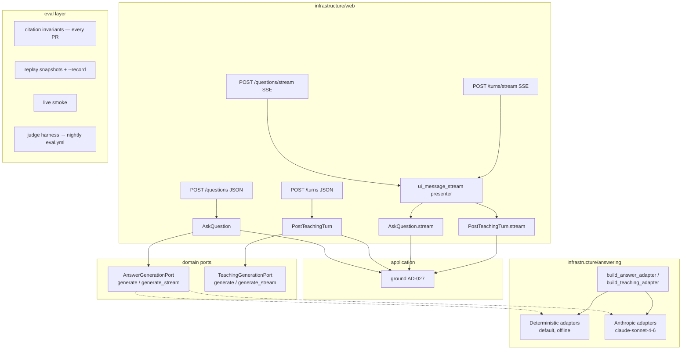

# v2-generation Design

**Spec**: `.specs/features/v2-generation/spec.md`
**Status**: Approved (auto-decided per ship-cycle rule; context.md D-1..D-8)

Active-constraint check (STATE.md Decisions): conforms to AD-024/AD-027/AD-032 (ports + service-level grounding), AD-052 (factory + offline-default pattern, provider SDK gated to its cycle), AD-029 (rate limits), ADR-0009 (no orchestration frameworks — raw `anthropic` SDK behind ports), ADR-0016/AD-036 (eval as deterministic harness). No supersessions.

---

## Architecture Overview



Request shape (Anthropic, both adapters): one plain-text citations-enabled `document` block per `Evidence` (evidence order), `citations: {enabled: true}` on every document (all-or-none API rule), map back strictly via `document_index` → ordered `chunk_id` list built at request-assembly time. `title` = last section-path element; `context` = stringified `{chunk_id, anchor}` (informational only — never parsed back).

## Code Reuse Analysis

| Component | Location | How to Use |
| --- | --- | --- |
| Embeddings factory pattern | `backend/app/infrastructure/embeddings/__init__.py:28` | Mirror exactly: settings switch, `ValueError` on unknown, deterministic default |
| OpenAI adapter conventions | `backend/app/infrastructure/embeddings/openai.py` | Copy: lazy SDK import in `_get_client`, `_Client` Protocol test seam, injected-client ctor, `@property model` |
| Deterministic adapters | `backend/app/infrastructure/answering/local.py` | Extend with `generate_stream` (yield one delta + completed); stay the default |
| Grounding guard | `backend/app/application/grounding.py:18` | Unchanged — single AD-027 home; streaming paths call it post-completion |
| `AskQuestion` / `PostTeachingTurn` flows | `backend/app/application/qa.py:65`, `teaching.py:265` | Streaming variants reuse the same guard sequence; extract shared pre-flight helpers if duplication exceeds ~15 lines |
| Error mapping | `backend/app/infrastructure/web/error_handlers.py:104` | `AnswerGenerationFailed` → 502 unchanged; stream paths raise it only pre-stream |
| `EvidenceView` projection | `backend/app/infrastructure/web/retrieval.py:67` | Reused verbatim in the `data-citations` part |
| Rate limit deps | `backend/app/infrastructure/web/rate_limit.py:128,144` | Same dependency objects on `/stream` siblings |
| Fakes | `backend/tests/fakes.py:468` | Extend `FakeAnswerGeneration` (+ teaching fake) with `generate_stream`; add fake Anthropic client hierarchy modeled on `test_embeddings_openai.py:23-55` |
| Live-marker pattern | `backend/tests/test_embeddings_openai.py:136`, `backend/pyproject.toml:46` | Same `@pytest.mark.live` + key-gate skip for Anthropic |
| Golden corpus | `backend/tests/golden_*.py` | Source of eval cases + invariant inputs |
| CI service containers | `.github/workflows/ci.yml` backend-test job | Copy Postgres service block into `eval.yml` |

## Components

### 1. Settings (`backend/app/core/config.py`)

New `LEARNY_*` fields, following existing style/placement:

```python
generation_provider: str = "local"            # local | anthropic
anthropic_api_key: str = ""                    # env-only secret
generation_model: str = "claude-sonnet-4-6"
generation_max_tokens: int = 1024
judge_model: str = "claude-haiku-4-5"
eval_max_cases: int = 50
```

### 2. Prompts (`backend/app/infrastructure/answering/prompts.py`)

- `SENTINEL = "NOT_FOUND_IN_SOURCE"`.
- `ANSWER_SYSTEM_PROMPT`: answer only from the provided documents; cite; if the documents do not answer the question, reply with exactly the sentinel and nothing else. Frozen string — no interpolation.
- `TEACHING_SYSTEM_PROMPT`: tutoring persona, grounded-only, same sentinel rule. Frozen — target section and learner message live in the final user turn, never here.

### 3. `AnthropicAnswerAdapter` + `AnthropicTeachingAdapter` (`backend/app/infrastructure/answering/anthropic.py`)

- `__init__(self, *, api_key: str, model: str, max_tokens: int, client: _MessagesClient | None = None)`; `_MessagesClient` Protocol seam; lazy `import anthropic` inside `_get_client()` only.
- `@property model` returns the configured model id (readable without a call).
- **Shared request builder**: `_build_documents(evidence) -> (list[doc blocks], list[UUID])` — the UUID list *is* the `document_index` mapping.
- **Shared response parser**: concatenate `text` blocks → `text`; walk `citations` arrays collecting `document_index` (first-occurrence order, dedup) → `cited_chunk_ids`; `found = text.strip() != SENTINEL` (whole-reply match only); on sentinel return `GeneratedAnswer(text="", cited_chunk_ids=(), model=..., found=False)`. `stop_reason == "max_tokens"` → return the partial (never raise).
- **Answer `generate`**: non-streaming `client.messages.create(model=..., max_tokens=..., system=[{text: ANSWER_SYSTEM_PROMPT}], messages=[{role:"user", content:[*docs, {type:"text", text: question}]}])`. No `cache_control` on the answer path (single-shot; prompt below Sonnet 4.6's 2048-token cache minimum — a marker would silently never cache).
- **Teaching `generate`**: `system=[{type:"text", text: TEACHING_SYSTEM_PROMPT, cache_control:{type:"ephemeral", ttl:"1h"}}]`; history rendered as alternating `user`/`assistant` messages from `HistoryTurn` (`message` → user, `response_text` → assistant), with the **last history assistant block** carrying the second `cache_control` breakpoint (block-list content form); final user message = `[*evidence docs, {type:"text", text: f"...studying section {' > '.join(target_section_path)}...\n\n{message}"}]`. Volatile content strictly after the cached prefix. Empty history → system breakpoint only.
- **`generate_stream`** (both): `client.messages.stream(...)` context manager; map `text_delta` → domain delta events; accumulate; after `get_final_message()` yield the completed event with the parsed `GeneratedAnswer`. `try/finally` guarantees stream closure on consumer cancellation.
- **Errors**: SDK exceptions propagate (services own the `AnswerGenerationFailed` wrap → 502). One content-free log line per call: model, input/output tokens, `cache_read_input_tokens`, `found`.
- No sampling params; no `thinking` param (omitted ⇒ off on Sonnet 4.6 — grounded synthesis doesn't need it and it would consume `max_tokens`).

### 4. Factories (`backend/app/infrastructure/answering/__init__.py`)

`build_answer_adapter(settings) -> AnswerGenerationPort`, `build_teaching_adapter(settings) -> TeachingGenerationPort`: `"local"` → deterministic; `"anthropic"` → require non-empty `anthropic_api_key` (else `ValueError("LEARNY_ANTHROPIC_API_KEY is required...")`), construct with model/max_tokens; unknown → `ValueError`. Wire in `dependencies.py`: replace the module-level singletons at `:330`/`:400` with `@lru_cache`d builders calling the factory with `get_settings()` (preserves dependency-override test seams; cache cleared implicitly per-process like `get_settings`).

### 5. Domain streaming contract (`backend/app/domain/entities.py` + `ports.py`)

```python
@dataclass(frozen=True)
class AnswerTextDelta:
    text: str

@dataclass(frozen=True)
class AnswerCompleted:
    answer: GeneratedAnswer

AnswerStreamEvent = AnswerTextDelta | AnswerCompleted
```

Both ports gain `generate_stream(...) -> Iterator[AnswerStreamEvent]` with kwargs identical to `generate`. Contract: zero or more deltas, then exactly one `AnswerCompleted` (always last; its `answer` is authoritative). Deterministic adapters: yield the full extractive text as one delta, then completed. Update `tests/fakes.py` fakes accordingly (protocol conformance).

### 6. Application streaming (`backend/app/application/qa.py`, `teaching.py`)

- `AskQuestion.stream(*, user, source_id, question) -> Iterator[AskStreamEvent]` — same guard sequence as `__call__` (ownership → readiness → retrieve → empty short-circuit) executed *before* the first yield (so HTTP errors surface pre-stream); then iterates the port stream.
- **Sentinel hold-back** (provider-independent): buffer deltas while the accumulated text is a prefix of `SENTINEL`; flush on divergence; if the stream completes as the sentinel, emit no text. Prevents streaming the sentinel token to clients.
- On `AnswerCompleted`: apply `ground(...)`; yield a final app event carrying the same `QuestionAnswer` the buffered path returns (status/citations/model/evidence_count).
- Port/stream exceptions → raise `AnswerGenerationFailed` from within the generator (presenter converts to a protocol `error` part since headers are already sent).
- `PostTeachingTurn.stream(...)`: same pattern + persists the turn (existing repo write path) only after grounding completes; consumer cancellation (`GeneratorExit`) → close port stream, persist nothing.
- App events: `StreamDelta(text)`, `StreamAnswer(result: QuestionAnswer)` / `StreamTurn(turn: TeachingTurn)` — defined in application layer, protocol-free.

### 7. SSE presenter + endpoints (`backend/app/infrastructure/web/ui_message_stream.py`, `questions.py`, `teaching.py`)

- Presenter is the **only** module that knows the Vercel UI Message Stream v1 vocabulary: emits `start` → `text-start` → `text-delta`× → `text-end` → `data-citations` (list of `EvidenceView` dicts) → `data-answer-status` (`answered` | `not_found_in_source`) → `finish` → `[DONE]`; sets `x-vercel-ai-ui-message-stream: v1`. Message/part ids: `uuid4()` per response.
- Transport: `fastapi.sse.EventSourceResponse` (raise pin `fastapi>=0.135,<0.200`). Sync app generators are bridged with Starlette's threadpool iteration — the phase worker verifies actual frames with an endpoint test (deterministic provider, offline).
- Endpoints: `POST /api/sources/{source_id}/questions/stream` and `POST /api/teaching-sessions/{session_id}/turns/stream`; identical request schemas, auth/CSRF/origin/rate-limit dependency lists as their JSON siblings (`rate_limit_questions`/`rate_limit_teaching` shared limiter — a stream call counts like a JSON call). Handlers run all guards via the service generator's pre-yield section, so 404/409/422/429 return as plain HTTP.
- Mid-stream failure: presenter catches `AnswerGenerationFailed` from the generator → emits protocol `error` part with the existing generic message, then terminates.

### 8. Eval layer

- **Invariants** (`backend/tests/test_generation_invariants.py`): for each eval case run through retrieval + deterministic adapter on the golden book: cited ids ⊆ evidence ids; every cited anchor resolves in the corpus; `answered` ⇒ ≥1 citation. Parametrized to also consume any committed replay snapshots.
- **Replay harness** (`backend/tests/eval/`): `cases.yaml` (question, source fixture ref, expected-status hints — hand-authored from the golden book, ~10–15 cases); `snapshots/*.json` (one per case: `{case_id, model, question, evidence: [{chunk_id, snippet, anchor}], answer: {text, cited_chunk_ids, found}}`); loader + `--record-generation` pytest option (conftest addoption) that, given a key, runs the live adapter and rewrites snapshots. No snapshots committed this cycle → snapshot-driven tests `pytest.skip` with reason (AD-056 precedent).
- **Live smoke** (`backend/tests/test_answering_anthropic.py::test_live_*`): `@pytest.mark.live` + `skipif(not os.getenv("LEARNY_ANTHROPIC_API_KEY"))`; one answer call + one teaching call against inline evidence; assert prose + ≥1 valid citation; assert sentinel on an irrelevant-evidence case (F5 live proof).
- **Judge** (`backend/app/eval/judge.py`, prompts `backend/app/eval/prompts/faithfulness.md`, `relevancy.md`): Learny-owned, no framework. `judge_faithfulness(question, evidence, answer) -> FaithfulnessResult` (claims + supported ratio) and `judge_relevancy(question, answer) -> int` via `client.messages.create` with `output_config={"format": {json_schema}}` on `judge_model` (judge calls carry no citations-enabled documents, so structured outputs are legal). `run_eval(cases, *, max_cases) -> list[dict]` writes `evals/results/YYYY-MM-DD-<sha>.jsonl` (scores, model ids, prompt hash). Unit tests with a fake client; `eval` marker registered in `pyproject.toml`.
- **Nightly** (`.github/workflows/eval.yml`): `on: schedule: cron "0 3 * * *"` + `workflow_dispatch`; first step exits successfully with a notice when `ANTHROPIC_API_KEY` secret is absent; Postgres service copied from ci.yml; runs `pytest -m "live and eval"` (smoke + judge) with `LEARNY_EVAL_MAX_CASES`; uploads `evals/results/*.jsonl` artifact. Thresholds: judge asserts aggregates only when `LEARNY_EVAL_GATE=1` (calibration default off; gate values set after first baselines — recorded in the workflow env for later flip).

### 9. ADR-0020 (`docs/adr/0020-use-anthropic-claude-for-generation.md`)

Accepted. Anthropic Claude for generation behind Learny ports; `claude-sonnet-4-6` initial model (settings-swappable; Sonnet 5 re-baseline path + Opus 4.8 escalation documented as alternatives); deterministic adapters remain default; sentinel mechanism; closes the AD-024/AD-032 provider follow-up (embedding half closed by ADR-0019).

## Data Models

No DB schema changes. New wire/domain shapes: `AnswerStreamEvent` union (domain), app stream events, snapshot JSON schema (above), JSONL result line `{case_id, ts, git_sha, generation_model, judge_model, prompt_hash, faithfulness, relevancy, citation_valid}`.

## Error Handling Strategy

| Error Scenario | Handling | User Impact |
| --- | --- | --- |
| Provider exception (buffered) | Service wraps → `AnswerGenerationFailed` → 502 generic | "Answer generation failed. Please try again." |
| Provider exception mid-stream | Generator raises → presenter emits protocol `error` part, terminates | Stream ends with generic error; UI shows failure |
| Sentinel reply | `found=False` → not_found outcome (200 / status part) | "Not found in source" product outcome |
| Zero citations, prose text | Grounding → not_found (AD-027) | Same as above |
| `anthropic` provider, empty key | `ValueError` at composition | Process fails fast at startup, not per-request |
| Unknown provider | `ValueError` from factory | Same |
| Client disconnect mid-stream | `GeneratorExit`/cancellation → close SDK stream, no persist | None (user left) |
| `stop_reason == max_tokens` | Partial text returned; grounding decides | Possibly truncated answer, still cited |
| Nightly without secret | Workflow notice + success exit | None |

## Risks & Concerns

| Concern | Location | Impact | Mitigation |
| --- | --- | --- | --- |
| Sentinel leakage mid-prose | prompts.py / parser | not-found text shown as answer | Whole-reply match only; delta hold-back in app stream; judge watches faithfulness |
| Port Protocol extension breaks existing fakes/tests | `tests/fakes.py:468`, `test_application_teaching.py:286` | suite fails on isinstance checks | Phase C updates all fakes in the same commit as the port change |
| `fastapi.sse` availability | `pyproject.toml:8` floor `>=0.118` | ImportError on old resolve | Raise floor to `>=0.135` in Phase C |
| Teaching cache prefix below Sonnet 4.6's 2048-token minimum on early turns | anthropic.py | silent cache misses (cost, not correctness) | Log `cache_read_input_tokens`; economics improve as history grows |
| Sync-generator-over-SSE bridging subtleties | ui_message_stream.py | stalled/buffered streams | Offline endpoint test asserts actual frame sequence; `X-Accel-Buffering` handled by `fastapi.sse` |
| Existing hard-wired singletons read settings at import | `dependencies.py:330,400` | stale provider under test env changes | Replace with lazy `@lru_cache` builders; tests keep using dependency overrides |
| `--record` writing snapshots with volatile fields | tests/eval | noisy diffs | Snapshot schema excludes timestamps/request ids; sorted keys |

## Tech Decisions (non-obvious)

| Decision | Choice | Rationale |
| --- | --- | --- |
| Buffered path SDK call | `messages.create` (not `.stream`) | `max_tokens=1024` is far below the SDK's non-streaming guard; simpler fake client |
| Thinking | Omitted (off on Sonnet 4.6) | Grounded synthesis over provided documents; deterministic-ish latency |
| Citations in stream | Terminal `data-citations` part only | Single AD-027 enforcement point (context.md D-4) |
| Sentinel hold-back | Application layer, provider-independent | Deterministic adapter path gets it free; not duplicated per adapter |
| Judge gating | Calibration-first (`LEARNY_EVAL_GATE`) | Research §5/§8: baseline before thresholds |
| Streaming method on existing ports (not new port) | `generate_stream` alongside `generate` | One capability, two consumption modes; avoids a third port + factory pair |
