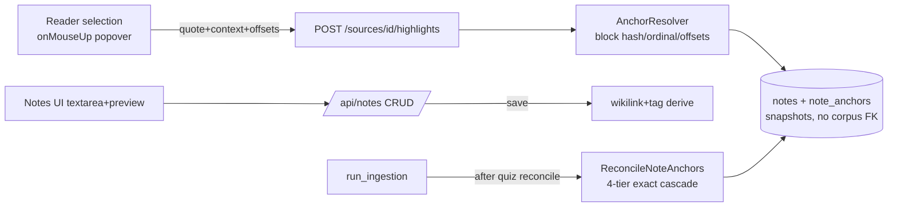

# v3-notes-foundation Design

**Spec**: `.specs/features/v3-notes-foundation/spec.md` · **Binding**: ADR-0026 decisions 1–3 · **Status**: Approved (auto)

## Architecture

## Key seams (from the survey — exact refs)

| Need | Seam |
|---|---|
| Migration shape to copy (snapshot, no corpus FK) | `backend/migrations/versions/0008_quiz_schema.py:40-88` (PK/FK/index/unique/CHECK/JSONB patterns); new file `0010_notes_schema.py` |
| Inverse-cascade rule | note tables FK only: notes→users CASCADE, note_anchors→notes CASCADE, note_links.target SET NULL; **source_id is a bare UUID column** |
| Block hash idiom | `normalize_text` `backend/app/application/quiz_qc.py:27` + sha256 (`quiz.py:72-74` `_chunk_hash`); build-time compute in `BuildCorpus` where blocks are walked (`corpus.py:100-119`); column via 0010 on `corpus_blocks` (`metadata.py:248`) |
| Reconcile precedent to mirror | `ReconcileQuizItems` `backend/app/application/quiz.py:438-518` (tiers, alias maps `:473-483`, `quote_in_text` `quiz_qc.py:43`); wiring sibling at `backend/app/worker/tasks.py:252-253` (own txn, after quiz reconcile, before embed) |
| Entities/ports/repo conventions | frozen dataclasses `entities.py` (QuizItem `:653`), Protocol repos `ports.py` (QuizItemRepository `:726`), Connection-taking impls `infrastructure/db/repositories.py:87-91`, tables in `metadata.py` |
| Router conventions | `infrastructure/web/quiz.py` (`:69` router, `:263` UoW dep, `:271-282` auth+rate+CSRF stack); error map `error_handlers.py:67-85,126`; register `main.py:35-42`; new `rate_limit_notes` in `rate_limit.py` (copy `:161-175`) |
| Frontend client | `frontend/app/lib/quiz.ts` (CSRF echo `:99-124`, typed errors `:204`); simpler read exemplar `lib/sections.ts` |
| Reader capture site | `frontend/app/components/section-reader.tsx` — Streamdown inside `.prose` (`:175-176`), scroll/highlight pattern (`:152-168`); selection capture is greenfield: `onMouseUp` + `window.getSelection()` over the prose container, offsets against the served `markdown` string via quote search (exact + context), popover near selection |
| Shell/screens | sidebar Notes entry beside Review (`app-sidebar.tsx:218-224`); route group `(app)/notes/`; list+detail per `library-screen.tsx` patterns; vitest conventions incl. fake timers |

## Components

- **AnchorResolver** (`app/application/anchoring.py`, pure): `resolve(section_blocks, quote, prefix, suffix) -> AnchorBinding | None` — locates the block containing the normalized quote (first match; multi-block selection binds to first block per spec edge), returns block_hash/ordinal/in-block offsets. Used by CaptureHighlight (save) and ReconcileNoteAnchors (tier 1 validity + rebind in tiers 2–3).
- **ReconcileNoteAnchors** (`app/application/notes.py`): mirrors quiz reconcile structure/status writes; tiers per NF-07; consumes `CorpusRepository` reconcile views (may need a `blocks_for_reconcile(source_id)` addition to the port — add it alongside existing methods, same style).
- **Notes use cases** (`app/application/notes.py`): CRUD + capture + derive (wikilink regex `\[\[([^\]]+)\]\]`, title match lowercased; tags normalize-lowercase). Owner scoping via `AuthorizeOwnership` like sources/quiz.
- **Router** (`infrastructure/web/notes.py`): endpoints per NF-09; views per NF-10; new errors in `application/errors.py` (NoteNotFound, StaleCaptureTarget→409).
- **Frontend**: `lib/notes.ts`; `components/notes/notes-screen.tsx` (list) + `note-detail-screen.tsx` (textarea + `MessageResponse` preview toggle, tags chips, backlinks panel, anchors list w/ `read?anchor=` links + orphan badges); `section-reader.tsx` gains the capture popover (component-local state; test with jsdom selection mocks).
- **Settings**: `notes_max_body_chars: int = 100000` (`LEARNY_NOTES_MAX_BODY_CHARS`), documented in both env examples.

## Error handling
| Case | Result |
|---|---|
| Capture on non-owned/unknown source or unknown anchor | 404 (owner-collapse convention) |
| Capture evidence no longer matches served section (corpus replaced) | 409 StaleCaptureTarget |
| Body over cap | 422 |
| Reconcile failures | statuses only; never raises out of the ingestion step's txn discipline (mirror quiz step's error posture) |

## Risks & mitigations
| Risk | Mitigation |
|---|---|
| Selection offsets vs Streamdown-rendered DOM divergence | Offsets are computed against the SERVED markdown string (client searches the quote in `section.markdown`), never against DOM ranges; DOM only supplies the selected string |
| Reconcile perf on large corpora | Tier maps built once per source (quiz precedent); quote search bounded to section texts already loaded for quiz reconcile — reuse the same section snapshot query shape |
| Multi-block selections | First-block binding + full-quote snapshot (documented); tiers 2–3 recover after re-ingest |
| Empty-body notes cluttering list | Styled as quote cards; not a separate type (D-5) |

## Gates
Backend from `backend/`: quick `uv run pytest <touched> -q`; phase-end `uv run pytest -q` (baseline 739 passed/350 skipped grows) + bare `uv run ruff check` (never piped). Frontend from `frontend/`: `npx vitest run` (174 baseline grows) + `npx tsc --noEmit`. Full-stack boundary: both suites at D's end.
