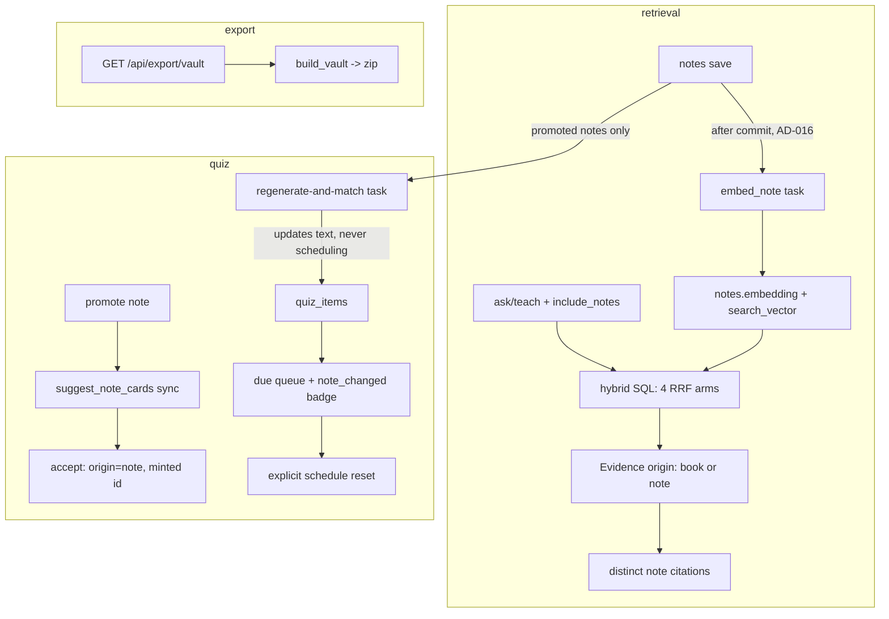

# v3-notes-loop Design

**Spec**: `.specs/features/v3-notes-loop/spec.md`
**Status**: Approved (auto, ship-cycle autonomy contract)
**Binding**: ADR-0026 d4–d6; AD-016, AD-022, AD-027, AD-052/053/054, AD-060, AD-113/114, AD-134..138, AD-143..149. All paths below are `backend/`-relative unless prefixed `frontend/`.

---

## Architecture Overview

Three vertical additions that each reuse a shipped substrate, plus release close:

1. **Notes join retrieval** — `notes` grows its own index columns (embedding + trigger-maintained tsvector, ADR-0026 d4: never in `corpus_chunks`); the single hybrid statement gains two note arms fused by the same RRF; `Evidence` grows an `origin` discriminator so Q&A/teaching/citations carry note evidence end-to-end behind `include_notes`.
2. **Note→quiz** — a third `origin='note'` identity regime in `quiz_items` (minted id per ADR-0026 d5), promotion reusing the AD-134 synchronous suggest path with the note body as source, an async regenerate-and-match Celery task honoring the edit-stability invariant, and a badge + explicit schedule reset at review.
3. **Vault export** — a pure `(domain reads) -> zip bytes` builder in `infrastructure/export/obsidian.py` per the Anki seam, deterministic by construction.

## Code Reuse Analysis

| Component | Location | How |
| --- | --- | --- |
| Hybrid RRF template + anchored variant | `app/infrastructure/db/retrieval.py:39,105` | Extend the template with note-arm CTEs; note arms join `notes` on `user_id`, skip empty bodies / NULL embeddings (mirrors semantic-arm NULL skip) |
| tsvector trigger pattern (AD-054) | migration `0006`/`metadata.py:277` | Same BEFORE INSERT/UPDATE trigger shape on `notes`, config `'simple'` (title weight A, body D per AD-020 weighting) |
| Embedding port + model versioning | `ports.py:435`, AD-052/053 | `embed_note` task embeds whole body, records `embedding_model` `<model>@<dims>` |
| Enqueue-after-commit port (AD-016) | `IngestionEnqueuer` precedent | New `NoteIndexEnqueuer` port; web layer enqueues embed (+ regenerate when promoted) after commit |
| Sync suggestion port (AD-134) | `ports.py:678` `suggest_cards`; `application/cards.py` | New port method `suggest_note_cards(note_body, context, limit)`; local + Anthropic adapters mirror `suggest_cards` minus the chunk-id enum; QC containment against the note body (NL-08, AD-138 asymmetry preserved on accept) |
| Grounding + citations contract (AD-027/060) | `application/qa.py`, `application/grounding.py` | Unchanged: evidence ids are opaque; note evidence uses the note id as its evidence id |
| Streaming presenter | `web/ui_message_stream.py`, `frontend/app/lib/streaming.ts` | `data-citations` part carries the widened citation fields |
| Provenance at review (AD-136) | `entities.py:750`, `web/quiz.py:197`, `frontend .../review-screen.tsx:290` | `CardProvenance` reused; for note cards join `notes` directly via `quiz_items.note_id` |
| Export seam | `infrastructure/export/anki.py:39`, `application/quiz.py:408` (`ExportQuizDeck`), `web/quiz.py:405` | Same triple: pure builder → service → file-download route |
| Wikilink parsing / titles | `application/notes.py:52`, `NoteRepository.resolve_titles` | Export emits `body_markdown` verbatim; filename = sanitized title so Obsidian resolves `[[...]]` |
| FSRS initial state | `infrastructure/scheduling/fsrs.py`, `SchedulingPort` | Schedule reset writes the same fresh state a new card gets |

## Components

### Migration `0013_notes_retrieval`
`notes` + nullable `embedding VECTOR(1536)`, nullable `embedding_model text`, `search_vector tsvector` + trigger (`'simple'`, title A / body D) + backfill `UPDATE`, HNSW (`vector_cosine_ops`, m=16/ef_construction=64, AD-020 params) + GIN. Down: drop.

### Migration `0014_note_cards`
- `quiz_items.user_id` UUID nullable → backfill from `sources` join → NOT NULL, FK `users.id` ON DELETE CASCADE, index (AD-149).
- `quiz_items.source_id` → nullable; CHECK `source_id IS NOT NULL OR origin = 'note'`.
- `quiz_items.note_id` UUID nullable FK `notes.id` ON DELETE SET NULL, index (AD-145/148).
- `quiz_items.note_changed_at` timestamptz nullable.
- Down: reverse (delete `origin='note'` rows first — downgrade data-loss confined to the new regime, mirroring `0012`'s backfill-then-reverse).

### Notes index maintenance
- **Port** `NoteIndexEnqueuer` (`ports.py`): `enqueue_embed(note_id)`, `enqueue_refresh_cards(note_id)`. Celery impl in `infrastructure/worker/`; enqueued by the web layer after commit on create/update (embed always when body changed; refresh only when the note has live `origin='note'` items — repo predicate `has_note_items(note_id)`), and on delete nothing (rows die with the note, NL-07).
- **Task** `embed_note(note_id)` (`worker/tasks.py`): idempotent; reads current body at run time (a stale enqueue embeds the newest body — the guard the spec's concurrency edge needs); empty body → clear embedding; truncates input deterministically to the provider limit (records truncation in `embedding_model`? no — plain truncation, documented); Celery retry conventions as `reembed_document`.

### Hybrid query + Evidence widening
- `_HYBRID_SQL_TEMPLATE` gains `note_semantic` / `note_lexical` CTEs over `notes WHERE user_id = :user_id AND body_markdown <> ''` (semantic skips NULL embeddings), each `LIMIT :notes_*_limit`, fused as `:notes_weight * (1/(:k+rank))`, then a `UNION ALL` projection with the book fusion before the final `ORDER BY rrf_score DESC, evidence_id LIMIT :top_k` (deterministic tie-break, NL-02). Bound only when `include_notes`; the book-only statement stays byte-identical to today's (regression guard).
- Projection for note rows: `evidence_id = note id`, `origin='note'`, `note_title`, `section_path = []`, `anchor = 'note:'||id`, `page_span = NULL`, `snippet = left(body_markdown, :notes_snippet_chars)`.
- `Evidence` (`entities.py:381`) gains `origin: Literal["book","note"] = "book"`, `note_id: UUID | None = None`, `note_title: str | None = None` — additive, frozen, all existing constructions valid.
- `RetrievalPort.search` + `SqlAlchemyRetrievalRepository.search` gain `user_id: UUID | None = None, include_notes: bool = False` (notes arms require both).
- Settings (`core/config.py`, naming per `retrieval_*`): `retrieval_notes_semantic_limit=5`, `retrieval_notes_lexical_limit=5`, `retrieval_notes_weight=1.0` (neutral; limits are the constraint — no eval signal for a bias), `retrieval_notes_snippet_chars=2000`.

### Q&A / teaching plumbing
- `RetrieveEvidence` / `AskQuestion` / teaching turn service accept `include_notes: bool | None`; route defaults per AD-147 (Q&A absent→true, teaching absent→false) applied in the **web layer** request models (server owns defaults).
- Generation documents: one citations-enabled doc per evidence item unchanged (AD-060 — titles never parsed, so note docs need no special casing).
- Web: `EvidenceView`/`AnswerResponse` + stream `data-citations` gain `origin`, `note_id`, `note_title`.
- `retrieve` endpoint (`web/retrieval.py:101`) passes the flag too (default false — diagnostic endpoint keeps old behavior).

### Note→quiz services (`application/cards.py` siblings)
- `SuggestNoteCards(user, note_id, limit)` — ownership via note; empty-QC → explicit empty list (spec edge); suggestions ephemeral (AD-134).
- `AcceptNoteCard(user, note_id, item_type, question, answer)` — writes `origin='note'`, `user_id`, `source_id=NULL`, `note_id`, minted id, `content_key` fingerprint (no unique), `source_excerpt` = grounding excerpt from the note body, fresh scheduling row; dedup against live items of this note by `content_key` (NL-15: return existing instead of duplicating); embedding computed and stored (AD-138).
- `RefreshNoteCards(note_id)` (worker-invoked): regenerate via `suggest_note_cards`; QC-filter; greedy one-to-one match live items ↔ suggestions by pgvector cosine over stored item embeddings, threshold `quiz_note_match_threshold=0.80` (0.90 is the *duplicate* threshold — matching revised text needs looser); matched+changed → update question/answer/content_key/source_excerpt/embedding + `note_changed_at=now`; matched+identical → untouched; unmatched item → `note_changed_at=now` only; leftover suggestions → dropped (AD-144). **Never touches `quiz_item_scheduling` or `review_log` (NL-10 invariant — sensor required).**
- `ResetSchedule(user, item_id)` — scheduling row → same fresh state a new card receives, clears `note_changed_at`, `review_log` untouched (append-only history).
- Due queue (`repositories.py:1388`): ownership via `quiz_items.user_id` (AD-149); `sources` becomes LEFT JOIN, `source_title = 'Your notes'` constant for note-origin rows; provenance joins `notes` on `note_id` for note cards (anchor join for highlight cards unchanged); `DueReviewItem` gains `note_changed: bool` (`note_changed_at > COALESCE(last_review, item.created_at)` — reviewing naturally retires the badge; reset clears it explicitly).

### Note→quiz API (`web/cards.py` + `web/quiz.py`)
- `POST /api/notes/{note_id}/cards/suggest` · `POST /api/notes/{note_id}/cards` (mirror the highlight pair: CSRF, quiz throttle, 404 non-disclosure).
- `POST /api/quiz-items/{item_id}/schedule-reset` (CSRF, throttle, 404, 409 non-active).
- `DueItemView` gains `note_changed`; `CardProvenanceView` reused for note provenance.

### Frontend
- `frontend/app/lib/questions.ts` `Citation` + `streaming.ts` parts: `origin`, `noteId`, `noteTitle` (optional). Citation components render note citations as "Your note — <title>" linking `/notes/{id}` (no "Open in book"); book citations byte-identical.
- Ask panel: "Include my notes" switch, default on, persisted (versioned localStorage key per AD-125 precedent); Teach panel same, default off; flag sent only when user has chosen (absent → server default).
- Note detail: "Add to review" → suggestions flow reusing the v4-D card-suggestions component pattern → accept; shows existing card count.
- Review screen: "your note changed" badge (linked note) + explicit "Reset schedule" confirm → `schedule-reset`; note provenance line reuses `card-provenance`.
- Notes list header: "Export vault" anchor → `GET /api/export/vault` download.

### Vault export
- `infrastructure/export/obsidian.py`: `build_vault(notes: Sequence[NoteView], anchors_by_source: ...) -> bytes` — pure, `zipfile` with fixed `date_time=(1980,1,1,0,0,0)`, entries sorted, `Learny/Books/<title>.md` + `Learny/Notes/<title>.md`; sanitizer strips `[]:\\/^|#?*<>"` + trims + de-collides with deterministic ` (2)` suffixes ordered by `(created_at, id)`; note frontmatter `learny-id/learny-created/learny-updated/learny-tags/learny-sources`; body verbatim; anchors under a `## Highlights` heading in the note file as `[[<book file>#^lh-<anchor uuid>]]` + quote, or plain quote when the anchor's book file is absent; book files: callouts `> [!quote] <section path> · <page span>` + quote + `^lh-<anchor uuid>`, ordered by position (section path, block ordinal, offsets), orphaned under a trailing `## Orphaned highlights`.
- `application/vault.py` `ExportVault(user)`; repo read additions kept to `NoteRepository` (`anchors_for_user` grouped by source) if the existing reads don't already cover it.
- `web/vault.py`: `GET /api/export/vault` → zip download, filename `learny-vault.zip` (auth only — GET, no CSRF needed, matches Anki export).

### Release close
README feature-set refresh (capture → retrieve → reinforce → export), `docs/retrospectives/2026-07-learny-v3.md` following the v2 form, `0.3.0` in `backend/pyproject.toml` + `frontend/package.json` (+ lockfile refresh).

## Error Handling

| Scenario | Handling | User sees |
| --- | --- | --- |
| Note embed provider failure | Celery retry (existing conventions); lexical arm still serves (NL-06) | Nothing; note briefly semantic-invisible |
| Promotion generation failure | 502 per AD-026 vocabulary | Explicit error, retryable |
| All suggestions fail QC | 200 empty list | "No cards could be grounded in this note" |
| Regenerate task failure | Retry; items keep prior text, scheduling untouched | Nothing |
| Reset on non-active item | 409 | Explicit conflict |
| Export with zero notes/highlights | Valid zip with empty `Learny/` skeleton | Empty vault |

## Risks & Concerns

| Concern | Location | Impact | Mitigation |
| --- | --- | --- | --- |
| `Evidence` widening ripples (frontend `Citation`, stream parts, golden citation tests) | `entities.py:381`, `frontend/app/lib/questions.ts:16` | Silent contract drift | Additive-with-defaults fields; regression test pins book-only SQL/behavior unchanged |
| AD-149 ownership migration touches every quiz read | `repositories.py:1388` area | Auth regression risk (cross-user leak) | Backfill + NOT NULL in one migration; ownership tests for all three origins incl. negative cases |
| Edit-stability invariant is quiet-failure-prone | `RefreshNoteCards` | Schedule wiped without any test noticing | Named invariant + byte-equal scheduling/review-log sensor required by the phase brief |
| LLM call per promoted-note save | `RefreshNoteCards` | Cost creep | Promoted-only gate (`has_note_items`) + deterministic local default in CI; author scale |
| Zip determinism vs OS/zlib variance | `obsidian.py` | NL-19 flaky | Fixed date_time, `ZIP_DEFLATED` fixed level (or STORED), sorted entries, test asserts byte-equality of two builds |
| `notes.search_vector` config `'simple'` = no stemming | migration 0013 | Weaker pt/en lexical recall on notes | Accepted for v1 (language unknown per note); recorded upgrade: reuse AD-106 detector |

## Tech Decisions (non-obvious)

| Decision | Choice | Rationale |
| --- | --- | --- |
| Note evidence identity | Note id as opaque evidence id | AD-027/060 treat ids as opaque; grounding + streaming untouched |
| Notes FTS config | `'simple'` | Note language unknown; deterministic; short texts |
| Match threshold | New setting 0.80 (≠ 0.90 dup threshold) | Matching *revisions*, not duplicates |
| Badge retirement | Computed vs `last_review`, no stored flag-clear on review | Reviewing IS acknowledgment; reset clears explicitly |
| Suggest port shape | New `suggest_note_cards` method, not a widened `suggest_cards` | The chunk-id-enum contract (AD-134) is meaningless for notes; adapters share prompt/QC helpers |
| AD-149 (STATE.md) | `quiz_items.user_id` denormalized ownership; `source_id` nullable gated by CHECK to note origin | Un-anchored notes have no source; extends AD-014/073 rather than a per-origin ownership fork |
