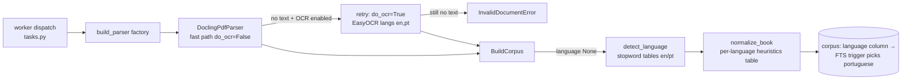

# v3-ocr Design

**Spec**: `.specs/features/v3-ocr/spec.md` · **Status**: Approved (auto, ship-cycle)

## Architecture Overview

Three thin, layered changes along the existing ingestion path — no schema, no API, no frontend:

## Code Reuse Analysis

| Component | Location | How to use |
|---|---|---|
| `_convert` seam + `InvalidDocumentError` wrap | `docling_pdf.py:80-107` | restructure: `_convert(..., do_ocr: bool)` returns the document without the text guard; `parse()` owns the guard + single retry |
| `_has_text` | `docling_pdf.py:252` | unchanged; becomes the retry trigger |
| `_to_parsed_book` mapping + anchor scheme | `docling_pdf.py:111,188` | identical for OCR output (OCR-03) |
| Settings extension pattern | `config.py` (`pdf_max_bytes:85`) | add `pdf_ocr_enabled: bool = True`, `pdf_ocr_langs: str = "en,pt"` (+ parsed-tuple helper) |
| Factory lazy probe + wiring pattern | `factory.py:23-45`, `tasks.py:107-124` | thread the two settings into the parser the same way existing settings reach worker steps — follow the existing construction pattern, do not invent a new DI path |
| Model bake | `backend/Dockerfile:38` | `with_easyocr=True`; keep others as-is |
| `ParsedBook.language` + corpus `language` + FTS trigger | `entities.py:254`, `corpus.py:125`, migration 0007, `text_search.py:21-46` | detection fills the existing field; persistence + trigger need zero changes |
| `normalize_book` pass structure + constants | `normalization.py:44-58, 87-101` | constants become the neutral row of a per-language table; passes read the table for `book.language` |
| Live-test conventions | `test_ingestion_docling_live.py:15,21` (`importorskip`, `_make_pdf`) | scanned fixture = code-generated image-only PDF in the same module family |
| Mapping-test conventions (CI-safe) | `test_ingestion_docling_mapping.py` | stubbed-converter tests for the retry logic |

## Components

### Selective OCR (`docling_pdf.py`, `config.py`, `Dockerfile`)
- `DoclingPdfParser(ocr_enabled: bool = True, ocr_langs: Sequence[str] = ("en","pt"))` (defaults mirror settings; construction site passes real settings).
- `parse()`: fast-path convert → `_has_text`? return mapping : (if `ocr_enabled` → OCR convert → `_has_text`? return mapping : raise) : raise. Exactly one retry (OCR-02); disabled path identical to today (OCR-05).
- OCR pipeline options: `PdfPipelineOptions(do_ocr=True, do_table_structure=True, ocr_options=EasyOcrOptions(lang=list(ocr_langs)))` — **verify the exact docling 2.112 API names against the pinned version's docs/source (WebFetch) before writing; docling is not installed locally. Never guess API names** (knowledge chain).
- Langs parsing: split `pdf_ocr_langs` on commas, strip, drop empties; empty result → default `("en","pt")` (edge case).
- Dockerfile: `with_easyocr=True` in `download_models`; test asserts it (OCR-06).

### Language detection (`app/application/language.py`, wiring in `corpus.py`)
- `detect_language(text: str) -> str | None`: lowercase tokenize, score against per-language stopword frozensets (EN/PT, ~40 words each — include PT-distinctive: não, uma, para, como, mais, são, também, já, à, é...; EN-distinctive: the, and, of, that, with, from...); require ≥ `_MIN_TOKENS` (e.g. 200) and winner-ratio ≥ threshold vs runner-up (e.g. 1.5×), else None. Pure, table-driven (OCR-12).
- Wiring: in `BuildCorpus.__call__` after parse, if `book.language is None` → sample text from the first N blocks (bounded, e.g. first 5000 words), `dataclasses.replace(book, language=detected)` before normalization/persist (OCR-09/10/11). EPUB language flows through untouched.

### Localized normalization (`normalization.py`)
- `@dataclass(frozen=True) LanguageHeuristics`: `generic_title_pattern`, `part_keywords`, `chapter_keywords`, `front_matter_titles`, `noise_markers` (extending the Gutenberg pair), plus the numeric thresholds shared across languages.
- `_HEURISTICS: dict[str | None, LanguageHeuristics]` with `None` (neutral = exactly today's constants), `"en"`, `"pt"` rows; lookup by primary subtag of `book.language`.
- Passes consult the table: `_infer_flat_hierarchy` uses part/chapter keyword matching for depth assignment; `_apply_title_cascade`/generic-title uses the per-language pattern; `_strip_gutenberg`→`_strip_noise` uses per-language markers. Neutral row keeps every existing test/golden green (OCR-15).

### Proof + record (Phase D)
- Live suite: code-generated image-only PDF (render text glyphs into a raster page — hand-rolled minimal PDF with an embedded 1-bit/8-bit image XObject; no new deps) → end-to-end OCR ingest; blank-image PDF → `InvalidDocumentError` (OCR-17).
- Bounded real-environment proof: attempt `docker.exe build --target pdf-worker` and run the live docling suite in the built image (`docker.exe run --rm --entrypoint python ... -m pytest tests/test_ingestion_docling_live.py -q` with the repo tests mounted). If build/download cost is prohibitive in this environment, record the gap honestly in ADR-0025 and the merge report — do not fake it.
- ADR-0025: selective-OCR policy, engine choice, detection design, heuristics table, C-before-B reorder (AD-103), 4g-fit evidence or gap.

## Error Handling

| Scenario | Handling |
|---|---|
| OCR retry throws docling error | existing wrap → `InvalidDocumentError` (worker terminal path, no crash-loop) |
| Both passes textless | `InvalidDocumentError` naming file (today's message shape) |
| Malformed `LEARNY_PDF_OCR_LANGS` | normalize; fall back to default list |
| Detector ambiguity/short text | `language=None` → today's behavior (simple FTS, neutral heuristics) |

## Risks & Concerns

| Concern | Location | Impact | Mitigation |
|---|---|---|---|
| docling OCR API names guessed wrong (not installed locally) | `docling_pdf.py` | broken live path invisible to CI | mandatory WebFetch verification against the pinned 2.112 line; live suite in built image (Phase D) as the executable check |
| EasyOCR memory at conc-1 vs 4g limit | worker-pdf | OOM on large scanned books | Phase D in-image run observes peak; ADR records fit or a flagged follow-up |
| PT heuristics regress EN/neutral books | `normalization.py` | corpus quality regression | neutral table row = today's constants; OCR-15 asserts existing goldens byte-identical |
| Detector misfires on mixed-language books | `language.py` | wrong FTS config | confidence ratio + min tokens → None fallback; mixed-fixture test |

## Tech Decisions (feature-local)

| Decision | Choice | Rationale |
|---|---|---|
| Where detection runs | `BuildCorpus`, not the parser | format-agnostic (any future parser benefits); parser stays a pure format mapper |
| Sample bound | first ~5000 words | detection is O(sample), not O(book) |
| Table keyed by | primary subtag (`pt` from `pt-BR`) | matches `text_search.py` semantics |
