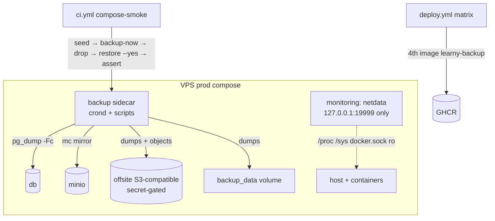

# v3-ops-maturity Design

**Spec**: `.specs/features/v3-ops-maturity/spec.md`
**Status**: Approved (auto, ship-cycle)

## Architecture Overview

Three independent tracks, no schema/app-code changes:

Backup dataflow: nightly crond job → `pg_dump -Fc` to `backup_data` (atomic tmp+rename) → if offsite configured: copy dump + `mc mirror` source bucket to offsite → prune local+offsite dumps by `KEEP_DAYS` → optional heartbeat. Restore is a shipped script run manually (CI proves it on scratch services).

## Code Reuse Analysis

| Component | Location | How to Use |
|---|---|---|
| Prod overlay patterns (env_file required, pinned images, restart, caddy-as-only-public) | `docker-compose.prod.yml` | backup + monitoring services follow the same shape |
| Secrets model | `secrets/*.env` + `backend/.env.production.example` | add `backup.env` section to example; reuse `db.env`/`minio.env` creds via multiple env_file entries (no cred duplication) |
| Deploy build matrix | `.github/workflows/deploy.yml:41` | add 4th entry `learny-backup` / `./deploy/backup` (single-stage, no target) |
| compose-smoke job | `.github/workflows/ci.yml` | extend with the backup/restore roundtrip using the override's `backup` profile |
| YAML/text test helpers (`_load`, `_deep_merge`, `_services`, `_flag_value`, `_host_ports`) | `backend/tests/test_compose_*.py`, `test_deploy_*.py` | new `test_backup_stack.py` + edits reuse these patterns |
| Ops-docs assertions | `backend/tests/test_ops_docs.py` | extend for backups automation section + monitoring.md |
| `mc mirror` / `pg_dump -Fc` / `pg_restore --clean --if-exists` semantics | `docs/ops/backups.md` (manual runbook) | scripts automate exactly what the runbook already prescribes |

## Components

### Backup image (`deploy/backup/`)
- **Purpose**: self-contained scheduled backup + manual restore tooling.
- **Files**: `Dockerfile` (alpine pinned minor; `postgresql16-client`, `curl`, minio `mc` binary pinned release; non-root not required — needs no host access), `entrypoint.sh` (renders crontab from `LEARNY_BACKUP_CRON`, default `30 3 * * *`, runs `crond -f` foreground logging to stdout), `backup.sh`, `restore.sh`, wrapper `backup-now`.
- **`backup.sh` contract**: `flock -n` guard (OPS-07); `pg_dump -Fc` → `*.tmp` → `mv` on success (OPS-04); offsite block only when all four `LEARNY_BACKUP_REMOTE_*` set, else log `offsite not configured` and exit 0 after local work (OPS-05); `mc mirror` source bucket → offsite **without `--remove`** (deleted app objects persist offsite; safer default, documented); prune runs only after successful dump, `find -mtime +KEEP_DAYS` for local + `mc rm --older-than` for offsite dumps, newest archive always exempt (OPS-06, edge); heartbeat `curl -fsS` last, success-only (OPS-08); any failure → exit non-zero (set -euo pipefail).
- **`restore.sh` contract**: `restore <archive|--latest> --yes`; without `--yes` prints plan, exits non-zero; unknown archive → exit non-zero listing `/backups/db/` (OPS-09, edge).
- **Env**: `POSTGRES_USER/PASSWORD/DB` (from `db.env`), `MINIO_ROOT_USER/PASSWORD` (from `minio.env`), `LEARNY_BACKUP_CRON`, `LEARNY_BACKUP_KEEP_DAYS=14`, `LEARNY_BACKUP_SOURCE_BUCKET=learny-sources`, `LEARNY_BACKUP_REMOTE_ENDPOINT/_ACCESS_KEY/_SECRET_KEY/_BUCKET`, `LEARNY_BACKUP_HEARTBEAT_URL`, hosts default `db`/`http://minio:9000`.

### Compose changes
- **prod overlay**: `backup` service (GHCR image `${LEARNY_IMAGE_TAG:-latest}`, restart unless-stopped, env_file db/minio/backup all `required: true`, `backup_data:/backups`, depends_on db+minio healthy, no ports) + `monitoring` service (see below) + volumes `backup_data`, `netdata_config`, `netdata_lib`, `netdata_cache`.
- **dev override**: `backup` service under `profiles: ["backup"]` — `build: ./deploy/backup`, dev creds, `backup_data:/backups`; keeps default `up` untouched, gives CI/dev `docker compose --profile backup run --rm backup ...`.

### Monitoring service (prod overlay only)
- **Purpose**: host + per-container metrics UI (OPS-13/14).
- **Shape**: `netdata/netdata:<pinned>` — worker MUST verify the exact tag exists on Docker Hub before pinning (project lesson: phantom third-party versions); `ports: ["127.0.0.1:19999:19999"]`; mounts `netdata_config:/etc/netdata`, `netdata_lib:/var/lib/netdata`, `netdata_cache:/var/cache/netdata`, `/proc:/host/proc:ro`, `/sys:/host/sys:ro`, `/etc/os-release:/host/etc/os-release:ro`, `/var/run/docker.sock:/var/run/docker.sock:ro`; `cap_add: [SYS_PTRACE]`, `security_opt: [apparmor:unconfined]` (netdata's documented compose recipe — verify against official docs); mem limit (512m).
- **Access**: SSH tunnel `ssh -L 19999:127.0.0.1:19999 <vps>` — documented in `docs/ops/monitoring.md`.

### CI roundtrip (compose-smoke extension)
Steps appended after the existing `--wait`: build backup profile image; `exec db psql` seed marker table; `run --rm backup backup-now` (assert exit 0 + `offsite not configured` in output); `exec db psql` drop marker; `run --rm backup restore --latest --yes`; `exec db psql` assert marker row returns (OPS-10).

### Image hygiene (`backend/Dockerfile` runtime stage + uv config)
- runtime: `uv sync --frozen` (drop `--extra dev`) both sync lines; add non-root `USER` (uid 10001, own `/app`); **pre-change audit**: `grep -rn "docling" backend/app` — any import reachable from api/worker startup must be lazy/guarded (docling-core lives in the dev extra); compose-smoke proves boot.
- pdf-worker torch: check `uv.lock` for CUDA-variant torch wheels; if present attempt `[tool.uv.sources]`/index pin to CPU wheels; accept only if `uv lock` stays consistent + full CI green; else record measured evidence in ADR-0024 (OPS-18 either-outcome).

## Error Handling Strategy

| Error Scenario | Handling | Operator Impact |
|---|---|---|
| db/minio down during backup | job exits non-zero, no heartbeat, prior archives intact | missed-heartbeat alert / `docker logs backup` |
| offsite configured but unreachable | local dump kept, exit non-zero, no heartbeat | same |
| overlapping run | second run exits immediately (flock) | log line only |
| restore without `--yes` / unknown archive | no DB touch, non-zero, prints plan / lists archives | safe-by-default |

## Risks & Concerns

| Concern | Location | Impact | Mitigation |
|---|---|---|---|
| Hidden dev-extra import at runtime after dropping `--extra dev` | `backend/app/**` (docling-core in dev extra) | api/worker crash at boot | mandatory import audit in D1 + compose-smoke boots api/worker in CI |
| Third-party tags (netdata, mc release, alpine) may not exist | new Dockerfile/compose pins | broken build/deploy | lesson applied: verify every new tag against its registry before pinning |
| `test_deploy_topology.py` asserts caddy-only exposure | `backend/tests/test_deploy_topology.py:149` | new loopback publish could fail/weaken it | tighten test to "only caddy publishes non-loopback ports; monitoring only 127.0.0.1:19999" |
| compose-smoke runtime growth | `.github/workflows/ci.yml` | slower CI | roundtrip adds ~30–60 s (psql + run×2) — acceptable; no new service in default `up` |
| Prune deleting the just-written dump if clock/mtime skew | `deploy/backup/backup.sh` | data-loss edge | newest-archive exemption is an explicit script guard + spec edge case |

## Tech Decisions (feature-local; project-level ones are AD-097..102)

| Decision | Choice | Rationale |
|---|---|---|
| Object mirror `--remove` | not used | deleted app objects persist offsite; favors recoverability, documented |
| Backup service in base vs overlays | prod overlay + dev-override profile | prod parity with caddy pattern; dev/CI opt-in without polluting default `up` |
| Scripts tested how | text asserts (house style) + real CI roundtrip | behavior proven end-to-end in CI; text asserts pin the safety-critical flags |
| New test file | `backend/tests/test_backup_stack.py` | mirrors `test_deploy_topology.py` naming/patterns |
