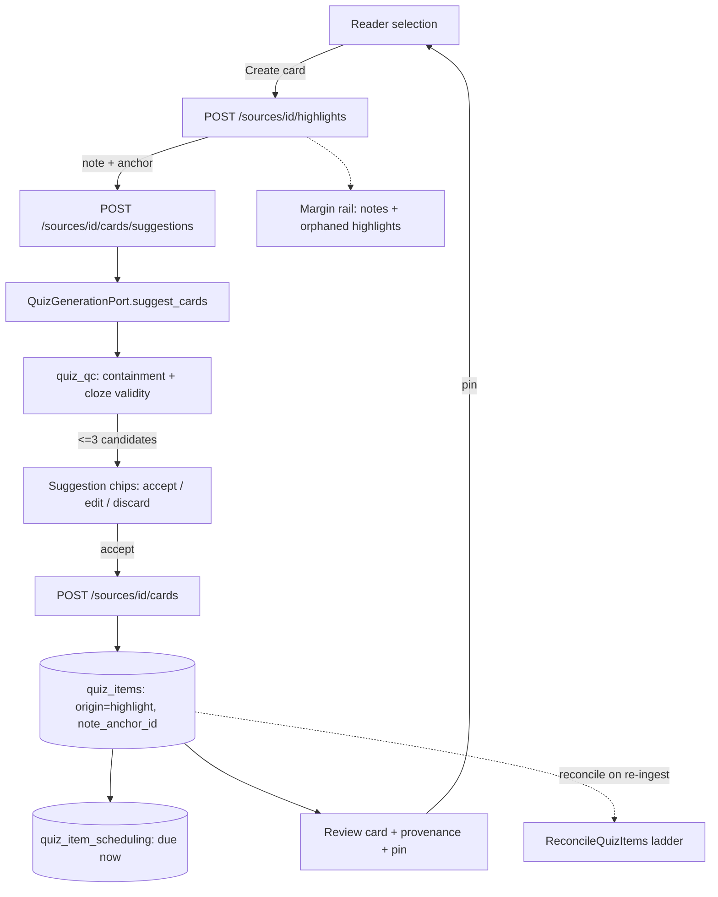

# v4-capture-pipeline Design

**Spec**: `.specs/features/v4-capture-pipeline/spec.md`
**Context**: `.specs/features/v4-capture-pipeline/context.md`
**Status**: Approved (auto-approved per the ship-cycle autonomy contract)

---

## Architecture Overview

The cycle threads one new path — *selection → highlight → suggestions → accepted card → review
→ back to the passage* — through machinery that already exists, adding a second identity mode to
`quiz_items` and one synchronous generation entry point.



Two identity modes coexist in one table: `deck`-origin rows keep the shipped
content-hash upsert identity; `highlight`-origin rows are minted at acceptance and mutate freely
underneath a stable id.

---

## Code Reuse Analysis

### Existing components to leverage

| Component | Location | How to use |
| --- | --- | --- |
| `CaptureHighlight` | `backend/app/application/notes.py:274` | Called unchanged by the client's first step; supplies the anchor every card hangs off |
| `resolve(blocks, quote, prefix, suffix)` | `backend/app/application/anchoring.py:56` | Already invoked inside capture; not called directly by this cycle |
| `quiz_qc.quote_in_text` / `cloze_is_valid` / `content_key` / `normalize_text` | `backend/app/application/quiz_qc.py` | Reused verbatim to gate suggestions (CAP-03/04) and compute the fingerprint |
| `_items_schema(chunk_ids)` structured output + `source_chunk_id` enum | `backend/app/infrastructure/quiz/anthropic.py:51` | Reused for the single-quote request so grounding stays schema-enforced |
| `AnthropicAdapterBase` | `backend/app/infrastructure/quiz/anthropic.py` | The suggest path is a sibling method on the same adapter, same client/model/token settings |
| `SchedulingPort.initial()` | `backend/app/domain/ports.py:713` | Accepted card gets initial FSRS state exactly like a deck item |
| `ReconcileQuizItems` ladder | `backend/app/application/quiz.py:438` | Applies to highlight-origin rows with no change (CAP-17) |
| `highlights_for_source` | `backend/app/infrastructure/db/repositories.py:964` | Widened with note title + has-body for the rail (CAP-18/19) |
| `AnchorStatusBadge` | `frontend/app/components/notes/anchor-status-badge.tsx` | The single home for orphan treatment — reused by the rail (CAP-20) |
| `handleShowInBook` scroll/flash idiom | `frontend/app/components/chapter-reader.tsx:470` | Reused by rail entries (CAP-21) and by the review pin |
| `readUrl(sourceId, anchor, {panel})` | `frontend/app/lib/read-url.ts:12` | Replaces the hand-built URL at `review-screen.tsx:265` (CAP-26) |
| `saveAnswerAsNote` shape (lib fn + injectable impls + thin UI wrapper) | `frontend/app/lib/answer-notes.ts` | Pattern template for the suggestion flow |
| `routedFetch` / `jsonResponse` test idiom | `frontend/tests/chapter-reader.test.tsx:99` | House fetch-mocking convention for every new component test |

### Integration points

| System | Integration method |
| --- | --- |
| Notes aggregate | Quiz gains a nullable FK into `note_anchors` (SET NULL); notes gain nothing and never reference quiz |
| Ingestion pipeline | No new step; the existing quiz + notes reconcile steps cover the new rows |
| Rate limiting | Suggestion + accept routes reuse `rate_limit_quiz` |
| Celery | Untouched — the suggestion path is synchronous by design (AD-134) |

---

## Components

### Migration `0012_card_provenance`

- **Purpose**: Give `quiz_items` a typed origin and a provenance link, and split the uniqueness rule by origin.
- **Location**: `backend/migrations/versions/0012_card_provenance.py` (`down_revision = "0011_reader_progress"`)
- **Operations**:
  - `origin TEXT NOT NULL DEFAULT 'deck'` (existing rows are deck rows by construction)
  - `note_anchor_id UUID NULL REFERENCES note_anchors(id) ON DELETE SET NULL`, indexed
  - drop `UniqueConstraint("uq_quiz_items_source_id")` (created in `0008_quiz_schema.py:86`)
  - create partial unique index `uq_quiz_items_deck_content_key` on `(source_id, content_key) WHERE origin = 'deck'`
  - create partial unique index `uq_quiz_items_highlight_anchor_key` on `(note_anchor_id, content_key) WHERE origin = 'highlight' AND note_anchor_id IS NOT NULL`
- **Reuses**: the `note_links.target_note_id` SET NULL precedent (`metadata.py`) for cascade direction.
- **Note**: `metadata.py` must mirror both partial indexes as `Index(..., unique=True, postgresql_where=...)` in place of the current `UniqueConstraint`.

### `QuizItemOrigin` + widened `QuizItem`

- **Purpose**: Typed origin vocabulary and provenance field on the domain entity.
- **Location**: `backend/app/domain/entities.py` (beside `QuizItemStatus:557`)
- **Interfaces**: `QuizItemOrigin.DECK = "deck"`, `QuizItemOrigin.HIGHLIGHT = "highlight"`;
  `QuizItem` gains `origin: str` and `note_anchor_id: UUID | None`.
- **Reuses**: the string-constants-not-Enum convention already used by `QuizItemType`/`QuizItemStatus`.

### `QuizGenerationPort.suggest_cards`

- **Purpose**: Synchronous, quote-scoped candidate generation.
- **Location**: `backend/app/domain/ports.py:677` (port), `infrastructure/quiz/local.py` + `anthropic.py` (adapters)
- **Interface**: `suggest_cards(section: QuizSection, quote: str, limit: int) -> list[QuizCandidate]`
- **Dependencies**: settings `quiz_model`, `generation_max_tokens`, new `quiz_max_suggestions`
- **Reuses**: `_items_schema` + the `source_chunk_id` enum grounding constraint; the local adapter's
  existing deterministic candidate construction, narrowed to the quote.

### `SuggestCards` use case

- **Purpose**: Own ownership, anchor loading, generation, and QC for CAP-01..04, CAP-09.
- **Location**: `backend/app/application/cards.py` (new module — keeps `quiz.py` from growing a third concern)
- **Interface**: `__call__(*, user, source_id, note_anchor_id) -> list[QuizCandidate]`
- **Behaviour**: authorize source → load the anchor (must belong to a note owned by `user` *and* to
  `source_id`, else `QuizItemNotFound` → 404) → `corpus.blocks_for_section` for the anchor's section
  → build a single `QuizSection` → `suggest_cards(..., limit=settings.quiz_max_suggestions)` →
  drop candidates failing `quote_in_text` or `cloze_is_valid` → return at most `limit`.
- **Reuses**: `RunDeckGeneration._ground`-equivalent QC helpers from `quiz_qc`.

### `AcceptCard` use case

- **Purpose**: Mint the card (CAP-05..07, CAP-10..12), idempotently.
- **Location**: `backend/app/application/cards.py`
- **Interface**: `__call__(*, user, source_id, note_anchor_id, item_type, question, answer) -> tuple[QuizItem, bool]`
  (`bool` = created; `False` on the idempotent re-accept path)
- **Behaviour**: authorize → load + validate anchor → validate non-empty question/answer and length
  bound (422) → compute `content_key` → if a `highlight`-origin row already exists for
  `(note_anchor_id, content_key)` return it with `created=False` → else mint `QuizItem` with
  `origin="highlight"`, `note_anchor_id`, `anchor`/`section_path` from the anchor,
  `source_excerpt = anchor.quote_exact`, `chunk_hash = sha256(normalize_text(anchor.quote_exact))`,
  `generation_meta = {"model": generation.model}` → embed → `upsert` → `create_scheduling(initial())`.
- **Dedup**: embedding dedup deliberately NOT applied (CAP-A5); the embedding is still stored.

### `UpdateCard` use case

- **Purpose**: Prove and preserve CAP-12 — edit text, keep identity and scheduling.
- **Location**: `backend/app/application/cards.py`
- **Interface**: `__call__(*, user, item_id, question, answer) -> QuizItem`
- **Behaviour**: owner-scoped load → reject non-`highlight` origin (409 `QuizItemNotReviewable`-style
  guard, so deck items keep their upsert identity) → update text + recomputed `content_key` +
  `updated_at` only. **Never** touches `quiz_item_scheduling` or `review_log`.

### Card routes

- **Location**: `backend/app/infrastructure/web/cards.py` (new router, registered in `main.py`)

| Method | Path | Body | Response | Deps |
| --- | --- | --- | --- | --- |
| POST | `/api/sources/{source_id}/cards/suggestions` | `{note_anchor_id}` | `{suggestions: [{item_type, question, answer, anchor_quote}]}` 200 | `rate_limit_quiz`, origin, CSRF |
| POST | `/api/sources/{source_id}/cards` | `{note_anchor_id, item_type, question, answer}` | `CardView` 201 (200 on idempotent re-accept) | `rate_limit_quiz`, origin, CSRF |
| PATCH | `/api/quiz-items/{item_id}` | `{question, answer}` | `CardView` 200 | `rate_limit_quiz`, origin, CSRF |

- **Reuses**: the existing error map (`QuizItemNotFound`→404, `StaleCaptureTarget`→409); 404
  non-disclosure on any ownership failure.

### Widened `SourceHighlight` + provenance on `DueItemView`

- **Purpose**: Rail data (CAP-18/19) and review provenance (CAP-16).
- **Location**: `entities.py:946` / `repositories.py:964`; `web/quiz.py:196`
- **Changes**: `SourceHighlight` gains `note_title: str` and `has_body: bool`;
  `highlights_for_source` joins `notes` for both. `DueItemView` gains
  `provenance: {note_id, note_title} | null`, populated by joining `note_anchors` → `notes` in
  `due_for_user`.
- **Reuses**: existing owner-scoped queries; both additions are additive to the DTOs.

### Frontend — `CardSuggestions`

- **Purpose**: The accept/edit/discard chip row (CAP-01, 05–08).
- **Location**: `frontend/app/components/notes/card-suggestions.tsx`
- **Props**: `{ sourceId, noteAnchorId, csrf, suggestions, onAccepted, onDismiss }`
- **Behaviour**: one chip per suggestion — Accept, Edit (inline textarea, then Accept), Discard.
  Discard is client-only. Errors render inline and are retryable.
- **Reuses**: shadcn `Button`; the `saveAnswerAsNote` lib-fn + thin-wrapper pattern.

### Frontend — `lib/cards.ts`

- **Purpose**: Typed client for the three new routes.
- **Location**: `frontend/app/lib/cards.ts`
- **Interfaces**: `suggestCards(sourceId, noteAnchorId, csrf, fetchImpl?)`,
  `acceptCard(sourceId, body, csrf, fetchImpl?)`, `updateCard(itemId, body, csrf, fetchImpl?)`,
  plus `class CardError extends Error { kind: "stale_capture" | "invalid" | "unknown" }`.
- **Reuses**: the `NoteError`/`toNoteError` typed-error convention (`lib/notes.ts:102`), which
  `lib/quiz.ts` lacks — the new module follows notes, not quiz.

### Frontend — `MarginRail`

- **Purpose**: CAP-18..24.
- **Location**: `frontend/app/components/margin-rail.tsx`
- **Props**: `{ highlights: SourceHighlightView[], chapterAnchors: string[], onJump(anchor, noteId) }`
- **Behaviour**: filters to the loaded chapter's anchors, orders by the chapter's section order,
  renders title (or quote snapshot when untitled), `AnchorStatusBadge` for non-active statuses,
  empty state when the chapter has none. Rendered as a flex sibling right of the article, hidden
  when `panelMode` is set; below `lg` it renders after the article inside a `<details>`.

### Frontend — `use-key-shortcuts`

- **Purpose**: CAP-28..33.
- **Location**: `frontend/app/components/use-key-shortcuts.ts`
- **Interface**: `useKeyShortcuts(bindings: Record<string, () => void>, enabled: boolean): void`
- **Behaviour**: one `window` `keydown` listener; returns early when `event.ctrlKey || event.metaKey
  || event.altKey`, or when the target is `input`/`textarea`/`[contenteditable]`; cleans up on
  unmount. Bindings: reader `h` = Highlight, `c` = Create card (both only while the capture popover
  is open); review `space` = reveal, `1`–`4` = grade. `b` is never bound (vendored sidebar owns it).

---

## Data Models

```typescript
// quiz_items, after 0012
interface QuizItem {
  id: string                 // minted; the stable identity for origin === "highlight"
  source_id: string
  origin: "deck" | "highlight"
  note_anchor_id: string | null   // provenance; SET NULL when the note/anchor dies
  item_type: "free_recall" | "cloze"
  question: string
  answer: string
  section_path: string[]
  anchor: string
  source_excerpt: string     // renders the card even with provenance severed
  chunk_hash: string
  content_key: string        // upsert identity for deck; rewritable fingerprint for highlight
  status: "active" | "stale" | "orphaned"
}
```

**Relationships**: `quiz_items.note_anchor_id → note_anchors.id` (SET NULL) is the only edge
between the two aggregates, and it points from the derived object to its origin. Nothing in the
notes aggregate references quiz.

---

## Error Handling Strategy

| Error scenario | Handling | User impact |
| --- | --- | --- |
| Anchor not owned / wrong source | `QuizItemNotFound` → 404 | Generic not-found; no existence disclosure |
| Section changed, anchor no longer binds | `StaleCaptureTarget` → 409 | "This passage changed — reload the chapter" |
| Generation call fails or times out | 502, suggestions empty | Inline retryable error; highlight already saved |
| Zero candidates survive QC | 200 with `suggestions: []` | "No cards for this passage" — not an error |
| Empty or over-long question/answer | 422 | Inline validation message on the chip |
| Re-accept of identical text from same anchor | Idempotent, 200 with the existing card | No duplicate appears |
| Rate limited | 429 via `rate_limit_quiz` | Standard throttle message |
| Highlights fetch fails | Existing non-blocking semantics | Text renders; rail shows its empty state |

---

## Risks & Concerns

| Concern | Location | Impact | Mitigation |
| --- | --- | --- | --- |
| First synchronous LLM call inside a request handler; a slow provider ties up a worker | new `web/cards.py` | Latency/thread pressure under concurrency | Bounded by `generation_max_tokens`, a 3-candidate cap, and `rate_limit_quiz`; single-user scale (RFC-003 assumption). Flagged for the merge gate |
| Two reconcilers with no ordering contract | `worker/tasks.py:180` and `:188` | A card and its origin anchor can disagree after re-ingest | AD-137: independent reconcile on own snapshots; a test pins the current step order so a silent reorder fails |
| Partial unique indexes are easy to miss when reading the schema | `metadata.py` quiz_items | A future contributor may reinstate a global unique | Explicit tests for both index behaviours + a comment at the index site |
| `sources` CASCADE deletes quiz items while notes survive (bare-UUID `source_id`) | `metadata.py:395` vs `:523` | Deleting a source destroys cards but keeps orphaned notes | Pre-existing and correct per ADR-026 (prose is protected, derived cards are not); documented, not changed |
| `quiz.ts` throws untyped `Error` | `frontend/app/lib/quiz.ts:203` | Suggestion flow cannot branch on error kind | New `lib/cards.ts` follows the `NoteError` typed convention; `quiz.ts` left untouched to keep the diff honest |
| No shortcut precedent — a global listener can leak or hijack typing | new hook | Keys firing while the user types | Single guarded listener, unmount-cleanup test, input/contenteditable guard, modifier bail-out |
| jsdom has no layout, so true marginalia alignment is untestable | rail | Sensor-blind UI | AD-139 chooses a document-order sibling column over absolute alignment |

---

## Tech Decisions

| Decision | Choice | Rationale |
| --- | --- | --- |
| Card creation entry | Client sequences `captureHighlight` → `suggestCards`; endpoints stay single-purpose | Keeps "generate" free of write side effects; a mid-flow failure leaves a valid highlight and a retryable generate |
| `chunk_hash` for highlight cards | `sha256(normalize_text(anchor.quote_exact))` | Column is NOT NULL; the highlighted quote *is* the text the card was generated from, so the field keeps its meaning |
| New module `application/cards.py` | Separate from `quiz.py` | `quiz.py` already owns deck planning, running, listing, export, and reconcile |
| Suggestion cap setting | New `LEARNY_QUIZ_MAX_SUGGESTIONS` (default 3) | Tuning the interactive cap must not move the per-section deck cap |
| Idempotent re-accept | Partial unique index + return-existing | Handles double-submit at the database, not with a client-side disable |

> Project-level decisions from this design are recorded as AD-133..AD-142 in `.specs/project/STATE.md`.
