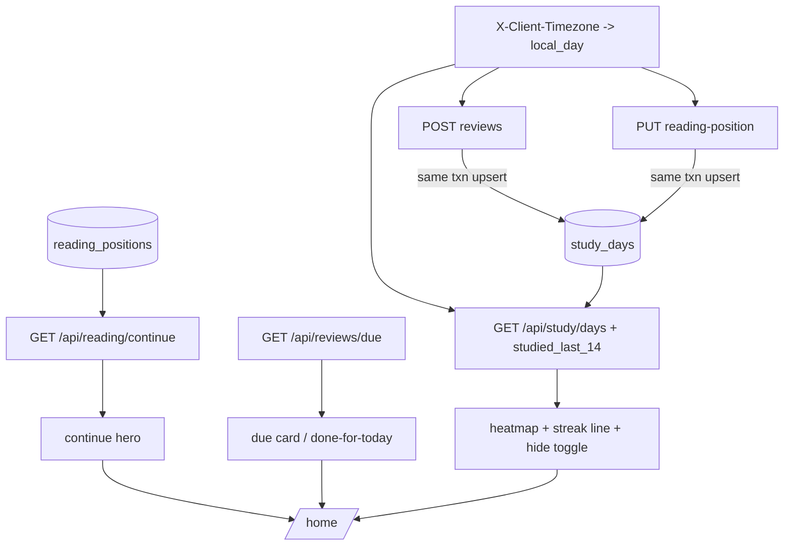

# v4-home-ia Design

**Spec**: `.specs/features/v4-home-ia/spec.md`
**Status**: Approved (auto, ship-cycle autonomy contract)
**Binding**: RFC-004 Cycle E (gamification hard cap; streak computed at read time, never stored); ADR-027 identity; AD-147 (no preferences table); AD-149 (quiz ownership on `user_id`); D-1..D-9 in `context.md` (AD-150..156). Paths `backend/`-relative unless prefixed `frontend/`.

## Architecture Overview

Two small backend additions feeding one new page, plus display-level IA changes:

1. **`study_days` rollup** — one table keyed `(user_id, day)` with per-kind counters, written by an atomic upsert-increment inside the transactions of the two existing activity writes (`SubmitReview`, `SaveReadingPosition`). Day boundary = user-local date from a validated `X-Client-Timezone` header, silent UTC fallback. Read side computes `studied_last_14` and returns the window — nothing derived is stored.
2. **Continue-reading query** — `most_recent_for_user` over `reading_positions` joined to owned sources; chapter title resolved from the stored anchor against the source's chapter index (reuse of the Cycle B locate helpers).
3. **Home + IA** — new `(app)/home` route composing the hero (continue endpoint), due card (existing `GET /api/reviews/due`), and the stats block (study endpoint + localStorage hide toggle); sidebar collapses to four items; `/sources` re-presents as Bookshelf; landing stub becomes an identity-styled minimal page.

## Components & Contracts

### Backend

| Component | Contract |
| --- | --- |
| Migration `0015_study_days` | `study_days(user_id UUID NOT NULL FK users ON DELETE CASCADE, day DATE NOT NULL, reviews_count INT NOT NULL DEFAULT 0, reading_updates INT NOT NULL DEFAULT 0, PRIMARY KEY (user_id, day))`. Downgrade drops the table. |
| `domain/entities.py` `StudyDay` | frozen entity: `user_id, day, reviews_count, reading_updates` |
| `SqlAlchemyStudyDayRepository` | `record(user_id, day, *, reviews=0, reading_updates=0)` — single `INSERT .. ON CONFLICT (user_id, day) DO UPDATE` counter increment (concurrency-safe by construction); `window(user_id, *, start, end) -> list[StudyDay]` ordered by day |
| `SqlAlchemyReadingPositionRepository.most_recent_for_user(user_id)` | latest position by `updated_at` joined to the owning source (title); user-scoped in SQL; returns `None` when no positions |
| `application/study.py` | `local_day(now, tz_name) -> date` pure helper (zoneinfo validate, invalid/None → UTC date — never raises); `GetStudySummary(user, window, tz)` → window rows + `studied_last_14` (count of distinct days with any activity in the 14-day window ending local today); `ContinueReading(user, tz?)` → hero shape or None, chapter title via the source's chapter index + existing locate logic (`application/reading.py:54/:72`) |
| `SubmitReview` / `SaveReadingPosition` | gain a `StudyDayRepository` + `client_tz` input; call `record(...)` inside their existing transaction. Existing behavior (FSRS advance, percent computation) byte-untouched otherwise |
| `web/study.py` router | `GET /api/study/days?window=` (default 84, min 7 / max 365 else 422) and `GET /api/reading/continue`; both session-authenticated, read `X-Client-Timezone`; registered in `main.py` |
| `web/quiz.py` / `web/sources.py` | pass the tz header through to the modified services; API bodies unchanged (additive header only) |

### Frontend

| Component | Contract |
| --- | --- |
| `app/lib/study.ts` | `clientTimezone()` (Intl resolvedOptions, safe fallback undefined), `getContinueReading()`, `getStudyDays(window?)` — typed views, existing error-mapper pattern |
| `app/lib/reading.ts` / `app/lib/quiz.ts` | `saveReadingPosition` and the review-submission client attach `X-Client-Timezone` |
| `app/(app)/home/page.tsx` + `app/components/home-screen.tsx` | two-card layout: `ContinueHero` (data/empty states) + `DueCard` (count / done-for-today, no celebratory UI); stats block below the fold |
| `StudyHeatmap` + streak line | week-aligned grid from `getStudyDays(84)`; empty cells plain (silent grace); intensity from activity totals via existing chart tokens; line: "Studied X of the last 14 days" |
| `use-home-settings.ts` | localStorage `learny.home.v1` `{ showStats: boolean }` default true, following `use-reading-settings` shape |
| `app-sidebar.tsx` | menu = Home, Bookshelf (`/sources`), Review, Notes; per-source Library group and its fetch removed; brand link → `/home` |
| `login/page.tsx`, `register` path | `onAuthenticated` → `router.push("/home")` |
| `sources/page.tsx` + `library-screen.tsx` | Bookshelf presentation (title + shelf-like grid of books); route unchanged |
| `app/page.tsx` landing | identity-styled: name, one-line value prop, Log in / Create account CTAs |

## Code Reuse Analysis

| Existing | Reused for |
| --- | --- |
| `reading_positions` + `ReadChapter` resume path (`application/reading.py:145`) | hero resume needs no new reader behavior — `/sources/{id}/read` already restores |
| `partition`/`locate` + chapter index (`application/reading.py:54,:72`) | chapter-title resolution in `ContinueReading` |
| `GET /api/reviews/due` `total_due` (`web/quiz.py:366`) | due card, unmodified (D-9) |
| `use-reading-settings.ts` localStorage pattern | `use-home-settings` |
| `chart-1..5` tokens (`app/globals.css:19-23`), Iron Gall tokens | heatmap shading, landing styling |
| shadcn `card`, `skeleton`, sidebar primitives | Home cards, nav |

## Invariants (each requires a sensor)

- I-1: A review submission and its study-day credit commit atomically — if the review write fails, no study-day row appears (and vice-versa). (HOME-07/08)
- I-2: N same-day events → exactly one `(user_id, day)` row, counters exact, including under concurrent commits. (HOME-10)
- I-3: Invalid or absent timezone header degrades to UTC silently — never a 4xx/5xx, never a skipped rollup. (HOME-09)
- I-4: No streak/adherence value is ever persisted; `studied_last_14` is recomputed per request. (HOME-11/12)
- I-5: Study and continue reads are user-scoped in SQL — another user's rows are unreachable, not filtered post-hoc. (HOME-04/15)
- I-6: Existing review/reading API responses stay byte-identical for clients that don't send the new header.
- I-7: No XP/badge/popup/notification affordance anywhere in the new surfaces (gamification cap).

## Error Handling

| Case | Behavior |
| --- | --- |
| `window` out of [7, 365] | 422 (FastAPI validation) |
| Bad tz header | UTC fallback (I-3) |
| No reading positions | `/api/reading/continue` 200 empty shape → hero empty state |
| Deleted most-recent source | positions cascade with source; query returns next or empty — no dangling render |
| Stats fetch failure on Home | stats block renders a quiet inline error; hero/due card unaffected (independent fetches) |

## Phase Mapping (→ tasks.md)

- **Phase A (backend)**: migration + entity + repos; rollup hooks + tz helper; endpoints. HOME-01 (API half), 04, 07–11 (API half), 15.
- **Phase B (frontend Home core)**: clients + tz header injection; `/home` hero + due card; entry redirects. HOME-01–06 (UI half), 17.
- **Phase C (frontend stats)**: heatmap + streak + hide toggle. HOME-12–14.
- **Phase D (frontend IA)**: nav collapse + bookshelf + landing. HOME-16, 18–20.
