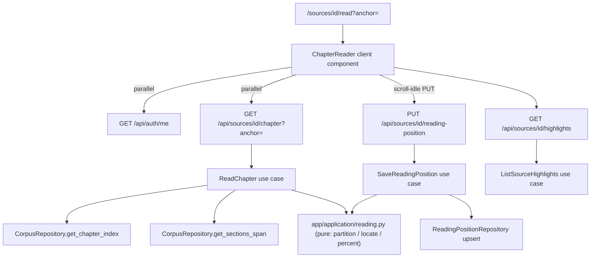

# v4-reader-core Design

**Spec**: `.specs/features/v4-reader-core/spec.md`
**Context**: `.specs/features/v4-reader-core/context.md` (D-1..D-8 locked, AD-121..128)
**Status**: Approved (auto-decision mode; approaches weighed in context.md D-2/D-8)

---

## Architecture Overview

Approach (recommended over client-composed N-fetches and an RSC rewrite — both rejected in context D-2/D-8): the server aggregates one chapter per request through a new `ReadChapter` use case mirroring `ReadSection`'s ownership semantics; the client renders the chapter as one flow and owns all reading-surface state (settings, scroll, TOC, painting). Chapter/percent math is pure application code over a new lightweight index read model — SQL stays flat, no recursive queries (matches the structure endpoint's philosophy).



## Code Reuse Analysis

| Component | Location | How to Use |
| --- | --- | --- |
| `authorized_source` + `AuthorizeOwnership` | `backend/app/application/ingestion.py` | Same ownership-first, 404-collapse pattern for all three new use cases |
| `ReadSection`/`ReadSourceStructure` shape | `backend/app/application/corpus.py:186-253` | Template for `ReadChapter`; `ReadSection` and `/section` route stay untouched (citations) |
| Anchor/alias matching semantics | `repositories.py:492-518` (`get_section`) | Mirror in pure `locate()`: canonical match beats alias, position breaks ties |
| Dependency providers pattern | `web/dependencies.py` (`get_read_section:332`) | Add `get_read_chapter`, `get_save_reading_position`, `get_list_source_highlights` |
| CSRF/auth on mutating routes | notes routes (`web/notes.py`) | PUT reading-position uses the same dependency stack |
| Migration style | `migrations/versions/0010_notes_schema.py` | Hand-written `0011_reader_progress.py`, linear chain |
| `MessageResponse` (memoized Streamdown) | `components/ai-elements/message.tsx:326` | Renders each section's markdown in the flow |
| `?anchor=` deep-link + transient highlight | `section-reader.tsx:188-192` | Generalized to section wrappers + heading fragments inside the flow |
| Capture popover + `deriveCaptureSelection` | `components/notes/capture-popover.tsx` | Ported into the flow untouched (pure seam keyed on per-section markdown) |
| `flattenSections` / `fetchSourceStructure` | `lib/tree.ts:21`, `lib/sources.ts` | TOC panel data |
| `next-themes` | `theme-provider.tsx`, `auth-header.tsx:67` | Theme axis of the Aa popover |
| Paper layer + `--highlight-*` tokens | `globals.css:145`, `@theme` block | Aa appearance axis; highlight marks |
| `theme-tokens.test.ts` helpers | `frontend/tests/theme-tokens.test.ts` | Extend pins for changed `.prose-reading` declarations (AD-118) |
| fetchImpl-injected client + jsdom `routedFetch` test idioms | `lib/sections.ts`, `tests/*` | All new clients/components follow them (AD-071) |

## Components

### Backend

**Migration `0011_reader_progress`** — `backend/migrations/versions/0011_reader_progress.py`
- `corpus_sections.word_count INTEGER` added nullable → SQL backfill `array_length(regexp_split_to_array(trim(markdown), '\s+'), 1)` with empty/blank→0 → `ALTER ... SET NOT NULL, DEFAULT 0` dropped after (match house style of 0010).
- `reading_positions`: `user_id UUID FK users ON DELETE CASCADE`, `source_id UUID FK sources ON DELETE CASCADE`, PK `(user_id, source_id)`, `anchor TEXT NOT NULL`, `percent NUMERIC(5,2) NOT NULL`, `updated_at TIMESTAMPTZ NOT NULL`. Mirrored in `db/metadata.py`.

**Word counts at build** — `BuildCorpus` (`application/corpus.py:120-147`): `CorpusSectionRecord` gains `word_count: int` = `len(markdown.split())` (whitespace-token count of the derived section markdown — spec RD-14's definition); `repositories.replace` persists it.

**Pure reading module** — `backend/app/application/reading.py`
- `WORDS_PER_MINUTE = 220` (AD-126; exported for the view/docs, client mirrors it).
- `partition(index) -> tuple[Chapter, ...]` — `Chapter(start: int, end: int)` half-open over index rows; new chapter at every `depth == 0` row; a book starting at depth>0 still opens a chapter at row 0.
- `locate(index, anchor) -> int | None` — canonical-first then alias, position order (mirror of `get_section` SQL).
- `percent_at(index, row_idx) -> Decimal` — `sum(word_count of rows[:row_idx]) / total * 100`, quantized 2dp; total 0 → 0 (RD-16).

**Entities** — `domain/entities.py`: `ChapterIndexRow(position, depth, title, section_path, anchor, anchor_aliases, word_count)`; `ChapterSection(anchor, title, section_path, markdown, word_count)`; `ChapterContent(chapter_title, chapter_anchor, chapter_index, chapter_count, prev_anchor, next_anchor, words_before_chapter, chapter_word_count, total_word_count, sections)`; `ReadingPosition(anchor, percent, updated_at)`.

**Ports** — `domain/ports.py`: `CorpusRepository` gains `get_chapter_index(source_id) -> tuple[ChapterIndexRow, ...] | None` (None = no corpus) and `get_sections_span(source_id, first_position, last_position) -> tuple[ChapterSection, ...]`; new `ReadingPositionRepository(get(user_id, source_id) -> ReadingPosition | None; upsert(user_id, source_id, *, anchor, percent, updated_at) -> ReadingPosition)` (PG `INSERT ... ON CONFLICT DO UPDATE` — RD-12 last-write-wins); `NoteRepository` gains `anchors_for_source(user_id, source_id) -> tuple[SourceHighlight, ...]` (`SourceHighlight(note_id, anchor, quote_exact, quote_prefix, quote_suffix, status)`).

**Use cases** — `application/reading.py` (same module as the pure core):
- `ReadChapter(user, source_id, anchor: str | None) -> tuple[ChapterContent, ReadingPosition | None]`: ownership → index (`None`/empty → `CorpusNotFound`) → target row = `locate(anchor)` (miss → `CorpusNotFound`) or, when `anchor is None`, stored position's row (unresolvable/absent → row 0, stored row untouched — spec edge) → chapter bounds → `get_sections_span` → assemble. Always returns the stored position (or None) for the reader's percent display.
- `SaveReadingPosition(user, source_id, anchor) -> ReadingPosition`: ownership → locate (miss → `CorpusNotFound` → 404, RD-09) → percent = `percent_at` → upsert with the **canonical** anchor of the matched row (alias writes store canonical) → return view.
- `ListSourceHighlights(user, source_id) -> tuple[SourceHighlight, ...]`: ownership → `anchors_for_source`.

**Web** — `web/sources.py`: `GET /api/sources/{id}/chapter` (optional `anchor` query) → `ChapterView` (adds `reading_position: ReadingPositionView | None`); `PUT /api/sources/{id}/reading-position` body `{anchor}` → 200 `ReadingPositionView{anchor, percent, updated_at}` (auth + CSRF/Origin like notes mutations; no rate limit, AD-124). `web/notes.py`: `GET /api/sources/{id}/highlights` → `list[SourceHighlightView]`. All 404 mapping identical to `/section`.

### Frontend

**`lib/reading.ts`** — `getChapter(sourceId, anchor | null, fetchImpl) -> ChapterResult` (`{status:"found", chapter} | {status:"not_found"}`; throws on other non-OK — mirror `sections.ts`), `saveReadingPosition(sourceId, anchor, csrf, fetchImpl)`, `listHighlights(sourceId, fetchImpl)`, `minutesLeft(words, wpm=220)`.

**`components/chapter-reader.tsx`** — replaces `section-reader.tsx` (deleted; `read/page.tsx` renders `ChapterReader`). Orchestration: `?anchor=` present → parallel `fetchAuthState()` + `getChapter(id, anchor)`; absent → parallel `fetchAuthState()` + `getChapter(id, null)` (server resumes — still one content round-trip, RD-26). States: `loading (skeleton) | signed-out | not-found | error | found`. Found renders:
- `ReaderTopBar` — sticky; chapter title (RD-05), book percent + chapter minutes-left (live), Aa trigger, TOC toggle; recedes on downward scroll via `useRecedingChrome` (transform, `motion-reduce:transition-none`), ink-line stays.
- `InkLine` — hairline rule + `width: percent%` fill from identity tokens (reuses Cycle A rule utilities if present; no raw hexes — the no-hex-leak scan stays green).
- `ChapterFlow` — `.prose-reading` article; per section: wrapper `<section id={anchor} data-section-anchor>` + heading + memoized `MessageResponse(markdown)`; capture popover wiring ported here (mouseup → containing wrapper → that section's markdown → `deriveCaptureSelection` unchanged).
- Deep-link effect: scroll to section wrapper (or heading fragment within it, reusing the existing fragment/`data-highlight` transient treatment) once per anchor change.
- `ChapterNav` — prev/next links (`router.push` with the adjacent chapter anchor); hidden at edges (RD-06).
- `TocPanel` — structure via `fetchSourceStructure` + `flattenSections`; current chapter/section marked from scroll state (RD-22); click → same-chapter smooth scroll or cross-chapter push, URL `?anchor=` always updated via `router.replace/push` (RD-23); ≥lg persistent side panel, below lg collapsed behind the toggle (RD-25).
- `ReturnChip` — set on TOC/citation jumps away from a live position; one-click return; dismissed on use or after scrolling past a threshold in the new spot (RD-24).

**Hooks**
- `useReadingSettings` — `localStorage["learny.reading.v1"]` `{size: 17|19|21|23, leading: 1.5|1.6|1.8, appearance: "default"|"paper", }` (theme lives in next-themes); returns values + setters; applies `--reading-size`/`--reading-leading` inline vars and `data-appearance` on the reader container; in-memory fallback when storage throws (spec edge); values outside the enum clamp to defaults.
- `useScrollPosition` — IntersectionObserver over `[data-section-anchor]` wrappers → topmost visible section; exposes `{currentAnchor, liveWordsRead}`; scroll-idle (2 s) + changed-anchor → `saveReadingPosition` fire-and-forget with silent retry next idle (RD-07/13). Observer injectable for jsdom tests.
- `useRecedingChrome` — scroll direction + threshold → `hidden` boolean.

**Aa popover** — `components/reading-controls.tsx`: popover (existing vendored shadcn Popover) with size steps (17/19/21/23 px), spacing (1.5/1.6/1.8), appearance (Default/Paper — always visible, note under dark: "Dark reading uses the night palette", RD-20), theme (Light/Dark/System via `useTheme`).

**Highlight painting** — `lib/highlight-paint.ts`: pure `findQuoteOffset(haystack, quote, prefix, suffix) -> number | null` (all occurrences; single → it; multiple → prefix/suffix filter; still ambiguous or zero → null); `paintHighlights(sectionEl, highlights)` — TreeWalker over text nodes, map offsets → node ranges, wrap slices in `<mark class="reader-highlight" data-note-id>`; idempotent (unwraps existing marks first); active-status only (RD-29). Effect in `ChapterFlow` after markdown render, keyed on (markdown, highlights).

**CSS (`globals.css`)** — `.prose-reading` `font-size: var(--reading-size, 19px); line-height: var(--reading-leading, 1.6)` (pinned test updated to the var forms — AD-118 gate evolves with the spec); `.reader-highlight` mark on `--highlight-yellow` tokens; ink-line fill utility from existing rule tokens.

## Data Models

```typescript
interface ChapterView {
  chapter_title: string; chapter_anchor: string;
  chapter_index: number; chapter_count: number;          // 0-based index, total
  prev_anchor: string | null; next_anchor: string | null;
  words_before_chapter: number; chapter_word_count: number; total_word_count: number;
  sections: { anchor: string; title: string; section_path: string[]; markdown: string; word_count: number }[];
  reading_position: { anchor: string; percent: number; updated_at: string } | null;
}
interface SourceHighlightView {
  note_id: string; anchor: string; quote_exact: string;
  quote_prefix: string; quote_suffix: string; status: "active" | "stale" | "orphaned";
}
```

Live client math: `percent = (words_before_chapter + wordsAboveViewportInChapter) / total_word_count * 100`; `minutesLeft = ceil((chapter_word_count - wordsReadInChapter) / 220)`.

## Error Handling Strategy

| Error Scenario | Handling | User Impact |
| --- | --- | --- |
| Chapter anchor unresolvable / non-owner / no corpus | `CorpusNotFound`/`SourceNotFound` → 404 (existing mapping) | "Not found" reader state |
| No `?anchor=`, stored position unresolvable | Fall back to first chapter; stored row untouched | Book opens at start |
| PUT position with bad anchor | 404, nothing stored (RD-09) | None (silent; client retries next idle) |
| Position write network failure | Fire-and-forget; retry next scroll-idle (RD-13) | None |
| Highlight quote not found / ambiguous | No paint, no error (RD-29) | Highlight visible on Notes screen only |
| localStorage unavailable | In-memory settings for the session | Settings don't persist |
| Content fetch 401 | Same login redirect as today (RD-27) | Unchanged |

## Risks & Concerns

| Concern | Location | Impact | Mitigation |
| --- | --- | --- | --- |
| Full-chapter Streamdown render cost (RFC assumption) | `chapter-reader.tsx` | Jank on huge chapters | Per-section memoized components (static content, render once); verify with largest fixture; virtualization only if broken (in-cycle, per RFC) |
| DOM marks inserted outside React's knowledge | `highlight-paint.ts` | React reconciliation could drop/duplicate marks | Paint only inside memoized, content-stable section subtrees; painter is idempotent (unwrap-first); repaint effect keyed on content |
| Reader rewrite touches v3-E capture flow | `capture-popover.tsx` wiring | Regression in shipped capture | `deriveCaptureSelection` pure seam untouched; capture tests ported to the flow and kept green |
| `.prose-reading` pins from Cycle A change shape | `tests/theme-tokens.test.ts` (+ pin test) | Gate fails or silently weakens | Update pins to the `var(--reading-size, 19px)` forms in the same commit as the CSS change — assert fallback values explicitly |
| IntersectionObserver absent in jsdom | new hooks' tests | Untestable scroll logic | Injectable observer factory; tests drive callbacks directly |
| Backfill vs build-time count drift | migration vs `BuildCorpus` | Percent inconsistencies across corpora | Same definition both sides (whitespace-token count of markdown); migration test asserts equality on a fixture |
| `sources.py` router accretes reader routes | `web/sources.py` | File bloat | Acceptable this cycle (structure/section precedent); Cycle C may split a reader router |

## Tech Decisions (feature-local; project-level ones live in context.md → STATE AD-121..128)

| Decision | Choice | Rationale |
| --- | --- | --- |
| Resume round-trip | `GET /chapter` without `anchor` resumes server-side (position → chapter in one response); no standalone GET reading-position route — PUT returns the view and chapter embeds it | One round-trip resume; fewer routes; Cycle E will want a cross-source listing anyway (refines AD-124's API shape) |
| Stored anchor form | Canonical anchor of the located row (alias input normalized on write) | Survives renormalization; matches citation round-trip semantics |
| Chapter math placement | Pure functions in `application/reading.py`, thin SQL read models | Unit-testable without DB; repos stay flat SQL (structure-endpoint precedent) |
| Percent type | `NUMERIC(5,2)`, server-quantized | Trustworthy for Home; no float drift |
| Settings key | `learny.reading.v1` versioned JSON | Cheap forward migration |
| Highlight color | Single `--highlight-yellow` for all marks this cycle | Anchors carry no color; palette choice is Cycle D territory |

## Test-Coverage Matrix (verifier input)

| Requirement | Test level | Where |
| --- | --- | --- |
| RD-01/02 chapter endpoint shape, ownership, aliases, edges | API (pytest) | `backend/tests/test_web_reading.py` |
| RD-08/09/12 position upsert/404/last-write-wins | API + repo | same + `test_application_reading.py` |
| RD-10 resume + unresolvable fallback | use case (fakes) | `test_application_reading.py` |
| RD-14/15/16 word counts build/backfill/zero | build test + migration test | `test_application_corpus.py`, `test_migrations.py` |
| Chapter partition/locate/percent purity | unit | `test_reading_pure.py` |
| RD-03..06 flow render, DOM ids, deep-link scroll, sticky, prev/next | jsdom | `frontend/tests/chapter-reader.test.tsx` |
| RD-07/11/13 idle write, live percent/minutes, silent retry | jsdom (injected observer/timers) | `chapter-reader.test.tsx` / hook test |
| RD-17..21 Aa controls, vars, Paper, dark override, persistence | jsdom + CSS pins | `reading-controls.test.tsx`, `theme-tokens.test.ts` |
| RD-22..25 TOC context/nav/return/collapse | jsdom | `toc-panel.test.tsx` |
| RD-26/27 parallel fetch + 401 + skeleton | jsdom (fetch-order assertion) | `chapter-reader.test.tsx` |
| RD-28/29 highlights endpoint + paint/disambiguation/silent-miss | API + pure unit + jsdom | `test_web_notes.py`, `highlight-paint.test.ts` |
| RD-30/31 ink-line fill + receding chrome + reduced motion | jsdom + CSS pin | `chapter-reader.test.tsx`, `theme-tokens.test.ts` |
| Capture-in-flow regression | jsdom | ported capture tests |
