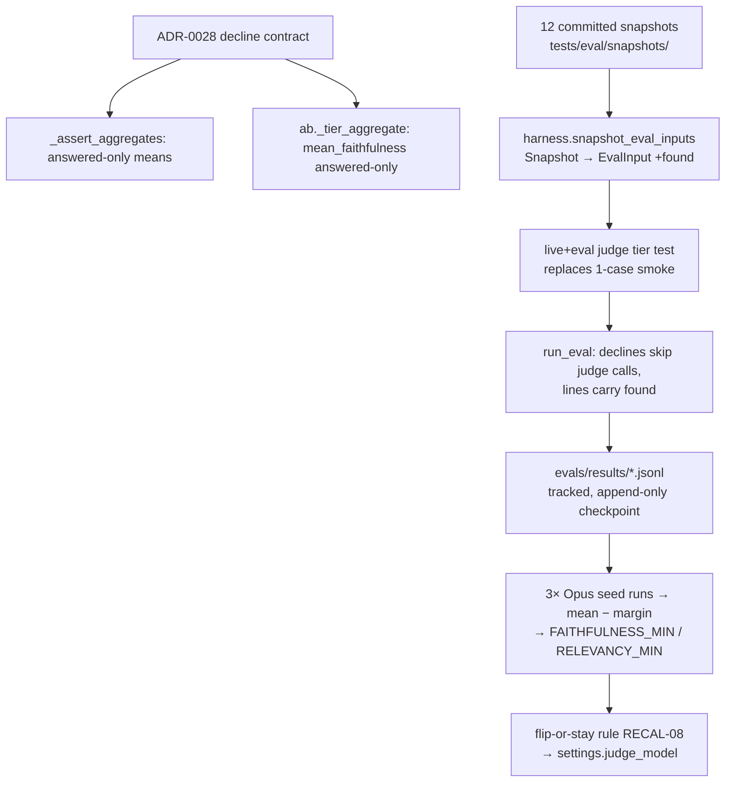

# v5-opus-judge-recalibration Design

**Spec**: `.specs/features/v5-opus-judge-recalibration/spec.md`
**Status**: Approved (ship-cycle auto-decision protocol; approach alternatives recorded in context.md AD-225..AD-230)

---

## Architecture Overview

No new components — the cycle re-contracts an existing seam and then exercises it live:

Ordering is contractual: ADR-0028 commits before any semantics change; semantics + tier commit before any paid run; constants + config flip commit together (RECAL-07).

## Code Reuse Analysis

| Component | Location | How to Use |
|---|---|---|
| `EvalInput`, `run_eval`, `_assert_aggregates` | `backend/app/eval/judge.py:153,303,404` | Extend in place — no new module |
| Vacuous-1.0 convention | `judge.py:116-126` (`FaithfulnessResult.supported_ratio`) | Untouched; ADR-0028 documents it as the per-case (not aggregate) convention |
| `_tier_aggregate`, `_mean` (None-on-empty) | `backend/app/eval/ab.py:128,120` | `_mean`'s None-on-empty is the precedent for the gate's skip-on-all-declined |
| `load_snapshots`, `Snapshot` | `backend/tests/eval/harness.py:119,87` | Source of the widened tier; add `snapshot_eval_inputs()` beside them |
| Citation-validity rule for snapshots | `backend/tests/test_generation_invariants.py` (cited ⊆ evidence chunk ids) | Reuse the same containment rule in the mapping helper |
| Live smoke pattern (skipif, real results dir) | `backend/tests/test_eval_judge.py:320-351` | The widened tier test keeps its markers, skip guard, and results-dir behavior |
| Derivation rule + budget protocol | `docs/ops/eval-calibration.md:127-128,143-165` | Followed verbatim; runbook itself updated where the tier/commands change |

## Components

### ADR-0028 (`docs/adr/0028-decline-answers-in-judge-aggregates.md`)
- **Purpose**: One convention for declined answers across all judge aggregates.
- **Content**: answered-only means (faithfulness + relevancy) in nightly gate and A/B study; per-case vacuous-1.0 retained at `FaithfulnessResult`; not-found discipline is the decline-carrying metric (study-level; gate adoption deferred until the nightly tier includes live generation); all-declined runs skip threshold asserts, citation invariant remains. Records the Opus-0.0 observation that forced the contract.

### `judge.py` semantics (RECAL-02/03)
- `EvalInput` gains `found: bool = True` (frozen dataclass, defaulted → all existing constructors valid).
- `run_eval`: for `found=False` inputs, skip both judge calls; line gets `"faithfulness": None, "relevancy": None`; every line gains `"found"`. Docstring schema updated.
- `_assert_aggregates`: `answered = [l for l in lines if l.get("found", True)]`; means over `answered` only; when `answered` is empty, skip both threshold asserts; `citation_valid` asserted over all lines (unchanged).

### `ab.py` unification (RECAL-04)
- `mean_faithfulness` moves from all-scored-lines to `answered` (the list already computed at ab.py:130). Docstrings/contract comments updated. `citation_valid_rate` stays all-lines. Declining lines with `None` scores are naturally excluded (they're outside `answered`).

### Widened live tier (RECAL-05)
- `harness.snapshot_eval_inputs(snapshots) -> list[EvalInput]`: question, evidence_text = `"\n\n".join(snippets)`, answer_text, `found` from `answer.found`, `citation_valid` = cited ⊆ evidence chunk ids, `generation_model` from snapshot. Pure, offline-testable.
- `test_live_judge_scores_replay_snapshots` replaces `test_live_judge_scores_one_case`: same `live`+`eval` markers + skipif + real results dir; builds inputs from `load_snapshots()`, runs `run_eval` with `settings.eval_max_cases`; asserts 12 lines, 3 declines carry nulls, answered scores in range.
- New offline unit tests: mapping correctness incl. the 3 `notfound-*` cases → `found=False`.

## Error Handling Strategy

| Error Scenario | Handling | Impact |
|---|---|---|
| All lines declined in a gated run | Threshold asserts skip (no mean exists); citation invariant still runs | Gate cannot false-fail on a decline-only tier; documented in ADR-0028 |
| Seed run dies mid-pass | Append-only JSONL preserves completed cases; rerun; partial runs excluded from derivation and noted in the research doc | Runbook protocol step 2/3 |
| `prompt_hash` ≠ runbook-pinned value at seed time | Abort derivation (rubric drifted) | Spec edge case; checked before run 1 |
| Key absent | Live tier skips exactly as the old smoke did | CI offline stays green |

## Risks & Concerns

| Concern | Location | Impact | Mitigation |
|---|---|---|---|
| `test_ab.py` (28 tests) encodes decline-inclusive faithfulness expectations | `backend/tests/eval/test_ab.py` | Semantics change breaks them | Update expectations to ADR-0028 deliberately; never weaken assertions — each changed value re-derived by hand in the test |
| 3 seed runs append into ONE dated JSONL (`<date>-<sha>.jsonl`, append mode) | `judge.py:394-398` | Run boundaries blur | Lines carry `ts` + `judge_model`; research doc groups by timestamp gaps; runs executed sequentially |
| Bare `-m "live and eval"` also selects the paid silver runner + retrieval arm + quiz answerability | `tests/eval/test_silver.py`, others | Accidental spend beyond estimate | Seed command targets `tests/test_eval_judge.py` only; runbook step-2 command updated accordingly |
| Nightly gate currently runs with `LEARNY_EVAL_GATE=1` against constants that seed runs would trip | eval.yml | Seed runs failing spuriously | Seed runs use local default gate-off (report-only) — `LEARNY_EVAL_GATE` unset locally |
| Snapshots predate v6-E answer-format change (inline markers, 4096 tokens) | `tests/eval/snapshots/` | Baselines understate live answers | Accepted (AD-228); runbook gains an explicit staleness flag → re-record is the follow-up trigger |

## Tech Decisions (feature-local; project-level ones live in context.md AD-225..230)

| Decision | Choice | Rationale |
|---|---|---|
| Evidence text join for snapshot inputs | `"\n\n".join(snippet for each evidence item)` | Mirrors what the judge prompt expects (plain evidence block); deterministic |
| Mapping helper location | `tests/eval/harness.py` | Test-side code consuming test-side snapshots; keeps app/eval free of test imports |
| Seed-run judge selection | `LEARNY_JUDGE_MODEL=claude-opus-4-8` env override | Config flip only after the decision (RECAL-08); settings already env-driven |
| Old smoke test | Replaced, not kept alongside | Its case is subsumed by the tides snapshots; two live entrypoints = drift surface |

## Phase Plan (feeds tasks.md)

- **Phase 1 (offline, no keys):** ADR-0028 → judge.py semantics → ab.py unification → widened tier + mapping. Full offline suite green at phase end.
- **Phase 2 (keyed, ≤$10):** pre-flight estimate + prompt_hash check → 3× Opus seed runs → derivation + constants + runbook → flip-or-stay + config + research doc + ROADMAP/RFC rows.
- **Verifier:** fresh subagent, evidence-or-zero, after the last commit.
