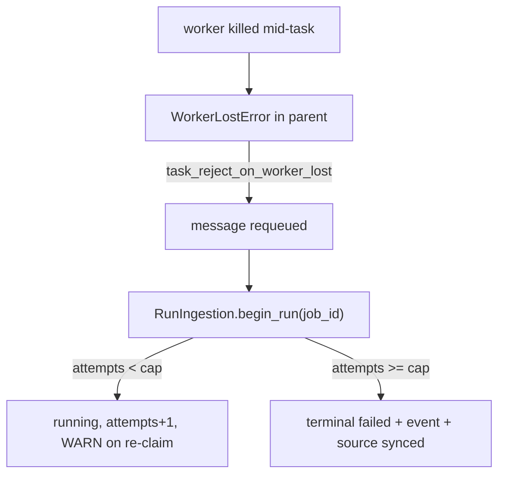

# v5-worker-recovery-hardening Design

**Spec**: `.specs/features/v5-worker-recovery-hardening/spec.md`
**Context**: `.specs/features/v5-worker-recovery-hardening/context.md`
**Status**: Approved (ship-cycle auto-decision)

---

## Architecture Overview

Two independent hardening paths sharing one cycle.

**Worker path** — a lost worker today leaves `ingestion_jobs.status = running` with nothing behind it. Rejection turns that into a redelivery; the durable attempts cap turns an endless redelivery into a terminal failure.

**Recovery path** — `db` archives completed WAL segments to a shared volume; the existing `backup` sidecar ships and prunes them alongside a weekly physical base backup. Restore replays the archive onto a base up to a target timestamp.

```mermaid
graph TD
    DB[(db: archive_mode=on)] -->|archive_command cp| V[/wal_archive volume/]
    S[backup sidecar] -->|weekly| BB[pg_basebackup archive]
    V --> S
    BB --> S
    S -->|when configured| O[(offsite bucket)]
    BB --> RS[restore-pitr: base + replay to target]
    V --> RS
```

---

## Code Reuse Analysis

### Existing Components to Leverage

| Component | Location | How to Use |
|---|---|---|
| Celery config block | `backend/app/worker/celery_app.py:29-41` | Add one key; pin the block with a test |
| `RunIngestion.begin_run` | `backend/app/application/ingestion.py:174-188` | Extend with the cap branch — the single claim seam every ingestion path already crosses |
| `IngestionJob.failed()` / `_append_event` | `backend/app/domain/entities.py:183`, `application/ingestion.py:231` | Reuse verbatim for cap-triggered termination; no new terminal vocabulary |
| `_STEP_FAILURE_ERROR` convention | `backend/app/worker/tasks.py:76` | The durable field stays a fixed non-secret summary |
| Backup image + entrypoint | `deploy/backup/{Dockerfile,entrypoint.sh}` | `entrypoint.sh` already execs any non-`crond` argv, so new jobs need no entrypoint change |
| `backup.sh` offsite gate + prune idioms | `deploy/backup/backup.sh:58-88` | Same four-var gate, same "newest exempt", same `mc` alias setup |
| `restore.sh` `--yes` discipline | `deploy/backup/restore.sh:30` | Mirror for the point-in-time restore |
| CI restore drill | `.github/workflows/ci.yml:139-196` (`compose-smoke`) | The PITR drill is a sibling of this proven shape |
| Structural compose/backup pins | `backend/tests/test_backup_stack.py`, `test_compose_topology.py`, `test_compose_prod.py` | Extend; no new test files for structure |

### Integration Points

| System | Integration Method |
|---|---|
| Deploy image matrix | `.github/workflows/deploy.yml` gains the postgres image (precedent: `learny-backup` was added the same way) |
| Monitoring | The re-claim WARNING and archive failures land in the structured log stream Netdata already collects (ADR-0024) |
| Secrets | New values reuse `secrets/db.env` / `secrets/backup.env`; `.env.production.example` documents them |

---

## Components

### Attempts cap in the claim seam

- **Purpose**: make `task_reject_on_worker_lost` safe by terminating a job that keeps killing its worker.
- **Location**: `backend/app/application/ingestion.py` (`RunIngestion.begin_run`), settings in `backend/app/core/config.py`.
- **Behavior**: on claim, if the job's `attempts` have reached the cap, transition to terminal `failed` (fixed error text), append the `failed` event, sync source status, and return `None` — which the task already treats as a no-op, so no task-side change is needed for the terminal path. Otherwise proceed as today.
- **Dependencies**: `IngestionJobRepository`, `SourceRepository`, `IngestionEventRepository`, clock — all already injected.
- **Reuses**: the existing `fail` path's exact transitions.

> **Invariant**: the cap branch and the normal branch must both leave the job's status, source status, and event trail mutually consistent — `begin_run` returning `None` must never mean "silently did nothing" when the cap fired.

### WAL archiving substrate

- **Purpose**: continuously capture completed WAL segments outside the data volume.
- **Location**: new `deploy/postgres/Dockerfile`; `docker-compose.yml` `db` service (`command`, volume); `docker-compose.prod.yml` image pin.
- **Behavior**: `archive_mode=on`, an `archive_command` that refuses to overwrite an existing segment, a bounded `archive_timeout`. The image creates the archive directory owned by the database user so a fresh named volume inherits writable ownership.

> **Invariant**: a failing `archive_command` must retain the segment (PostgreSQL's own behavior) — WAL is never silently discarded.

### Base backup + WAL shipping job

- **Purpose**: produce the physical base every replay starts from, and move both artifact families offsite.
- **Location**: `deploy/backup/` (new job script + wrapper, mirroring `backup.sh` / `backup-now`).
- **Behavior**: temp-then-rename, the same four-variable offsite gate, newest-exempt pruning, lock-guarded against the nightly dump.

> **Invariant (PITR-05)**: WAL pruning is derived from the oldest *retained base backup*, never from age alone.

### Point-in-time restore

- **Purpose**: recover to an arbitrary timestamp within the window.
- **Location**: `deploy/backup/` (new script), driven in CI from `compose-smoke`.
- **Behavior**: `--yes` required to touch anything; a target older than every retained base exits non-zero naming the earliest recoverable time.

---

## Error Handling Strategy

| Error Scenario | Handling | Operator Impact |
|---|---|---|
| Worker killed mid-task | Message requeued; job re-claimed, attempt logged at WARNING | Job completes on a later attempt |
| Job repeatedly kills its worker | Terminal `failed` at the cap | Job stops consuming worker capacity; failure visible on the source |
| WAL archive volume unwritable | PostgreSQL retains the segment and retries | Disk pressure surfaces in monitoring; no WAL loss |
| Base backup fails | Non-zero exit, no prune, prior bases intact | Retention window unchanged |
| Offsite configured but unreachable | Non-zero exit, local artifacts kept | Matches the existing convention |
| Restore target outside the window | Non-zero exit naming the earliest recoverable time, nothing modified | No half-restored data directory |

---

## Risks & Concerns

| Concern | Location | Impact | Mitigation |
|---|---|---|---|
| `self.request.retries` looks like a retry cap but does not survive worker-lost redelivery | `backend/app/worker/tasks.py:277` | Enabling rejection alone would loop forever | The cap is durable (`attempts`), not Celery-side — D-2 |
| Fresh named volume is root-owned; `archive_command` runs unprivileged | new `db` volume | Archiving fails at runtime on a clean deploy, far from its cause | Directory created in a repo-owned image — D-7; asserted by a test (PITR-02) |
| Remote replication connections may be refused by the stock image's `pg_hba` | `db` service | `pg_basebackup` fails | Verify empirically in Phase B before building on it; extend the `db` command if refused — never bake credentials |
| Reliability config is almost entirely unpinned | `backend/tests/test_worker_logging.py:19` | Silent durability regression | WRK-06 pins the block including the timeout ordering |
| Retention now spans two coupled artifact families | `deploy/backup/` | An operator pruning WAL by age breaks replay | PITR-05 encodes the rule in code; runbook states the coupling |
| `archive_mode` requires a database restart to take effect | `db` service | First deploy restarts the database | Documented in the runbook as a one-time restart |

---

## Tech Decisions (only non-obvious ones)

| Decision | Choice | Rationale |
|---|---|---|
| Cap location | Application claim seam, not the task | Only seam every ingestion path crosses; keeps Celery out of application code (ADR-007/009) |
| Cap counter | Durable `attempts` | The only counter that survives a worker-lost requeue |
| `broker_heartbeat` | Deliberately not set | AMQP-only; inert on Redis |
| Postgres image | Thin repo-owned derivative | Solves volume ownership declaratively; mirrors AD-098 |
| WAL offsite path | Via the sidecar | Keeps backup credentials out of the database container |

> Project-level decisions are recorded as AD-249..AD-257 in `.specs/project/STATE.md`.
