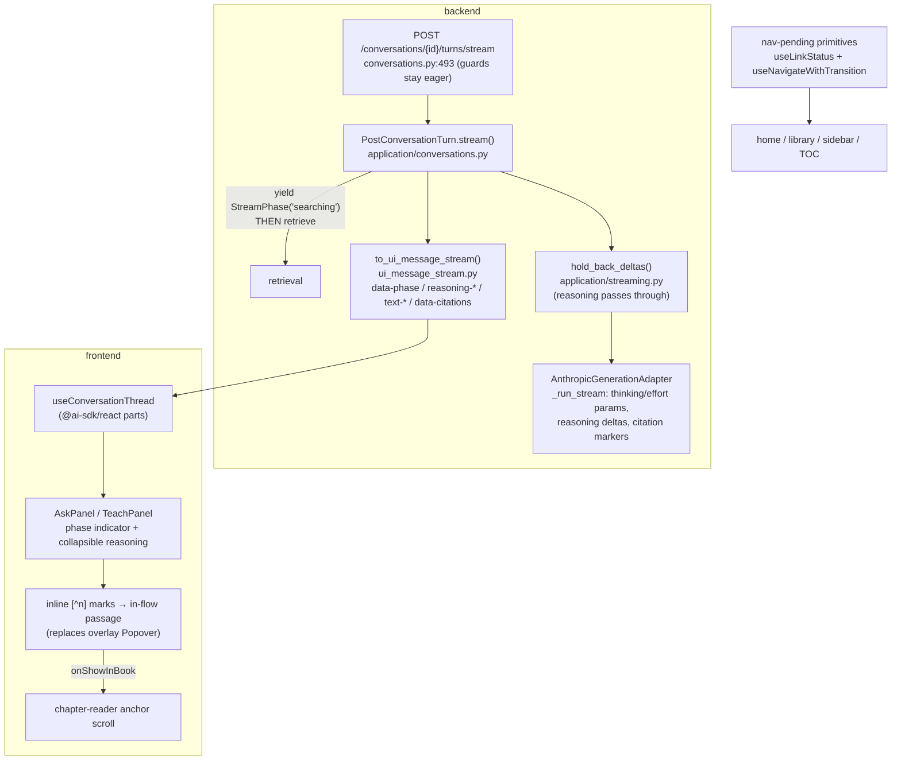

# v6-answer-experience Design

**Spec**: `.specs/features/v6-answer-experience/spec.md`
**Context**: `.specs/features/v6-answer-experience/context.md` (D-1…D-7 locked; AD-219…AD-224)
**Status**: Approved (auto-decided per ship-cycle protocol)

---

## Architecture Overview

Three flows change; the layering (ADR-0007/0009: domain ports → application services → web presenters / infra adapters) does not.

**Stream frame order (contract):** `start` → `data-phase{searching}` → (retrieval) → `reasoning-start/delta*/end`\* → `text-start/delta*/end` → `data-citations` → `data-answer-status`\* → `finish` → `[DONE]`. \*optional. Not-found: phase → `data-answer-status{not_found_in_scope}` with no reasoning/text surviving hold-back. Errors after first byte: existing `error` part at any point.

## Code Reuse Analysis

| Component | Location | How to Use |
|---|---|---|
| `AnthropicAdapterBase._run_stream` | `backend/app/infrastructure/answering/anthropic.py:200` | Extend: add `thinking`/`output_config` kwargs, map thinking deltas, insert citation markers |
| `_parse_message` / `_build_documents` | `anthropic.py:94` / `:60` | Extend `_parse_message` to insert `[^n]` markers per cited block (buffered parity); numbering already first-occurrence |
| `hold_back_deltas` | `backend/app/application/streaming.py:45` | Extend: pass `AnswerReasoningDelta` through untouched; text/sentinel logic unchanged |
| `to_ui_message_stream` / `to_sse_response` | `backend/app/infrastructure/web/ui_message_stream.py:55` | Extend part vocabulary: `data-phase`, `reasoning-start/delta/end` |
| Settings block | `backend/app/core/config.py:193-204` | Add `generation_effort` (validated literal), change `generation_max_tokens` default |
| `assistantView` / `LearnyDataParts` | `frontend/app/lib/streaming.ts:37/:54` | Extend: collect `reasoning` text + `data-phase`; type the new part |
| `useConversationThread` | `frontend/app/components/use-conversation-thread.ts` | Unchanged API; panels read new fields from `assistantView` |
| `AskPanel` / `TeachPanel` | `frontend/app/components/{ask,teach}-panel.tsx` | Render phase indicator + reasoning region; both modes (AD-208/220) |
| `CitationList` / popovers | `frontend/app/components/citations.tsx` | Rework: chips stay as fallback/inventory; overlay `Popover` deleted; in-flow passage region added |
| `Shimmer` (vendored, unused) | `frontend/components/ai-elements/shimmer.tsx:77` | "Searching the book…" / "Thinking…" labels |
| `chapter-reader` anchor scroll | `frontend/app/components/chapter-reader.tsx:447-456` | Unchanged; reached via existing `onShowInBook` |
| `Spinner` | `frontend/components/ui/spinner.tsx` | Pending indicator inside nav primitives |
| Test SSE helper pattern | `frontend/tests/teach-panel.test.tsx:69-80` | Extend frames with reasoning/phase parts |
| Fake Anthropic clients | `backend/tests/test_answering_anthropic.py` | Widen `_MessagesClient` fakes to accept/emit thinking + citation events |

### Integration Points

| System | Integration Method |
|---|---|
| Anthropic SDK (`0.116`, pinned) | New request params only — typed kwargs if accepted, else `extra_body`; **no version bump** (RFC-006 exclusion) |
| UI Message Stream v1 | Native `reasoning-*` parts + one new `data-phase` data part; header/protocol unchanged |
| Persisted turns | Unchanged schema; answer text now contains `[^n]` markers; `turnsToUIMessages` replays as-is |
| Instrumentation (Cycle A) | Untouched; effort added to `_log_call` line |

## Components

### 1. Generation settings (backend)
- **Location**: `backend/app/core/config.py`
- **Interfaces**: `generation_effort: Literal["low","medium","high","xhigh","max"] = "medium"` (`LEARNY_GENERATION_EFFORT`); `generation_max_tokens` default 1024 → 4096; factory (`infrastructure/answering/__init__.py`) threads effort into the adapter.
- **Reuses**: existing pydantic settings validation; startup rejection on bad literal.

### 2. Adapter request config + reasoning + markers (backend)
- **Location**: `backend/app/infrastructure/answering/anthropic.py`
- **Interfaces**: `AnthropicAdapterBase.__init__(..., effort: str)`; `_run_stream` emits `AnswerReasoningDelta(text)` for provider thinking deltas and inserts `[^n]` marker text deltas at citation attachment points; `_parse_message` inserts the same markers per cited block (buffered parity) and keeps first-occurrence numbering; `_log_call` gains `effort=`.
- **Traps**: `event.type == "text"` filter currently drops thinking deltas; verify which citation events SDK 0.116's high-level stream exposes — fall back to raw-event iteration / per-block insertion at block stop; `max_tokens` caps thinking+answer together; sentinel replies carry no citations → no markers.
- **Invariant**: local `DeterministicGenerationAdapter` untouched — emits no reasoning, no markers beyond what its extractive text already is.

### 3. Domain + application stream events (backend)
- **Location**: `backend/app/domain/entities.py`, `backend/app/application/streaming.py`, `backend/app/application/conversations.py`
- **Interfaces**: domain `AnswerReasoningDelta` joins `AnswerStreamEvent`; application `StreamReasoningDelta`, `StreamPhase(phase="searching")` join `TurnStreamEvent`; `PostConversationTurn.stream()` splits `_preflight` — guards + conversation load + history stay eager (HTTP errors before first byte), retrieval moves into the generator after an immediate `StreamPhase` yield.
- **Invariants**: sentinel hold-back byte-identical for text; reasoning passes through while text is held; generator close still closes the port stream; retrieval failure inside the stream → `AnswerGenerationFailed` → error part (new test).

### 4. SSE presenter (backend)
- **Location**: `backend/app/infrastructure/web/ui_message_stream.py`
- **Interfaces**: `StreamPhase` → `data-phase {"phase": "searching"}`; `StreamReasoningDelta` → `reasoning-start` (first) / `reasoning-delta` / `reasoning-end` (before `text-start` or terminal); existing parts unchanged.

### 5. Frontend stream types + panels
- **Location**: `frontend/app/lib/streaming.ts`, `app/components/{ask,teach}-panel.tsx`, new `app/components/answer-phase.tsx` (or colocated)
- **Interfaces**: `assistantView` returns `{text, citations, status, reasoning, phase}`; panel renders: phase="searching" ∧ no parts yet → Shimmer "Searching the book…"; reasoning streaming → collapsible region (open while streaming, collapses when text starts, re-expandable); empty reasoning → no region (AC4).
- **Reuses**: shadcn collapsible/`details`, `Shimmer`.

### 6. Inline marks + in-flow passage (frontend)
- **Location**: `frontend/app/components/citations.tsx`, `message.tsx` integration
- **Interfaces**: marker tokens `[^n]` in answer text render as numbered marks (pre-process or Streamdown footnote-component override — worker latitude); activating mark n or chip n expands one clamped passage region beneath the answer (snippet, breadcrumb, "Show in book" → `onShowInBook`, "Open note" for note-origin); overlay `Popover` deleted; dangling marker (no citation n) renders as plain text; `saveAnswerAsNote` strips markers.

### 7. Navigation pending primitives (frontend)
- **Location**: new `frontend/components/ui/nav-pending.tsx` (+ hook), applied in `home-screen`, `library-screen`, `shell/app-sidebar`, `toc-panel`
- **Interfaces**: `<LinkPendingIndicator/>` (child of `<Link>`, `useLinkStatus`, animation-delayed ~120ms); `useNavigateWithTransition(): {navigate, isPending}` wrapping `router.push` in `startTransition`.

## Error Handling Strategy

| Error Scenario | Handling | User Impact |
|---|---|---|
| Guard failure (auth/ownership/validation) | Unchanged — eager, HTTP status pre-stream | Existing readable messages |
| Retrieval failure (now in-stream) | `AnswerGenerationFailed` → `error` part | Same generation-failed wording as today |
| Provider error mid-thinking/mid-text | Existing error part | Error state replaces phase indicator |
| Adaptive thinking absent | No reasoning parts emitted | No reasoning region (no empty shell) |
| Sentinel (not found) | Hold-back suppresses text; phase → not-found message | Existing not-found notice; transient reasoning collapses into it |
| Marker without citation (grounding dropped) | Frontend renders token as plain text | Cosmetic only |
| Bad `LEARNY_GENERATION_EFFORT` | Settings validation fails at startup | Operator error surfaced immediately |

## Risks & Concerns

| Concern | Location | Impact | Mitigation |
|---|---|---|---|
| SDK 0.116 typed-kwarg coverage for `thinking`/`output_config`/citation stream events unverified | `anthropic.py:218` | Worker could fight types or miss events | Brief names the fallbacks (`extra_body`; raw-event iteration; per-block marker insertion); Protocol/fakes widened in tests |
| Sentinel hold-back is subtle, freshly re-sensored last cycle (Verifier round-1 failure) | `streaming.py:45` | Silent regression risk if reasoning passthrough touches text logic | Named invariant + required sensor; text path must stay byte-identical |
| Guards-before-first-byte contract while moving retrieval | `conversations.py:535-641` | 4xx could degrade into stream errors | Split is explicit in design; existing `test_web_conversations` guard tests must stay green + new retrieval-failure-in-stream test |
| Markers change persisted answer text | turn rows | Old turns have no markers; note saves could carry them | Frontend treats markers as optional; note-save strips; no migration needed |
| `data-phase` unknown to older persisted-turn replay | `turnsToUIMessages` | None — replay never emits phase parts | Covered by restore-parity tests |
| Eval/judge pipelines read answer text | `tests/eval*` | Markers could perturb judge scoring | Eval harness runs the local adapter (no markers); live evals out of cycle scope — noted for RFC-005 resumption |

## Tech Decisions (feature-local; project-level ones are AD-219…AD-224)

| Decision | Choice | Rationale |
|---|---|---|
| Marker token | `[^n]` | Footnote-shaped, near-zero collision with book prose, regex-friendly |
| One passage region vs per-mark accordions | One region beneath the answer | Matches RFC wording; keeps answers readable |
| Reasoning region default state | Open while streaming, collapse when text starts | "Collapsible streamed reasoning" per RFC; completed turns keep it collapsed |
| Phase indicator copy | "Searching the book…" / "Thinking…" | RFC copy; Shimmer treatment, no gamification (I-4/I-7) |
