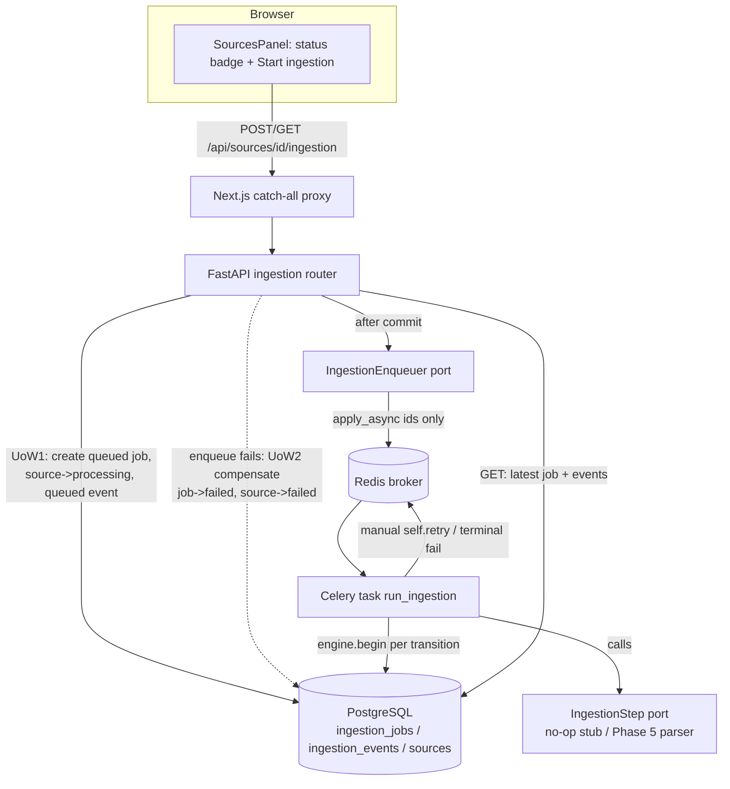

# Worker Foundation Design

**Spec**: `.specs/features/worker-foundation/spec.md`
**Status**: Draft

---

## Architecture Overview

The worker foundation adds an ingestion **job lifecycle** driven by a Celery task over Redis, keeping the exact layering the codebase already uses: pure domain entities → framework-free application services on injected ports → SQLAlchemy Core adapters, with the transaction boundary owned by the caller (web handler for HTTP, Celery task for background). Celery and boto3 never cross into `domain`/`application` (ADR-007/009).

The Celery task body is a **stub** this cycle: it drives `queued → running → succeeded/failed` and calls an injectable `IngestionStep` port whose default adapter is a no-op (`# TODO(Phase 5): parse EPUB`). Phase 5 replaces the no-op with the real parser without touching the lifecycle, the task, or the schema.



**Two units of work on the start path (enqueue-after-commit).** The job row must be committed and visible *before* the task is enqueued — otherwise a worker could dequeue and find no row. So the start handler commits UoW1 (create job + `source.status='processing'` + `queued` event), then enqueues; if enqueue raises, it opens UoW2 to mark the job terminal `failed` + `source.status='failed'` + `failed` event and returns `502` (ING-11). Because the failed job is terminal, it leaves the active set, so a restart `POST` is not blocked.

---

## Code Reuse Analysis

### Existing Components to Leverage

| Component | Location | How to Use |
| --------- | -------- | ---------- |
| Port + adapter + fake pattern | `app/domain/ports.py`, `app/infrastructure/db/repositories.py`, `tests/fakes.py` | Add `IngestionJobRepository`, `IngestionEventRepository`, `IngestionStep`, `IngestionEnqueuer` mirroring `SourceRepository`/`StoragePort` and their fakes. |
| SQLAlchemy Core metadata | `app/infrastructure/db/metadata.py` | Add `ingestion_jobs` + `ingestion_events` tables using the same `NAMING_CONVENTION`, UUID/Text/DateTime columns, FK `ondelete="CASCADE"`. |
| Alembic migration style | `migrations/versions/0002_sources_schema.py` | New `0003_ingestion_schema.py`, `down_revision="0002_sources_schema"`, reversible up/down. |
| Celery app + conventions | `app/worker/celery_app.py`, skill `celery-workers` | Extend the conservative conf block; register `app.worker.tasks` via `include=[...]`. |
| Transaction boundary | `dependencies.get_db_connection` (read) and `get_engine().begin()` (command/task) | GET uses the request-scoped connection like `GetSource`; the start command + task own explicit `engine.begin()` UoWs. |
| Ownership → 404 mapping | `application/sources.py:GetSource`, `AuthorizeOwnership` | Reuse verbatim: non-owner/missing source → `SourceNotFound` → 404 (ING-04). |
| Error → HTTP mapping | `web/error_handlers.py` | Register `ActiveIngestionExists`→409, `IngestionNotFound`→404, `EnqueueFailed`→502. |
| CSRF/Origin guards | `web/csrf.py` (`enforce_csrf`, `enforce_origin`) | Apply to `POST .../ingestion` exactly as `create_source` does. |
| Same-origin proxy | `frontend/app/api/[...path]/route.ts` | **No change** — the catch-all already forwards GET+POST; new endpoints pass through. |
| Sources client + panel | `frontend/app/lib/sources.ts`, `app/components/SourcesPanel.tsx` | Add `startIngestion(...)` (mirrors `uploadSource` CSRF flow) and render status + button per row. |
| Structured logging + redaction | `app/core/logging.py`, existing `logger.info(..., extra=...)` | Task + handler log `job_id`/`source_id` only, no secrets. |

### Integration Points

| System | Integration Method |
| ------ | ------------------ |
| `sources` table | `ingestion_jobs.source_id` FK → `sources.id` (CASCADE); `source.status` projection updated in the same txn as job transitions. |
| Redis/Celery | `IngestionEnqueuer` adapter calls `run_ingestion.apply_async(args=[str(source_id), str(job_id)])`; broker/backend already resolved from `redis_url` (config). |
| Existing sources UI | New per-row status + "Start ingestion" control on the existing panel; no new screen. |

---

## Components

### Domain entities — `app/domain/entities.py` (add)

- **Purpose**: Pure job + event records with immutable transition helpers.
- **Interfaces**:
  - `IngestionJob`: `id, source_id, status, attempts, last_error, created_at, updated_at` (frozen). Transitions return new instances: `started(now)` → `running`, `attempts+1`; `succeeded(now)` → `succeeded`; `retrying(now, error)` → `last_error=error` (status stays `running`); `failed(now, error)` → `failed`, `last_error=error`.
  - `IngestionEvent`: `id, job_id, type, message, created_at` (frozen).
  - Status/event constants: `IngestionStatus` (`QUEUED/RUNNING/SUCCEEDED/FAILED`), `ACTIVE_STATUSES = {QUEUED, RUNNING}`, event types `queued/started/retrying/succeeded/failed`.
- **Dependencies**: none (stdlib only).
- **Reuses**: `@dataclass(frozen=True)` style of `Source`/`Session`.

### Domain ports — `app/domain/ports.py` (add)

- `IngestionJobRepository`: `add(job) -> IngestionJob` (raises on the active partial-unique violation), `get_by_id(job_id) -> IngestionJob | None`, `get_latest_for_source(source_id) -> IngestionJob | None`, `update(job) -> IngestionJob`.
- `IngestionEventRepository`: `append(event) -> IngestionEvent`, `list_for_job(job_id) -> list[IngestionEvent]` (chronological).
- `SourceRepository` (extend): `set_status(source_id, status, updated_at) -> None` — maintains the `source.status` projection.
- `IngestionStep`: `run(*, source: Source, job: IngestionJob) -> None` — the Phase-5 seam. Default adapter is a no-op; raises `RetryableIngestionError` for transient failures, any other exception for terminal failures.
- `IngestionEnqueuer`: `enqueue_ingestion(*, source_id: UUID, job_id: UUID) -> None` — the Celery boundary (keeps `apply_async` out of application code).

### Application services — `app/application/ingestion.py` (new)

- **StartIngestion** (pure, injected repos): validate source (`get_by_id` + `AuthorizeOwnership`, else `SourceNotFound`), `jobs.add(queued job)` (→ `ActiveIngestionExists` on the partial-unique `IntegrityError`), `sources.set_status(processing)`, append `queued` event; returns the job. **Does not enqueue** — the handler orchestrates commit-then-enqueue.
- **RunIngestion** (pure, injected repos + `IngestionStep`): the task's driver.
  - `begin_run(job_id) -> IngestionJob | None`: returns `None` if the job is missing (ING-08 AC3 no-op) or already terminal (idempotent redelivery no-op); else `started()` (→ `running`, `attempts+1`), `sources.set_status(processing)`, append `started`.
  - `run_step(job)`: calls `IngestionStep.run(...)` (propagates exceptions to the task for retry classification).
  - `complete(job_id)`: `succeeded()`, `sources.set_status(ready)`, append `succeeded`.
  - `record_retry(job_id, error)`: `retrying()` (bump `last_error`), append `retrying`.
  - `fail(job_id, error)`: `failed()`, `sources.set_status(failed)`, append `failed`.
- **ReadIngestion** (pure, injected repos): owner-check the source (`SourceNotFound`→404), `get_latest_for_source` (`None`→`IngestionNotFound`→404), `list_for_job`; returns `(job, events)`.
- **Reuses**: `AuthorizeOwnership`, `SourceNotFound`, the constructor-injection style of `CreateSource`/`GetSource`.

### Celery task — `app/worker/tasks.py` (new)

- **Purpose**: Thin bound adapter owning the retry policy and the per-transition UoWs.
- **Interface**: `@celery_app.task(bind=True, name="ingestion.run") def run_ingestion(self, source_id: str, job_id: str) -> None`.
- **Flow**: `begin_run` (UoW) → return if `None` → `run_step`; on exception classify: if `RetryableIngestionError` **and** `self.request.retries < self.max_retries` → `record_retry` (UoW) + `raise self.retry(exc=..., countdown=backoff)`; otherwise `fail` (UoW) and return (terminal state already durable). On success → `complete` (UoW). Logs `job_id`/`source_id` at each transition.
- **Dependencies**: `get_engine`, repositories, `IngestionStep` (built no-op adapter), `celery_app`.
- **Reuses**: celery-workers skill task-design (thin adapter, `engine.begin()`), reliability (idempotent terminal no-op, manual `self.retry`).

### Celery app config — `app/worker/celery_app.py` (edit)

- Register tasks: `Celery("learny", ..., include=["app.worker.tasks"])`.
- Extend conf per the reliability skill: keep `task_acks_late`/`worker_prefetch_multiplier=1`/`broker_connection_retry_on_startup`; add `task_time_limit`, `task_soft_time_limit`, `task_track_started=True`, `broker_transport_options={"visibility_timeout": 3600}` (kept above `task_time_limit`).

### Persistence adapters — `app/infrastructure/db/repositories.py` (add)

- `SqlAlchemyIngestionJobRepository(conn)`: `add`/`get_by_id`/`get_latest_for_source`(order by `created_at desc` limit 1)/`update`; `_to_ingestion_job`. `add` propagates `IntegrityError` on the partial-unique index.
- `SqlAlchemyIngestionEventRepository(conn)`: `append`/`list_for_job`(order by `created_at`); `_to_ingestion_event`.
- `SqlAlchemySourceRepository`: add `set_status(source_id, status, updated_at)` (UPDATE `sources`).

### Enqueuer adapter — `app/infrastructure/worker/enqueuer.py` (new)

- `CeleryIngestionEnqueuer.enqueue_ingestion(*, source_id, job_id)` → `run_ingestion.apply_async(args=[str(source_id), str(job_id)])`. Import of `run_ingestion` is local to keep import graph clean.

### Web router — `app/infrastructure/web/ingestion.py` (new)

- `APIRouter(prefix="/api/sources", tags=["ingestion"])`.
- `POST /{source_id}/ingestion` (auth + `enforce_origin` + `enforce_csrf`, `status_code=202`): open UoW1 via `get_engine().begin()`, run `StartIngestion`; after commit call `IngestionEnqueuer`; on enqueue exception open UoW2 → `RunIngestion.fail(...)`-equivalent compensate → raise `EnqueueFailed`. Returns `IngestionSummary`.
- `GET /{source_id}/ingestion` (auth): request-scoped connection + `ReadIngestion`; returns `IngestionSummary`.
- `IngestionSummary(BaseModel)`: `id, status, attempts, error, created_at, updated_at, events: list[IngestionEventView]`; `IngestionEventView`: `type, message, created_at`; `from_entities(job, events)`. Secret-free (no `object_key`/`checksum`).
- **Composition root** (`dependencies.py`): `get_read_ingestion(conn)` (request-scoped connection, like `GetSource`), `build_start_ingestion(conn)`, `build_compensate(conn)`, module-level `_enqueuer = CeleryIngestionEnqueuer()` with a `get_ingestion_enqueuer()` override hook for tests.
- **Injectable unit-of-work for the start path (testability).** The start handler cannot use the request-scoped auto-commit connection (`get_db_connection`), because ING-11 requires committing the job *before* a synchronous enqueue that may return `502`. So the two write UoWs go through a `get_ingestion_uow()` dependency returning a factory `Callable[[], ContextManager[Connection]]`: in production it yields a fresh `engine.begin()` (commits on exit); web tests override it to yield the shared rolled-back `db_conn` (no commit), exactly as `get_db_connection`/`get_ingestion_enqueuer` are overridden today — preserving the existing rollback isolation while keeping enqueue-after-commit correct in production. The GET read path keeps the ordinary request-scoped connection.

### Frontend — `app/lib/sources.ts` + `app/components/SourcesPanel.tsx` (edit)

- `startIngestion(sourceId, csrfToken, fetchImpl=fetch): Promise<IngestionSummary>` → `POST /api/sources/{id}/ingestion` with `X-CSRF-Token` (reuses the `/api/auth/me` CSRF token, exactly like `uploadSource`), `credentials: "same-origin"`; `toSourceError` on non-OK. Add `IngestionSummary` type.
- `SourcesPanel`: render each source's `status`; when `status === "uploaded"` show a "Start ingestion" button that calls `startIngestion` and optimistically sets that row's status to `processing`; disable while in flight; surface `409`/`502` messages via the existing `role="alert"`. No polling this cycle.

---

## Data Models

### `ingestion_jobs`

```
id          UUID  pk
source_id   UUID  fk -> sources.id (CASCADE), indexed
status      Text  not null            -- queued | running | succeeded | failed
attempts    Integer not null default 0
last_error  Text  null                -- redacted, non-secret; set on retry/failure
created_at  DateTime(tz) not null default now()
updated_at  DateTime(tz) not null default now()

-- concurrency guard (ING-03): at most one active job per source
UNIQUE INDEX uq_ingestion_jobs_active_source (source_id) WHERE status IN ('queued','running')
```

### `ingestion_events`

```
id          UUID  pk
job_id      UUID  fk -> ingestion_jobs.id (CASCADE), indexed
type        Text  not null            -- queued | started | retrying | succeeded | failed
message     Text  null                -- redacted summary; e.g. error text on retrying/failed
created_at  DateTime(tz) not null default now()
```

**Relationships**: `ingestion_jobs.source_id → sources.id`; `ingestion_events.job_id → ingestion_jobs.id`. Ownership is reachable only via the parent `source` (which holds `user_id`); jobs/events carry no `user_id` (TDD Identifier Rules, AD-014). Queue messages carry only `source_id` + `job_id` (AD-014).

---

## Error Handling Strategy

| Error Scenario | Handling | User Impact |
| -------------- | -------- | ----------- |
| Start on a source with an active job (ING-03) | `jobs.add` hits partial-unique → `IntegrityError` → `ActiveIngestionExists` | `409` — "Ingestion is already in progress." |
| Start/read on non-owned or missing source (ING-04) | `AuthorizeOwnership`/missing → `SourceNotFound` | `404`, no existence disclosure |
| Restart after terminal job (ING-05) | Prior job is `succeeded`/`failed` (out of active set) → new `queued` job created | `202` + new job |
| Broker/enqueue failure at start (ING-11) | UoW2 compensates job→`failed`, source→`failed`, `failed` event → `EnqueueFailed` | `502` — inspectable failed job; restart allowed |
| Read before any job (ING-12) | `get_latest_for_source` → `None` → `IngestionNotFound` | `404` |
| Retryable step error (ING-07) | `RetryableIngestionError` + retries remaining → `record_retry` + `self.retry(backoff)` | Job stays active; `retrying` events + `attempts` climb |
| Retries exhausted / non-retryable (ING-08) | `fail` → `failed` + durable `last_error` + source `failed` | `GET` shows `failed` + reason |
| Task fires for a missing job row (ING-08 AC3) | `begin_run` returns `None` → task no-ops | none (defensive) |
| Redelivery of a terminal job | `begin_run` sees terminal status → no-op (idempotent, `acks_late`) | none |

---

## Risks & Concerns

| Concern | Location | Impact | Mitigation |
| ------- | -------- | ------ | ---------- |
| Crash in the window between UoW1 commit and enqueue leaves a `queued` job never enqueued; it stays in the active set, so restart → `409` forever | `web/ingestion.py` start handler | A source could be stuck unable to (re)start ingestion | Narrow window; documented known limitation. A reconciler/sweeper for orphaned `queued` jobs is deferred to Phase 10 (production readiness). Not in scope this cycle. |
| `task_acks_late=True` + Redis `visibility_timeout` can redeliver a job while `status='running'` (mid-run), double-running the step | `worker/tasks.py` | For the **stub** step this is harmless; a real Phase-5 step could duplicate work | Terminal-status + already-`running` no-op guards cover terminal redelivery; `visibility_timeout` kept above `task_time_limit`; Phase 5 steps must be idempotent (documented in celery-workers skill). |
| Retryable-vs-terminal classification depends on the step raising `RetryableIngestionError` for transient faults | `domain/ports.py:IngestionStep`, Phase 5 adapters | Misclassification retries a permanent error or fails a transient one | Explicit exception contract on the port; this cycle's tests exercise both branches via injected doubles. |
| No rate limit on `POST .../ingestion` | `web/ingestion.py` | An authenticated user could spam enqueue/restart | Low risk for MVP (auth required; restart bounded by terminal state). Reuse `rate_limit`-style guard is a cheap follow-up; noted, not built. |
| Pre-existing `ruff format` drift on 10 Cycle-1 files (STATE.md Known Gaps) | repo-wide | `ruff format --check` fails on unrelated files | Out of scope; do not reformat here (avoid scope creep). New files must be `ruff`-clean. |

---

## Tech Decisions (only non-obvious ones)

| Decision | Choice | Rationale |
| -------- | ------ | --------- |
| Active-job invariant | Partial unique index `WHERE status IN ('queued','running')` | DB-enforced, race-proof; satisfies ING-03 "rejected at the persistence layer" (design fork, confirmed). |
| `source.status` sync | Stored projection updated in the same txn as job transitions | Sources list query + `SourceSummary` stay unchanged; no join (design fork, confirmed). |
| Phase-5 seam / testable failure | Injectable `IngestionStep` port, default no-op adapter | Clean DI seam for retry tests + discrimination sensor; Phase 5 swaps the adapter, not the task (design fork, confirmed). |
| Start-path orchestration | Commit job (UoW1) → enqueue → compensate on failure (UoW2); orchestration in the composition root, services stay pure | Enqueue-after-commit correctness (worker must see a committed row); services remain fakeable and Celery-free. → **AD-016**. |
| Retry ownership | Celery task owns retry count via manual `self.retry`; the pure service owns DB transitions and writes terminal `failed` when retries are exhausted | Retry count is Celery state; DB transitions must stay framework-free and be written exactly when exhausted. |
| Enqueue boundary | `IngestionEnqueuer` port + `CeleryIngestionEnqueuer` adapter | Keeps `apply_async` out of application/handler logic, mirroring `StoragePort` (ADR-007/009). → **AD-016**. |

> **Project-level:** append **AD-016** to `.specs/STATE.md` — "Worker-triggering commands commit durable job state first, then enqueue after commit through a Learny `IngestionEnqueuer` port, compensating to terminal `failed` if enqueue fails; Celery/`apply_async` never enters application or domain code." Future worker-triggered features (embedding, indexing, evaluation) follow this pattern.
