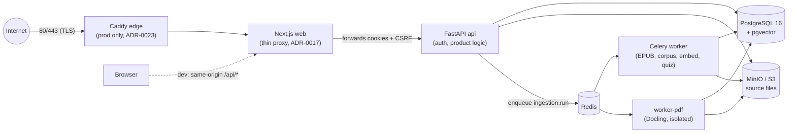

# Learny

**Book intelligence with citations you can trust.** Learny ingests EPUB books while preserving their structure, answers questions with passage-level citations, and runs guided teaching sessions anchored to specific sections of the book — so every claim traces back to an exact location in the source.

> Status: v2 shipped (v0.2.0). EPUB **and** PDF ingestion, cited Q&A and teaching with real streaming Claude generation, active-recall quizzes with spaced repetition, and hybrid retrieval over real OpenAI embeddings all work end-to-end. Real provider adapters (OpenAI embeddings, Anthropic Claude generation) sit behind Learny-owned ports; the deterministic, network-free adapters remain the default for offline development and CI, so the suite runs with no keys. The stack is deployed via CI → GHCR images → a VPS behind a Caddy TLS edge.

---

## Demo

A <90-second money-path walkthrough — upload a book, ask a cited question, generate a quiz, review a spaced-repetition card — plus scene stills live under [`docs/media/`](docs/media/). The capture script and named asset slots are in [`docs/media/README.md`](docs/media/README.md); the media binaries are produced separately (git-ignored, not committed) so cloning the repo stays lightweight.

<!-- Demo media (produced per docs/media/README.md; not committed):


-->

Until the capture is recorded, see **[docs/media/README.md](docs/media/README.md)** for exactly what each screen shows.

---

## Why this project exists

Most RAG demos flatten a book into anonymous chunks and hope the answer is right. Learny takes the opposite stance, encoded as explicit architecture decisions ([ADRs](docs/adr/)):

- **Structure is canonical.** Headings, sections, reading order, and stable location anchors survive ingestion ([ADR-0002](docs/adr/0002-canonical-document-format.md)). Chunks are *derived* from the canonical corpus, never the other way around.
- **Citations are a core requirement, not polish.** Every answer and teaching turn carries citations that resolve to exact anchors ([ADR-0003](docs/adr/0003-citations-and-evaluation-are-core-requirements.md)).
- **Evaluation before scale.** Golden fixtures pin ingestion, retrieval, and citation behavior before any provider or dashboard exists ([ADR-0016](docs/adr/0016-use-golden-fixtures-for-mvp-evaluation.md)).

## System architecture

One backend codebase shared by the API and the workers; in production a Caddy TLS edge is the only host-exposed service, terminating HTTPS and reverse-proxying to the Next.js app. EPUB ingestion runs on the default Celery worker; PDF ingestion runs on an isolated, memory-bounded `worker-pdf` (ADR-0022):



- **Next.js (React 19)** renders the UI and hosts a catch-all same-origin proxy (`app/api/[...path]/route.ts`) that forwards every `/api/*` call to FastAPI. The browser never talks to the backend cross-origin, and the session cookie stays first-party ([ADR-0017](docs/adr/0017-use-thin-nextjs-same-origin-api-proxy-to-fastapi.md)).
- **FastAPI** is authoritative for auth, authorization, and all product logic. The frontend holds zero business rules.
- **Celery workers** run every long-lived job (document parsing, corpus build, embedding, quiz-deck generation) outside HTTP handlers ([ADR-0005](docs/adr/0005-run-document-work-in-separate-workers-same-codebase.md), [ADR-0014](docs/adr/0014-use-redis-and-celery-for-worker-queues.md)). A dedicated `worker-pdf` service consumes an isolated `ingest-pdf` queue with bounded memory so a pathological PDF cannot starve EPUB ingestion or the API ([ADR-0022](docs/adr/0022-pdf-ingestion-via-docling-and-corpus-normalization.md)). PostgreSQL is the source of truth for job state; Redis is transport only.
- **PostgreSQL** holds identity, sources, the canonical corpus, retrieval indexes, teaching history, and quiz items with their spaced-repetition schedule. **MinIO** (any S3-compatible store) holds the uploaded files ([ADR-0013](docs/adr/0013-use-s3-compatible-object-storage-for-uploaded-sources.md)).

### Backend: hexagonal / ports-and-adapters

```
backend/app/
├── domain/          # frozen entities + port Protocols — zero framework imports
├── application/     # use-case services (identity, ingestion, normalization, corpus,
│                    #   retrieval, qa, teaching, quiz, scheduling, grounding) —
│                    #   framework-free, injected via ports
├── infrastructure/  # adapters: web/ (FastAPI routers), db/ (SQLAlchemy Core),
│                    #   storage/ (S3), embeddings/ (deterministic + OpenAI),
│                    #   answering/ + teaching/ (deterministic + Anthropic Claude),
│                    #   quiz/ (deterministic + Anthropic), scheduling/ (FSRS),
│                    #   ingestion/ (ebooklib EPUB + Docling PDF), security/ (Argon2id),
│                    #   worker/ (Celery enqueuer)
├── core/            # config (pydantic-settings), structured logging, tracing
├── worker/          # Celery app + tasks (thin shells over application services)
└── main.py          # FastAPI composition root
```

The dependency rule is strict and enforced by review: SQLAlchemy, Celery, boto3, ebooklib, Docling, the OpenAI and Anthropic SDKs, and FSRS never appear in `domain/` or `application/`. Routers are thin HTTP adapters; `web/dependencies.py` is the single composition root that wires concrete adapters into ports. This is exactly what let v2 swap providers mechanically: alongside the deterministic, network-free defaults (`DeterministicEmbeddingAdapter`, `DeterministicAnswerAdapter`, and their teaching/quiz siblings — extractive, evidence-only, no network) now sit an `OpenAIEmbeddingAdapter` behind `EmbeddingPort` ([ADR-0019](docs/adr/0019-use-openai-embeddings-with-per-chunk-model-versioning.md)) and Anthropic Claude adapters behind `AnswerGenerationPort`, `TeachingGenerationPort`, and `QuizGenerationPort` ([ADR-0020](docs/adr/0020-use-anthropic-claude-for-generation.md)) — each a new class selected by a `LEARNY_*_PROVIDER` setting, wired in one place ([ADR-0007](docs/adr/0007-use-learny-owned-ports-for-ai-provider-integration.md), [ADR-0009](docs/adr/0009-use-learny-owned-orchestration-with-specialized-edge-libraries.md)). The deterministic adapters stay the default so CI and local development run offline and key-free.

### Ingestion pipeline (Celery task `ingestion.run`)

```
S3 bytes ──▶ parse ──▶ normalize ──▶ canonical corpus ──▶ chunk ──▶ embed ──▶ ready
             EPUB      format-        documents/sections/    derived    pgvector
             (ebooklib) agnostic       blocks in PostgreSQL   chunks     column
             PDF       cleanup pass
             (Docling)
```

Both formats feed the **same** canonical corpus. EPUB is parsed by ebooklib and PDF by Docling ([ADR-0022](docs/adr/0022-pdf-ingestion-via-docling-and-corpus-normalization.md)) behind one `DocumentParserPort`, selected by content type at the worker composition root; Docling's PDF pipeline bakes its models into the `worker-pdf` image so parsing needs no network. A shared, deterministic **normalization pass** then runs on every parsed book before corpus records are built — inferring human-meaningful section titles over filename-derived noise (`part0034`), re-deriving hierarchy from heading levels, clamping depth, merging trivial sections (their anchors preserved as aliases), and stripping boilerplate — so citations, teaching targets, and quiz eligibility get clean structure regardless of source format.

Each stage commits in its own transaction, so redelivery is idempotent (the job-claim step is a no-op for missing/terminal jobs). Transient faults (e.g. object storage down) raise a retryable error with exponential backoff (base 10s, cap 600s, max 3 retries); everything else marks the job `failed` with a durable event trail in `ingestion_events`. A partial unique index guarantees at most one active job per source. Corpus replacement is atomic (delete-then-insert in one transaction), so a re-ingest never leaves a half-built corpus.

### Retrieval: PostgreSQL hybrid search with RRF

One SQL statement ([ADR-0006](docs/adr/0006-use-postgresql-hybrid-search-with-pgvector-and-full-text.md), `infrastructure/db/retrieval.py`):

1. **Semantic arm** — pgvector cosine distance over `corpus_chunks.embedding` (HNSW index, per-transaction `SET LOCAL hnsw.ef_search`).
2. **Lexical arm** — PostgreSQL full-text search over a generated `tsvector` column (GIN index, `websearch_to_tsquery`, cover-density ranking).
3. **Fusion** — FULL OUTER JOIN with Reciprocal Rank Fusion (`1/(k + rank)` summed per arm).

Results project directly into `Evidence` DTOs carrying `section_path`, `anchor`, `page_span`, and `snippet` — citations are a first-class output of retrieval, not a post-processing step. Teaching sessions reuse the same query with an anchor-subtree filter so tutoring stays scoped to the passage being taught.

### Active recall

Beyond reading and asking, Learny turns a book into durable memory ([ADR-0021](docs/adr/0021-active-recall-design.md)). A Celery deck pipeline generates grounded quiz items (free-recall and single-mask cloze) from corpus sections, each carrying a citation snapshot and server-side quality checks (verbatim-quote containment, embedding dedup). Reviews are scheduled by the **FSRS** spaced-repetition algorithm behind a `SchedulingPort` (the `fsrs` library at the edge), with a cross-source due queue and an append-only review log; FSRS state describes the learner's memory, so it survives re-ingest untouched. Decks export to Anki as `.apkg` via `genanki`, with stable note GUIDs so re-import updates in place.

### Security model

- **Backend-owned sessions** ([ADR-0015](docs/adr/0015-use-backend-owned-auth-with-http-only-cookies.md)): opaque token in an `HttpOnly` `SameSite=Lax` cookie; only its SHA hash is stored. Passwords are Argon2id.
- **CSRF**: synchronizer token (issued by `GET /api/auth/me`, echoed as `X-CSRF-Token`, compared constant-time) plus an Origin/Referer host check on every write.
- **Authorization**: every source, corpus record, and teaching session is owner-scoped at the query level; cross-user access resolves to 404.
- **Log hygiene**: a recursive redaction filter strips password/token/secret/cookie fields from every log record before emission.

### Observability

Structured logging (`human` or `json` via `LEARNY_LOG_FORMAT`) with `ContextVar`-based trace correlation: every record is stamped with `request_id`, `user_id`, `job_id`, `source_id`. The API adopts/generates `X-Request-ID` and echoes it; the worker opens its own trace scope per job, so one ingestion can be followed across both processes. Liveness (`/healthz`) and readiness (`/readyz`, checks the DB) probes back the compose healthchecks.

## Tech stack

| Layer | Choice | Decision record |
|---|---|---|
| Backend | Python 3.13, FastAPI, SQLAlchemy Core, Alembic | [ADR-0004](docs/adr/0004-python-fastapi-react-nextjs-postgresql-stack.md) |
| Frontend | Next.js 15 (App Router), React 19, TypeScript | ADR-0004, [ADR-0017](docs/adr/0017-use-thin-nextjs-same-origin-api-proxy-to-fastapi.md) |
| Storage | PostgreSQL 16 + pgvector, MinIO (S3 API) | [ADR-0006](docs/adr/0006-use-postgresql-hybrid-search-with-pgvector-and-full-text.md), [ADR-0013](docs/adr/0013-use-s3-compatible-object-storage-for-uploaded-sources.md) |
| Jobs | Celery + Redis (broker only; Postgres owns state) | [ADR-0014](docs/adr/0014-use-redis-and-celery-for-worker-queues.md) |
| Ingestion | EPUB via ebooklib + PDF via Docling, behind one `DocumentParserPort` | [ADR-0011](docs/adr/0011-support-epub-first-for-initial-ingestion.md), [ADR-0022](docs/adr/0022-pdf-ingestion-via-docling-and-corpus-normalization.md) |
| Embeddings | OpenAI `text-embedding-3-large@1536` (deterministic default) behind `EmbeddingPort` | [ADR-0019](docs/adr/0019-use-openai-embeddings-with-per-chunk-model-versioning.md) |
| Generation | Anthropic Claude with citations + streaming (deterministic default) | [ADR-0020](docs/adr/0020-use-anthropic-claude-for-generation.md) |
| Active recall | FSRS spaced repetition + genanki `.apkg` export, at the edges | [ADR-0021](docs/adr/0021-active-recall-design.md) |
| AI orchestration | Learny-owned; no LangChain/LlamaIndex core | [ADR-0009](docs/adr/0009-use-learny-owned-orchestration-with-specialized-edge-libraries.md) |
| Deploy | Docker Compose → GHCR images → VPS behind a Caddy TLS edge | [ADR-0008](docs/adr/0008-use-docker-compose-vps-for-first-production-like-deploy.md), [ADR-0023](docs/adr/0023-ghcr-ssh-deploy-caddy-edge.md) |

## Getting started

Prerequisites: Docker with the Compose plugin. **No API keys required** — the MVP's AI adapters are deterministic and network-free.

```bash
git clone <repo> && cd learny
docker compose up --build
```

That's the whole local setup. Compose auto-loads `docker-compose.override.yml` (dev credentials, published infra ports); the `api` container applies Alembic migrations on start; the MinIO bucket is auto-created on first upload.

- App: http://localhost:3000 — register, upload an EPUB, ingest, ask, teach.
- API: http://localhost:8000 (`/healthz`, `/readyz`, `/docs`)
- MinIO console: http://localhost:9001 (`learny` / `learny-dev-secret`)

### Production-like run

Secrets are injected via git-ignored env files — the prod overlay refuses to start without them:

```bash
mkdir -p secrets   # db.env, minio.env, api.env, worker.env — see backend/.env.production.example
docker compose -f docker-compose.yml -f docker-compose.prod.yml up -d
```

The prod overlay pins image versions, adds restart policies, publishes no infra ports, forces `Secure` cookies and JSON logs, and runs uvicorn with multiple workers and the Next.js standalone server. Note the two `-f` flags: the local `docker-compose.override.yml` is auto-loaded only for the bare `docker compose up`, never in production, so the prod invocation always names both files explicitly.

### Deployment (CI → GHCR → VPS)

Shipping is `git merge` ([ADR-0023](docs/adr/0023-ghcr-ssh-deploy-caddy-edge.md)). On every green CI run on `main`, a separate `deploy.yml` (gated via `workflow_run`) builds and publishes three images to the GitHub Container Registry — `ghcr.io/augusto-dmh/learny-{backend,pdf-worker,web}`, each tagged `latest` and the commit SHA — then, when the `VPS_HOST`/`VPS_USER`/`VPS_SSH_KEY` secrets are present, scps the compose files and Caddyfile to `/opt/learny` on the VPS and runs `docker compose … pull && up -d --no-build --wait` with `LEARNY_IMAGE_TAG=<sha>`. Missing VPS secrets make the deploy job exit green, so the pipeline runs before any host exists.

In production, **Caddy is the only host-exposed service** (80/443), terminating TLS with certificates persisted in a `caddy_data` volume and reverse-proxying solely to `web:3000` — the API and infrastructure ports stay on the internal compose network, consistent with the same-origin proxy boundary ([ADR-0017](docs/adr/0017-use-thin-nextjs-same-origin-api-proxy-to-fastapi.md)). Rollback is one variable: redeploy an older SHA-tagged image. A newcomer can take a fresh VPS to a running Learny with the runbook alone — see **[docs/ops/deploy.md](docs/ops/deploy.md)** (and [docs/ops/rollback.md](docs/ops/rollback.md) for the image-tag rollback path).

### Tests

```bash
# Backend (unit + integration; DB tests need a running Postgres with pgvector)
cd backend && uv run pytest                      # set LEARNY_TEST_DATABASE_URL for DB/golden tests

# Frontend
cd frontend && npm test
```

Evaluation uses **golden fixtures**: a hand-authored EPUB is run through the *real* ingestion/retrieval/answer pipeline and compared against hand-written expected corpus structure, retrieval rankings, and citations (`backend/tests/test_golden_*.py`). Deterministic adapters make this reproducible with zero network.

## API surface (summary)

| Area | Endpoints |
|---|---|
| Health | `GET /healthz`, `GET /readyz` |
| Auth | `POST /api/auth/register`, `POST /api/auth/login`, `POST /api/auth/logout`, `GET /api/auth/me` |
| Sources | `POST /api/sources` (multipart), `GET /api/sources`, `GET /api/sources/{id}`, `GET /api/sources/{id}/structure` |
| Ingestion | `POST /api/sources/{id}/ingestion` (202, async), `GET /api/sources/{id}/ingestion` (job + events) |
| Retrieval | `POST /api/sources/{id}/retrieve` (raw hybrid evidence) |
| Q&A | `POST /api/sources/{id}/questions` (cited answer) |
| Teaching | `POST /api/teaching-sessions`, `GET /api/teaching-sessions/{id}`, `POST /api/teaching-sessions/{id}/turns`, `GET /api/sources/{id}/teaching-sessions` |
| Streaming | `POST /api/sources/{id}/questions/stream`, `POST /api/teaching-sessions/{id}/turns/stream` (SSE, UI Message Stream) |
| Quizzes | `POST /api/sources/{id}/quiz/deck` (202, async), `GET /api/sources/{id}/quiz`, `GET /api/sources/{id}/quiz/export` (.apkg) |
| Reviews | `GET /api/reviews/due` (cross-source), `POST /api/quiz-items/{id}/reviews` (FSRS grade) |

## Engineering process

The repository is decision-driven: 23 [ADRs](docs/adr/) record accepted architecture choices with context and trade-offs, [RFCs](docs/rfc/) hold open proposals (RFC-002 drove the v2 roadmap), and a [technical design doc](docs/tdd/0001-mvp-architecture.md) maps the MVP. Features were built in spec-driven cycles (specify → design → tasks → execute with independent verification) with small, reviewed PRs. Operational runbooks live in [docs/ops/](docs/ops/) (deploy, backups, rollback, [end-to-end QA](docs/ops/e2e-qa.md)); the v2 build is written up in the [v2 retrospective](docs/retrospectives/2026-07-learny-v2.md).

## Roadmap

v2 (RFC-002 cycles A–G) is shipped at **v0.2.0** — everything the original roadmap listed as future work is now in `main`:

- ✅ **Real provider adapters** behind the existing ports — OpenAI embeddings ([ADR-0019](docs/adr/0019-use-openai-embeddings-with-per-chunk-model-versioning.md)) and Anthropic Claude generation with citations + streaming ([ADR-0020](docs/adr/0020-use-anthropic-claude-for-generation.md)), deterministic adapters retained as the offline default.
- ✅ **PDF ingestion** via Docling behind the shared parser port, plus a format-agnostic corpus normalization pass ([ADR-0022](docs/adr/0022-pdf-ingestion-via-docling-and-corpus-normalization.md)).
- ✅ **Active-recall quizzes** with FSRS spaced repetition and Anki export ([ADR-0021](docs/adr/0021-active-recall-design.md)) — the successor to the MVP's deferred quiz/notes scope ([ADR-0010](docs/adr/0010-scope-first-mvp-to-ingestion-cited-qa-and-teaching-sessions.md)).
- ✅ **A real product frontend** (Next.js App Router, streaming UI) and **CI + Apache-2.0 hygiene**.
- ✅ **Deployment**: CI-built GHCR images auto-deployed to a VPS behind a Caddy TLS edge ([ADR-0023](docs/adr/0023-ghcr-ssh-deploy-caddy-edge.md)). A nightly LLM-judge evaluation runs against real providers, with results persisted as JSONL.

Possible future directions (out of RFC-002 scope, no decision recorded yet):

- Multi-provider / bring-your-own-key generation and embeddings.
- A dedicated vector database or reranker if PostgreSQL hybrid search stops scaling.
- Notes and second-brain workflows layered on the canonical corpus.
- A monitoring/metrics stack and automated backups (structured logs and the ops runbooks are the current hooks).
- A publicly hosted multi-tenant instance.

See the [v2 retrospective](docs/retrospectives/2026-07-learny-v2.md) for what shipped in each cycle and what to improve next.
