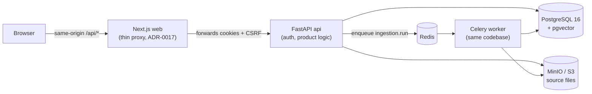

# Learny

**Book intelligence with citations you can trust.** Learny ingests EPUB books while preserving their structure, answers questions with passage-level citations, and runs guided teaching sessions anchored to specific sections of the book — so every claim traces back to an exact location in the source.

> Status: functional MVP. Ingestion, cited Q&A, and teaching sessions work end-to-end with deterministic (network-free) AI adapters behind provider-independent ports; swapping in a real LLM/embedding provider is an adapter change, not an architecture change.

---

## Why this project exists

Most RAG demos flatten a book into anonymous chunks and hope the answer is right. Learny takes the opposite stance, encoded as explicit architecture decisions ([ADRs](docs/adr/)):

- **Structure is canonical.** Headings, sections, reading order, and stable location anchors survive ingestion ([ADR-0002](docs/adr/0002-canonical-document-format.md)). Chunks are *derived* from the canonical corpus, never the other way around.
- **Citations are a core requirement, not polish.** Every answer and teaching turn carries citations that resolve to exact anchors ([ADR-0003](docs/adr/0003-citations-and-evaluation-are-core-requirements.md)).
- **Evaluation before scale.** Golden fixtures pin ingestion, retrieval, and citation behavior before any provider or dashboard exists ([ADR-0016](docs/adr/0016-use-golden-fixtures-for-mvp-evaluation.md)).

## System architecture

Six services, one backend codebase shared by the API and the worker:



- **Next.js (React 19)** renders the UI and hosts a catch-all same-origin proxy (`app/api/[...path]/route.ts`) that forwards every `/api/*` call to FastAPI. The browser never talks to the backend cross-origin, and the session cookie stays first-party ([ADR-0017](docs/adr/0017-use-thin-nextjs-same-origin-api-proxy-to-fastapi.md)).
- **FastAPI** is authoritative for auth, authorization, and all product logic. The frontend holds zero business rules.
- **Celery workers** run every long-lived job (EPUB parsing, corpus build, embedding) outside HTTP handlers ([ADR-0005](docs/adr/0005-run-document-work-in-separate-workers-same-codebase.md), [ADR-0014](docs/adr/0014-use-redis-and-celery-for-worker-queues.md)). PostgreSQL is the source of truth for job state; Redis is transport only.
- **PostgreSQL** holds identity, sources, the canonical corpus, retrieval indexes, and teaching history. **MinIO** (any S3-compatible store) holds the uploaded files ([ADR-0013](docs/adr/0013-use-s3-compatible-object-storage-for-uploaded-sources.md)).

### Backend: hexagonal / ports-and-adapters

```
backend/app/
├── domain/          # frozen entities + port Protocols — zero framework imports
├── application/     # use-case services (identity, ingestion, corpus, retrieval,
│                    #   qa, teaching, grounding) — framework-free, injected via ports
├── infrastructure/  # adapters: web/ (FastAPI routers), db/ (SQLAlchemy Core),
│                    #   storage/ (S3), embeddings/, answering/, ingestion/ (ebooklib),
│                    #   security/ (Argon2id), worker/ (Celery enqueuer)
├── core/            # config (pydantic-settings), structured logging, tracing
├── worker/          # Celery app + tasks (thin shells over application services)
└── main.py          # FastAPI composition root
```

The dependency rule is strict and enforced by review: SQLAlchemy, Celery, boto3, and ebooklib never appear in `domain/` or `application/`. Routers are thin HTTP adapters; `web/dependencies.py` is the single composition root that wires concrete adapters into ports. This is what makes the AI layer swappable ([ADR-0007](docs/adr/0007-use-learny-owned-ports-for-ai-provider-integration.md), [ADR-0009](docs/adr/0009-use-learny-owned-orchestration-with-specialized-edge-libraries.md)): the MVP ships `DeterministicEmbeddingAdapter` and `DeterministicAnswerAdapter` (extractive, evidence-only, no network); an OpenAI/Anthropic adapter is a new class behind the same `EmbeddingPort` / `AnswerGenerationPort`, wired in one place.

### Ingestion pipeline (Celery task `ingestion.run`)

```
S3 bytes ──▶ parse EPUB (ebooklib) ──▶ canonical corpus ──▶ chunk ──▶ embed ──▶ ready
             structure preserved:      documents/sections/    derived    pgvector
             TOC, anchors, order       blocks in PostgreSQL   chunks     column
```

Each stage commits in its own transaction, so redelivery is idempotent (the job-claim step is a no-op for missing/terminal jobs). Transient faults (e.g. object storage down) raise a retryable error with exponential backoff (base 10s, cap 600s, max 3 retries); everything else marks the job `failed` with a durable event trail in `ingestion_events`. A partial unique index guarantees at most one active job per source. Corpus replacement is atomic (delete-then-insert in one transaction), so a re-ingest never leaves a half-built corpus.

### Retrieval: PostgreSQL hybrid search with RRF

One SQL statement ([ADR-0006](docs/adr/0006-use-postgresql-hybrid-search-with-pgvector-and-full-text.md), `infrastructure/db/retrieval.py`):

1. **Semantic arm** — pgvector cosine distance over `corpus_chunks.embedding` (HNSW index, per-transaction `SET LOCAL hnsw.ef_search`).
2. **Lexical arm** — PostgreSQL full-text search over a generated `tsvector` column (GIN index, `websearch_to_tsquery`, cover-density ranking).
3. **Fusion** — FULL OUTER JOIN with Reciprocal Rank Fusion (`1/(k + rank)` summed per arm).

Results project directly into `Evidence` DTOs carrying `section_path`, `anchor`, `page_span`, and `snippet` — citations are a first-class output of retrieval, not a post-processing step. Teaching sessions reuse the same query with an anchor-subtree filter so tutoring stays scoped to the passage being taught.

### Security model

- **Backend-owned sessions** ([ADR-0015](docs/adr/0015-use-backend-owned-auth-with-http-only-cookies.md)): opaque token in an `HttpOnly` `SameSite=Lax` cookie; only its SHA hash is stored. Passwords are Argon2id.
- **CSRF**: synchronizer token (issued by `GET /api/auth/me`, echoed as `X-CSRF-Token`, compared constant-time) plus an Origin/Referer host check on every write.
- **Authorization**: every source, corpus record, and teaching session is owner-scoped at the query level; cross-user access resolves to 404.
- **Log hygiene**: a recursive redaction filter strips password/token/secret/cookie fields from every log record before emission.

### Observability

Structured logging (`human` or `json` via `LEARNY_LOG_FORMAT`) with `ContextVar`-based trace correlation: every record is stamped with `request_id`, `user_id`, `job_id`, `source_id`. The API adopts/generates `X-Request-ID` and echoes it; the worker opens its own trace scope per job, so one ingestion can be followed across both processes. Liveness (`/healthz`) and readiness (`/readyz`, checks the DB) probes back the compose healthchecks.

## Tech stack

| Layer | Choice | Decision record |
|---|---|---|
| Backend | Python 3.13, FastAPI, SQLAlchemy Core, Alembic | [ADR-0004](docs/adr/0004-python-fastapi-react-nextjs-postgresql-stack.md) |
| Frontend | Next.js 15 (App Router), React 19, TypeScript | ADR-0004, [ADR-0017](docs/adr/0017-use-thin-nextjs-same-origin-api-proxy-to-fastapi.md) |
| Storage | PostgreSQL 16 + pgvector, MinIO (S3 API) | [ADR-0006](docs/adr/0006-use-postgresql-hybrid-search-with-pgvector-and-full-text.md), [ADR-0013](docs/adr/0013-use-s3-compatible-object-storage-for-uploaded-sources.md) |
| Jobs | Celery + Redis (broker only; Postgres owns state) | [ADR-0014](docs/adr/0014-use-redis-and-celery-for-worker-queues.md) |
| Ingestion | ebooklib behind a Learny-owned port, EPUB-first | [ADR-0011](docs/adr/0011-support-epub-first-for-initial-ingestion.md) |
| AI orchestration | Learny-owned; no LangChain/LlamaIndex core | [ADR-0009](docs/adr/0009-use-learny-owned-orchestration-with-specialized-edge-libraries.md) |
| Deploy | Docker Compose (base + dev override + prod overlay) | [ADR-0008](docs/adr/0008-use-docker-compose-vps-for-first-production-like-deploy.md) |

## Getting started

Prerequisites: Docker with the Compose plugin. **No API keys required** — the MVP's AI adapters are deterministic and network-free.

```bash
git clone <repo> && cd learny
docker compose up --build
```

That's the whole local setup. Compose auto-loads `docker-compose.override.yml` (dev credentials, published infra ports); the `api` container applies Alembic migrations on start; the MinIO bucket is auto-created on first upload.

- App: http://localhost:3000 — register, upload an EPUB, ingest, ask, teach.
- API: http://localhost:8000 (`/healthz`, `/readyz`, `/docs`)
- MinIO console: http://localhost:9001 (`learny` / `learny-dev-secret`)

### Production-like run

Secrets are injected via git-ignored env files — the prod overlay refuses to start without them:

```bash
mkdir -p secrets   # db.env, minio.env, api.env, worker.env — see backend/.env.production.example
docker compose -f docker-compose.yml -f docker-compose.prod.yml up -d
```

The prod overlay pins image versions, adds restart policies, publishes no infra ports, forces `Secure` cookies and JSON logs, and runs uvicorn with multiple workers and the Next.js standalone server.

### Tests

```bash
# Backend (unit + integration; DB tests need a running Postgres with pgvector)
cd backend && uv run pytest                      # set LEARNY_TEST_DATABASE_URL for DB/golden tests

# Frontend
cd frontend && npm test
```

Evaluation uses **golden fixtures**: a hand-authored EPUB is run through the *real* ingestion/retrieval/answer pipeline and compared against hand-written expected corpus structure, retrieval rankings, and citations (`backend/tests/test_golden_*.py`). Deterministic adapters make this reproducible with zero network.

## API surface (summary)

| Area | Endpoints |
|---|---|
| Health | `GET /healthz`, `GET /readyz` |
| Auth | `POST /api/auth/register`, `POST /api/auth/login`, `POST /api/auth/logout`, `GET /api/auth/me` |
| Sources | `POST /api/sources` (multipart), `GET /api/sources`, `GET /api/sources/{id}`, `GET /api/sources/{id}/structure` |
| Ingestion | `POST /api/sources/{id}/ingestion` (202, async), `GET /api/sources/{id}/ingestion` (job + events) |
| Retrieval | `POST /api/sources/{id}/retrieve` (raw hybrid evidence) |
| Q&A | `POST /api/sources/{id}/questions` (cited answer) |
| Teaching | `POST /api/teaching-sessions`, `GET /api/teaching-sessions/{id}`, `POST /api/teaching-sessions/{id}/turns`, `GET /api/sources/{id}/teaching-sessions` |

## Engineering process

The repository is decision-driven: 18 [ADRs](docs/adr/) record accepted architecture choices with context and trade-offs, [RFCs](docs/rfc/) hold open proposals, and a [technical design doc](docs/tdd/0001-mvp-architecture.md) maps the MVP. Features were built in spec-driven cycles (specify → design → tasks → execute with independent verification) with small, reviewed PRs. Operational runbooks live in [docs/ops/](docs/ops/) (backups, rollback, [end-to-end QA](docs/ops/e2e-qa.md)).

## Roadmap

- Real LLM/embedding provider adapters behind the existing ports (OpenAI/Anthropic), with the golden-fixture harness as the regression gate.
- PDF ingestion via a second parser adapter (Docling is the candidate) behind the same ingestion port.
- Ragas-style automated evaluation on top of the golden fixtures.
- Quizzes, notes, and second-brain workflows (deliberately deferred out of the MVP — [ADR-0010](docs/adr/0010-scope-first-mvp-to-ingestion-cited-qa-and-teaching-sessions.md)).
