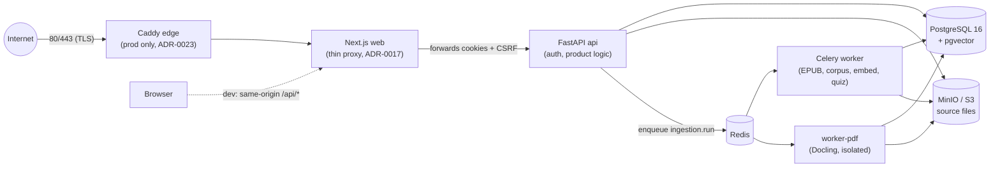

# Learny

**Book intelligence with citations you can trust.** Learny ingests EPUB books while preserving their structure, answers questions with passage-level citations, and runs guided teaching sessions anchored to specific sections of the book — so every claim traces back to an exact location in the source.

> Status: **v0.7.0** — seven roadmaps shipped (MVP, [RFC-002](docs/rfc/0002-learny-v2-roadmap.md) v2, [RFC-003](docs/rfc/0003-learny-v3-roadmap.md) v3, [RFC-004](docs/rfc/0004-student-experience-roadmap.md), [RFC-005](docs/rfc/0005-evidence-gated-hardening-roadmap.md), [RFC-006](docs/rfc/0006-reading-first-ux-overhaul.md), [RFC-0007](docs/rfc/0007-public-launch-roadmap.md)). Learny ingests EPUB **and** PDF books (scanned PDFs through selective OCR), answers and teaches with streaming Claude generation whose citations resolve to exact passages, keeps highlights and notes in the retrieval loop, schedules review with FSRS, and runs as a reading-first workspace: the reader is the hub, a page unit tracks position, retrieval is bound to how far you have read, the learner chooses among operator-curated AI profiles, and registration is open behind rate, spend, and quota rails. Real provider adapters (OpenAI embeddings, Anthropic Claude generation, an OpenAI-compatible economy tier) sit behind Learny-owned ports; the deterministic, network-free adapters remain the default for offline development and CI, so the suite runs with no keys. The stack deploys via CI → GHCR images → a VPS behind a Caddy TLS edge, with off-VPS backups, point-in-time recovery, and self-hosted monitoring.

---

## Demo

The demo is not recorded yet. The money path it will show — upload a book, ask a cited question, generate a quiz, review a spaced-repetition card — is scripted in [`docs/media/README.md`](docs/media/README.md), which also names the four asset files that this section will embed once they are committed. Until then, the fastest way to see Learny is `docker compose up --build` (below) with the public-domain sample book.

---

## Why this project exists

Most RAG demos flatten a book into anonymous chunks and hope the answer is right. Learny takes the opposite stance, encoded as explicit architecture decisions ([ADRs](docs/adr/)):

- **Structure is canonical.** Headings, sections, reading order, and stable location anchors survive ingestion ([ADR-0002](docs/adr/0002-canonical-document-format.md)). Chunks are *derived* from the canonical corpus, never the other way around.
- **Citations are a core requirement, not polish.** Every answer and teaching turn carries citations that resolve to exact anchors ([ADR-0003](docs/adr/0003-citations-and-evaluation-are-core-requirements.md)).
- **Evaluation before scale.** Golden fixtures pin ingestion, retrieval, and citation behavior before any provider or dashboard exists ([ADR-0016](docs/adr/0016-use-golden-fixtures-for-mvp-evaluation.md)).

## System architecture

One backend codebase shared by the API and the workers; in production a Caddy TLS edge is the only host-exposed service, terminating HTTPS and reverse-proxying to the Next.js app. EPUB ingestion runs on the default Celery worker; PDF ingestion runs on an isolated, memory-bounded `worker-pdf` (ADR-0022):


```mermaid
flowchart LR
    I((Internet)) -->|"80/443 (TLS)"| CADDY["Caddy edge<br/>(prod only, ADR-0023)"]
    CADDY --> W["Next.js web<br/>(thin proxy, ADR-0017)"]
    B[Browser] -.->|dev: same-origin /api/*| W
    W -->|forwards cookies + CSRF| A["FastAPI api<br/>(auth, product logic)"]
    A --> P[("PostgreSQL 16<br/>+ pgvector")]
    A --> M[("MinIO / S3<br/>source files")]
    A -->|enqueue ingestion.run| R[("Redis")]
    R --> C["Celery worker<br/>(EPUB, corpus, embed, quiz)"]
    R --> CP["worker-pdf<br/>(Docling, isolated)"]
    C --> P
    C --> M
    CP --> P
    CP --> M
```

- **Next.js (React 19)** renders the UI and hosts a catch-all same-origin proxy (`app/api/[...path]/route.ts`) that forwards every `/api/*` call to FastAPI. The browser never talks to the backend cross-origin, and the session cookie stays first-party ([ADR-0017](docs/adr/0017-use-thin-nextjs-same-origin-api-proxy-to-fastapi.md)).
- **FastAPI** is authoritative for auth, authorization, and all product logic. The frontend holds zero business rules.
- **Celery workers** run every long-lived job (document parsing, corpus build, embedding, quiz-deck generation) outside HTTP handlers ([ADR-0005](docs/adr/0005-run-document-work-in-separate-workers-same-codebase.md), [ADR-0014](docs/adr/0014-use-redis-and-celery-for-worker-queues.md)). A dedicated `worker-pdf` service consumes an isolated `ingest-pdf` queue with bounded memory so a pathological PDF cannot starve EPUB ingestion or the API ([ADR-0022](docs/adr/0022-pdf-ingestion-via-docling-and-corpus-normalization.md)). PostgreSQL is the source of truth for job state; Redis is transport only.
- **PostgreSQL** holds identity, sources, the canonical corpus, retrieval indexes, teaching history, and quiz items with their spaced-repetition schedule. **MinIO** (any S3-compatible store) holds the uploaded files ([ADR-0013](docs/adr/0013-use-s3-compatible-object-storage-for-uploaded-sources.md)).

### Backend: hexagonal / ports-and-adapters

```
backend/app/
├── domain/          # frozen entities + port Protocols — zero framework imports
├── application/     # use-case services (identity, ingestion, normalization, corpus,
│                    #   retrieval, qa, teaching, quiz, scheduling, grounding,
│                    #   notes, cards, reviews, vault) — framework-free, via ports
├── infrastructure/  # adapters: web/ (FastAPI routers), db/ (SQLAlchemy Core),
│                    #   storage/ (S3), embeddings/ (deterministic + OpenAI),
│                    #   answering/ + teaching/ (deterministic + Anthropic Claude),
│                    #   quiz/ (deterministic + Anthropic), scheduling/ (FSRS),
│                    #   ingestion/ (ebooklib EPUB + Docling PDF), security/ (Argon2id),
│                    #   export/ (Anki .apkg + Obsidian vault), worker/ (Celery enqueuer)
├── core/            # config (pydantic-settings), structured logging, tracing
├── worker/          # Celery app + tasks (thin shells over application services)
└── main.py          # FastAPI composition root
```

The dependency rule is strict and enforced by review: SQLAlchemy, Celery, boto3, ebooklib, Docling, the OpenAI and Anthropic SDKs, and FSRS never appear in `domain/` or `application/`. Routers are thin HTTP adapters; `web/dependencies.py` is the single composition root that wires concrete adapters into ports. This is exactly what let v2 swap providers mechanically: alongside the deterministic, network-free defaults (`DeterministicEmbeddingAdapter`, `DeterministicGenerationAdapter`, and their quiz sibling — extractive, evidence-only, no network) now sit an `OpenAIEmbeddingAdapter` behind `EmbeddingPort` ([ADR-0019](docs/adr/0019-use-openai-embeddings-with-per-chunk-model-versioning.md)) and Anthropic Claude adapters behind `GenerationPort` and `QuizGenerationPort` ([ADR-0020](docs/adr/0020-use-anthropic-claude-for-generation.md)) — each a new class selected by a `LEARNY_*_PROVIDER` setting, wired in one place ([ADR-0007](docs/adr/0007-use-learny-owned-ports-for-ai-provider-integration.md), [ADR-0009](docs/adr/0009-use-learny-owned-orchestration-with-specialized-edge-libraries.md)). The deterministic adapters stay the default so CI and local development run offline and key-free.

### Ingestion pipeline (Celery task `ingestion.run`)

```
S3 bytes ──▶ parse ──▶ normalize ──▶ canonical corpus ──▶ chunk ──▶ embed ──▶ ready
             EPUB      format-        documents/sections/    derived    pgvector
             (ebooklib) agnostic       blocks in PostgreSQL   chunks     column
             PDF       cleanup pass
             (Docling)
```

Both formats feed the **same** canonical corpus. EPUB is parsed by ebooklib and PDF by Docling ([ADR-0022](docs/adr/0022-pdf-ingestion-via-docling-and-corpus-normalization.md)) behind one `DocumentParserPort`, selected by content type at the worker composition root; Docling's PDF pipeline bakes its models into the `worker-pdf` image so parsing needs no network. A shared, deterministic **normalization pass** then runs on every parsed book before corpus records are built — inferring human-meaningful section titles over filename-derived noise (`part0034`), re-deriving hierarchy from heading levels, clamping depth, merging trivial sections (their anchors preserved as aliases), and stripping boilerplate — so citations, teaching targets, and quiz eligibility get clean structure regardless of source format.

Each stage commits in its own transaction, so redelivery is idempotent (the job-claim step is a no-op for missing/terminal jobs). Transient faults (e.g. object storage down) raise a retryable error with exponential backoff (base 10s, cap 600s, max 3 retries); everything else marks the job `failed` with a durable event trail in `ingestion_events`. A partial unique index guarantees at most one active job per source. Corpus replacement is atomic (delete-then-insert in one transaction), so a re-ingest never leaves a half-built corpus.

### Retrieval: PostgreSQL hybrid search with RRF

One SQL statement ([ADR-0006](docs/adr/0006-use-postgresql-hybrid-search-with-pgvector-and-full-text.md), `infrastructure/db/retrieval.py`):

1. **Semantic arm** — pgvector cosine distance over `corpus_chunks.embedding` (HNSW index, per-transaction `SET LOCAL hnsw.ef_search`).
2. **Lexical arm** — PostgreSQL full-text search over a generated `tsvector` column (GIN index, `websearch_to_tsquery`, cover-density ranking).
3. **Fusion** — FULL OUTER JOIN with Reciprocal Rank Fusion (`1/(k + rank)` summed per arm).

Results project directly into `Evidence` DTOs carrying `section_path`, `anchor`, `page_span`, and `snippet` — citations are a first-class output of retrieval, not a post-processing step. Teaching sessions reuse the same query with an anchor-subtree filter so tutoring stays scoped to the passage being taught.

When a request opts in (`include_notes`), the same statement grows two more RRF arms over the caller's own notes — a semantic arm on a whole-note `vector(1536)` embedding and a lexical arm on a note `tsvector` — fused with a configurable notes weight and smaller per-arm limits than the book arms (`LEARNY_RETRIEVAL_NOTES_*`). Notes never enter `corpus_chunks`; they carry a parallel index, so a note the user just wrote is retrievable without re-ingesting anything, and the note arms are strictly scoped to the requesting user.

### Active recall

Beyond reading and asking, Learny turns a book into durable memory ([ADR-0021](docs/adr/0021-active-recall-design.md)). A Celery deck pipeline generates grounded quiz items (free-recall and single-mask cloze) from corpus sections, each carrying a citation snapshot and server-side quality checks (verbatim-quote containment, embedding dedup). Reviews are scheduled by the **FSRS** spaced-repetition algorithm behind a `SchedulingPort` (the `fsrs` library at the edge), with a cross-source due queue and an append-only review log; FSRS state describes the learner's memory, so it survives re-ingest untouched. Decks export to Anki as `.apkg` via `genanki`, with stable note GUIDs so re-import updates in place.

### Second brain: capture → retrieve → reinforce → export

Reading a book produces thinking, and v3 keeps that thinking in the loop ([ADR-0026](docs/adr/0026-notes-and-second-brain-domain-model.md)):

- **Capture.** A reader selection becomes a highlight or a whole-Markdown note, anchored to the exact corpus anchor and snapshotted so it survives re-ingestion (the quiz-item precedent). Capture is the only way a note is created, so every note keeps the passage it came from; a capture with no selection anchors the section itself. Notes carry tags and note↔note / note↔section links with a backlinks panel in the reader (`POST /api/sources/{id}/highlights`, `GET /api/notes/{id}/backlinks`).
- **Retrieve.** With the "Search my notes too" toggle on — a choice made per conversation, never assumed — the user's notes join hybrid retrieval as the two extra RRF arms above and are cited distinctly — a "Your note — <title>" citation linking the note detail, while book citations render byte-identically. `include_notes=false` keeps note content out of evidence, prompt, and citations entirely.
- **Reinforce.** One action promotes a note to review cards: suggestions are generated from the note body through the same quiz-generation port (the note *is* the source, QC'd against it), and accepted cards get `origin='note'`, fresh FSRS scheduling, and a due-queue slot like any other card (`POST /api/notes/{id}/cards/suggest`, `POST /api/notes/{id}/cards`). Editing the note afterward runs an async regenerate-and-match that rewrites matched cards' text **in place** — their scheduling and review-log rows are left byte-for-byte untouched, the invariant this cycle was built around. A changed note surfaces a "your note changed" badge at review with an explicit, opt-in schedule reset (`POST /api/quiz-items/{id}/schedule-reset`); rescheduling never happens implicitly.
- **Export.** `GET /api/export/vault` streams a deterministic `learny-vault.zip` — a `Learny/` folder with one Markdown file per book that has highlights (each a `> [!quote]` callout with a stable `^lh-<id>` block anchor) and one file per note (namespaced `learny-*` Properties frontmatter, verbatim Markdown body). Two exports of the same data are byte-identical, and the vault opens in Obsidian with working wikilinks and block deep-links. Export is a one-way projection, never a sync ([ADR-0026](docs/adr/0026-notes-and-second-brain-domain-model.md)).

Card ownership moved to `quiz_items.user_id` this cycle so a note card can exist without a source; note cards are source-less by construction (`source_id` null, guarded by a CHECK), and their provenance line reads "Your notes".

### Reading-first workspace

The app is study-shaped, not tool-shaped ([RFC-004](docs/rfc/0004-student-experience-roadmap.md), [RFC-006](docs/rfc/0006-reading-first-ux-overhaul.md)):

- **The reader is the hub.** `/sources/{id}/read` renders chapter flow in a paper reading appearance ([ADR-0027](docs/adr/0027-iron-gall-visual-identity.md)) with the book's figures inline and the app chrome hidden while you read. Ask, Teach, Notes, and Review live in one dock beside the text instead of on sibling pages.
- **One conversation model.** Asking and being taught are the same grounded conversation scoped to a book, a section, or the whole library ([ADR-0029](docs/adr/0029-unified-grounded-conversations.md)); a failed turn keeps its thread, and the tutor opens the session with a frozen teaching playbook that ends in one FSRS card when the check passes.
- **A page unit and a position.** Pages are derived (~275 words), progress is live, and a study heatmap on Home shows reading and review days. Retrieval for Ask and Teach is bound to the reader's position, so a cited answer never spoils what comes later ([RFC-005](docs/rfc/0005-evidence-gated-hardening-roadmap.md) Cycle F).
- **Answers you can audit.** Streaming shows thinking, phases, and inline citations as claim-level spans; a refusal is logged under its own name and excluded from judge means ([ADR-0028](docs/adr/0028-decline-answers-in-judge-aggregates.md)).
- **Learner-chosen AI profiles.** Generation routes across priced profiles with a Learny-owned error taxonomy and per-profile price catalogs; the learner picks among operator-curated house profiles from the account page, and an economy tier stays inert until the nightly judge gate promotes it ([ADR-0020](docs/adr/0020-use-anthropic-claude-for-generation.md) amendments, [RFC-0007](docs/rfc/0007-public-launch-roadmap.md) Cycle G).
- **Safe to open the doors.** Registration is open behind a Redis rate limiter, per-user spend and quota caps, invite codes, legal pages, account deletion, and transactional mail; a shared sample book, a canned first Ask, and a starter deck make the first session convert ([RFC-0007](docs/rfc/0007-public-launch-roadmap.md) Cycles E–F).

### Security model

- **Backend-owned sessions** ([ADR-0015](docs/adr/0015-use-backend-owned-auth-with-http-only-cookies.md)): opaque token in an `HttpOnly` `SameSite=Lax` cookie; only its SHA hash is stored. Passwords are Argon2id.
- **CSRF**: synchronizer token (issued by `GET /api/auth/me`, echoed as `X-CSRF-Token`, compared constant-time) plus an Origin/Referer host check on every write.
- **Authorization**: every source, corpus record, and conversation is owner-scoped at the query level; cross-user access resolves to 404.
- **Log hygiene**: a recursive redaction filter strips password/token/secret/cookie fields from every log record before emission.

### Observability

Structured logging (`human` or `json` via `LEARNY_LOG_FORMAT`) with `ContextVar`-based trace correlation: every record is stamped with `request_id`, `user_id`, `job_id`, `source_id`. The API adopts/generates `X-Request-ID` and echoes it; the worker opens its own trace scope per job, so one ingestion can be followed across both processes. Liveness (`/healthz`) and readiness (`/readyz`, checks the DB) probes back the compose healthchecks.

## Tech stack

| Layer | Choice | Decision record |
|---|---|---|
| Backend | Python 3.13, FastAPI, SQLAlchemy Core, Alembic | [ADR-0004](docs/adr/0004-python-fastapi-react-nextjs-postgresql-stack.md) |
| Frontend | Next.js 15 (App Router), React 19, TypeScript | ADR-0004, [ADR-0017](docs/adr/0017-use-thin-nextjs-same-origin-api-proxy-to-fastapi.md) |
| Storage | PostgreSQL 16 + pgvector, MinIO (S3 API) | [ADR-0006](docs/adr/0006-use-postgresql-hybrid-search-with-pgvector-and-full-text.md), [ADR-0013](docs/adr/0013-use-s3-compatible-object-storage-for-uploaded-sources.md) |
| Jobs | Celery + Redis (broker only; Postgres owns state) | [ADR-0014](docs/adr/0014-use-redis-and-celery-for-worker-queues.md) |
| Ingestion | EPUB via ebooklib + PDF via Docling, behind one `DocumentParserPort` | [ADR-0011](docs/adr/0011-support-epub-first-for-initial-ingestion.md), [ADR-0022](docs/adr/0022-pdf-ingestion-via-docling-and-corpus-normalization.md) |
| Embeddings | OpenAI `text-embedding-3-large@1536` (deterministic default) behind `EmbeddingPort` | [ADR-0019](docs/adr/0019-use-openai-embeddings-with-per-chunk-model-versioning.md) |
| Generation | Anthropic Claude with citations + streaming (deterministic default) | [ADR-0020](docs/adr/0020-use-anthropic-claude-for-generation.md) |
| Active recall | FSRS spaced repetition + genanki `.apkg` export, at the edges | [ADR-0021](docs/adr/0021-active-recall-design.md) |
| AI orchestration | Learny-owned; no LangChain/LlamaIndex core | [ADR-0009](docs/adr/0009-use-learny-owned-orchestration-with-specialized-edge-libraries.md) |
| Deploy | Docker Compose → GHCR images → VPS behind a Caddy TLS edge | [ADR-0008](docs/adr/0008-use-docker-compose-vps-for-first-production-like-deploy.md), [ADR-0023](docs/adr/0023-ghcr-ssh-deploy-caddy-edge.md) |

## Getting started

Prerequisites: Docker with the Compose plugin. **No API keys required** — the MVP's AI adapters are deterministic and network-free.

```bash
git clone <repo> && cd learny
docker compose up --build
```

That's the whole local setup. Compose auto-loads `docker-compose.override.yml` (dev credentials, published infra ports); the `api` container applies Alembic migrations on start; the MinIO bucket is auto-created on first upload.

- App: http://localhost:3000 — register, upload an EPUB, ingest, ask, teach.
- API: http://localhost:8000 (`/healthz`, `/readyz`, `/docs`)
- MinIO console: http://localhost:9001 (`learny` / `learny-dev-secret`)

### Production-like run

Secrets are injected via git-ignored env files — the prod overlay refuses to start without them:

```bash
mkdir -p secrets   # db.env, minio.env, api.env, worker.env — see backend/.env.production.example
docker compose -f docker-compose.yml -f docker-compose.prod.yml up -d
```

The prod overlay pins image versions, adds restart policies, publishes no infra ports, forces `Secure` cookies and JSON logs, and runs uvicorn with multiple workers and the Next.js standalone server. Note the two `-f` flags: the local `docker-compose.override.yml` is auto-loaded only for the bare `docker compose up`, never in production, so the prod invocation always names both files explicitly.

### Deployment (CI → GHCR → VPS)

Shipping is `git merge` ([ADR-0023](docs/adr/0023-ghcr-ssh-deploy-caddy-edge.md)). On every green CI run on `main`, a separate `deploy.yml` (gated via `workflow_run`) builds and publishes three images to the GitHub Container Registry — `ghcr.io/augusto-dmh/learny-{backend,pdf-worker,web}`, each tagged `latest` and the commit SHA — then, when the `VPS_HOST`/`VPS_USER`/`VPS_SSH_KEY` secrets are present, scps the compose files and Caddyfile to `/opt/learny` on the VPS and runs `docker compose … pull && up -d --no-build --wait` with `LEARNY_IMAGE_TAG=<sha>`. Missing VPS secrets make the deploy job exit green, so the pipeline runs before any host exists.

In production, **Caddy is the only host-exposed service** (80/443), terminating TLS with certificates persisted in a `caddy_data` volume and reverse-proxying solely to `web:3000` — the API and infrastructure ports stay on the internal compose network, consistent with the same-origin proxy boundary ([ADR-0017](docs/adr/0017-use-thin-nextjs-same-origin-api-proxy-to-fastapi.md)). Rollback is one variable: redeploy an older SHA-tagged image. A newcomer can take a fresh VPS to a running Learny with the runbook alone — see **[docs/ops/deploy.md](docs/ops/deploy.md)** (and [docs/ops/rollback.md](docs/ops/rollback.md) for the image-tag rollback path).

### Tests

```bash
# Backend (unit + integration; DB tests need a running Postgres with pgvector)
cd backend && uv run pytest                      # set LEARNY_TEST_DATABASE_URL for DB/golden tests

# Frontend
cd frontend && npm test
```

Evaluation uses **golden fixtures**: a hand-authored EPUB is run through the *real* ingestion/retrieval/answer pipeline and compared against hand-written expected corpus structure, retrieval rankings, and citations (`backend/tests/test_golden_*.py`). Deterministic adapters make this reproducible with zero network.

## API surface (summary)

| Area | Endpoints |
|---|---|
| Health | `GET /healthz`, `GET /readyz` |
| Auth | `POST /api/auth/register`, `POST /api/auth/login`, `POST /api/auth/logout`, `GET /api/auth/me` |
| Sources | `POST /api/sources` (multipart), `GET /api/sources`, `GET /api/sources/{id}`, `GET /api/sources/{id}/structure` |
| Ingestion | `POST /api/sources/{id}/ingestion` (202, async), `GET /api/sources/{id}/ingestion` (job + events) |
| Retrieval | `POST /api/sources/{id}/retrieve` (raw hybrid evidence) |
| Conversations | `POST /api/conversations` (scope + notes choice), `GET /api/conversations` (`?source_id=`, paged), `GET`/`PATCH`/`DELETE /api/conversations/{id}`, `POST /api/conversations/{id}/turns` (`mode: answer\|teach`) — one surface for asking and for being taught |
| Streaming | `POST /api/conversations/{id}/turns/stream` (SSE, UI Message Stream) |
| Quizzes | `POST /api/sources/{id}/quiz/deck` (202, async), `GET /api/sources/{id}/quiz`, `GET /api/sources/{id}/quiz/export` (.apkg) |
| Reviews | `GET /api/reviews/due` (cross-source), `POST /api/quiz-items/{id}/reviews` (FSRS grade), `POST /api/quiz-items/{id}/schedule-reset` |
| Notes & highlights | `GET /api/notes` (`?tag=`, `?source_id=` for one book's notes, each row carrying the passage it came from), `GET`/`PATCH`/`DELETE /api/notes/{id}`, `GET /api/notes/{id}/backlinks`, `POST`/`GET /api/sources/{id}/highlights` |
| Note review cards | `POST /api/notes/{id}/cards/suggest` (grounded suggestions), `POST /api/notes/{id}/cards` (promote) |
| Export | `GET /api/export/vault` (Obsidian-compatible `learny-vault.zip`) |
| AI profiles | `GET /api/ai/profiles` (house catalog), `GET`/`PUT`/`DELETE /api/me/ai-profile` (the learner's choice) |
| Study | `GET /api/study/days` (heatmap), `GET /api/reading/continue` (resume position) |
| Dev-only (never in production) | `GET /api/dev/evals` (nightly eval history), `GET /api/dev/instrument` (request/query/task timings) |

## Engineering process

The repository is decision-driven: 31 [ADRs](docs/adr/) record accepted architecture choices with context and trade-offs, 7 [RFCs](docs/rfc/) hold the stack selection (RFC-001) and the six roadmap proposals that drove each arc (RFC-002 v2, RFC-003 v3, RFC-004 the student experience, RFC-005 evidence-gated hardening, RFC-006 the reading-first overhaul, RFC-0007 the public launch), and a [technical design doc](docs/tdd/0001-mvp-architecture.md) maps the MVP. Features were built in spec-driven cycles (specify → design → tasks → execute, with an independent verifier that mutates the code to prove the tests can fail) and each cycle shipped as one reviewed pull request. Operational runbooks live in [docs/ops/](docs/ops/) (deploy, backups, monitoring, rollback, instrumentation, [end-to-end QA](docs/ops/e2e-qa.md)). Research that fed a decision is archived under [`docs/research/`](docs/research/) by date; retrospectives live under [`docs/retrospectives/`](docs/retrospectives/).

## Roadmap

Every roadmap written so far is shipped. Releases track arcs, not calendar: **v0.1.0** the MVP (TDD-001), **v0.2.0** [RFC-002](docs/rfc/0002-learny-v2-roadmap.md), **v0.3.0** [RFC-003](docs/rfc/0003-learny-v3-roadmap.md), **v0.4.0** [RFC-004](docs/rfc/0004-student-experience-roadmap.md), **v0.5.0** [RFC-006](docs/rfc/0006-reading-first-ux-overhaul.md), **v0.6.0** [RFC-005](docs/rfc/0005-evidence-gated-hardening-roadmap.md), **v0.7.0** [RFC-0007](docs/rfc/0007-public-launch-roadmap.md) plus the post-arc house-profiles slice.

- ✅ **[RFC-004](docs/rfc/0004-student-experience-roadmap.md) — student experience**: the Iron Gall identity and paper reading appearance ([ADR-0027](docs/adr/0027-iron-gall-visual-identity.md)), chapter flow with position and progress, Ask/Teach as reader panels, cards at the highlight, a two-card Home with streak and heatmap.
- ✅ **[RFC-005](docs/rfc/0005-evidence-gated-hardening-roadmap.md) — evidence-gated hardening**: an offline-suite provider pin, the Opus judge with re-derived thresholds ([ADR-0028](docs/adr/0028-decline-answers-in-judge-aggregates.md)), a multi-run generation study that kept Sonnet as the default, the dev-only eval dashboard, worker-loss recovery with point-in-time restore proven by a CI drill ([ADR-0030](docs/adr/0030-point-in-time-recovery-and-worker-loss.md)), and position-bound retrieval.
- ✅ **[RFC-006](docs/rfc/0006-reading-first-ux-overhaul.md) — reading-first overhaul**: request/query/task instrumentation, the page unit and study heatmap, the unified conversation model ([ADR-0029](docs/adr/0029-unified-grounded-conversations.md)), the workspace dock for conversations, notes, and review, and the streaming answer experience with inline citations.
- ✅ **[RFC-0007](docs/rfc/0007-public-launch-roadmap.md) — public launch**: trustworthy cited Ask (claim-level spans, kept threads), a reader people read in, Teach as a tutor, review worth returning to, a first session that converts, safety rails for open registration, and cheaper intelligence through priced generation profiles — followed by learner-chosen house profiles.
- ✅ **[RFC-003](docs/rfc/0003-learny-v3-roadmap.md) — v3** (off-VPS backups and self-hosted monitoring per [ADR-0024](docs/adr/0024-backup-and-monitoring-stack.md), real-provider eval baselines, scanned-PDF OCR per [ADR-0025](docs/adr/0025-selective-ocr-and-localized-normalization.md), the notes and second-brain loop) and **[RFC-002](docs/rfc/0002-learny-v2-roadmap.md) — v2** (real providers, product UI, active recall, PDF ingestion, deploy) as described in the sections above.

Recorded candidates, not scheduled (each needs its own roadmap row and decision first):

- Promoting the economy generation profile once a candidate nightly is green on it.
- Bring-your-own API keys for house profiles (the 2026-09-07 research sized it at three or more cycles and named the encryption-at-rest and open-relay problems it must solve first).
- Paragraph-level note chunking for retrieval; a dedicated vector database or reranker if PostgreSQL hybrid search stops scaling.

See the [v2](docs/retrospectives/2026-07-learny-v2.md) and [v3](docs/retrospectives/2026-07-learny-v3.md) retrospectives for what each of those arcs shipped and what to improve next.
