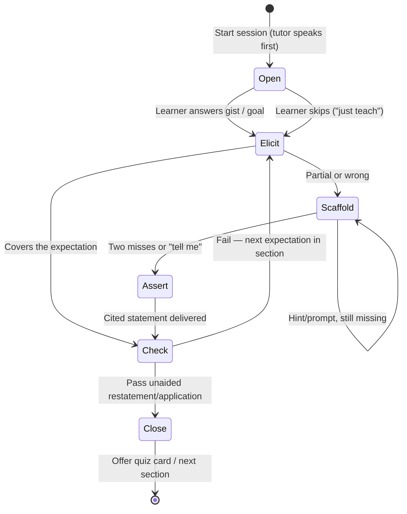

# RQ03 — AI tutor pedagogy: making Teach a tutor, not a Q&A skin

*Learny public-launch research fleet, 2026-09-03. Grounded in shipped teach flow (`TEACHING_SYSTEM_PROMPT`, `PostConversationTurn`, `TeachPanel`) plus ITS / LLM-tutor literature. Not a decision record.*

## TL;DR

Learny Teach is a **cited, section-scoped chat** with a four-sentence “patient tutor” prompt. It is not a tutor. The architecture that *could* make it one is already there: a frozen, cacheable system prompt (ADR-0020), a target subtree, bounded history, and the book sitting in the same dock. What is missing is **session ownership** — the tutor opening, a tell-vs-ask policy, a hint ladder, a mastery close, and retrieval that is about the *passage*, not the learner’s first typed line.

The evidence does not say “never give answers.” It says: **elicit first, escalate specificity, assert when stuck, check, then stop.** Khanmigo’s published lesson is that an optional chatbot next to content is sidestepped; the tutor has to *start* and make productive struggle hard to skip. Claude Learning Mode showed the opposite failure: endless Socratic with no exit. Learny’s unique shot is to bind that arc to a **cited book subtree** and hand a passing check to FSRS review — something ChatGPT Study Mode cannot do.

Do not train a tutor model, do not switch off Claude (ADR-0020), do not implement Bayesian Knowledge Tracing. Ship a frozen teach *playbook*, a tutor-opens first turn with section-first retrieval, and a close that writes one mastery item into the existing quiz queue.

---

## Evidence review

### What a good tutor actually does (ITS, not vibe)

Bloom’s “2-sigma problem” ([Bloom 1984](https://doi.org/10.3102/0013189X013006004)) compared one-to-one tutoring *plus mastery testing* to a 30-student class. The headline d ≈ 2.0 is widely over-read: samples were small, the tutoring arm also got extra formative tests, and [VanLehn 2011](https://doi.org/10.1080/00461520.2011.611369) later estimated human tutoring at **d ≈ 0.79** and step-based ITS at **d ≈ 0.76**. The durable claim is narrower: **timely feedback + mastery loops + interaction at the step (not the whole-answer) grain** close most of the human-tutor gap. Learny already has FSRS mastery *elsewhere*; Teach does not use it.

**AutoTutor** ([Nye, Graesser & Hu 2014](https://doi.org/10.1007/s40593-014-0029-5); review of ~17 years, Cohen’s d ≈ 0.80) is the closest design pattern to a book-passage tutor. Two mechanisms:

1. **Five-step frame** (from [Graesser, Person & Magliano 1995](https://doi.org/10.1080/01638539509544922) human-tutor transcripts): (1) tutor poses a hard question, (2) learner answers, (3) brief evaluation, (4) multi-turn improvement, (5) check understanding.
2. **Expectation–misconception tailored (EMT) dialogue** with a **pump → hint → prompt → assertion** ladder. A *pump* is “what else?”; a *hint* is a leading question whose answer is a clause; a *prompt* wants a word/phrase; an *assertion* states the expectation. Cover expected facets of a good answer; correct anticipated misconceptions when they fire. Human tutors almost never name misconceptions explicitly — they hint around them ([Graesser et al. 1995](https://doi.org/10.1080/01638539509544922)).

**Scaffolding and fading** ([Wood, Bruner & Ross 1976](https://doi.org/10.1111/j.1467-8624.1976.tb00391.x)): support inside the zone of proximal development, then withdraw it. A tutor that stays at “hint” forever is not fading; a tutor that dumps the section on turn one never scaffolds.

**ICAP** ([Chi & Wylie 2014](https://doi.org/10.1080/00461520.2014.965823)): Interactive > Constructive > Active > Passive. A cited explanation the learner reads is **passive/active**. A learner who *generates* a paraphrase of the passage, then defends it against a counter-question, is **constructive/interactive**. Teach that only streams prose cannot leave Passive.

**Productive failure** ([Kapur 2010](https://doi.org/10.1007/s11251-009-9093-x); [Kapur 2014](https://onlinelibrary.wiley.com/doi/10.1111/cogs.12107); meta [Sinha & Kapur 2021](https://doi.org/10.3102/00346543211019105), d ≈ 0.36 on conceptual transfer when design fidelity is high): struggle *before* instruction, then teach. For a book section this is not “invent the chapter”; it is **elicit a prediction / gist / objection from the passage before the tutor narrates it**, then reconcile with the cited text. [Puech et al. 2024](https://arxiv.org/abs/2410.03781) show you can *steer* an LLM tutor toward PF intents (ask-for-next-step vs tell) rather than hoping the system prompt remembers.

**Knowledge tracing** ([Corbett & Anderson 1994/95](https://doi.org/10.1007/BF01099821)): per-skill P(mastered) ≈ 0.95 before advancing. Full BKT needs a production-rule skill graph Learny does not have. The *product* analog is: **do not close a section session until the learner has produced one unaided restatement or application**, then schedule that item in FSRS.

Session length: LearnLM’s scenario evals required ≥10 turns (5 each side) and typically ran ~20 ([Jurenka / LearnLM Team 2024](https://arxiv.org/abs/2412.16429)). Human tutoring slices of 15–25 minutes are the usual cognitive-load envelope. A Learny section session should be **one claim-cluster, 8–14 tutor turns, one check, then stop** — not an unbounded chat.

### What the 2024–2026 LLM tutors actually shipped

| Product | Mechanism | Lesson for Learny |
|---|---|---|
| **Khanmigo** | Socratic, then (v2) *woven into practice*; tutor prompts the student to explain; “cognitive onloading” | Isolated optional chat next to content **failed to move learning**. Integration + tutor-initiates is the published correction. Primary: [Sal Khan, 2026-07-15](https://blog.khanacademy.org/khanmigos-first-chapter-changed-how-i-think-about-ai-a-note-from-sal-khan/). Product: [khanmigo.ai](https://www.khanmigo.ai/). |
| **Claude for Education / Learning mode** | Frozen-ish style: guide, don’t answer; “How would you approach this?”; “What evidence supports your conclusion?” | Same *prompt-layer* strategy Learny already uses. Failure mode: **no stop condition** — reviewers report endless questions ([Mashable 2025](https://me.mashable.com/education/61373/i-tried-learning-from-anthropics-ai-tutor-i-felt-like-i-was-back-in-college)). Primary: [Anthropic, 2025-04-02](https://www.anthropic.com/news/introducing-claude-for-education). |
| **ChatGPT Study Mode** | Custom system instructions (not a new model): active participation, cognitive-load management, metacognition, curiosity, supportive feedback. Calibrate with “what do you already know?”; one question at a time; knowledge checks. OpenAI says they chose instructions *so they can iterate*; they plan to train it in later. | Confirms **prompt playbook first**. Also admits inconsistency. Primary: [OpenAI, 2025-07](https://openai.com/index/chatgpt-study-mode/); [Help Center](https://help.openai.com/en/articles/11780217). Reverse-engineered rules (get to know user; don’t do their work; check & reinforce; vary rhythm) match [Forbes / leaked-instructions writeups](https://www.forbes.com/sites/lanceeliot/2025/08/03/deciphering-the-custom-instructions-underlying-openais-new-chatgpt-study-mode-reveals-vital-insights-including-for-prompt-engineering/). |
| **LearnLM / Gemini** | Pedagogical *instruction following* + co-training. Experts preferred LearnLM over GPT-4o / Claude 3.5 / Gemini 1.5 Pro in 2024-10 head-to-heads. 2025 “arena for learning”: Gemini 2.5 Pro first on a five-principle rubric (manage load, inspire active learning, deepen metacognition, stimulate curiosity, adapt). Crucial split: **role-playing “students” liked answer-giving tutors; expert judges did not** (“as a lazy student I’d have loved it”). | Do not optimize Teach for “felt helpful.” Measure **does not give away the answer too early** and **stays on the passage**. Papers: [Jurenka et al. 2024](https://arxiv.org/abs/2407.12687), [LearnLM 2024-12](https://arxiv.org/abs/2412.16429), [Arena 2025-05](https://arxiv.org/abs/2505.24477). Khan Academy mistake-ID bench in the arena paper: Gemini 2.5 Pro 87.4% / Claude 3.7 85.8% — **diagnosis of wrong answers is a real skill, not a vibe**. |

**MathTutorBench** ([Macina et al., EMNLP 2025](https://arxiv.org/abs/2502.18940); [leaderboard](https://eth-lre.github.io/mathtutorbench/)): subject expertise ≠ tutoring. Strong solvers can have *worse* scaffolding win-rates; pedagogy IF **degrades on long/hard dialogs**. [MathDial](https://arxiv.org/abs/2305.14536) is the dialog substrate. Implication: a frozen playbook that is not *stateful* (hint level, phase) will drift after ~6 turns — exactly Learny’s `conversation_history_turns = 6` window.

Tell vs ask (synthesized rule, not a slogan):

- **Ask** when the learner can still construct (gist, next step, “what does this sentence commit the author to?”).
- **Hint** when the attempt is partial or off.
- **Tell (assert + cite)** when two failed elicitations, an explicit “just tell me”, a factual prerequisite the passage assumes, or a safety/clarity need.
- **Never** stay Socratic after the learner has earned the answer; **never** lecture the whole subtree on turn one.

---

## Critique of Learny Teach today

Teach is `mode="teach"` on the unified conversation (ADR-0029), not a separate tutor engine. That is the right *product* model. The pedagogy is almost entirely missing.

### What actually happens

1. **Picker, then silence.** `TeachPanel` loads the TOC, defaults the `<select>` to the first section, and on “Start session” mounts an empty `TeachChat`. The conversation row is **not** created until the first send (`startConversation` inside `useConversationThread`). Placeholder: `"Send a message…"`. The tutor never speaks first. Contrast Khanmigo v2: the tutor *prompts* the learner to explain.

2. **The entire pedagogical difference is four frozen sentences** in `backend/app/infrastructure/answering/prompts.py`:

   > You are Learny's patient book tutor. Teach the learner about the passage they are studying using only the information contained in the provided documents, building naturally on the conversation so far. Cite the specific passages you rely on. Do not use outside knowledge and do not speculate beyond what the documents state. If the provided documents do not support a grounded response to the learner's message, reply with exactly `{SENTINEL}` and nothing else.

   Adjacent `ANSWER_SYSTEM_PROMPT` is the same contract with “answering assistant” swapped in. There is **no** Socratic rule, hint ladder, tell-vs-ask, one-question-at-a-time, misconception move, knowledge check, session length, or “don’t do the work.” “Teach” is a persona adjective.

3. **Target is a header, not a lesson plan.** `AnthropicGenerationAdapter._build_request` prefixes the user turn with `I am currently studying this section: {path}.\n\n{message}`. Evidence documents are whatever hybrid retrieval returned for **`query=message`** (`PostConversationTurn._retrieve_evidence`). Scope is the subtree (good; TEACH-09). Opening quality therefore depends on the learner typing a retrievable question. `"ok"`, `"teach me this"`, or `"what does this mean?"` are weak lexical/semantic queries against a chapter. There is no “load the section’s own chunks as the lesson.”

4. **No session state.** Turns are `(message, mode, answer, citations)`. No phase, no hint level, no expectation coverage, no mastery flag. History is the last **6** pairs (`conversation_history_turns`). After that the model forgets earlier misconceptions. The deterministic adapter **ignores mode, history, and target** and dumps the top-3 snippets — so CI cannot regress pedagogy.

5. **Grounding fights tutoring.** The sentinel + citations-API design (ADR-0020) is correct for Ask. For Teach it means the model cannot say “try restating the claim in your own words” without citing, and cannot diagnose a misconception that is *not in the retrieved snippets*. A Socratic question that is not a claim about the book is still a *response*; if the model gets nervous it emits `NOT_FOUND_IN_SOURCE` and the UI shows an empty not-found notice. Productive failure *requires* a turn that withholds the answer.

6. **The book is beside the chat (this is the one Khanmigo lesson already taken).** RA-11 scrolls the taught passage into view once per activation. Notes default **off** for Teach (AD-147). Quizzes exist on a different tab with no handoff. The reader can skip struggle by flipping to Ask in the same dock — Study Mode’s known escape hatch, now one click.

Net: Teach is **Ask with a section filter and a warmer system sentence**. ICAP: Passive. AutoTutor frame: missing steps 1 and 5. Khanmigo: isolated chat the learner must know how to start.

---

## Proposed teach-session blueprint

Keep hexagonal boundaries: pedagogy lives in the **frozen** `TEACHING_SYSTEM_PROMPT` (cache prefix, ADR-0020) plus **volatile** fields on the user turn (already where `target_section_path` lives). Do not interpolate ids/timestamps into the system prompt. Do not add a second generation port.

### Opening retrieval (before any learner prose)

On session start (or a synthetic first turn), retrieve with `query = target_title` (and/or lexical boost on the target subtree) rather than waiting for a user string. Cap to the subtree as today. That evidence *is* the lesson text. Optional later: pin the target section’s own chunks (path match) as document 0..k, hybrid-fill the rest.

### Frozen playbook (system prompt — byte-stable)

Encode, as hard constraints, the LearnLM/OpenAI five behaviors plus AutoTutor’s ladder, **grounded**:

- One move per turn. Prefer a single question. Do not dump the section.
- Pump → hint → prompt → assert. After two failed elicitations on the same expectation, **assert and cite**.
- If the learner asks to be told, tell — then immediately demand a restatement (fade back to ask).
- Stay inside the provided documents. Socratic questions and checks are allowed without the sentinel; **claims about the book** still cite. If documents cannot support a claim, sentinel as today.
- End the session after a passing unaided check (or an explicit “stop”). Offer one next-section or “save a review card.”

### Volatile user-turn envelope (after the cache breakpoint)

```
Section: {path}
Phase: OPEN | ELICIT | SCAFFOLD | CHECK | CLOSE
HintLevel: pump | hint | prompt | assert
Covered: {short ids of expectations already hit, or none}
Learner: {message or "(session start — open the lesson)"}
```

Phase is **application-owned** (a small state machine in `PostConversationTurn` or a tiny `TeachingPolicy` in application, not the model). The model is instructed to follow `Phase`/`HintLevel`; the service advances them from the last turn + a cheap classifier (or from structured tags the model is asked to emit in a trailer that the adapter strips before persist — only if eval shows the frozen prompt alone drifts).

### State machine



**OPEN (tutor-owned, 1 turn).** Name the section in one sentence (cited). Ask **one** gist question: “In your own words, what is this section trying to convince you of?” (PF + ICAP constructive). If they opted “just teach,” skip to a short cited frame then ELICIT a prediction.

**ELICIT.** Work **one expectation at a time** — a claim, distinction, or causal link *in the passage*, not a chapter outline. Pump first.

**SCAFFOLD.** Hint ladder. Point at an already-visible citation mark or ask them to look at a sentence the reader already scrolled to (RA-11). Do not introduce off-subtree knowledge.

**ASSERT.** Tell + cite. Then fade: “Now say it back without looking.”

**CHECK.** One unaided item: paraphrase, apply to a nearby example in the same subtree, or contrast two sentences. Pass → CLOSE. Fail → one more SCAFFOLD cycle, not a new lecture.

**CLOSE.** 8–14 tutor turns or ~15 min of wall clock is enough. Summarize in three cited bullets. Offer: promote the check to an FSRS card; start the next sibling section. Do not keep chatting into the next chapter inside this scope (scope-is-a-promise).

### Misconceptions without a catalog

Books are not algebra item banks. Do not author EMT scripts per EPUB. On a wrong restatement: (1) quote the conflicting cited span, (2) ask what would have to be true for their version to fit, (3) assert if they cannot reconcile. That is AutoTutor’s *indirect* misconception move, grounded.

### Tell vs ask (operational)

| Signal | Move |
|---|---|
| Opening / first attempt | Ask (gist) |
| Partial, on-topic | Hint |
| Keyword-close | Prompt |
| Two misses, “just tell me”, prerequisite fact in the passage | Assert + cite |
| Passed check | Close, don’t keep probing |
| Off-scope question | Offer to widen (existing `not_found_in_scope`) — do not silently become Ask |

---

## Cycle-sized moves

Each is one spec-driven cycle. Why-recommend **and** why-not are mandatory; skip any whose why-not dominates the current launch bar.

### 1. Frozen teach playbook (prompt-only)

Replace `TEACHING_SYSTEM_PROMPT` with the playbook above. Keep it a byte-stable constant (cache + ADR-0020). Add golden *transcript shape* tests: first model turn after `"Start teaching."` contains a question; a follow-up after a wrong gist contains a hint not a dump; two misses then an assertion with a citation mark.

- **Why-recommend:** This is how OpenAI Study Mode and Claude Learning Mode shipped. LearnLM’s developer lesson is that **instruction following** is the lever, and prompting remains how product owners specify pedagogy. Cheapest cycle; no schema; deterministic adapter still dumb but Claude path changes immediately.
- **Why-not:** OpenAI admits instruction-only tutors are inconsistent; MathTutorBench shows IF decaying in long dialogs; a longer prompt can inflate tokens against `max_tokens` / thinking budget. Endless-Socratic is a prompt bug if CLOSE is weak. Do not expect learning-gain evidence from a prompt swap alone.

### 2. Tutor-opens + section-first retrieval

Create the conversation on “Start session.” Issue a synthetic opening turn (`Learner: (session start)`) whose retrieval query is `target_title` (subtree still applied). Scroll as today. Empty composer until the opening stream finishes.

- **Why-recommend:** Khanmigo’s actual post-mortem: optional chat that waits for a good question is sidestepped; **cognitive onloading** requires the tutor to start. Fixes the worst retrieval bug (query = `"teach me"`). Matches ICAP (the learner must answer something) and PF (gist before narration).
- **Why-not:** Lazy-create-on-first-send is a deliberate CONV-10 pattern (discarded first messages leave no row). Opening turns cost a generation even for bounce-offs. Title-as-query can retrieve the wrong facet of a long chapter; may need pinning path-matched chunks (touches retrieval, not just prompt). Users who wanted a Q&A skin will feel “nagged.”

### 3. Application-owned phase + hint level on the user envelope

Store `phase` / `hint_level` on the conversation or last turn (small JSON, not a new aggregate). Advance with explicit rules (wrong check → stay SCAFFOLD; two misses → ASSERT; pass → CLOSE). Put the fields in the volatile user turn.

- **Why-recommend:** AutoTutor’s ladder only works if *someone* tracks the rung. MathTutorBench: pedagogy collapses in long dialogs when the model is the only memory. Learny already truncates history to 6 — the envelope is the prosthetic. Stays behind `GenerationPort`.
- **Why-not:** Classifying “was that a miss?” from free text is a new error surface (false ASSERT lectures; false ELICIT loops). Structured trailers fight the Citations API (ADR-0020: citations and structured outputs are mutually exclusive). Prefer rule-based advances (turn count in SCAFFOLD, explicit UI buttons “I don’t know” / “just tell me”) before an LLM judge.

### 4. Close → one FSRS card (Teach–Review join)

On CHECK pass, offer “Save this as a review card” using the existing note/card promote path (citation snapshot + FSRS). Do not auto-insert.

- **Why-recommend:** This is Learny’s only unfair advantage vs Study Mode / Learning Mode: **the check becomes memory**. Completes Bloom’s actual 2-sigma recipe (tutor *plus* mastery). Uses shipped quiz/FSRS instead of inventing BKT.
- **Why-not:** Brief already records quiz-generation producing empty decks on tiny fixtures. A bad auto-card poisons the due queue. Coupling Teach to quiz QC is a second product surface in one cycle if not strictly “promote this learner-produced restatement.”

### 5. Pedagogy goldens (eval), not a learning arena

Extend golden fixtures with 4–6 scripted teach transcripts (opening question present; no whole-section dump; citation on asserts; sentinel still works for off-book claims). Nightly real-provider spot-check optional; PR gate stays deterministic + *shape* asserts on the Anthropic request (prompt bytes, opening envelope).

- **Why-recommend:** ADR-0003/0016: you cannot improve tutoring you do not pin. LearnLM’s whole program is “eval-driven pedagogy.” Cheap relative to a 200-educator arena.
- **Why-not:** Shape tests are not learning gains. LLM-as-pedagogy-judge is circular and expensive. Do not block merge on expert preference vs Gemini.

### Park (explicitly not a cycle now)

- **Do not** fine-tune or swap in LearnLM/Gemini — ADR-0019/0020 lock providers; LearnLM’s win is instruction-following that Claude can be *prompted* toward.
- **Do not** implement BKT / skill graphs / per-paragraph mastery meters.
- **Do not** forbid answers (pure Socratic). Mashable’s Claude critique is the warning.
- **Do not** generate a full quiz deck as the session. One checked item, opt-in.

---

## What “good” would look like on a real book

Reader opens Teach on a chapter already on screen. Tutor (not the empty box) says, with a citation: this section argues X — *what do you think X is, in one sentence?* Learner tries. Tutor hints from the same paragraph they can see. After a miss, it tells and cites. Learner restates unaided. Session offers a card and stops. Ask remains one dock-tab away for lookup. That is a tutor. Today’s flow is the lookup tab with a different label.
