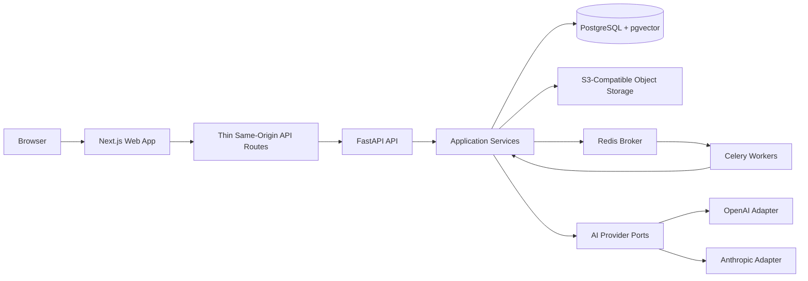

# TDD-001: MVP Architecture For Ingestion, Cited Q&A, And Teaching Sessions

| Field | Value |
|---|---|
| Status | Draft |
| Created | 2026-06-27 |
| Last Updated | 2026-06-27 |
| Tech Lead | Augusto |
| Contributors | Codex |
| Related RFC | [RFC-001: Select The Technology Stack For Learny](../rfc/0001-technology-stack-selection.md) |
| Related ADRs | [ADR-001](../adr/0001-hybrid-book-intelligence-architecture.md), [ADR-002](../adr/0002-canonical-document-format.md), [ADR-003](../adr/0003-citations-and-evaluation-are-core-requirements.md), [ADR-004](../adr/0004-python-fastapi-react-nextjs-postgresql-stack.md), [ADR-005](../adr/0005-run-document-work-in-separate-workers-same-codebase.md), [ADR-006](../adr/0006-use-postgresql-hybrid-search-with-pgvector-and-full-text.md), [ADR-007](../adr/0007-use-learny-owned-ports-for-ai-provider-integration.md), [ADR-008](../adr/0008-use-docker-compose-vps-for-first-production-like-deploy.md), [ADR-009](../adr/0009-use-learny-owned-orchestration-with-specialized-edge-libraries.md), [ADR-010](../adr/0010-scope-first-mvp-to-ingestion-cited-qa-and-teaching-sessions.md), [ADR-011](../adr/0011-support-epub-first-for-initial-ingestion.md), [ADR-012](../adr/0012-use-email-password-accounts-from-mvp.md), [ADR-013](../adr/0013-use-s3-compatible-object-storage-for-uploaded-sources.md), [ADR-014](../adr/0014-use-redis-and-celery-for-worker-queues.md), [ADR-015](../adr/0015-use-backend-owned-auth-with-http-only-cookies.md), [ADR-016](../adr/0016-use-golden-fixtures-for-mvp-evaluation.md), [ADR-017](../adr/0017-use-thin-nextjs-same-origin-api-proxy-to-fastapi.md) |

## Context

Learny is a multi-user learning application that starts with robust book teaching. The first MVP must ingest EPUB sources, preserve source structure, support cited question answering, and run structured teaching sessions around a chapter, section, or passage.

The accepted architecture is Python/FastAPI for the backend, React/Next.js for the frontend, PostgreSQL with pgvector for primary data plus hybrid retrieval, Redis/Celery for worker queues, and S3-compatible object storage for uploaded source files. Browser authentication is owned by FastAPI and exposed through secure HTTP-only cookies, with browser-facing API calls routed through a thin same-origin Next.js proxy.

The design goal is to turn the accepted ADRs into an implementation-ready architecture without over-designing later product areas such as quizzes, notes, memory, multi-document synthesis, PDF ingestion, or a full evaluation dashboard.

## Problem Statement And Motivation

### Problems We Are Solving

- Learny needs a real product architecture, not only research and ADRs.
  - Impact: without module boundaries and flow definitions, implementation can couple FastAPI handlers, provider SDKs, retrieval SQL, worker tasks, and UI behavior too early.
- Learny must preserve source grounding as a product invariant.
  - Impact: if ingestion, retrieval, citations, and evaluation are designed separately, answer quality will be hard to debug and regressions will be hard to catch.
- Learny needs multi-user ownership from the beginning.
  - Impact: retrofitting user ownership after uploads, corpus records, embeddings, and sessions exist would create authorization and data migration risk.
- Learny needs long-running document work to be durable and observable.
  - Impact: request-bound ingestion would cause slow requests, poor retries, unclear failures, and weak progress reporting.

### Why Now

The stack and product-scope decisions are accepted. The next work should be implementation planning and scaffolding, so the architecture must define the first vertical slice before application code is added.

### Impact Of Not Solving

- Product behavior risks becoming "chat with uploaded files" instead of a grounded teaching system.
- Provider, framework, or retrieval details may leak into core domain logic.
- Worker retries and partial failures may create duplicate or inconsistent corpus/index data.
- Authorization gaps may appear around user-owned source files, corpus records, and teaching sessions.

## Scope

### In Scope For MVP

- Email/password registration, login, logout, authenticated API access, and user-owned resources.
- EPUB upload or source registration through the web app.
- Original source storage in S3-compatible object storage through a Learny-owned storage port.
- Durable source metadata, ingestion status, corpus state, chunks, embeddings, retrieval metadata, citations, and session state in PostgreSQL.
- Asynchronous EPUB ingestion using Redis/Celery workers from the same backend codebase.
- Canonical corpus generation with stable identifiers, source locations, section paths, and derived Markdown/chunk views.
- PostgreSQL hybrid retrieval using pgvector semantic search plus PostgreSQL full-text search.
- Cited Q&A over a processed source.
- Structured teaching sessions around a chapter, section, or passage, with enough context for follow-up explanation.
- Golden fixture evaluation for ingestion, retrieval, and citation behavior.
- Docker Compose topology for local and first production-like VPS deployment.

### Out Of Scope For MVP

- PDF, DOCX, scanned-document, or OCR ingestion.
- Quiz generation, remediation, study plans, notes, highlights, memory, graph features, and second-brain workflows.
- Multi-document synthesis unless needed to complete the first source-specific tutor flow.
- Full evaluation dashboard or mandatory Ragas integration.
- Dedicated vector/search infrastructure outside PostgreSQL.
- Provider-native file search as Learny's canonical retrieval or corpus system.
- OAuth/social login, organizations, sharing, invite workflows, and account administration.
- A rich Next.js backend-for-frontend that owns domain orchestration.

### Future Considerations

- PDF ingestion with page-span citations.
- Reranking once retrieval fixtures expose quality limits.
- Ragas or similar evaluation runs after stable answer-generation outputs exist.
- Notes, highlights, memory, quizzes, remediation, and study plans.
- Dedicated vector/search infrastructure if PostgreSQL hybrid search shows measured pain.
- Richer BFF behavior if frontend-specific aggregation becomes repetitive and still does not duplicate backend authorization or domain logic.

## Architectural Principles

- FastAPI owns product behavior, authentication, authorization, and user-owned resource access.
- Next.js owns user experience and a thin same-origin API/proxy boundary, not Learny domain policy.
- Application services orchestrate use cases; transport handlers and Celery tasks stay thin.
- Domain/application code uses Learny-owned ports for storage, AI providers, embeddings, long-context reading, retrieval, and specialized document/evaluation libraries.
- Provider SDK objects, model-specific response types, framework-specific RAG objects, Celery internals, and storage SDK objects do not cross into core domain models.
- PostgreSQL is the durable source of truth for product state, ingestion state, corpus records, retrieval metadata, and user-visible progress.
- Redis/Celery coordinates background execution only; it is not authoritative product state.
- Every user-owned resource query must be scoped by authenticated user ownership or an explicit future sharing/organization rule.

## Technical Solution

### Architecture Overview



### Key Components

| Component | Responsibility | Boundary Rule |
|---|---|---|
| Next.js web app | UI, route protection for user experience, same-origin browser entry point | May proxy and shape browser requests, but must not own domain policy or authorization |
| FastAPI API | Auth, authorization, request validation, use-case entry points, status reads | Does not perform long-running document work inside request handlers |
| Application services | Use-case orchestration for auth, sources, ingestion, retrieval, Q&A, and tutor sessions | Depend on ports and repositories, not provider SDKs or transport details |
| Domain models | Learny concepts such as user, source, corpus, chunk, evidence, answer, teaching session | No direct dependency on FastAPI, Next.js, Celery, SDK clients, or SQL details |
| PostgreSQL repositories | Durable product, corpus, retrieval, evaluation, and session state | Enforce ownership scoping and transactional consistency |
| Object storage adapter | Store and read original uploaded source artifacts | Exposes object keys and metadata through Learny storage contracts |
| Celery workers | Execute ingestion, corpus generation, chunking, embedding, indexing, and fixture evaluation jobs | Task payloads contain stable identifiers, not large files or provider objects |
| Retrieval service | Hybrid candidate retrieval and evidence packaging | Keeps SQL/ranking details behind a Learny retrieval contract |
| AI provider adapters | Generation, embeddings, long-context reading, structured output, provider health | Normalize provider outputs into Learny result types |
| Evaluation fixtures | Deterministic tests for ingestion, retrieval, and citations | Fixture expectations are versioned with test data |

## Module Boundaries

### Identity And Access

Owns users, credentials, sessions, cookie-backed authentication, and resource authorization checks. Other modules ask identity/access questions through explicit application services or policies; they do not inspect session storage directly.

Authoritative state:

- users;
- password credentials and password metadata;
- sessions or session references;
- authorization ownership rules for MVP user-owned resources.

### Library And Sources

Owns uploaded source records, source metadata, object-storage references, source lifecycle, and user ownership. It does not own parsed corpus structure after ingestion completes.

Authoritative state:

- source records;
- object keys and checksums;
- upload status;
- ingestion status summary for the user.

### Corpus And Ingestion

Owns canonical document representation, extraction state, section/block identifiers, source locations, derived Markdown, chunks, and ingestion job progress.

Authoritative state:

- corpus documents and versions;
- canonical blocks/sections;
- source-location mappings;
- derived Markdown/chunk views;
- ingestion job state and failure records.

### Retrieval And Answering

Owns retrieval indexes, embeddings, hybrid search behavior, evidence selection, cited answer generation, and long-context fallback routing.

Authoritative state:

- embedding records;
- lexical search vectors or derived search fields;
- retrieval runs;
- evidence bundles;
- generated answers and citation mappings where persisted.

### Teaching Sessions

Owns session lifecycle, target chapter/section/passage, conversation turns, cited explanations, and bounded session context.

Authoritative state:

- teaching sessions;
- session target references;
- turns and generated outputs;
- evidence used in each teaching response.

### Evaluation

Owns golden fixtures, expected ingestion outputs, retrieval expectations, citation expectations, and evaluation run records.

Authoritative state:

- fixture definitions;
- expected source/corpus/chunk/citation values;
- evaluation run results.

## Data Model Outline

This section names conceptual tables and ownership. Exact column names may change during implementation, but ownership should not.

| Area | Conceptual Tables | Notes |
|---|---|---|
| Identity | users, user_credentials, sessions | Stores email/password account state and authenticated sessions |
| Sources | sources, source_files | Stores user ownership, source metadata, object keys, checksums, upload state |
| Ingestion | ingestion_jobs, ingestion_events | Durable job state, progress, retry/failure details visible to users |
| Corpus | corpus_documents, corpus_sections, corpus_blocks, corpus_locations | Canonical structured representation with stable IDs and source locations |
| Derived Views | derived_markdown, retrieval_chunks | Markdown/chunk views generated from canonical corpus |
| Retrieval | embeddings, lexical_indexes, retrieval_runs, evidence_items | Embedding and search metadata tied back to chunks and source locations |
| Answers | qa_answers, answer_citations | Optional persistence of generated Q&A outputs and source evidence |
| Teaching | teaching_sessions, teaching_turns, teaching_turn_citations | Session state and evidence-backed generated turns |
| Evaluation | evaluation_fixtures, evaluation_runs, evaluation_results | Golden fixture expected values and run outcomes |

### Identifier Rules

- User-owned resources include a user ownership field or are reachable only through a parent with clear user ownership.
- Corpus, chunk, and citation identifiers must be stable across repeated reads of the same corpus version.
- Re-ingestion or changed chunking creates a new corpus/index version rather than silently changing identifiers used by historical citations.
- Queue messages reference durable IDs only, such as source ID, ingestion job ID, corpus document ID, or evaluation run ID.

## API Contract Outline

Exact request/response schemas belong in implementation specs, but the MVP API surface should follow these contracts.

| Endpoint | Method | Responsibility | Auth |
|---|---|---|---|
| `/api/auth/register` | POST | Create email/password account and start authenticated session | Public |
| `/api/auth/login` | POST | Validate credentials and start authenticated session | Public |
| `/api/auth/logout` | POST | End authenticated session | Required |
| `/api/auth/me` | GET | Return authenticated user summary | Required |
| `/api/sources` | POST | Create source metadata and upload flow | Required |
| `/api/sources` | GET | List current user's sources | Required |
| `/api/sources/{source_id}` | GET | Read current user's source metadata and processing state | Required |
| `/api/sources/{source_id}/ingestion` | POST | Start or restart ingestion for an uploaded source | Required |
| `/api/sources/{source_id}/ingestion` | GET | Read durable ingestion progress and failures | Required |
| `/api/sources/{source_id}/questions` | POST | Ask a cited question against a processed source | Required |
| `/api/teaching-sessions` | POST | Start a teaching session for a source target | Required |
| `/api/teaching-sessions/{session_id}` | GET | Read session state and prior turns | Required |
| `/api/teaching-sessions/{session_id}/turns` | POST | Add a user turn and receive a cited teaching response | Required |

### Example: Cited Q&A Response Shape

```json
{
  "answer": "Short generated answer text.",
  "sourceId": "src_123",
  "corpusVersion": "corpus_v1",
  "citations": [
    {
      "chunkId": "chunk_abc",
      "sectionPath": ["Chapter 1", "Core Idea"],
      "location": {
        "kind": "epub_href",
        "href": "chapter-1.xhtml#core-idea"
      },
      "snippet": "Relevant source excerpt."
    }
  ],
  "retrieval": {
    "strategy": "hybrid",
    "semanticCandidates": 20,
    "lexicalCandidates": 20,
    "selectedEvidence": 4
  }
}
```

## Core Flows

### Registration And Authenticated Access

1. User registers or logs in through Next.js.
2. Browser sends same-origin request to Next.js route/proxy.
3. Next.js forwards auth request to FastAPI.
4. FastAPI validates credentials and sets secure HTTP-only cookies.
5. Subsequent browser requests go through the same-origin proxy and are authorized by FastAPI.

### EPUB Upload And Ingestion

1. Authenticated user creates a source record.
2. Backend returns an upload path or accepts a file upload according to the selected implementation.
3. Source file is stored in S3-compatible object storage.
4. PostgreSQL stores source metadata, ownership, object key, checksum, and initial ingestion state.
5. FastAPI enqueues an ingestion task with source ID and ingestion job ID.
6. Celery worker reads source metadata and object storage through Learny ports.
7. Worker extracts EPUB metadata, table of contents, sections, headings, anchors, and HTML fragments.
8. Worker writes canonical corpus records, derived Markdown, retrieval chunks, embeddings, and search metadata.
9. Worker updates durable ingestion status in PostgreSQL.
10. User reads ingestion status through FastAPI while the job progresses.

### Cited Q&A

1. User asks a question against a processed source.
2. FastAPI verifies source ownership and corpus readiness.
3. Retrieval service performs semantic and lexical candidate retrieval in PostgreSQL.
4. Retrieval service merges and selects evidence with source locations and snippets.
5. Answering service calls an AI provider through a Learny-owned generation port.
6. Provider adapter normalizes output, usage, latency, model identity, failure details, and citations/evidence mapping.
7. FastAPI returns answer text plus Learny-owned citation objects.

### Teaching Session

1. User starts a teaching session for a source target such as chapter, section, or passage.
2. FastAPI verifies ownership and target validity.
3. Teaching service stores session target and initial context.
4. Each turn uses bounded session context plus retrieval or long-context fallback as needed.
5. Each generated teaching response records evidence and citations.
6. Follow-up questions are scoped to the session target unless the user explicitly changes scope.

### Golden Fixture Evaluation

1. Test runner loads one or more fixture EPUBs.
2. Ingestion produces canonical corpus, sections, chunks, and source locations.
3. Tests compare expected metadata, table of contents, stable block IDs, and chunks.
4. Retrieval tests ask selected fixture queries and verify expected chunks or sections are returned.
5. Citation tests verify answer/evidence outputs refer to allowed source chunks and section paths.

## Security Considerations

### Authentication And Authorization

- FastAPI owns registration, login, logout, session validation, and authorization.
- Browser credentials are represented by secure HTTP-only cookies, not localStorage bearer tokens.
- Every protected FastAPI endpoint enforces authentication and user-owned resource authorization.
- Next.js route protection is a user-experience optimization only; it is not the security boundary.

### CSRF, Cookie, And Origin Handling

- State-changing browser requests need a CSRF strategy compatible with same-origin proxying and HTTP-only cookies.
- Cookie attributes must be explicitly defined for local development and VPS deployment.
- Cross-origin browser calls should be avoided in the MVP by routing through Next.js.

### Data Protection

- Passwords are never stored in plaintext.
- Secrets and provider credentials stay server-side and are never exposed to browser JavaScript.
- Source object keys should not reveal user emails or source titles.
- Logs must redact passwords, session tokens, provider API keys, and sensitive source excerpts by default.
- User deletion/export behavior is not MVP scope, but schema ownership should not prevent future account data lifecycle work.

### Abuse And Rate Limits

- Login, registration, source upload, Q&A, and teaching-turn endpoints should have rate-limit hooks even if initial thresholds are conservative.
- File upload constraints must include size, content type, and extension validation.
- Ingestion workers should enforce timeouts and maximum resource limits per job.

## Testing Strategy

| Test Type | Scope | MVP Requirement |
|---|---|---|
| Unit tests | Domain services, application services, ports/adapters with fakes | Validate rules without live providers or infrastructure where practical |
| Integration tests | FastAPI endpoints, PostgreSQL repositories, auth/session behavior | Cover protected endpoints, ownership checks, ingestion state reads, and retrieval queries |
| Worker tests | Celery task orchestration with durable IDs | Verify retries, idempotency, status transitions, and failure states |
| Fixture tests | EPUB ingestion, corpus generation, chunking, retrieval, citations | Golden fixtures are required by ADR-016 |
| Frontend tests | Authenticated route behavior and core source/session screens | Verify UI calls same-origin proxy and handles status states |
| E2E smoke tests | Registration, upload, ingestion status, question, teaching session | Run against Docker Compose when application exists |

### Critical Scenarios

- User cannot access another user's source, corpus state, ingestion job, answer, or teaching session.
- Duplicate ingestion retry does not create conflicting active corpus/index state.
- Failed ingestion records a durable user-visible failure with enough diagnostic context.
- Retrieval returns evidence tied to chunk ID, section path, and source location.
- Generated answer without usable evidence is rejected or returned as an explicit "not found in source" response.
- Provider adapter failure is captured without corrupting session or answer state.

## Monitoring And Observability

### Required Trace Fields

- request ID;
- authenticated user ID where available;
- source ID;
- ingestion job ID;
- corpus version;
- retrieval run ID;
- teaching session ID;
- provider name and normalized model identity where an AI call occurs.

### Metrics

| Metric | Type | Purpose |
|---|---|---|
| API request latency and error rate | Latency/counter | Detect user-facing failures |
| Auth failure rate | Counter | Detect credential abuse or broken login |
| Upload failures | Counter | Detect storage or validation problems |
| Ingestion job duration | Latency | Track EPUB processing health |
| Ingestion job failures by stage | Counter | Identify parser, storage, embedding, or indexing failures |
| Queue depth and worker runtime | Gauge/latency | Detect worker backlog |
| Retrieval latency | Latency | Detect slow hybrid search |
| Selected evidence count | Gauge | Diagnose retrieval quality changes |
| AI provider latency and error rate | Latency/counter | Detect provider degradation |
| Citation coverage | Gauge | Ensure generated answers include source evidence |

### Logs

- Log lifecycle events for upload, ingestion state transitions, retrieval runs, answer generation, and teaching turns.
- Log provider calls with normalized provider/model identity, duration, token/usage metadata if available, and error class.
- Do not log raw passwords, session tokens, full uploaded documents, large source excerpts, or provider secrets.

## Rollback And Failure Handling

### Deployment Rollback

- The first production-like deployment should support reverting API, worker, and frontend images independently where practical.
- Schema migrations should be reversible unless explicitly documented as forward-only.
- Worker changes that alter corpus/chunk/index generation should create versioned outputs so old citations remain interpretable.

### Operational Rollback Triggers

| Trigger | Action |
|---|---|
| Auth or authorization regression | Stop rollout and revert API/frontend changes |
| Ingestion failures spike after worker deploy | Stop workers, revert worker image, inspect failed jobs |
| Retrieval returns empty or uncited answers for fixture-backed queries | Revert retrieval/indexing change and preserve prior index version |
| Provider adapter failure rate spikes | Disable affected adapter or route to an accepted fallback if available |
| Migration failure | Stop deployment and restore from tested database backup or migration rollback path |

### Idempotency And Recovery

- Ingestion jobs must be safe to retry using source ID, ingestion job ID, and corpus/index version.
- Workers should persist stage transitions before and after expensive work.
- Partial outputs should be marked incomplete until a corpus/index version is finalized.
- User-visible state should distinguish pending, processing, completed, failed, and retryable failed states.

## Risks

| Risk | Impact | Probability | Mitigation |
|---|---|---:|---|
| Provider SDK or model details leak into core services | High | Medium | Keep Learny-owned ports and normalized result types; adapter tests verify mapping |
| Ingestion retries create duplicate or inconsistent corpus data | High | Medium | Version corpus/index outputs and make tasks idempotent around durable job IDs |
| Hybrid retrieval is under-specified and returns weak evidence | High | Medium | Start with fixture-backed retrieval expectations and expose retrieval run diagnostics |
| Cookie/CSRF behavior breaks between local and VPS environments | High | Medium | Design same-origin proxy explicitly and test auth flows in Docker Compose |
| Object storage provider differences cause local/prod drift | Medium | Medium | Keep storage behind a port and run adapter contract tests |
| Celery/Redis state is mistaken for durable product state | Medium | Low | Store durable job, progress, and failure state in PostgreSQL only |
| TDD scope drifts into full second-brain platform | Medium | Medium | Keep MVP exclusions explicit and require follow-up ADR/TDD for deferred domains |
| Fixture evaluation gives false confidence | Medium | Medium | Add fixtures as new retrieval/citation failures are discovered and track coverage gaps |

## Implementation Plan

| Phase | Work | Outcome |
|---|---|---|
| 1. Repository scaffold | Create backend, frontend, shared local Docker Compose, and test structure aligned with ADR-004 and ADR-008 | Runnable skeleton with API, web, PostgreSQL, Redis, object storage, and worker services |
| 2. Identity foundation | Implement email/password accounts, secure cookie sessions, same-origin proxy path, and ownership policies | Authenticated users can access only their own resources |
| 3. Source storage | Implement source records, upload flow, object storage port, and metadata persistence | Users can create and inspect uploaded EPUB source records |
| 4. Worker foundation | Add Celery/Redis integration, durable ingestion jobs, status transitions, retries, and worker observability | Long-running work runs outside HTTP requests with visible progress |
| 5. EPUB corpus pipeline | Parse fixture EPUBs into canonical corpus, derived Markdown, chunks, and source locations | Corpus model supports section paths, anchors, and stable IDs |
| 6. Retrieval indexes | Add embeddings, PostgreSQL full-text search fields, hybrid candidate retrieval, and evidence packaging | Processed sources can return citation-ready evidence |
| 7. Cited Q&A | Add answer-generation port, provider adapter, cited answer endpoint, and "not found in source" behavior | Users can ask source-grounded questions and inspect citations |
| 8. Teaching sessions | Add session target selection, bounded context, turns, cited teaching responses, and session state reads | Users can learn from a chapter, section, or passage with follow-up context |
| 9. Golden fixtures | Add fixture EPUBs, expected ingestion outputs, retrieval expectations, and citation checks | Regression tests protect the source-grounding path |
| 10. Production-like readiness | Add Docker Compose deployment shape, observability hooks, backups/restore notes, and rollback checks | MVP can run in local and first production-like topology |

## Success Metrics

| Metric | MVP Target |
|---|---|
| EPUB fixture ingestion | Deterministic expected metadata, section paths, chunks, and source locations |
| Retrieval fixture recall | Expected chunks or sections appear in candidate set for fixture queries |
| Citation completeness | Cited Q&A and teaching responses include source-linked evidence or explicitly say the answer is not found |
| Authorization coverage | Critical user-owned endpoints deny cross-user access in tests |
| Ingestion reliability | Failed jobs produce durable, inspectable failure state and retry path |
| Worker/API separation | No long-running parsing, embedding, or indexing runs inside HTTP request handlers |

## Dependencies

| Dependency | Role | Status |
|---|---|---|
| FastAPI | Backend API framework | Accepted by ADR-004 |
| Next.js/React | Frontend and same-origin proxy layer | Accepted by ADR-004 and ADR-017 |
| PostgreSQL + pgvector | Product state, corpus state, hybrid retrieval | Accepted by ADR-004 and ADR-006 |
| Redis + Celery | Worker queue and background execution | Accepted by ADR-014 |
| S3-compatible object storage | Uploaded source file storage | Accepted by ADR-013 |
| AI providers | Generation, embeddings, long-context fallback through Learny ports | Boundary accepted by ADR-007; concrete defaults open |
| EPUB fixtures | Repeatable ingestion/retrieval/citation evaluation | Required by ADR-016 |

## Open Questions

| # | Question | Owner | Status |
|---|---|---|---|
| 1 | Which password hashing/session library should the FastAPI implementation use? | Augusto | Open |
| 2 | What is the MVP CSRF strategy for same-origin Next.js proxying and HTTP-only cookies? | Augusto | Open |
| 3 | Which concrete S3-compatible provider should local and VPS deployments use first? | Augusto | Open |
| 4 | Which EPUB parsing library should be accepted for the first implementation? | Augusto | Open |
| 5 | Which embedding provider/model should be used for fixture-backed retrieval? | Augusto | Open |
| 6 | What is the first accepted answer-generation provider/model and fallback behavior? | Augusto | Open |
| 7 | What are the exact corpus schema fields and versioning rules? | Augusto | Open |
| 8 | What are the initial retrieval scoring and candidate-merging rules? | Augusto | Open |
| 9 | What are the first fixture EPUBs and licensing constraints for storing them in the repo? | Augusto | Open |
| 10 | What backup, TLS, reverse proxy, and monitoring stack will the first VPS use? | Augusto | Open |

## Architecture Compliance Checklist

- Public contracts are defined for browser/API, API/application services, worker tasks, storage, retrieval, and AI providers.
- FastAPI remains authoritative for authentication, authorization, product behavior, and user-owned resources.
- Next.js proxy remains thin and same-origin; it does not own domain orchestration.
- PostgreSQL owns durable state; Redis/Celery owns task delivery only.
- Original files live in object storage; PostgreSQL stores metadata and corpus/index state.
- Corpus, chunks, citations, and answers preserve source identifiers and source locations.
- Provider SDK objects and framework-specific RAG objects do not enter core domain models.
- Golden fixtures cover ingestion, retrieval, and citation behavior before broad model evaluation.
